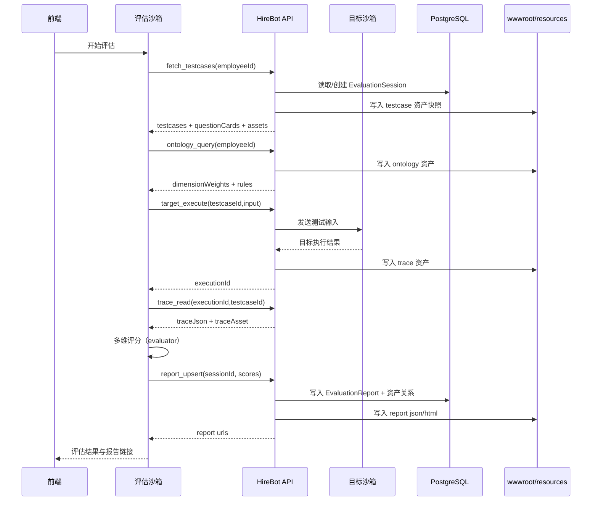

# 双沙箱交互核心设计（Evaluation Core v1）

## 1. 目标与范围
本设计聚焦本轮必须落地的核心能力：
- 评估沙箱通过 Skill 协调目标沙箱执行测试用例
- 评估沙箱按本体规则进行多维度评分
- 评估报告持久化到数据库，并将报告文件暴露为静态资源 URL

当前阶段默认：测试用例与本体已就绪；缺失补全分支保留但不作为主路径。

## 2. 组件与职责
- `目标沙箱`：被测员工实例，负责执行测试输入并产生行为轨迹。
- `评估沙箱`：运行评估 Skill，负责编排、取证、评分、报告。
- `ncrew API (HireBot.ApiService)`：提供 Tool API，统一治理双沙箱交互。
- `PostgreSQL`：保存会话、资产关系、报告元数据。
- `wwwroot/resources`：保存测试用例快照、trace、报告文件。

## 3. 交互时序（主链路）

## 4. Tool API 契约（已实现）
- `GET /api/v1/employees/{employeeId}/evaluation/tools/testcases`
  - 返回：`sessionId`、`targetHireId`、`testcases[]`、`questionCards[]`、`assets[]`
- `GET /api/v1/employees/{employeeId}/evaluation/tools/ontology`
  - 返回：`dimensionWeights`、`dimensionRules`、`assets[]`
- `POST /api/v1/employees/{employeeId}/evaluation/target/bootstrap`
  - 入参：`backendId?`、`sourceArtifactPath?`、`forceRecreate?`
  - 行为：缺少可用 target hireId 时，按员工模板自动创建目标沙箱并绑定；然后发送 artifact zip 附件与解压学习提示词
  - 返回：`sessionId`、`backendId`、`workspacePath`、`sourceArtifactPath`
- `POST /api/v1/employees/{employeeId}/evaluation/tools/target-execute`
  - 入参：`testcaseId`、`input`
  - 返回：`executionId`、执行状态与时间戳
- `POST /api/v1/employees/{employeeId}/evaluation/tools/trace-read`
  - 入参：`executionId`、`testcaseId`
  - 返回：`traceJson`、`traceAsset`
- `POST /api/v1/employees/{employeeId}/evaluation/tools/report`
  - 入参：`sessionId`、`overallScore`、`passed`、`dimensionScores[]`
  - 返回：`reportJsonUrl`、`reportHtmlUrl`、`assets[]`

## 5. 持久化与静态资源
### 5.1 数据库实体
- `EvaluationSessionEntity`
  - 会话主表：owner、employee、target/evaluator hire & sandbox、status、iteration
- `EvaluationAssetEntity`
  - 文件索引：assetType、relatedKey、relativePath、publicUrl、hash、sourceType
- `EvaluationReportEntity`
  - 评估结果：overallScore、passed、dimensionScoresJson、报告资产外键

### 5.2 文件存储策略
- 物理路径：`{contentRoot}/wwwroot/resources/evaluation/{sessionId}/iter-{nn}/{assetType}/...`
- 对外路径：`/resources/...`
- 中间件：`UseStaticFiles(new StaticFileOptions { RequestPath = "/resources" ... })`

## 6. 会话状态建议
实现中已覆盖以下关键状态（可继续扩展）：
- `ready`
- `testcases_ready`
- `ontology_ready`
- `target_executed`
- `passed` / `failed`
- `waiting_materials` / `execute_failed`

## 7. 为什么优于 demo Python 直连方案
相较“Skill 内 Python 脚本直接连目标沙箱”，当前方案更稳定：
- 单一治理入口：所有通信经 API 层，鉴权、审计、重试策略可统一。
- 可追溯：trace/报告资产统一落库+落盘，可按 session 回放。
- 解耦：Skill 关注业务流程，不耦合 WebSocket 协议细节。
- 可演进：后续可把 mock 执行替换为真实执行引擎而不改 Skill 契约。

## 8. 当前实现边界
- 已实现：单用例主路径闭环、报告持久化、静态资源访问、核心 Tool API。
- 待增强：多用例并行执行、补充素材自动回填、前端考题卡片专用组件、重试与超时策略细化。
