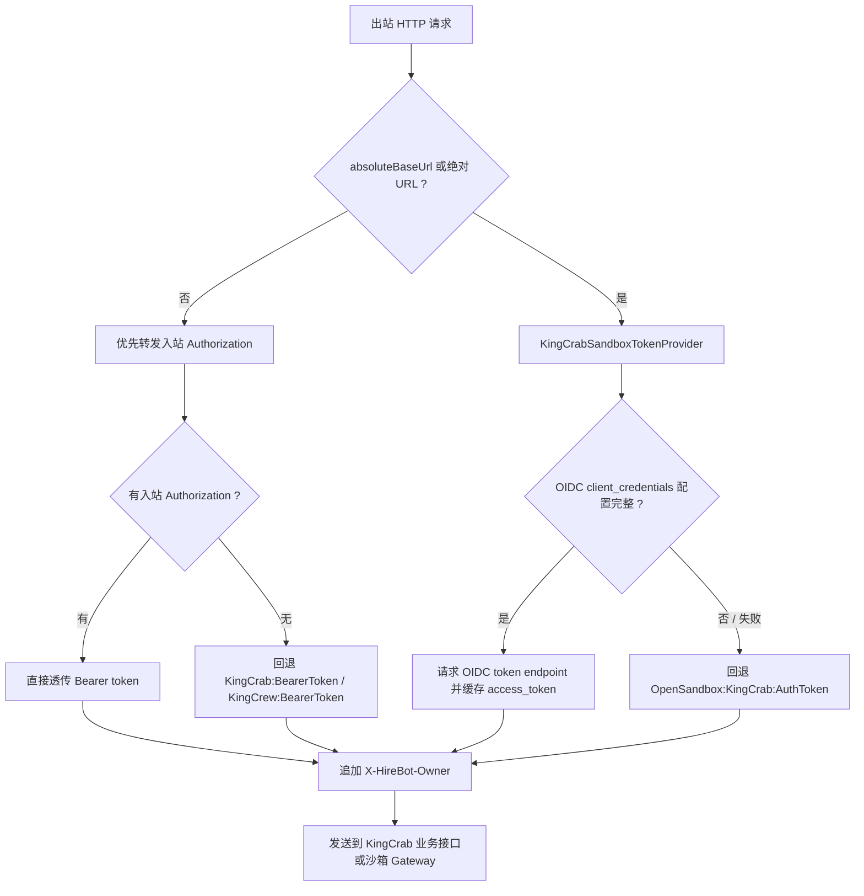
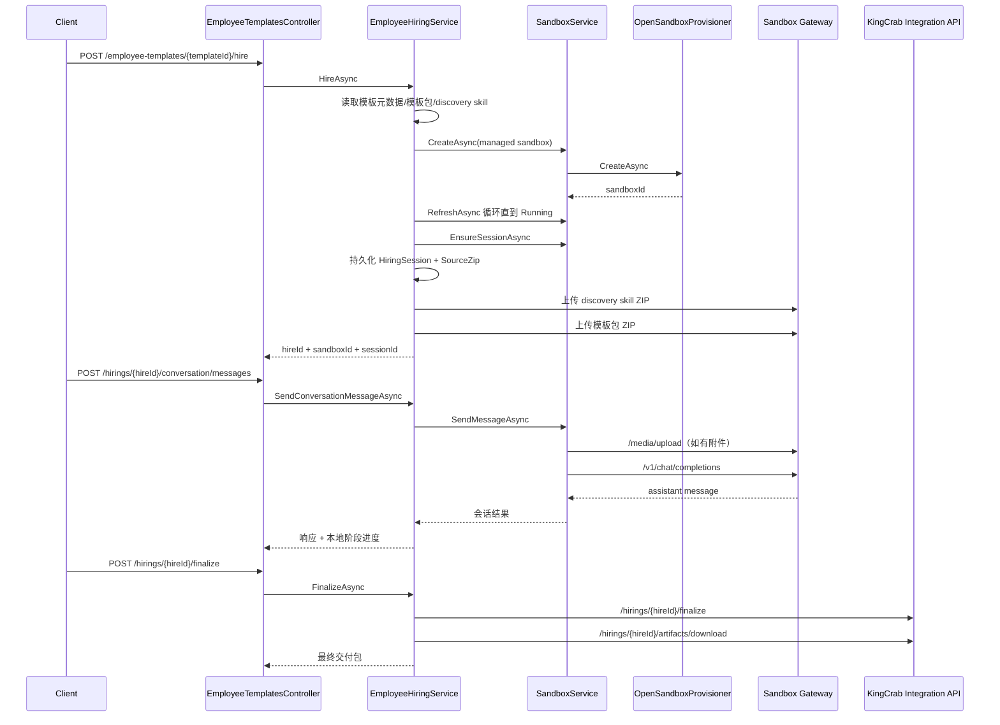
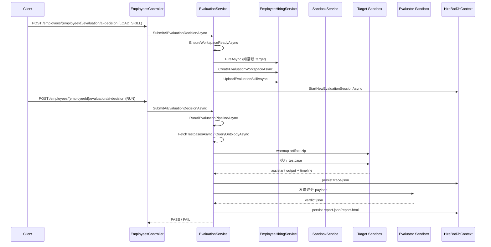

# 雇佣流程与评估流程代码实现路径（侧重沙箱服务与 Token 传递）

## 1. 说明

本文基于 `hirebot` 后端当前实现整理，重点回答 4 个问题：

1. 雇佣流程从哪个 API 入口进入，沿哪些方法一路走到沙箱。
2. 评估流程如何复用雇佣流程，并形成 `target sandbox + evaluator sandbox` 双沙箱结构。
3. 沙箱能力统一落在哪一层，哪些方法负责建沙箱、建会话、发消息、查历史、传附件。
4. Token 在“业务侧 KingCrab 接口”和“沙箱直连 Gateway”两条链路里分别如何传递。

分析范围主要覆盖以下目录：

- `src/HireBot.ApiService/Controllers`
- `src/HireBot.Core/Services/Hiring`
- `src/HireBot.Core/Services/Evaluation`
- `src/HireBot.Core/Services/Sandbox`
- `src/HireBot.Repository`

## 2. 关键角色分层

| 层次 | 主要代码 | 作用 |
| --- | --- | --- |
| API 入口层 | `EmployeeTemplatesController`、`HiringsController`、`EmployeesController` | 暴露雇佣 / 评估 API |
| 业务编排层 | `EmployeeHiringService`、`EvaluationService` | 串起模板、运行时、沙箱、评估资产、报告 |
| 沙箱抽象层 | `ISandboxService` / `SandboxService` | 统一建沙箱、会话、发消息、拉时间线、上传附件 |
| 沙箱编排层 | `OpenSandboxProvisioner` | 调 OpenSandbox 创建/刷新/删除实例，解析 endpoint |
| 对外 HTTP 适配层 | `KingCrabHttpClient`、`KingCrabGatewayClient` | 负责 token 选择、Header 注入、HTTP 请求发送 |
| 令牌提供层 | `KingCrabSandboxTokenProvider` | 为“直连沙箱 Gateway”的请求提供 access token |
| 持久化层 | `Sandbox*Entity`、`Hiring*Entity`、`Evaluation*Entity` | 记录沙箱绑定、会话、附件、评估资产与报告 |

## 3. 共用基础能力

### 3.1 ownerSubject 的解析与传播

`ownerSubject` 是两条流程里比 token 更核心的“业务归属主键”，它被持续写入数据库并通过 Header 透传给下游。

解析规则有两套实现，但优先级一致：

- `RequestContextService.ResolveOwnerSubject`
- `EmployeeHiringService.ResolveOwnerSubject`

优先级都是：

1. JWT `sub`
2. `ClaimTypes.NameIdentifier`
3. 请求头 `X-HireBot-Owner`
4. `tenantId:operatorId` fallback

它会被写入或使用在：

- `SandboxCreateRequestDto.OwnerSubject`
- `SandboxEnsureSessionRequestDto.OwnerSubject`
- `SandboxSendMessageRequestDto.OwnerSubject`
- `SandboxInstanceEntity.OwnerSubject`
- `SandboxSessionEntity.OwnerSubject`
- `HiringSessionEntity.OwnerSubject`
- `EvaluationSessionEntity.OwnerSubject`
- 所有下游 HTTP 请求头 `X-HireBot-Owner`

这意味着：

- 用户 token 主要用于“鉴权”。
- `ownerSubject` 主要用于“多租户归属 / 沙箱绑定 / 会话回查 / 资产关联”。

### 3.2 沙箱实例的统一入口

雇佣与评估都不直接操作 OpenSandbox SDK，而是统一走 `ISandboxService`：

- 创建实例：`SandboxService.CreateAsync`
- 注册已有实例：`SandboxService.RegisterAsync`
- 刷新状态：`SandboxService.RefreshAsync`
- 确保会话：`SandboxService.EnsureSessionAsync`
- 发送消息：`SandboxService.SendMessageAsync`
- 读取时间线：`SandboxService.GetTimelineAsync`
- 上传附件：`SandboxService.UploadAttachmentAsync`

`SandboxService` 自己不创建容器，它把“容器生命周期”委托给 `OpenSandboxProvisioner`，把“请求发送”委托给 `KingCrabHttpClient` / `KingCrabGatewayClient`。

### 3.3 OpenSandbox 创建时注入到容器内的认证信息

`SandboxProvisioningSettings.BuildRuntimeEnv()` 会把以下配置注入沙箱内 OpenClaw Gateway：

- `OpenClaw__AuthToken`
- `OpenClaw__Security__OidcAuthority`
- `OpenClaw__Security__OidcAudience`
- `OpenClaw__Security__AlwaysRequireAuth=true`
- `OpenClaw__Port`
- `OpenClaw__Tooling__WorkspaceRoot=/workspace`

这一步非常关键，因为它决定了“外部调用沙箱 Gateway 时该拿什么 token”。

结论是：

- 沙箱内 Gateway 自己带一套独立认证配置。
- 调用沙箱 Gateway 时，不依赖前端用户当前的 Bearer token。

### 3.4 出站 Token 选择规则

`KingCrabHttpClient.BuildRequestAsync()` 把出站请求分成两类。

#### A. 普通业务接口

触发条件：

- 没有 `absoluteBaseUrl`
- `path` 也不是绝对 URL

Token 选择规则：

1. 优先转发当前请求头 `Authorization`
2. 如果没有，再使用 `KingCrab:BearerToken` 或 `KingCrew:BearerToken`

典型用途：

- `POST /api/integration/hirebot/hirings/{hireId}/audit-decisions`
- `POST /api/integration/hirebot/hirings/{hireId}/finalize`
- `GET /api/integration/hirebot/hirings/{hireId}/artifacts/download`

#### B. 直连沙箱 Gateway

触发条件：

- 传入了 `absoluteBaseUrl`
- 或 `path` 本身就是绝对 URL

Token 选择规则：

1. 调 `KingCrabSandboxTokenProvider.GetAccessTokenAsync()`
2. 若配置完整，优先走 `OpenSandbox:KingCrab:ClientId + ClientSecret + OidcAuthority` 的 `client_credentials`
3. provider 会按 `expires_in` 做缓存
4. 如果 OIDC 配置缺失或取 token 失败，则回退到 `OpenSandbox:KingCrab:AuthToken`

典型用途：

- 向沙箱上传系统技能 ZIP
- 向沙箱上传模板包 ZIP
- `/media/upload`
- `/v1/chat/completions`
- `/api/integration/sessions/{sessionId}`

#### C. 无论哪一类请求都会附带

- `X-HireBot-Owner: <ownerSubject>`

如果是会话聊天，还会附带：

- `X-OpenClaw-Session-Id: <sessionId>`

### 3.5 Token 分流图



## 4. 雇佣流程代码路径

### 4.1 API 入口

主入口在 `src/HireBot.ApiService/Controllers/EmployeeTemplatesController.cs`：

- `POST /api/v1/employee-templates/{templateId}/hire`
- 调用 `IEmployeeHiringService.HireAsync`

后续雇佣会话入口在 `src/HireBot.ApiService/Controllers/HiringsController.cs`：

- `POST /api/v1/hirings/{hireId}/conversation/start`
- `POST /api/v1/hirings/{hireId}/conversation/messages`
- `GET /api/v1/hirings/{hireId}/conversation/messages`
- `POST /api/v1/hirings/{hireId}/audit-decisions`
- `POST /api/v1/hirings/{hireId}/finalize`

### 4.2 HireAsync 主链路

核心方法：`src/HireBot.Core/Services/Hiring/EmployeeHiringService.cs` 的 `HireAsync`

依赖调用关系如下：

```text
EmployeeTemplatesController.HireTemplate
-> EmployeeHiringService.HireAsync
   -> ITemplateDataProvider.GetByIdAsync
   -> ITemplatePackageProvider.LoadAsync
   -> IDiscoveryRuleProvider.LoadAsync
   -> ResolveOwnerSubject / ResolveTenantAndOperator
   -> ProvisionManagedHireSandboxAsync
      -> SandboxService.CreateAsync
         -> OpenSandboxProvisioner.CreateAsync
         -> SandboxInstanceEntity 持久化
      -> WaitForManagedSandboxReadyAsync
         -> SandboxService.RefreshAsync
            -> OpenSandboxProvisioner.RefreshAsync
   -> SandboxService.EnsureSessionAsync
      -> SandboxSessionEntity 持久化
   -> PersistSessionAndSourceZipAsync
      -> HiringSessionEntity / HiringArtifactEntity / HiringAuditLogEntity
   -> UploadDiscoverySystemSkillAsync
      -> UploadSystemSkillPackageAsync
      -> UploadSandboxArchiveAsync
   -> UploadTemplatePackageAsync
      -> UploadTemplatePackageViaDigitalEmployeeAsync
      -> UploadSandboxArchiveAsync
```

关键点：

- 雇佣一开始就创建“托管沙箱”，不是先调远端业务接口再回填沙箱。
- `ProvisionManagedHireSandboxAsync` 会阻塞等待沙箱 `Running` 且 `GatewayEndpoint` 可用。
- `HireAsync` 不是只建数据库记录，它还会立即：
  - 建会话
  - 落 source zip
  - 上传 discovery system skill
  - 上传模板包到沙箱内 Gateway

### 4.3 模板包 / 技能包是如何上传到沙箱的

雇佣流程的“真正进入沙箱”的关键 helper 是：

- `UploadDiscoverySystemSkillAsync`
- `UploadTemplatePackageAsync`
- `UploadSandboxArchiveAsync`
- `ResolveSandboxGatewayTargetAsync`
- `ResolveSandboxUploadEndpointAsync`

调用链：

```text
EmployeeHiringService.UploadSandboxArchiveAsync
-> ResolveSandboxGatewayTargetAsync
   -> SandboxService.RefreshAsync
   -> ResolveSandboxUploadEndpointAsync
      -> OpenSandboxProvisioner.BuildEndpointLookupUrl
      -> GET /sandboxes/{sandboxId}/endpoints/{gatewayPort}
-> KingCrabHttpClient.SendMultipartForJsonAsync
   -> absoluteBaseUrl / 绝对 URL 分支
   -> KingCrabSandboxTokenProvider.GetAccessTokenAsync
-> POST {sandbox endpoint}/admin/digital-employee/upload
```

这条链路说明：

- 上传模板包和系统技能时，已经不再走业务侧 `KingCrab:BaseUrl`。
- 一旦目标地址是沙箱 endpoint，就会切换到“沙箱 token 分支”。

### 4.4 对话是如何进入沙箱的

#### StartConversation

`StartConversationAsync` 调用链：

```text
HiringsController.StartConversation
-> EmployeeHiringService.StartConversationAsync
   -> SandboxService.EnsureSessionAsync
   -> EnsureAssistantKickoffAsync
      -> SandboxService.GetTimelineAsync
      -> 若无 assistant 消息，再调 SandboxService.SendMessageAsync
```

#### SendConversationMessage

`SendConversationMessageAsync` 调用链：

```text
HiringsController.SendConversationMessage
-> EmployeeHiringService.SendConversationMessageAsync
   -> SandboxService.SendMessageAsync
      -> 若有 Materials 且 UploadMaterialsAsAttachments=true
         -> SandboxService.UploadAttachmentAsync
            -> KingCrabGatewayClient.UploadMediaAsync
               -> KingCrabHttpClient.SendMultipartForJsonAsync("/media/upload", absoluteBaseUrl=sandbox gateway)
         -> 返回 [FILE_URL:/media/{id}] marker
      -> KingCrabHttpClient.SendForJsonAsync("/v1/chat/completions", absoluteBaseUrl=sandbox gateway)
         -> Header: X-OpenClaw-Session-Id
```

这里有两个很重要的实现细节：

1. 附件不是直接塞进 prompt，而是先上传到沙箱 `/media/upload`，再把 marker 拼回消息正文。
2. 聊天调用使用的是沙箱内 OpenClaw Gateway 的 `/v1/chat/completions`，不是 HireBot 自己模拟会话。

#### GetConversationTimeline

`GetConversationTimelineAsync` 调用链：

```text
HiringsController.GetConversationTimeline
-> EmployeeHiringService.GetConversationTimelineAsync
   -> SandboxService.GetTimelineAsync
      -> EnsureSessionAsync
      -> OpenSandboxProvisioner.GetGatewayEndpointResultAsync(useServerProxy:false)
      -> KingCrabHttpClient.SendForJsonAsync("/api/integration/sessions/{sessionId}", absoluteBaseUrl=direct endpoint)
```

这说明“读历史”与“发消息”不完全走同一个 endpoint：

- 发消息通常用实例上记录的 `GatewayEndpoint`
- 读时间线时会重新向 OpenSandbox 查询 `sandboxId + gatewayPort` 对应的 direct endpoint

### 4.5 审核与最终交付

#### 审核

`SubmitAuditDecisionAsync` 不走直连沙箱，而是走业务接口：

```text
HiringsController.SubmitAuditDecision
-> EmployeeHiringService.SubmitAuditDecisionAsync
   -> SendForJsonAsync("/hirings/{hireId}/audit-decisions")
      -> KingCrabHttpClient.SendForJsonAsync
      -> 非 absoluteBaseUrl 分支
      -> 转发用户 Authorization 或回退 KingCrab:BearerToken
```

#### Finalize

`FinalizeAsync` 同样先走业务接口，再把交付物下载回来：

```text
HiringsController.FinalizeHiring
-> EmployeeHiringService.FinalizeAsync
   -> SendForJsonAsync(POST "/hirings/{hireId}/finalize")
   -> SendForBytesAsync(GET "/hirings/{hireId}/artifacts/download")
   -> 合并本地 TemplatePackage 与远端 Artifact ZIP
   -> PersistFinalPackageAsync
   -> IEmployeeRuntimeService.CreateFromHireAsync
```

结论：

- 雇佣的“聊天/上传/时间线”是沙箱直连。
- 雇佣的“审核/最终交付”是 KingCrab 业务接口。

### 4.6 雇佣流程时序图



## 5. 评估流程代码路径

### 5.1 API 入口

评估入口集中在 `src/HireBot.ApiService/Controllers/EmployeesController.cs`：

- `GET /api/v1/employees/{employeeId}/evaluation/state`
- `GET /api/v1/employees/{employeeId}/evaluation/sandbox/conversation`
- `POST /api/v1/employees/{employeeId}/evaluation/sandbox/messages`
- `POST /api/v1/employees/{employeeId}/evaluation/ai-decision`
- `GET /api/v1/employees/{employeeId}/evaluation/tools/testcases`
- `GET /api/v1/employees/{employeeId}/evaluation/tools/ontology`
- `POST /api/v1/employees/{employeeId}/evaluation/target/bootstrap`
- `POST /api/v1/employees/{employeeId}/evaluation/tools/target-execute`
- `POST /api/v1/employees/{employeeId}/evaluation/tools/trace-read`
- `POST /api/v1/employees/{employeeId}/evaluation/tools/report`

### 5.2 评估流程的核心结论

当前实现不是“评估服务单独管一套沙箱”。

真实结构是：

1. `target sandbox` 通过 `EmployeeHiringService.HireAsync` 复用雇佣流程创建。
2. `evaluator sandbox` 通过 `EmployeeHiringService.CreateEvaluationWorkspaceAsync` 单独创建。
3. 两边的对话、附件、时间线访问，最终都复用 `SandboxService`。

也就是说，评估流程是建立在“雇佣流程已经把沙箱抽象出来”的基础上。

### 5.3 SubmitAiEvaluationDecisionAsync 是评估总开关

`EvaluationService.SubmitAiEvaluationDecisionAsync` 用 `Decision` 驱动阶段推进：

- `START`
- `LOAD_SKILL` / `SKILL_UPLOADED`
- `RUN`

其中：

- `LOAD_SKILL` 会准备双沙箱工作区、上传 evaluator skill、预热 testcase/ontology
- `RUN` 会真正执行自动评估 pipeline

### 5.4 EnsureWorkspaceReadyAsync：评估工作区的总入口

几乎所有评估工具方法都会先走：

```text
EvaluationService.EnsureWorkspaceReadyAsync
-> 解析 / 绑定 targetHireId
-> 如无 target，则 CreateTargetHireAsync
   -> EmployeeHiringService.HireAsync
-> EmployeeHiringService.GetHiringStatusAsync(targetHireId)
-> 如无 evaluator，则 EmployeeHiringService.CreateEvaluationWorkspaceAsync(targetHireId)
-> EmployeeHiringService.UploadEvaluationSkillAsync(evaluatorHireId)
-> 缓存 EvaluationWorkspaceContext
```

这一步产生了两个运行时：

- `TargetHireId + TargetSandboxId`
- `EvaluatorHireId + EvaluatorSandboxId`

### 5.5 创建 target sandbox：直接复用雇佣流程

`CreateTargetHireAsync` 的核心只有一句：

```text
employeeHiringService.HireAsync(templateId, new HireTemplateRequestDto { UseCase = $"evaluation-target-for:{employee.EmployeeId}" })
```

所以 target sandbox 的能力来源与普通雇佣完全一致：

- 也是 managed sandbox
- 也会上传 discovery skill 和模板包
- 也会建默认会话

### 5.6 创建 evaluator sandbox：复用 EmployeeHiringService 的辅助入口

`CreateEvaluationWorkspaceAsync(targetHireId)` 会：

- 再创建一个 managed sandbox
- `sandboxRole = "evaluation-evaluator"`
- 初始化独立的 `HiringRuntimeContext`
- 之后由 `UploadEvaluationSkillAsync` 把 `evaluation-expert` 技能包上传进去

因此 evaluator sandbox 本质上还是“雇佣沙箱模型”的一个特化实例，只是角色不同。

### 5.7 评估补充对话：仍然走 SandboxService

#### 获取对话

```text
EmployeesController.GetEvaluationSandboxConversation
-> EvaluationService.GetEvaluationSandboxConversationAsync
   -> EnsureWorkspaceReadyAsync
   -> EnsureEvaluatorConversationStartedAsync
      -> SandboxService.EnsureSessionAsync
   -> EnsureSupplementConversationPreparedAsync
      -> 看是否已有 testcase / ontology 资产
      -> 如齐备，向 evaluator 发送 ready prompt
      -> 如不齐备，向 evaluator 发送 missing-materials prompt
   -> GetSandboxTimelineAsync
      -> SandboxService.GetTimelineAsync
```

#### 发送补充消息

```text
EmployeesController.SendEvaluationSandboxMessage
-> EvaluationService.SendEvaluationSandboxMessageAsync
   -> EnsureWorkspaceReadyAsync
   -> EnsureEvaluatorConversationStartedAsync
   -> SendSandboxMessageAsync
      -> SandboxService.SendMessageAsync
   -> GetSandboxTimelineAsync
```

所以“评估补充对话”没有单独协议，本质上就是把 evaluator sandbox 当成普通会话沙箱来用。

### 5.8 testcase / ontology / artifact warmup 的主链路

#### FetchTestcasesAsync

```text
FetchTestcasesAsync
-> EnsureWorkspaceReadyAsync
-> GetOrCreateSessionEntityAsync
-> EnsureTargetArtifactBundleLoadedAsync
-> LoadTestcaseSourcesAsync
-> ParseTestcases
-> PersistTextAssetAsync(assetType = "testcases-json")
```

#### QueryOntologyAsync

```text
QueryOntologyAsync
-> EnsureWorkspaceReadyAsync
-> GetOrCreateSessionEntityAsync
-> EnsureTargetArtifactBundleLoadedAsync
-> BuildOntologyProfileAsync
-> PersistTextAssetAsync(assetType = "ontology-json")
```

#### EnsureTargetArtifactBundleLoadedAsync

这是 target sandbox 真正“拿到待测交付物”的地方：

```text
EnsureTargetArtifactBundleLoadedAsync
-> BuildTargetArtifactBundleAsync
   -> 优先 explicitArtifactPath
   -> 否则 artifactPackageService.GetLatestPackageAsync(targetHireId)
-> PersistBinaryAssetAsync(assetType = "target-artifact-zip")
-> EnsureSandboxConversationStartedAsync(target sandbox)
-> SendSandboxMessageAsync(target sandbox)
   -> Materials 内附带 ZIP(base64)
   -> 进入 SandboxService.SendMessageAsync
      -> UploadAttachmentAsync
         -> /media/upload
      -> /v1/chat/completions
```

这里要特别注意：

- target artifact 不是直接写到共享磁盘，而是通过“会话消息 + 附件上传”喂给 target sandbox。
- 所以 warmup 阶段同样依赖沙箱 Gateway token。

### 5.9 自动评估执行链

#### ExecuteTargetAsync

```text
ExecuteTargetAsync
-> EnsureWorkspaceReadyAsync
-> GetOrCreateSessionEntityAsync
-> EnsureTargetArtifactBundleLoadedAsync
-> EnsureSandboxConversationStartedAsync(target sandbox)
-> SendSandboxMessageAsync(target sandbox, 执行 testcase prompt)
-> GetSandboxTimelineAsync(target sandbox)
-> PersistTextAssetAsync(assetType = "trace-json")
```

当前实现并没有通过专门的“命令执行 API”向 target sandbox 下发任务，而是继续复用对话协议，把 testcase prompt 作为一条聊天消息送进去，再把结果整理成 trace 资产。

#### ReadTraceAsync

```text
ReadTraceAsync
-> 从 EvaluationAssets 查 execution:{executionId}
-> 读取磁盘上的 trace-json
-> 返回 TraceJson + TraceAsset
```

#### RequestSandboxVerdictAsync

```text
RequestSandboxVerdictAsync
-> EnsureEvaluatorConversationStartedAsync
-> BuildEvaluatorPayload
-> SendSandboxMessageAsync(evaluator sandbox)
   -> StructuredAnswers:
      - evaluation_mode=run_scoring
      - evaluation_payload_json=...
-> 尝试从 assistant message 直接解析 verdict
-> 若失败，再读 evaluator timeline 解析最新 assistant 消息
```

#### UpsertReportAsync

```text
UpsertReportAsync
-> PersistTextAssetAsync(assetType = "report-json")
-> PersistTextAssetAsync(assetType = "report-html")
-> EvaluationReportEntity 持久化
-> EvaluationSessionEntity.Status / Iteration 更新
```

### 5.10 自动评估总 Pipeline

`RunAiEvaluationPipelineAsync` 是真正的“自动跑完一轮评估”的编排器：

```text
RunAiEvaluationPipelineAsync
-> GetOrCreateSessionEntityAsync
-> FetchTestcasesAsync
-> QueryOntologyAsync
-> foreach testcase
   -> ExecuteTargetAsync
   -> ReadTraceAsync
-> RequestSandboxVerdictAsync
-> UpsertReportAsync
-> UpdateSessionStatusAsync
```

所以评估流程真正的主干不是单个 API，而是：

- `SubmitAiEvaluationDecisionAsync(decision=RUN)`
- `RunAiEvaluationAsync`
- `RunAiEvaluationPipelineAsync`

### 5.11 评估流程时序图



## 6. 两条流程里的 Token 传递总结

### 6.1 雇佣流程

| 场景 | 调用目标 | 是否直连沙箱 | Token 来源 |
| --- | --- | --- | --- |
| 模板元数据读取 | BuildService | 否 | 入站 `Authorization`，否则 `BuildService:BearerToken` |
| 模板包下载 | BuildService | 否 | 入站 `Authorization`，否则 `BuildService:BearerToken` |
| 建沙箱 / 刷新状态 | OpenSandbox 控制面 | 否 | 由 OpenSandbox SDK / ConnectionConfig 处理 |
| 上传 discovery skill ZIP | 沙箱 Gateway | 是 | `KingCrabSandboxTokenProvider` |
| 上传模板包 ZIP | 沙箱 Gateway | 是 | `KingCrabSandboxTokenProvider` |
| 对话发消息 | 沙箱 Gateway `/v1/chat/completions` | 是 | `KingCrabSandboxTokenProvider` |
| 上传对话附件 | 沙箱 Gateway `/media/upload` | 是 | `KingCrabSandboxTokenProvider` |
| 拉会话历史 | 沙箱 direct endpoint `/api/integration/sessions/{id}` | 是 | `KingCrabSandboxTokenProvider` |
| 审核决定 | KingCrab integration API | 否 | 入站 `Authorization`，否则 `KingCrab:BearerToken` |
| Finalize / 下载交付物 | KingCrab integration API | 否 | 入站 `Authorization`，否则 `KingCrab:BearerToken` |

### 6.2 评估流程

| 场景 | 调用目标 | 是否直连沙箱 | Token 来源 |
| --- | --- | --- | --- |
| 创建 target sandbox | 复用雇佣流程 | 混合 | 跟随雇佣流程各阶段规则 |
| 创建 evaluator sandbox | OpenSandbox + evaluator Gateway | 混合 | 跟随雇佣流程各阶段规则 |
| 上传 evaluation skill | evaluator Gateway | 是 | `KingCrabSandboxTokenProvider` |
| evaluator 补充对话 | evaluator Gateway | 是 | `KingCrabSandboxTokenProvider` |
| target artifact warmup | target Gateway | 是 | `KingCrabSandboxTokenProvider` |
| 执行 testcase | target Gateway | 是 | `KingCrabSandboxTokenProvider` |
| evaluator 评分 | evaluator Gateway | 是 | `KingCrabSandboxTokenProvider` |
| trace / report 读取写入 | HireBot 本地 DB + 文件系统 | 否 | 不涉及外部 token |

### 6.3 最值得注意的实现特征

1. 直连沙箱 Gateway 时，当前用户 Bearer token 不会透传下去。
2. 进入绝对 URL / `absoluteBaseUrl` 分支后，统一切到 `KingCrabSandboxTokenProvider`。
3. `X-HireBot-Owner` 会在两类请求里都透传，它承担了跨租户归属与会话回查职责。
4. 会话稳定性依赖 `X-OpenClaw-Session-Id`，不是只靠 prompt 内容维持。

## 7. 关键持久化对象

### 7.1 沙箱绑定

- `SandboxInstanceEntity`
  - 记录 `scopeType + scopeKey + sandboxRole + ownerSubject -> sandboxId/gatewayEndpoint`
- `SandboxSessionEntity`
  - 记录 `scope + sessionKey -> sessionId`
- `SandboxAssetEntity`
  - 记录 `/media/upload` 生成的附件资产

### 7.2 雇佣态

- `HiringSessionEntity`
  - 记录 `hireId -> sessionId/template/source zip`
- `HiringArtifactEntity`
  - 记录雇佣产物
- `HiringAuditLogEntity`
  - 记录会话初始化与审核日志

### 7.3 评估态

- `EvaluationSessionEntity`
  - 记录 `owner + employee + target/evaluator hire&sandbox + iteration + status`
- `EvaluationAssetEntity`
  - 记录 testcase、ontology、artifact zip、trace、report
- `EvaluationReportEntity`
  - 记录最终评分结果与报告资产关联

## 8. 排查建议

如果后续要排查“评估跑不起来”或“雇佣能建沙箱但不会话”，建议优先按下面顺序看：

1. `ownerSubject` 是否稳定
   - 看 `RequestContextService` / `EmployeeHiringService.ResolveOwnerSubject`
2. `SandboxInstances` 里是否有正确的 `sandboxId / gatewayEndpoint / sandboxRole`
3. 这次请求走的是哪条 token 分支
   - 普通业务接口分支
   - 沙箱直连分支
4. `SandboxSessions` 是否已经把 `sessionKey=default` 绑定到真实 `sessionId`
5. `OpenSandbox` endpoint lookup 是否能拿到 direct endpoint
6. `EvaluationAssets` 是否已经生成：
   - `target-artifact-zip`
   - `testcases-json`
   - `ontology-json`
   - `trace-json`
   - `report-json` / `report-html`

## 9. 一句话总结

当前实现里，雇佣流程是“先建托管沙箱，再把技能包/模板包/会话灌进去”；评估流程则是在此基础上复用雇佣流程创建 target，再额外创建 evaluator，最终通过同一套 `SandboxService + KingCrabHttpClient + KingCrabSandboxTokenProvider` 完成双沙箱对话、附件传输、执行与评分。
