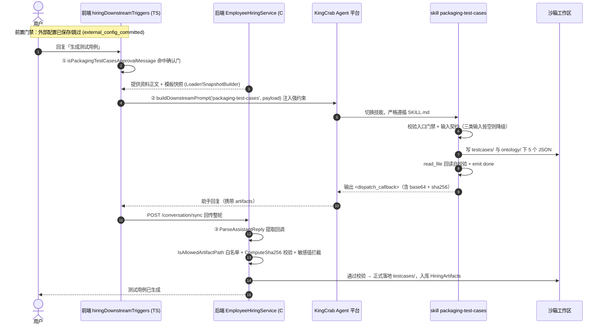

# SKILL 工作流编排能力与 Agent 框架对比分析

> 面向中级开发工程师的通俗讲解。围绕四个问题展开：
> ①参考附件链路；②附件中的 SKILL 模块能否实现「确定的、文档化」的工作流编排；③能否用 LangGraph / LlamaIndex 等 Agent 框架替换；④三者优缺点对比。
> 配图：本文内嵌 Mermaid 时序图；同目录另存《SKILL工作流编排能力与Agent框架对比分析-架构对比层次图.svg》（三方案同层对比）。

---

## 一、一句话结论

| 问题 | 结论 |
|------|------|
| **②SKILL 能做确定的、文档化编排吗？** | **能，但「确定性」是分层的**：流程编排/门禁/落地是确定的（代码硬逻辑），节点内部的「生成内容」是 LLM 概率行为，靠契约 + 自校验 + 后端硬校验 + 降级来收敛。 |
| **③能用 LangGraph / LlamaIndex 替换吗？** | **能替换「编排层」，但不是平替**。LangGraph 最贴合（它天生解决「确定流程 + 概率节点」）；LlamaIndex 可做编排但护城河在 RAG 检索，更适合当「节点能力」而非整体换掉编排。替换的真正代价是要新建一个**中心化常驻编排服务**，并接管现在分散在前端 TS / SKILL.md / 后端 C# 的逻辑。 |
| **④怎么选？** | 现状（轻量、业务可改文案、已与 KingCrab 解耦）适合**快速演进期**；当流程节点变多、确定性要求变高、需要断点续跑/人审回放时，**把编排层迁到 LangGraph** 收益最大；LlamaIndex 作为检索增强补充引入即可。 |

---

## 二、先把名词讲清楚：这里的「SKILL」到底是什么

很多人把它和 Claude Code 的 `/xxx` 斜杠命令搞混。在 hirebot 里，**SKILL 是 Claude Agent Skill 格式的「能力包」**，本质是一份**给 AI 看的自然语言作业指导书 + 配套契约文件**：

```
skills/packaging-test-cases/
├── SKILL.md                      # 作业指导书：何时触发、输入契约、生成要求、输出契约、降级
├── references/OUTPUT_CONTRACT.md  # 输出字段的硬约定
├── templates/TEMPLATE.json        # 结构示例
├── examples/ready/*.json          # 回调样例
└── contracts/artifacts.json       # 产物契约
```

`SKILL.md` 顶部是 YAML frontmatter（`name`/`description`/`trigger`/`input`/`output`），正文是给 Agent 读的"你这一步该怎么干"。**Agent 运行时被「切换」到某个 skill，就严格按这份 SKILL.md 干活。**

> 关键认知：**hirebot 自己不写「怎么生成测试用例」「怎么打 ZIP」的算法**。它把"怎么干"全部交给 SKILL.md，自己只负责**编排（前端门禁 + 提示词注入）+ 数据准备 + 回调落地 + 存储**。真正干活的智能在 KingCrab（Agent 执行平台）里跑的 skill。这正是「业务编排层 hirebot + Agent 执行平台 KingCrab」的分工。

---

## 三、问题②：SKILL 能否实现「确定的、文档化」的工作流编排？

**能。** 但要看清它的确定性是**靠三层硬逻辑「夹」出来的**，而不是靠模型自觉。

### 3.1 三层确定性机制（代码实证）

```
┌─────────────────────────────────────────────────────────────┐
│  ① 前端确定性门禁状态机（TypeScript 纯条件分支，与 LLM 无关）   │
│     resolvePackagingRequestRoute() 返回离散路由              │
│     none / import_existing_package / wait / launch_packaging │
├─────────────────────────────────────────────────────────────┤
│  ② 强约束提示词注入（把"必须怎么做"写死成 prompt 行）          │
│     buildManifestSyncInstructionLines() / ...ZipInstruction  │
│     一条条命令式约束：先 emit 什么 artifact、路径白名单、     │
│     写完必须 read_file 回读校验、失败要降级……                │
├─────────────────────────────────────────────────────────────┤
│  ③ 后端硬校验落地（C#，结果回来后逐项卡）                      │
│     ParseAssistantReply 正则提取 <dispatch_callback>         │
│     IsAllowedArtifactPath 路径前缀白名单                     │
│     ComputeSha256 完整性校验 + 敏感值拦截                     │
└─────────────────────────────────────────────────────────────┘
```

- **第①层是真·确定性**：[resolvePackagingRequestRoute](../front-end/src/features/hiring/pages/utils/hiringDownstreamTriggers.ts#L1065) 是一串 `if/else`，输入相同输出必然相同——这就是状态机式路由，和传统工作流引擎的"条件分支"没区别。门禁词识别 [isPackagingTestCasesApprovalMessage](../front-end/src/features/hiring/pages/utils/hiringDownstreamTriggers.ts#L781) 也是确定的字符串匹配。
- **第②层是「把规则写进文档/提示词」**：[buildManifestSyncInstructionLines](../front-end/src/features/hiring/pages/utils/hiringDownstreamTriggers.ts#L485)、[buildPackageZipInstructionLines](../front-end/src/features/hiring/pages/utils/hiringDownstreamTriggers.ts#L471) 把"打包前必须先同步 manifest、写完要回读、根目录不能是 /workspace"等规则**逐条命令化**注入会话。这是"文档化工作流"的精髓——流程规则是**写在文本里的、可读可审的**。
- **第③层是「结果回来再卡一遍」**：[HiringWorkflowSupport.cs](../back-end/HireBot.Core/Services/Hiring/HiringWorkflowSupport.cs#L97) 里 `IsAllowedArtifactPath` 只放行 `ontology/ skills/ external/ testcases/ config/` 前缀；`ComputeSha256` 校验内容完整性；`ContainsSensitiveValue` 拦截 token/密钥泄漏。**模型就算"不听话"，越界产物也落不了地。**

### 3.2 确定性的边界：哪一段是「概率」的

| 环节 | 确定性 | 由谁保证 |
|------|:---:|------|
| 何时触发哪个 skill（路由） | ✅ 确定 | 前端 TS 状态机 |
| 必须产出哪些文件、放哪、什么字段 | ✅ 确定（契约） | SKILL.md 输出契约 + OUTPUT_CONTRACT.md |
| 越界产物拦截、完整性校验、降级兜底 | ✅ 确定 | 后端 C# 校验 |
| **每条测试用例的具体内容怎么写** | ⚠️ **概率** | LLM 按 SKILL.md「生成要求」发挥 |

所以准确的说法是：**「流程编排是确定的，节点内的内容生成是概率的」**。SKILL.md 用「入口门禁 / 输入契约 / snake_case 字段 / ≥2 步 expected_behavior_sequence / 三类输入皆空则降级」等约束，把这段概率行为**收敛**到可接受范围——但它仍是"靠模型遵守约定"，不是"代码强制保证"。

### 3.3 编排链路时序图（链路一：生成测试用例文档）



> 一句话读懂：**前端决定"要不要走、走哪条"（确定）→ 注入"必须怎么干"的文档化指令（确定）→ KingCrab 里 skill 按 SKILL.md 生成内容（概率）→ 后端把结果逐项卡一遍才落地（确定）**。三道确定性卡口夹着一段概率生成，这就是它"既文档化又相对可控"的原因。

---

## 四、问题③：能否用 LangGraph / LlamaIndex 替换？

**能替换"编排层"，但要分清替换的是哪一块、代价是什么。**

先看清现状的"编排"长什么样：它**没有一个中心编排器**，而是把编排拆成了三处——前端 TS 门禁、SKILL.md 文本规则、后端 C# 校验。LangGraph / LlamaIndex 的价值，恰恰是把这套散落的逻辑**收拢成一张显式的图/工作流**。

### 4.1 用 LangGraph 替换（最贴合）

LangGraph 把工作流建成 **StateGraph（状态图）**：节点 = 一步逻辑，边 = 流转，条件边 = 路由。映射关系几乎一一对应：

| 现状（SKILL 方案） | LangGraph 对应物 |
|------|------|
| `resolvePackagingRequestRoute` 离散路由 | `add_conditional_edges` 条件边 + 路由函数 |
| 各 skill（packaging-test-cases / review …） | 各 `node`（节点函数，内部可调 LLM） |
| SKILL.md 里的"入口门禁/输入契约" | 节点入口的代码断言 + Pydantic schema 校验 |
| 会话历史 + 沙箱文件（隐式状态） | 显式 `State` 对象 + `Checkpointer` 持久化 |
| "写完 read_file 回读"自校验 | `with_structured_output` + 失败重试边 |
| 后端白名单/SHA256 落地校验 | 落地节点里的代码校验（同样写在代码里） |

**收益**：流程从"散在三处的隐式约定"变成"一张可视化、可单测、可断点续跑的图"；human-in-the-loop（人审）、checkpoint 回放是框架原生能力。

**代价**：要新建一个**常驻编排服务**（Python/JS）来承载这张图；LLM、工具、沙箱写文件都要你自己接进节点；与现有 .NET 后端、KingCrab 平台的边界要重新划。

### 4.2 用 LlamaIndex 替换（更适合当"节点能力"）

LlamaIndex 有两张牌：**Workflows（事件驱动编排）** 和 **Agent / 检索管线**。

- 用 **Workflows** 也能替换编排：节点是带 `@step` 的方法，步骤间用"事件类型"连边，隐式成图。能做，但它的定位偏数据/检索，纯流程编排不是它最锋利的地方。
- 它真正的护城河是 **RAG（检索增强）**：内置大量索引/检索/重排组件。本场景里"读上传资料 → 提炼业务场景 → 生成用例"这一段，如果资料量大、需要语义检索，用 LlamaIndex 当**节点内部的检索能力**非常合适。

**结论**：LlamaIndex 更适合"**作为节点能力补充**"被引入（比如配合 LangGraph：LangGraph 管编排，LlamaIndex 管节点内的检索），而不是拿它整体替换掉编排层。

### 4.3 替换的隐性代价（容易被低估）

1. **从"无中心编排器"到"有中心编排器"**：现状好处是轻——前端改个门禁、改个 SKILL.md 文案就能上线；换框架后，编排集中了，但每次流程变更都要改代码 + 测试 + 部署常驻服务。
2. **跨语言/跨平台成本**：现状是 TS + C# + KingCrab；引入 LangGraph/LlamaIndex 通常是 Python 生态，多一套运行时和运维面。
3. **"业务可改文案"能力会弱化**：现在运营/业务能直接改 SKILL.md 调整 Agent 行为；迁到代码图后，这种"零代码改节点"的灵活性需要额外做配置化才能保留。

---

## 五、问题④：三者优缺点对比

### 5.1 总览对比表

| 维度 | SKILL（SKILL.md 提示词编排，现状） | LangGraph | LlamaIndex |
|------|------|------|------|
| **定位** | 业务编排层 + 文档化 Agent 能力包 | 显式状态图编排框架 | 数据/检索框架（含 Workflows 编排） |
| **流程编排确定性** | 中：门禁/落地确定，节点内概率 | **高**：状态/路由/断点是一等公民 | 中高：Workflows 可编排，非主打 |
| **节点逻辑实现** | 自然语言 SKILL.md（业务可读写） | 代码函数（强类型、可单测） | 代码 + 丰富 RAG 组件 |
| **状态管理** | 隐式（会话历史 + 沙箱文件） | **显式 State + Checkpointer** | Context + Index/Memory |
| **改一个节点的成本** | 低：改文本不重新部署 | 高：改代码 + 测试 + 部署 | 高：改代码 + 测试 + 部署 |
| **行为可保证程度** | 靠模型"遵守"+ 后端兜底校验 | **代码强约束，可回归测试** | 代码约束 + 检索质量评估 |
| **人审/断点续跑/回放** | 需自行用门禁拼 | **原生支持** | 部分支持 |
| **检索增强（RAG）** | 无（需自建） | 需外接 | **原生强项** |
| **运维面 / 架构侵入** | 低（已与 KingCrab 解耦） | 中（需常驻编排服务） | 中（需常驻服务 + 向量库） |
| **业务/运营自助能力** | **强**（改 SKILL.md 即可） | 弱（需工程师） | 弱（需工程师） |
| **可观测/可视化** | 弱（逻辑分散三处） | **强**（图可视化、trace） | 中 |
| **生态/语言** | TS + C# + KingCrab，自有协议 | Python/JS，LangChain 生态 | Python，数据生态 |

### 5.2 各自最适合的场景

- **SKILL（现状）适合**：流程相对稳定、希望业务侧能快速改 Agent 行为、已经有 KingCrab 这类 Agent 执行平台、不想为编排单独养一套服务的团队。**快速演进期性价比最高。**
- **LangGraph 适合**：流程节点变多、分支复杂、对确定性/可回归/人审/断点续跑要求高、愿意把编排集中成一套代码服务的团队。**「确定的、文档化工作流编排」最正统的答案。**
- **LlamaIndex 适合**：核心痛点在"海量资料检索 + 基于检索生成"的场景。**优先作为节点内检索能力引入，而非整体替换编排。**

---

## 六、给本项目的选型建议

1. **现在不必急于替换**：当前 SKILL 方案的三层确定性（前端门禁 + 提示词强约束 + 后端硬校验）已经把"流程"做成确定的，且保留了"改 SKILL.md 即可调整行为"的业务灵活性，与 KingCrab 解耦良好。在流程还在频繁演进时，这套轻量编排的迭代速度是优势。
2. **触发迁移的信号**：当出现以下任一情况，再考虑把**编排层**迁到 LangGraph——①下游 skill/分支数量显著增多、门禁逻辑在前端 TS 越堆越乱；②需要断点续跑、失败回放、人工审批节点这类"工作流引擎"能力；③对"节点行为必须强保证、可回归测试"的要求超过"业务可改文案"的灵活性。
3. **LlamaIndex 按需点状引入**：若资料检索成为瓶颈（用例生成质量受限于"找不到对的资料"），在对应节点引入 LlamaIndex 的检索管线即可，无需动整体架构。
4. **迁移时保留的资产**：SKILL.md 里的"输入契约/输出契约/降级规则"是宝贵的领域知识，迁到 LangGraph 时应转化为节点的 Pydantic schema 与断言，而非丢弃。

---

## 附：相关代码索引（便于核对）

| 关注点 | 文件:行 |
|------|------|
| 确认语门禁（确定性触发） | [hiringDownstreamTriggers.ts:781](../front-end/src/features/hiring/pages/utils/hiringDownstreamTriggers.ts#L781) |
| 下游提示词注入 | [hiringDownstreamTriggers.ts:441](../front-end/src/features/hiring/pages/utils/hiringDownstreamTriggers.ts#L441) `buildDownstreamPrompt` |
| 打包请求路由状态机 | [hiringDownstreamTriggers.ts:1065](../front-end/src/features/hiring/pages/utils/hiringDownstreamTriggers.ts#L1065) `resolvePackagingRequestRoute` |
| manifest 同步强约束 | [hiringDownstreamTriggers.ts:485](../front-end/src/features/hiring/pages/utils/hiringDownstreamTriggers.ts#L485) |
| 打 ZIP 强约束 | [hiringDownstreamTriggers.ts:471](../front-end/src/features/hiring/pages/utils/hiringDownstreamTriggers.ts#L471) |
| SKILL 作业指导书 | [packaging-test-cases/SKILL.md](../back-end/HireBot.ApiService/Assets/DigitalEmployeeTemplates/employment-coach-conversation/skills/packaging-test-cases/SKILL.md) |
| 回调解析 | [HiringWorkflowSupport.cs:17](../back-end/HireBot.Core/Services/Hiring/HiringWorkflowSupport.cs#L17) `ParseAssistantReply` |
| 路径白名单校验 | [HiringWorkflowSupport.cs:97](../back-end/HireBot.Core/Services/Hiring/HiringWorkflowSupport.cs#L97) `IsAllowedArtifactPath` |
| 完整性 SHA256 校验 | [HiringWorkflowSupport.cs:82](../back-end/HireBot.Core/Services/Hiring/HiringWorkflowSupport.cs#L82) `ComputeSha256` |

> 配套层次图：《SKILL工作流编排能力与Agent框架对比分析-架构对比层次图.svg》（同目录）。
