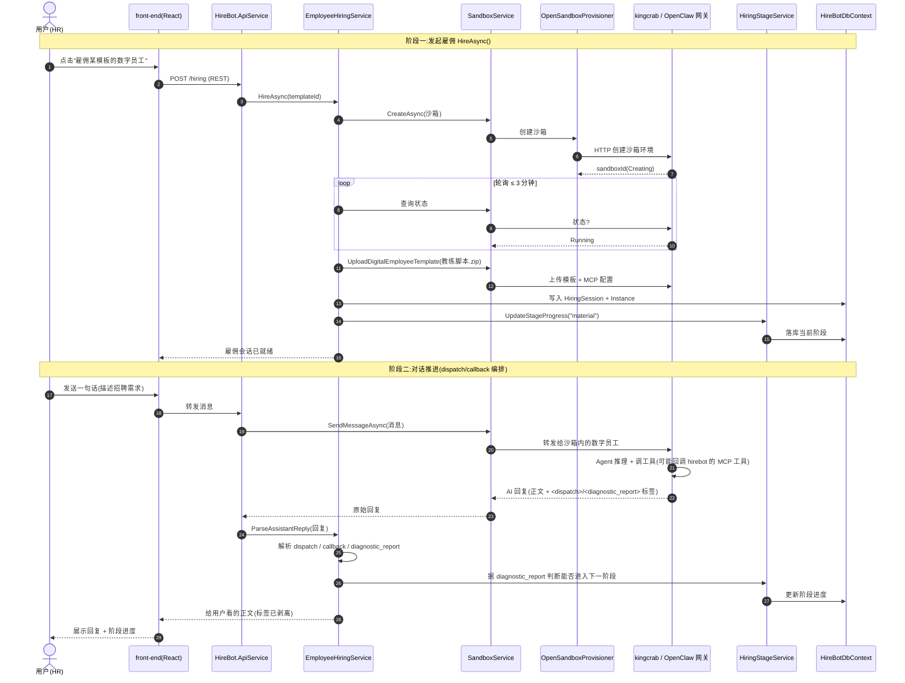

# hirebot 项目 — Agent 工作流编排与协作机制分析

> 面向中级开发工程师的通俗讲解版。代码标识符、文件名、命令保留英文原文，其余用中文。
> 分析对象:`c:\Users\wayye\Documents\ai4c_Projects\hirebot`（.NET 10 / C# 14）

---

## 0. 一句话结论

**hirebot 自己不是"AI 大脑",它是"业务编排层 + 雇佣流程引擎"。**
真正跑大模型、调工具的 Agent 运行时在隔壁的 kingcrab(OpenClaw) 里;hirebot 负责把"招一个数字员工"这件事拆成有顺序的阶段,通过 HTTP / MCP 指挥 kingcrab 干活,并解析 AI 回复里的结构化指令来推进流程。

用一个类比:
- **kingcrab** = 会干活的"数字员工"本人(有大脑、会用工具)。
- **hirebot** = HR + 项目经理,负责"面试→打包→测试→上岗"的全流程编排,以及给员工配工位(沙箱)、配 IM 账号(钉钉/飞书)。

---

## 1. 整体架构(后端模块分层)

hirebot 后端是一个**模块化单体(Modular Monolith)**,按职责切成 5 个 .NET 项目:

| 模块 | 职责 | 类比 |
|------|------|------|
| `HireBot.Abstraction` | 接口 + DTO,跨模块协议层 | "合同/协议文本" |
| `HireBot.Core` | 核心业务:雇佣、评估、沙箱、模板编排 | "业务大脑" |
| `HireBot.ApiService` | ASP.NET Core 入口、Controller、**MCP Server** | "前台接待 + 对外工具窗口" |
| `HireBot.Repository` | EF Core 数据访问、数据库迁移 | "档案室" |
| `HireBot.ServiceDefaults` | Aspire 服务默认配置(日志、健康检查等) | "公司基础设施" |

`HireBot.Core` 内部又按业务域细分(这是理解编排的关键):

```
HireBot.Core/Services/
├── Hiring/           # 雇佣流程编排(核心)
├── EmployeeRuntime/  # 数字员工实例的生命周期 + IM 通道配置
├── Evaluation/       # 评估工作流(1700+ 行,最复杂)
├── Sandbox/          # 沙箱生命周期 + KingCrab 集成
├── EmployeeTemplate/ # 模板管理
└── SystemSkills/     # 系统技能注册表
```

---

## 2. 核心问题一:有没有 "Agent 工作流编排"?

**有,而且是这个项目的灵魂。** 但它不是用某个现成的工作流引擎(如 Stateless、Elsa),而是用 **"业务阶段状态机 + AI 回复结构化解析"** 自己实现的。下面拆成 4 个机制讲。

### 2.1 机制 A:对话驱动的 dispatch / callback 编排 ⭐最关键

这是 hirebot 最有"Agent 味"的设计。AI(数字员工)给用户的回复里,除了给人看的文字,还**夹带了机器能读的结构化标签**,hirebot 解析这些标签来推进流程。

**关键代码**:[HiringWorkflowSupport.ParseAssistantReply](back-end/HireBot.Core/Services/Hiring/HiringWorkflowSupport.cs#L17-L70)

```csharp
// HiringWorkflowSupport.cs:25-60 —— 遍历 AI 回复里的标签
foreach (Match match in HiringTagRegex().Matches(normalizedContent))
{
    switch (tagName)
    {
        case "dispatch":              // ① 派活:让某个下游目标去做事
        case "dispatch_callback":     // ② 回执:某个任务做完了,带回产物
        case "diagnostic_report":     // ③ 体检报告:当前阶段完成度如何
        case "config_governance_patch": // ④ 配置变更:要改哪些配置文件
    }
}
```

通俗理解这 4 个标签:
- `<dispatch>`:数字员工说"这事该交给 packaging 模块去打包了" → hirebot 据此派发任务。
- `<dispatch_callback>`:"打包任务做完了,这是产出的文件" → hirebot 收下产物。
- `<diagnostic_report>`:"我盘点了一下,素材收集阶段已经齐了,可以进入下一阶段" → hirebot 据此判断能否推进。
- `<config_governance_patch>`:"请把这几个配置文件改成这样" → hirebot 更新配置。

对应的数据结构(记录类)在 `HiringWorkflowSupport.cs` 末尾:

```csharp
internal sealed record HiringDispatchCommand(
    string Target,                       // 派给谁:如 "packaging" / "evaluation"
    IReadOnlyList<string> HandoffIds,    // 关联的交付项
    string? To, string? Note, string? Mode);
```

> 💡 **为什么这么设计?** 因为大模型的输出本质是"一段文本"。要让文本驱动业务流程,就得约定一套"暗号"(标签),让 AI 按格式输出、让程序按格式解析。这是当前 Agent 工程里非常常见的"结构化输出 + 解析"模式。

### 2.2 机制 B:雇佣阶段状态机

整个雇佣过程被建模成一条**有顺序的流水线**:

```
material(素材收集) → packaging(包装) → testcases(测试用例) → evaluation(评估) → distribution(发布)
```

**关键代码**:[HiringStageService](back-end/HireBot.Core/Services/Hiring/HiringStageService.cs) —— 用一张数据库表 `HiringStageProgressEntity` 记录"当前走到哪一步",通过 `UpdateStageProgressAsync()` / `GetStageProgressAsync()` 读写。

> 注意:它没用专门的状态机框架,而是"数据库字段 + 条件判断"。优点是简单直观、易查询;代价是状态流转规则散落在代码里。

### 2.3 机制 C:雇佣主流程编排(把上面所有东西串起来)

**关键代码**:[EmployeeHiringService.HireAsync](back-end/HireBot.Core/Services/Hiring/EmployeeHiringService.cs#L59) —— 这是"招人"按钮背后的总指挥,串了 10 步:

```
1. 校验模板 ID
2. 查有没有可复用的旧沙箱(暂停的就唤醒,省资源)
3. 没有就 CreateAsync 创建新沙箱(调 kingcrab)
4. 轮询等待沙箱进入 Running(最多 3 分钟)
5. 上传"雇佣对话教练"模板(employment-coach-conversation.zip)到沙箱
6. 按需上传 MCP 配置
7. 标记沙箱已初始化
8. 落库:创建 HiringSessionEntity(雇佣会话)
9. 创建 hiring 状态的员工实例(EmployeeRuntimeService.CreateFromHireAsync)
10. 初始化阶段进度 = "material"
```

### 2.4 机制 D:沙箱生命周期编排

**关键代码**:[SandboxService](back-end/HireBot.Core/Services/Sandbox/SandboxService.cs) —— 管理沙箱这个"工位"的状态流转:

```
NotInitialized → Creating → Running → Paused → Running → Deleted
```

`CreateAsync` / `RefreshAsync` / `PauseAsync` / `ResumeAsync` / `RebuildAsync` / `DeleteAsync` 各管一段,底层全部委托给 `OpenSandboxProvisioner` 去调 kingcrab 的 HTTP 接口。

---

## 3. 核心问题二:有没有 "多模块 / 多 Agent 协作机制"?

**有。** 但要分清两个层次:
- **模块内协作**(hirebot 内部):靠依赖注入 + 多张轻量数据库表。
- **跨系统协作**(hirebot ↔ kingcrab):靠 HTTP 客户端 + MCP 工具,这是真正的"多 Agent 平台协作"。

### 3.1 hirebot 内部:DI + 多表协作

- **依赖注入**:[ServiceExtensions.cs](back-end/HireBot.Core/Extensions/ServiceExtensions.cs) 里把 `IEmployeeHiringService`、`ISandboxService`、`IEvaluationService`、`IInstanceChatService` 等全部注册为 `Scoped`,用 C# 14 主构造函数注入,互相调用。
- **多张轻量表替代"大上下文对象"**:雇佣会话、阶段进度、结构化数据、产物、审计日志……各用一张表(`HiringSessions` / `HiringStageProgresses` / `HiringArtifacts` …),各自独立读写,而不是把所有状态塞进一个巨大的 JSON。好处是并发友好、查询清晰。

### 3.2 跨系统:hirebot ↔ kingcrab 的协作(重点)

这才是"多 Agent 协作"的真身。协作有 4 条通道:

| 协作通道 | 方向 | 关键代码 | 作用 |
|---------|------|---------|------|
| **沙箱管理** | hirebot → kingcrab | `OpenSandboxProvisioner` / `KingCrabHttpClient` | 创建/刷新/删除数字员工的运行环境 |
| **模板上传** | hirebot → kingcrab | `SandboxService.UploadDigitalEmployeeTemplateAsync` | 把"雇佣教练对话脚本"灌进沙箱 |
| **对话消息流** | hirebot ↔ kingcrab | `SandboxService.SendMessageAsync` / `GetTimelineAsync` | 转发用户消息、取回 AI 回复时间线 |
| **IM 通道配置** | hirebot → kingcrab | `InstanceChatService` | 给数字员工配钉钉/飞书账号 |

其中 IM 通道的两个端点很说明问题:
```csharp
// InstanceChatService.cs
const string FeishuChannelUpdatePath   = "/admin/channels/feishu/update";
const string DingTalkChannelUpdatePath = "/admin/channels/dingtalk/update";
```
即:hirebot 配好渠道参数后,推给 kingcrab 网关,由 kingcrab 真正去对接钉钉/飞书。

### 3.3 反向协作:hirebot 也对外暴露 MCP 工具

hirebot 不只是"调用方",它自己也是一个 **MCP Server**,把能力暴露给 Agent 调用。

**关键代码**:[HiringTodoMcpTools](back-end/HireBot.ApiService/McpTools/HiringTodoMcpTools.cs) + `Program.cs` 里的 `AddMcpServer(...).WithTools<HiringTodoMcpTools>()`

```csharp
[McpServerTool(Name = "hiring.parse_uploaded_files", ReadOnly = true)]
[Description("读取当前雇佣会话已上传的 .md / .json 资料全文")]
public async Task<string> ParseUploadedFilesAsync(...)
```

也就是说:沙箱里的数字员工在跟用户聊"招聘需求"时,可以**反过来调用 hirebot 的 `hiring.parse_uploaded_files` 工具**,去读用户上传的资料。这就形成了双向协作的闭环。

---

## 4. 时序图:一次完整的"雇佣"流程(跨模块 + 跨系统协作)

> 这张图把第 2、3 节的机制串成一条端到端的时间线,最能体现 hirebot 的协作本质。



---

## 5. 部署形态(补充)

- **打包**:`Dockerfile` 三段式 —— Node 22 构建前端 → .NET 10 SDK 构建后端 → aspnet:10.0 运行时,前端 `dist` 拷进 `wwwroot`,单容器对外暴露 8080。
- **编排部署**:`helm/ncrew-hire/` Chart,部署到 K8s 的 `opensandbox` 命名空间,`values-saas.yaml` 管生产配置。
- **认证**:Keycloak 26.5(OIDC / OAuth2),前端拿 Bearer Token 调后端。

---

## 6. 总结与评价

| 维度 | 结论 |
|------|------|
| **Agent 工作流编排** | ✅ 有。以"阶段状态机 + AI 回复结构化标签(dispatch/callback)"自研实现,而非现成工作流引擎 |
| **多模块协作** | ✅ 有。DI + 多张轻量表;模块边界清晰(雇佣/评估/沙箱/实例) |
| **多 Agent / 跨系统协作** | ✅ 有。通过 HTTP 把真正的 Agent 运行托管给 kingcrab,并以 MCP 工具反向暴露能力,形成双向闭环 |
| **架构定位** | hirebot = **业务编排层**;kingcrab = **Agent 执行层**。职责分离清晰 |

**一句话总评**:hirebot 把"复杂的 AI 编排"和"严谨的业务流程"做了漂亮的解耦 —— 大模型的不确定性被关进 kingcrab 沙箱,hirebot 这边用确定性的状态机和数据库表来保证业务可追溯、可恢复。这是一种成熟、务实的"Agent 落地"工程范式。

**可改进点**:`agents.md` 里规划了 Dapr PubSub 异步消息,但当前核心流程仍以同步 HTTP 为主;沙箱失败的自动恢复、`HiringTodoService` 的部分能力仍有 TODO。

---

> 配套图:见同目录 `hirebot项目Agent调用堆栈层次图.svg`(从 HTTP 入口到 kingcrab 的调用分层)
