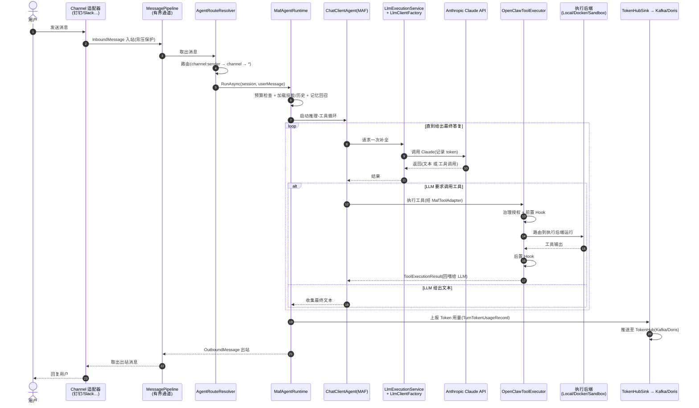

# kingcrab(OpenClaw) 项目 — Agent 工作流编排与多 Agent 协作机制分析

> 面向中级开发工程师的通俗讲解版。代码标识符、文件名、命令保留英文原文,其余用中文。
> 分析对象:`c:\Users\wayye\Documents\ai4c_Projects\kingcrab`(代号 OpenClaw,.NET 10 / .NET Aspire)

---

## 0. 一句话结论

**kingcrab 是一个完整、可扩展的"Agent 运行平台"。**
它不是某个具体业务,而是一套**通用底座**:把"大模型 + 工具 + 技能 + 多渠道接入 + 治理 + 计费"打包成一个可以接入任意 IM/客户端的数字员工运行时。

用一个类比:
- 如果 hirebot 是"HR + 项目经理",那么 **kingcrab 就是"员工本人 + 他所在的办公大楼"**:有大脑(LLM)、有手脚(工具)、有技能手册(Skill)、有门禁和审批(治理)、有多个入口(钉钉/Slack/飞书…)、还有水电表(Token 计费)。

**直接回答两个核心问题:**
- **Agent 工作流编排?** ✅ 有,而且有两层:① 单 Agent 内部的"推理-工具循环"(`MafAgentRuntime`);② 跨步骤的"工作流引擎"(`IAgentWorkflowRunner` + Plan-Execute-Verify)。
- **多模块 / 多 Agent 协作?** ✅ 有,这是它的核心卖点:多渠道适配器、进程内消息管道、契约驱动的协作路由、插件化扩展、.NET Aspire 多服务编排。

---

## 1. 整体架构(模块分层鸟瞰)

kingcrab 由 20+ 个 `OpenClaw.*` 项目组成。按职责可归为 5 层:

| 层 | 代表项目 | 职责 |
|----|---------|------|
| **客户端 / 接入层** | `OpenClaw.Channels`、`OpenClaw.Companion`(桌面)、`OpenClaw.Dashboard`(Web)、`OpenClaw.Cli`、`OpenClaw.Tui` | 各种入口:IM 渠道、桌面/网页/命令行界面 |
| **网关层** | `OpenClaw.Gateway` | 核心枢纽:收消息、路由、组装运行时、暴露 HTTP/WebSocket/MCP |
| **Agent 运行时层** | `OpenClaw.Agent` | Agent 大脑:推理-工具循环、LLM 交互、工具编排 |
| **核心抽象层** | `OpenClaw.Core` | 领域模型与接口:Session、Tool、Skill、Memory、Workflow、治理、可观测 |
| **能力扩展层** | `OpenClaw.SkillKit(.Abstractions)`、`OpenClaw.PluginKit`、`OpenClaw.Plugins.*`、`OpenClaw.TokenHubSink`、`OpenClaw.Payments.*` | 技能系统、插件系统、各类业务插件、Token 计费上报、支付 |

> 阅读建议:理解 kingcrab 只需抓住三条主线 —— **(A) Agent 怎么思考干活、(B) 模块之间怎么协作、(C) 一次请求怎么从渠道流到大模型再流回来。** 下面分别讲。

---

## 2. 主线 A:Agent 工作流编排

### 2.1 单 Agent 的"推理-工具循环"(最核心)

**接口**:[IAgentRuntime](src/OpenClaw.Agent/IAgentRuntime.cs#L8) —— 只有几个方法,但它就是整个 Agent 的总开关:

```csharp
public interface IAgentRuntime
{
    Task<string> RunAsync(Session session, string userMessage, CancellationToken ct, ...);      // 跑一轮对话
    IAsyncEnumerable<AgentStreamEvent> RunStreamingAsync(...);                                   // 流式跑一轮
    Task<IReadOnlyList<string>> ReloadSkillsAsync(...);                                          // 热重载技能
    IReadOnlyList<SkillDefinition> LoadedSkills { get; }   // 供 load_skill 工具按需取技能正文(渐进式披露)
}
```

**实现**:[MafAgentRuntime](src/OpenClaw.Agent/MafAgentRuntime.cs#L17) —— 基于微软的 `Microsoft.Agents.AI`(MAF)的 `ChatClientAgent` 来跑循环。一轮 `RunAsync` 大致做这些事:

```
1. 预算检查:合同预算 / 会话 Token 预算够不够
2. 加载技能(ApplySkillsIfNeeded) + 恢复会话历史(LoadAgentSession)
3. 拼消息:[系统提示 + 技能索引 + 历史 + 用户输入]
4. 记忆回召注入(TryInjectRecall):把相关长期记忆塞进上下文
5. 建立执行上下文作用域(MafExecutionContext,AsyncLocal)
6. agent.RunAsync() 启动"推理-工具循环":
       LLM 思考 → 要么输出文本、要么要求调用工具
       若调工具 → 执行 → 把结果回喂给 LLM → 继续想
       直到 LLM 给出最终答复
7. 保存历史 + 持久化会话 + 记录指标(Metrics)
```

> 💡 **通俗理解"推理-工具循环"**:大模型像一个人在解题,它可以说"我需要先查一下资料"(请求调工具),程序帮它查完把结果递回去,它接着想,直到得出结论。这个"想—查—再想"的来回,就是 Agent 的灵魂。

### 2.2 工具编排:OpenClawToolExecutor(带治理与 Hook)

当 LLM 要求调用工具时,不是直接执行,而是走一条**有安全检查的流水线**:

**关键代码**:`OpenClawToolExecutor.ExecuteAsync()`(`src/OpenClaw.Agent/OpenClawToolExecutor.cs`)

```
查表找到 ITool
  → 工具预设解析(IToolPresetResolver)
  → 治理授权(IToolGovernanceService.AuthorizeAsync)   ← 危险工具要审批
  → 前置 Hook(IToolHook.BeforeExecuteAsync)
  → 路由到执行后端(下面 4 选 1)
  → 后置 Hook(IToolHook.AfterExecuteAsync)
  → 返回 ToolExecutionResult
```

工具被适配进 MAF 是靠 [MafToolAdapter](src/OpenClaw.Agent/MafToolAdapter.cs#L9):把内部的 `ITool` 包装成 MAF 认识的 `AIFunction`。

**4 种执行后端**(同一个工具可以在不同环境跑,体现"多态执行"):
- `LocalExecutionBackend` —— 直接在网关主机执行
- `DockerExecutionBackend` —— Docker 容器隔离
- `SshExecutionBackend` —— SSH 远程执行
- `OpenSandboxExecutionBackend` —— OpenSandbox 沙箱(就是 hirebot 用的那种)

### 2.3 跨步骤工作流引擎:IAgentWorkflowRunner + Plan-Execute-Verify

除了"单轮对话循环",kingcrab 还有**显式的多步骤工作流**抽象:

**关键代码**:[WorkflowModels.cs](src/OpenClaw.Core/Models/WorkflowModels.cs) + `IAgentWorkflowRunner`

```csharp
public interface IAgentWorkflowRunner   // 跑一个长流程,可暂停等待人类输入
{
    Task<AgentWorkflowRunResult>   RunAsync(AgentWorkflowRequest request, CancellationToken ct);
    Task<AgentWorkflowRunSnapshot> RespondAsync(string runId, AgentWorkflowResponse response, CancellationToken ct);
    IAsyncEnumerable<AgentWorkflowEvent> StreamAsync(string runId, CancellationToken ct);
}

public static class AgentWorkflowStatuses  // 工作流状态机
{ Queued, Running, WaitingForInput, Completed, Failed, Cancelled }
```

后端类型支持 `maf-durable-http`(`WorkflowBackendConfig.Kind`),即对接 MAF 的持久化工作流。

另一条编排线是 **Plan-Execute-Verify**(计划-执行-校验):[IPlanExecuteVerifyOrchestrator](src/OpenClaw.Core/Abstractions/IPlanExecuteVerifyOrchestrator.cs#L19) —— 在执行工具前评估是否需要审批、执行后记录结果并做校验,把"先规划、再执行、后验证"做成可治理的闭环。

### 2.4 技能系统:SkillKit(让 Agent 按"剧本"工作)

技能(Skill)是给 Agent 的"专项操作手册"。`OpenClaw.SkillKit.Abstractions` 里定义了模型:

**关键代码**:`SkillKitModels.cs`

```csharp
public sealed class SkillManifest { Id; Name; Version; Intent; Inputs; Outputs; Workflow; ... }
public sealed class SkillWorkflow { Steps[] }
public sealed class SkillWorkflowStep { Id; Name; Type; }  // Type: Input/Reasoning/Generation/Validation/Approval/Output
```

即:一个技能本身可以声明一条"输入→推理→生成→校验→审批→输出"的小工作流。技能由 `SkillLoader.LoadAll()` 从 `SKILL.md` 加载,`SkillPromptBuilder.BuildIndex()` 生成"技能目录"塞进系统提示,LLM 需要时再用内置的 `load_skill` 工具按需取正文(**渐进式披露**,省 Token)。

---

## 3. 主线 B:多模块 / 多 Agent 协作机制

### 3.1 网关的"分层组合"(Composition Pattern)

`OpenClaw.Gateway` 启动时不是一坨初始化,而是**分阶段注册**(`src/OpenClaw.Gateway/Composition/`):

| 组合扩展 | 注册什么 |
|---------|---------|
| `CoreServicesExtensions` | Session 管理、内存存储、可观测 |
| `ToolServicesExtensions` | 原生插件工具、MCP 工具 |
| `ChannelServicesExtensions` | 多渠道适配器(钉钉/Slack/飞书…) |
| `BackendServicesExtensions` | 代码执行后端(Docker/Local/Sandbox) |
| `SecurityServicesExtensions` | 身份验证、审批、安全策略 |

运行时最终在 [RuntimeInitializationExtensions](src/OpenClaw.Gateway/Composition/RuntimeInitializationExtensions.cs#L35) 把这些"零件"装成一个 `IAgentRuntime`:
```
解析服务 → 加载插件 → 加载技能 → 聚合工具(内置 + 插件 + load_skill) → 注册 Hook → 创建 Agent 运行时
```

### 3.2 多渠道适配器(统一抽象,多入口接入)⭐

**关键代码**:[IChannelAdapter](src/OpenClaw.Core/Abstractions/IChannelAdapter.cs)

```csharp
public interface IChannelAdapter : IAsyncDisposable
{
    string ChannelId { get; }
    Task StartAsync(CancellationToken ct);
    ValueTask SendAsync(OutboundMessage message, CancellationToken ct);
    event Func<InboundMessage, CancellationToken, ValueTask> OnMessageReceived;  // 收到消息就触发
}
```

`OpenClaw.Channels/` 里实现了一大批渠道,全部统一成同一个接口:
`SlackChannel`、`DingTalkChannel`、`FeishuChannel`、`TeamsChannel`、`DiscordChannel`、`TelegramChannel`、`EmailChannel`、`WebSocketChannel`、`TwilioSmsChannel`、`CronChannel`(定时触发)、`SignalChannel`。

> 💡 这就是"多入口协作"的关键:无论消息来自钉钉还是 Slack,进了网关后都被归一成 `InboundMessage`,后续处理完全一致。新增一个渠道只要实现 `IChannelAdapter`,不动核心。

### 3.3 进程内高速消息管道 + 路由

**消息管道**:[MessagePipeline](src/OpenClaw.Core/Pipeline/MessagePipeline.cs) 用 `System.Threading.Channels` 的**有界通道(容量 1024)**实现入站/出站队列,满了就 `Wait`(背压),防止消息洪峰把内存打爆。

**路由解析**:[AgentRouteResolver](src/OpenClaw.Gateway/Integrations/AgentRouteResolver.cs#L8) 决定"这条消息该交给哪个 Agent 配置",优先级:
```
精确匹配(channel:sender) → 仅渠道匹配(channel) → 通配符(*)
```
> 这意味着同一个网关可以**承载多个不同的 Agent 路由**(不同渠道/不同用户 → 不同 Agent 人格/配置),这是"多 Agent 共存"的体现。

### 3.4 契约驱动的协作路由(ontology_extraction)⭐独特设计

这是 kingcrab 一个很有特色的设计,用于**让 Agent 在协作时自动选择正确的"协议形式"**。

**关键文件**:`src/OpenClaw.Gateway/skills/software-developer/contracts/projections/ontology_extraction/contract-index.json`

它是一套**五层智能路由**(打分选择):
- **第一层 Topic(4 个域)**:`skill-loading`(技能加载)、`task-execution`(任务执行)、`tool-orchestration`(工具编排)、`memory-session`(记忆会话)。
- **第二层 Target View(4 种视图)**:`domain-model`(C# 领域模型)、`json-schema`(校验契约)、`prompt-constraint`(提示约束)、`workflow-contract`(工作流契约)。

选择算法(打分):主要意图匹配 +5、强信号关键词 +3、支持信号 +1、跨话题冲突 -2;分差 ≥2 自动选,否则要求澄清。还有 6 对 topic 间的 `tie_breaker` 冲突消解规则。

> 💡 **通俗理解**:当一个 Agent 要把"某个概念"产出成代码/契约时,这套系统帮它判断"现在该输出 C# 类?还是 JSON Schema?还是一张工作流图?"——相当于多个协作角色之间的"翻译官 + 调度员"。`OpenClaw.Plugins.EmploymentCoachWorkflow`(雇佣教练工作流插件)就用这套契约把"技能加载"流程投影成显式的 `workflow-contract`。

### 3.5 插件系统:PluginKit(运行时热插拔能力)

**关键代码**:[INativeDynamicPlugin](src/OpenClaw.PluginKit/INativeDynamicPlugin.cs#L11)

```csharp
public interface INativeDynamicPlugin
{
    void Register(INativeDynamicPluginContext context);  // 插件在这里登记自己的能力
}
// context 提供:RegisterTool / RegisterChannel / RegisterProvider / RegisterMemoryProvider / RegisterHook / RegisterService
```

插件由 `NativeDynamicPluginHost.LoadAsync()` 在运行时加载 .NET DLL 并调用 `Register()`。一个插件可以一次性给系统加:新工具、新渠道、新 LLM Provider、新记忆后端、新 Hook。**工具/渠道/Provider 都是插件化扩展点**,这是"多模块可插拔协作"的工程基础。MCP 工具则由 `McpServerToolRegistry` 发现并注册。

### 3.6 LLM 供应商与 Token 计费协作

**多 Provider**:`LlmClientFactory` 支持 10+ 家 —— `anthropic`/`claude`(重点)、`anthropic-vertex`、`amazon-bedrock`、`openai`、`azure-openai`、`gemini`、`ollama`、`embedded`、各种 `openai-compatible`。Anthropic Claude 走官方 `Anthropic` SDK(`new AnthropicClient { ApiKey, BaseUrl }`),再用 `.AsIChatClient(modelId)` 适配成 `Microsoft.Extensions.AI.IChatClient`。

**Token 计费链路**(对接 TokenHub → Kafka/Doris):
```
LLM 调用(MafExecutionServiceChatClient)
  → 记录 TurnTokenUsageRecord(输入/输出/缓存读写 token)
  → ITurnTokenUsageObserver.RecordTurn()
  → TokenHubSinkTurnTokenUsageObserver
  → ITokenUsageEventSink.Publish(SessionTokenUsageEvent)
  → HttpTokenUsageSink → TokenHub 后端(Kafka / Doris)
```
同时 `ProviderUsageTracker` 按 (Provider, Model) 维度做本地用量统计。

### 3.7 .NET Aspire 多服务编排

**关键代码**:[AppHost.cs](Kingcrab.AppHost/AppHost.cs) —— 用 Aspire 把多个服务的启动顺序和依赖关系声明出来:

```csharp
var keycloak  = builder.AddKeycloak("keycloak", 8080).WithRealmImport(...);
var gateway   = builder.AddProject<Projects.OpenClaw_Gateway>("gateway")
                       .WithReference(keycloak).WaitFor(keycloak);   // 等 Keycloak 起来再起 Gateway
var cli       = builder.AddProject<Projects.OpenClaw_Cli>("cli");
var companion = builder.AddProject<Projects.OpenClaw_Companion>("companion");
```
> 这层是"宏观协作":谁先启动、谁依赖谁,由 Aspire 统一编排;Kafka/Doris 这类外部基础设施则在 `docker-compose.yml` 里。

---

## 4. 时序图:一次消息从渠道到大模型再回来的完整协作

> 这张图把主线 A(推理-工具循环)和主线 B(多模块协作)合在一条端到端时间线里。



---

## 5. 总结与评价

| 维度 | 结论 |
|------|------|
| **Agent 工作流编排** | ✅ 双层:`MafAgentRuntime` 推理-工具循环(单轮) + `IAgentWorkflowRunner`/Plan-Execute-Verify(多步骤) + Skill 内置小工作流 |
| **多模块协作** | ✅ 强。网关分层组合 + 插件化扩展点(工具/渠道/Provider/记忆/Hook 全可插拔) |
| **多 Agent / 多入口协作** | ✅ 强。统一渠道抽象(11+ 渠道)+ 路由(多 Agent 共存)+ 契约驱动的协作选型(ontology_extraction) |
| **可观测与计费** | ✅ Token 全链路统计,对接 TokenHub(Kafka/Doris) |
| **服务编排** | ✅ .NET Aspire 声明式编排 Keycloak/Gateway/Cli/Companion |
| **架构定位** | kingcrab = **通用 Agent 运行平台**;hirebot 是它上面的一个业务消费方 |

**一句话总评**:kingcrab 是一套**工程化程度很高的 Agent 平台**。它的设计哲学是"一切皆可插拔"——LLM、工具、渠道、执行环境、记忆、治理策略都抽象成接口并支持插件注册;再用 MAF 的 `ChatClientAgent` 承载推理-工具循环,用有界通道做高吞吐消息管道,用 Aspire 做服务编排,用 TokenHub 做计费闭环。这是一个可以长期演进、支撑多业务的底座型项目。

**与 hirebot 的关系**:hirebot(业务编排层)→ 通过 HTTP/MCP → kingcrab(Agent 执行层)。两者构成"编排 + 执行"的清晰分工。

---

> 配套图:见同目录 `kingcrab项目Agent调用堆栈层次图.svg`(从渠道入口到大模型/工具后端的调用分层)
