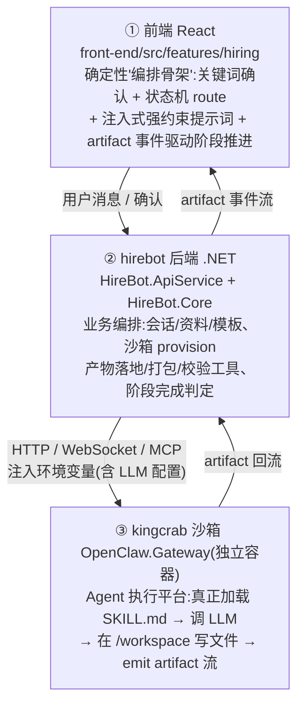

# langgraph 替换雇佣流程编排可行性与对比分析

> 面向读者:中级开发工程师(尽量讲人话 + 类比)
> 分析对象:`hirebot` 项目的「雇佣流程」(employment-coach-conversation 数字员工孵化链路)
> 核心问题:把现有编排工作流(含 `packaging-test-cases` skill)改用 `langgraph` 重写,能否避免「换一个 LLM 就输出不稳定」?复杂性/可维护性/稳定性/token 谁更优?
> 说明:本文结论已对照真实代码逐条核实,文末附「代码核实清单」与发现的一处偏差。

---

## 一句话结论

> 换 `langgraph` **能解决「编排协议层」的部分抖动**(漏发信号导致卡死、越级推进、结构不合规),但**解决不了根本问题**——只要测试用例还是 LLM 生成的,换个弱模型,**内容质量照样会抖**。
>
> 而且 `hirebot` 现在的编排骨架**本来就已经是确定性的**,所以 `langgraph` 的边际收益没想象中大,反而会把系统从「TS + C# 两栈三层」变成「多引入一套 Python/JS 运行时,且沙箱还得保留」。

---

## 0. 先搞清楚:现在这套系统长什么样

要回答「换 LLM 会不会乱」,必须先分清一件事:**skill 到底是「谁」在「执行」的。**

### 0.1 三层协作架构

**最关键的一句话**:skill(包括 `packaging-test-cases`)的「执行」,本质是 **「LLM 当一个新员工,去读一份工作手册(`SKILL.md`,自然语言提示词)自主干活」**,而不是一段确定性的 C#/TS 代码。

- `SKILL.md` 头部 `autonomy: 75` 表明它是「高自主度的提示词驱动 Agent」(已核实:[SKILL.md 第 7 行](../back-end/HireBot.ApiService/Assets/DigitalEmployeeTemplates/employment-coach-conversation/skills/packaging-test-cases/SKILL.md#L7))。

> **换 LLM = 换一个员工去读同一份手册。** 手册没变,但新员工的理解力和执行力变了 —— 这就是不稳定的来源。

### 0.2 LLM 是怎么「换」的

LLM 不是写死在代码里的,而是**通过配置注入到沙箱容器**:

- [SandboxProvisioningSettings.cs `BuildRuntimeEnv()`(第 164 行)](../back-end/HireBot.Core/Services/Sandbox/SandboxProvisioningSettings.cs#L164) 把 `LlmModel / LlmEndpoint / LlmApiKey / LlmTemperature` 等转成环境变量,注入沙箱里的 `OpenClaw.Gateway`(已核实:[第 204-213 行](../back-end/HireBot.Core/Services/Sandbox/SandboxProvisioningSettings.cs#L204-L213))。
- 启动前还有完整性校验:`Model/Endpoint/ApiKey` 必须一起配,否则启动即抛异常([`ValidateGatewayModelProviderConfiguration` 第 225 行](../back-end/HireBot.Core/Services/Sandbox/SandboxProvisioningSettings.cs#L225))。
- 温度默认 `0.7`、`LlmEnableThinking` 默认 `false`(已核实:[第 133-134 行](../back-end/HireBot.Core/Services/Sandbox/SandboxProvisioningSettings.cs#L133-L134))。

**结论**:所谓「换 LLM」就是改几个配置项,**整条雇佣流程的所有 skill 共用同一个模型**,没有「给某个 skill 单独指定模型」的能力。

---

## 1. 问题一:换 langgraph + 换 skill,能避免换 LLM 导致输出不稳定吗?

### 1.1 先把「不稳定」拆成两种(这是全文最重要的一步)

| 类型 | 含义 | 现在谁在扛 | 依赖 LLM 吗 |
|---|---|---|---|
| **A. 流程骨架不稳定** | 走错阶段、确认词识别错、阶段卡死 | 前端 React 确定性代码(状态机 + 关键词匹配) | ❌ 不依赖 |
| **B. 产物质量 / 一次成功率不稳定** | skill 有没有按 `SKILL.md` 干活、产物 JSON 合不合规、有没有漏发 `xxx_done` | LLM 在沙箱里读 `SKILL.md` 自主执行 | ✅ 强依赖 |

很多人把「换模型会乱」当成一件事,其实是两件完全不同的事。

### 1.2 langgraph 是什么,能改变什么

`langgraph` 是用**一张图**(节点 = 一步、边 = 跳转)把 LLM 应用的流程**显式编排**出来。核心价值是:**让「流程跳转」变成确定性的代码**(节点函数 return 了就走下一步),并自带状态管理、checkpoint、human-in-the-loop。

但请记牢这条铁律:

> **langgraph 让「流程跳转」确定,但它不会让「LLM 的输出」确定。** 图里每个调 LLM 的节点,用的还是你绑定的那个模型;弱模型该跑偏还是跑偏。

### 1.3 逐项对照:能治什么 / 治不了什么 / 有什么坑

#### ✅ 能改善的(真收益)

- **漏发 artifact 卡死**(附件 2.3 的故障):现在前端靠 artifact 类型驱动状态机——
  `xxx_ready → waiting_confirm`、`xxx_progress → running`、`xxx_done → completed`(已核实:[hiringArtifactState.ts 第 399-416 行](../front-end/src/features/hiring/pages/hiringArtifactState.ts#L399-L416))。
  如果 LLM 漏发 `xxx_done`,前端就一直卡在 `running`。**改成 langgraph 后,节点 return 就推进,不再求着模型发信号** —— 这个具体故障能被直接消灭。
- **结构不合规**:在节点里用 structured output(结构化输出 schema)+ 校验重试,把 JSON 字段强制卡住,弱模型乱填字段的概率下降。
- **只说不做(narrative-only)**:节点里用代码直接调「写文件」工具,而不是指望 LLM 自己决定要不要调工具。

> 为什么这部分现在脆弱?看真实证据:[hiringDownstreamTriggers.ts `buildDownstreamPrompt`(第 337 行)](../front-end/src/features/hiring/pages/utils/hiringDownstreamTriggers.ts#L337) 给每个下游 skill 注入一大段「死命令」,例如「必须用 `write_file` 工具」「写完必须 `read_file` 读回校验」「失败则标记 `slices_not_ready` 跳过,不得发成功的 done」(已核实:[第 384-388 行](../front-end/src/features/hiring/pages/utils/hiringDownstreamTriggers.ts#L384-L388))。
>
> **关键观察:这些约束全是写给 LLM 的自然语言指令,执行与否完全靠模型遵循。** 弱模型遵循度低 → 直接表现为「skill 看起来没执行」。这恰恰是 langgraph 能把「求 LLM 遵守」变成「代码强制」的地方。

#### ❌ 治不了的(根本问题)

- **测试用例内容好不好,还是看模型**。弱模型生成的用例照样可能空洞、跑题、覆盖不全。这跟用不用 langgraph **没有任何关系**。

#### ⚠️ 一个大坑

- langgraph **本身不提供「安全跑代码 / 写文件」的沙箱**。真正写文件、打 zip 包的活儿还得在 kingcrab 沙箱里干。
- 所以你要么 **langgraph + 沙箱**(系统更复杂),要么自己**重建沙箱那套安全护栏**:
  - 产物路径白名单(只允许 `ontology/ skills/ external/ testcases/ config/`,已核实:[`IsAllowedArtifactPath` 第 97-109 行](../back-end/HireBot.Core/Services/Hiring/HiringWorkflowSupport.cs#L97-L109));
  - 敏感值正则拦截(token/api_key/secret/password/connection_string,已核实:[`SensitiveValueRegex` 第 168 行](../back-end/HireBot.Core/Services/Hiring/HiringWorkflowSupport.cs#L168));
  - 网络出口白名单(`BuildNetworkPolicy`)。
- 这些 `hirebot` 现在**已经用 C# 实现好了**,推翻重写是净亏损。

### 1.4 问题一的结论

**部分能。** langgraph 能让**「协议层」更稳**(消灭卡死/越级/结构发射问题);但**「模型内容层」的稳定性**靠的是 **低温度 + 结构化输出 + 校验重试 + 强模型 + fallback** —— 这些**全部与框架无关**,而且 `hirebot` 现在大多**已经有了**:

- JSON 结构校验 + 降级占位(允许 `test_cases:[]`):[`TryValidateFallbackTestCasesJson` 第 126 行](../back-end/HireBot.Core/Services/Hiring/PackagingTestCasesJsonValidator.cs#L126);
- 多级回退提取:[`TryExtractPackagingTestCasesBundle` 第 186 行](../back-end/HireBot.Core/Services/Hiring/PackagingTestCasesJsonValidator.cs#L186);
- SKILL.md 自带「降级」段输出占位 JSON;
- 关联 skill 缺失时的 `fallbackSkillIds`。

所以 langgraph 真正「新增」的价值,主要就是**「把推进/产物发射从 LLM 信号改成代码控制」这一项**。

---

## 2. 问题二:复杂性 / 可维护性 / 稳定性,谁高?

### 2.1 复杂性

| 维度 | 现状(三层 + 沙箱 Agent) | 改用 langgraph |
|---|---|---|
| 逻辑分布 | 摊在 3 层(React TS + .NET C# + 沙箱 `SKILL.md`),层间靠 artifact 协议这种**隐式契约**连着 | 编排**集中在一张图**里 |
| 单看编排 | 端到端不好追(要跨多个仓/语言看) | **更清晰** |
| 整体系统 | 都在现有技术栈(TS + C#)内 | 多引入 **Python**(或 JS 版 `@langchain/langgraph`)= 多一套运行时;**写文件的活儿还得保留沙箱** |
| **结论** | — | **只看编排逻辑 langgraph 更简单;看整个系统是净复杂度上升** |

### 2.2 可维护性

| 维度 | 现状 | 改用 langgraph |
|---|---|---|
| 改一处的成本 | 编排逻辑分散(前端 triggers + 后端 validators + `SKILL.md`),要跨层翻三个地方 | 图显式,加节点/边一目了然,自带 checkpoint/状态持久化 |
| 学习成本 | 不用学新栈 | 团队需会 Python(或上 JS 版) |
| 风险 | — | 若前端仍在驱动 UI,会出现**「双编排大脑」互相打架** |
| **结论** | — | **彻底改(前端只做 UI、编排全收口到 langgraph)→ 更好维护;只是「贴」上去和前端并存 → 反而更差** |

### 2.3 稳定性

| 维度 | 谁更优 | 说明 |
|---|---|---|
| 编排稳定性 | **langgraph 略胜** | 两者都能做到确定性;现状已经是了,langgraph 在「漏发信号卡死」这一点上略胜 |
| LLM 输出稳定性 | **打平** | 两个框架都不能让模型输出变稳;真正杠杆(低温度/结构化输出/校验重试/强模型)与框架无关,`hirebot` 已有等价物 |
| **结论** | — | **langgraph 能多干掉「漏发 artifact 卡死」这一个具体故障(真收益);其余内容质量稳定性两者打平** |

---

## 3. 问题三:token 消耗,谁多?

| 维度 | 现状(高自主 Agent,`autonomy: 75`) | langgraph(设计良好的流水线) |
|---|---|---|
| 每次上下文 | 整份 `SKILL.md` + 系统提示 + 注入的**强约束 checklist**(`buildDownstreamPrompt`)+ 历史(40 轮/12000 字) | 每个节点是**聚焦的小提示** + 结构化 schema + **最小必要 state** |
| 执行方式 | 自己探索、多轮工具调用、**读回校验(read-back 把文件内容又读进上下文)**、自我纠错多轮 | 流程图告诉它该干啥,**探索少、往返少**,只在失败时重试 |
| thinking | 开了 `LlmEnableThinking` 还有思考 token | 一般可控 |
| 倾向 | **偏多** | **偏少** |

**结论**:同样任务,现状(自主 Agent)通常**比结构化的 langgraph 流水线更费 token**,省下的主要是「想该干啥」和「反复读文件」的开销。

⚠️ **注意前提**:这是「设计良好」的情况。如果 langgraph 设计得差(每个节点重发巨大 state、疯狂重试循环),token 优势会被吃掉甚至反超。

---

## 4. 总览与建议

### 4.1 总览表

| 维度 | 谁更优 | 备注 |
|---|---|---|
| 流程协议稳定性 | **langgraph 略胜** | 消灭「漏发信号卡死」 |
| 模型内容稳定性 | **打平** | 都靠模型 + 约束,与框架无关 |
| 编排逻辑可读性 | **langgraph** | 集中成一张图 |
| 整体系统复杂度 | **现状更优** | langgraph 要多一套运行时 + 仍需沙箱 |
| token 消耗 | **langgraph 更省** | 前提是设计良好 |
| 改造成本 / 风险 | **现状更优** | langgraph 要重写 skill + 重建/对接沙箱护栏 |

### 4.2 建议

- 如果痛点主要是「卡死 / 越级 / 结构不合规」 → **不必上 langgraph**。在现有架构上,把「产物发射/阶段推进」从「依赖 LLM emit 信号」改成「后端确定性兜底判定」,再调低温度 + 强制结构化输出,投入产出比更高。
- 如果痛点是「换弱模型后用例内容变差」 → **langgraph 救不了**,只能换强模型 / 加结构化输出 + 校验重试 / 把可确定的部分(如用例骨架)用模板代码生成。
- 只有当你**愿意把整个编排范式从「高自主 Agent」彻底切换到「低自主、强编排」**,并接受引入 Python/JS 栈、且仍要保留沙箱时,langgraph 才是合适的选择。

### 4.3 换模型时的稳妥做法(无论是否上 langgraph)

1. 跟现有合约测试回归(仓库已有针对 `packaging-test-cases` 产物的校验测试)。
2. 重点验证新模型两项能力:**artifact 协议遵循度**(`progress`/`done` 是否稳定)与 **JSON 结构遵循度**(字段/命名是否合规)。
3. 适当调低 `LlmTemperature`(默认 0.7);谨慎评估 `LlmEnableThinking` 对新模型的影响。

---

## 附录:代码核实清单

本文结论已对照真实代码逐条核实(行号以核对时仓库状态为准):

| 论断 | 核实位置 | 结果 |
|---|---|---|
| 换 LLM = 改配置注入沙箱 | [SandboxProvisioningSettings.cs:204-213](../back-end/HireBot.Core/Services/Sandbox/SandboxProvisioningSettings.cs#L204-L213) | ✅ 成立 |
| 启动前 LLM 配置完整性校验 | [SandboxProvisioningSettings.cs:225](../back-end/HireBot.Core/Services/Sandbox/SandboxProvisioningSettings.cs#L225) | ✅ 成立 |
| artifact 三态状态机(漏发 done 卡死) | [hiringArtifactState.ts:399-416](../front-end/src/features/hiring/pages/hiringArtifactState.ts#L399-L416) | ✅ 成立 |
| skill 为高自主提示词 + 门禁段 | [SKILL.md:7,15-24](../back-end/HireBot.ApiService/Assets/DigitalEmployeeTemplates/employment-coach-conversation/skills/packaging-test-cases/SKILL.md#L7) | ✅ 成立(门禁段印证「门禁误判」故障) |
| 注入式强约束提示词全是自然语言 | [hiringDownstreamTriggers.ts:337,384-388](../front-end/src/features/hiring/pages/utils/hiringDownstreamTriggers.ts#L384-L388) | ✅ 成立(核心证据:护栏靠 LLM 遵守) |
| 越权路径白名单 | [HiringWorkflowSupport.cs:97-109](../back-end/HireBot.Core/Services/Hiring/HiringWorkflowSupport.cs#L97-L109) | ✅ 成立 |
| 敏感值正则拦截 | [HiringWorkflowSupport.cs:168](../back-end/HireBot.Core/Services/Hiring/HiringWorkflowSupport.cs#L168) | ✅ 成立 |
| JSON 校验 + 降级占位 + 多级回退 | [PackagingTestCasesJsonValidator.cs:126,186](../back-end/HireBot.Core/Services/Hiring/PackagingTestCasesJsonValidator.cs#L126) | ✅ 成立 |

### 发现的一处偏差(值得记录)

- 附件 3.1 描述沙箱有「读写根限制」。实际核对:[SandboxProvisioningSettings.cs:198-199](../back-end/HireBot.Core/Services/Sandbox/SandboxProvisioningSettings.cs#L198-L199) 中 `AllowedReadRoots__0 = "*"`、`AllowedWriteRoots__0 = "*"`(**放开**),且 `WorkspaceOnly = false`(第 193 行)。
- 也就是说,**沙箱文件系统本身并没有做硬隔离**;真正的「越权产物防护」主要落在**前端提示词级约束**(`buildPackageZipInstructionLines` 等)与**后端产物落地校验**(`IsAllowedArtifactPath`)。
- **这反而强化了本文核心论点**:越权防护、协议遵循这套护栏在执行侧高度依赖「LLM 听话」,因此换弱模型时这一层才是真正的脆弱点 —— 也正是 langgraph(把约束从提示词变成代码强制)能发挥作用的地方,但代价是必须重建/对接沙箱安全模型。

---

*本文档由对话分析 + 真实代码核实整理而成;文件行号以核对时仓库状态为准,后续重构可能变动。*
