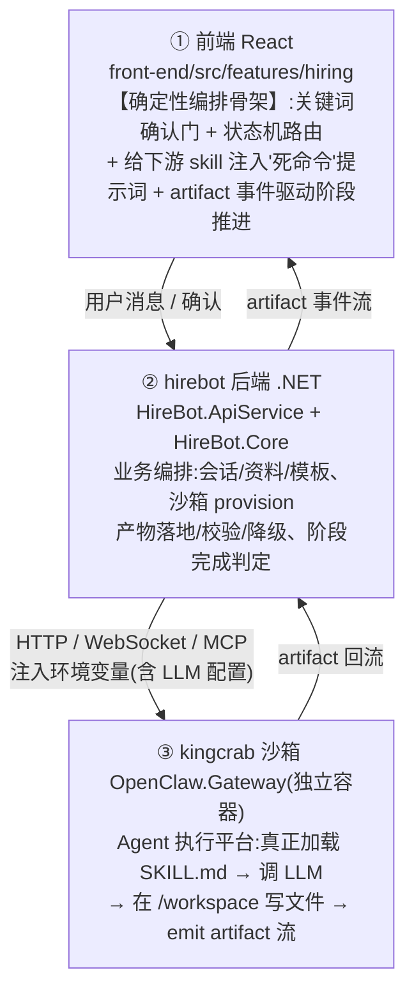
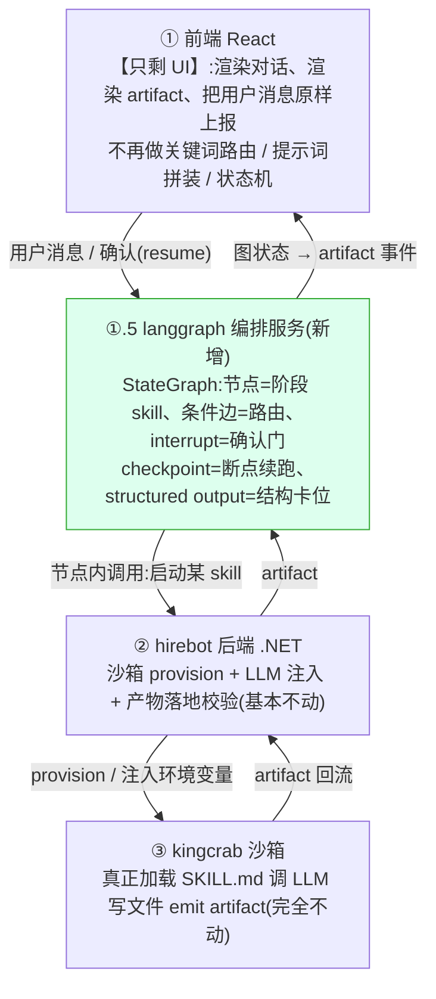

# langgraph 重构雇佣流程编排设计方案

> 面向读者：中级开发工程师（尽量讲人话 + 类比）
> 配套文档：本篇是[《langgraph 替换雇佣流程编排可行性与对比分析》](langgraph%20替换雇佣流程编排可行性与对比分析.md)的**落地续篇**——前者回答"该不该换"，本篇回答"如果换，代码长什么样"。
> 重构对象：`hirebot` 项目的「雇佣流程」（employment-coach-conversation 数字员工孵化链路）。
> 说明：本篇只产出设计文档，**不改动现有代码**；文中行号已对真实代码核对，核对时仓库状态见文末附录。

---

## 0. 先用大白话说清楚：我们到底在重构"哪一层"

很多人一听"用 langgraph 重构"，脑子里就是"把整个项目推倒重写"。**不是的。** 在动手之前，必须先认清：现在这套雇佣流程，是分成三层在跑的。



**这次重构，动的是哪一层？**

> 答案：**只动第 ① 层那个"确定性编排骨架"。** langgraph 接管的是"现在该走哪个阶段、用户确认了没、下一个 skill 该不该启动"这套**流程跳转逻辑**。
>
> 它**不碰** LLM（模型还是沙箱里那个），也**不碰**沙箱（真正写文件、打 zip 的活还在 kingcrab 里干）。

这一点是全篇的地基，记牢了再往下看。下面三章分别讲：现状骨架长什么样（第 1 章）、langgraph 是什么（第 2 章）、怎么把现状一比一映射过去（第 3 章）。

---

## 1. 现状编排：到底是"谁在指挥"

### 1.1 现状链路全景

雇佣流程本质是一条**流水线**：资料 → 本体切片 → 技能定义 → 数据匹配 → 技能生成 → 外部系统 → 测试用例 → 审查 → 打包。每一步都对应一个下游 skill，每个 skill 跑起来会吐出 `xxx_progress`（开工了）、`xxx_done`（干完了）这样的 artifact 信号。

```mermaid
flowchart LR
    M["资料收口<br/>material_handoff_ready"] --> S1["本体切片抽取<br/>slice_extraction"]
    S1 --> SD["技能定义<br/>skill_definition"]
    SD --> P["数据匹配(投影)<br/>ontology_projection"]
    P --> G["技能生成<br/>skill_generation"]
    G --> E["外部系统<br/>external_system_entry"]
    E --> T["测试用例(可选)<br/>packaging_testcases"]
    T --> R["完整性审查<br/>review"]
    R --> Z["打包成 zip<br/>template_package"]

    classDef gate fill:#fde,stroke:#c39
    class M,SD,P,E,T,R gate
    %% 粉色 = 需要用户确认的'门禁'
```



这条链路现在是靠**三根支柱**撑起来的，全在前端 React 里：

### 1.2 现状的三根支柱（配真实代码 + 大白话）

#### 支柱一：关键词确认门（"用户到底点没点头"）

每个阶段之间都有一道"门"，要用户说一句"可以 / 继续 / 生成"才放行。怎么判断用户说的算不算"同意"？靠**关键词匹配**。

```ts
// front-end/src/features/hiring/pages/utils/hiringDownstreamTriggers.ts
export function isPackagingTestCasesApprovalMessage(text: string): boolean {
  // 先把用户输入"压扁":去空格、去标点、转小写
  const compact = normalized.replace(/[\s,.;: ...]+/g, '')
  const exactApprovals = new Set(['生成', '开始生成', '可以', '确认', 'yes', 'ok', ...])
  if (exactApprovals.has(compact)) return true
  // 再按关键词包含判断
  const keywords = ['生成测试用例', '生成评估用例', ...]
  return keywords.some(keyword => compact.includes(keyword))
}
```

> **大白话**：这就是一张写死的"同意词词典"。用户说的话只要命中词典，就算点头。代码见 [hiringDownstreamTriggers.ts:781-820](../front-end/src/features/hiring/pages/utils/hiringDownstreamTriggers.ts#L781-L820)。
>
> 类似的判断函数有一大堆：`isSkillDefinitionApprovalMessage`、`isOntologyProjectionApprovalMessage`、`isPackageReviewApprovalMessage`、`isExternalSystemSkipMessage`……每道门一套。
>
> **痛点**：词典是死的，用户换个说法（"嗯那就这样吧"）可能就匹配不上，门打不开。

判断完"同不同意"后，用一组 `resolveXxxRoute` 函数算出"那现在到底该走哪条路"：

```ts
// 同一文件:把'当前状态 + 用户这句话'翻译成一个明确的路由分支
export function resolvePackageReviewDecisionRoute(input): PackageReviewDecisionRoute {
  if (input.incomingFileCount > 0 || !input.hasPendingPackageReviewDecision || ...) return 'none'
  if (isPackageReviewSkipMessage(input.text) || isPackagingRequestMessage(input.text)) return 'skip_review_and_package'
  if (isPackageReviewApprovalMessage(input.text)) return 'launch_package_review'
  return 'none'
}
```

> **大白话**：这就是一堆手写的 `if/else` 状态机，散落在前端。代码见 [hiringDownstreamTriggers.ts:1044-1089](../front-end/src/features/hiring/pages/utils/hiringDownstreamTriggers.ts#L1044-L1089)。**记住这个，第 3 章我们会把它整段换成 langgraph 的"条件边"。**

#### 支柱二：给下游 skill 注入"死命令"提示词

门一开，前端不是简单地喊一句"开始生成"，而是给 LLM 注入**一大段措辞极其严厉的自然语言指令**，逼模型按规矩来。

```ts
// hiringDownstreamTriggers.ts:367 buildDownstreamPrompt('ontology-projection', ...)
'For each generated projection JSON, call the sandbox file-writing tool (`write_file` preferred...). '
+ 'Do not use shell, Python here-docs, echo, or narrative-only output to create projection files.'
'After writing each projection file, call `read_file` on that exact path and verify the JSON is complete...'
'If the file-writing tool is unavailable or read-back verification fails after bounded retry, '
+ 'mark the skill skipped with `slices_not_ready`; do not emit a successful `ontology_projection_done`...'
```

> **大白话**：这些就是"嘴上的纪律"——"必须用 `write_file` 写""写完必须 `read_file` 读回来核对""失败要标 `slices_not_ready`，不准假装成功"。代码见 [hiringDownstreamTriggers.ts:384-388](../front-end/src/features/hiring/pages/utils/hiringDownstreamTriggers.ts#L384-L388)。
>
> **关键观察（全篇最重要的一句）**：这些纪律全是**说给 LLM 听的自然语言**，执行不执行，**全看模型听不听话**。强模型听话度高；换个弱模型，它可能"看起来跑了其实没写文件"——这就是"换模型会乱"的真正来源之一。

而 skill 本身（如 `packaging-test-cases`）头部写着 `autonomy: 75`，意思是"高自主度、靠提示词驱动的 Agent"。见 [SKILL.md:7](../back-end/HireBot.ApiService/Assets/DigitalEmployeeTemplates/employment-coach-conversation/skills/packaging-test-cases/SKILL.md#L7)。

> **换 LLM = 换个新员工去读同一份《岗位说明书》（`SKILL.md`）。** 说明书没变，但新员工的理解力和执行力变了——这就是不稳定的根源。

#### 支柱三：artifact 事件驱动的阶段推进（漏一个信号就卡死）

前端怎么知道某个 skill 跑到哪了？靠监听 artifact 类型，映射成阶段状态：

```ts
// front-end/src/features/hiring/pages/hiringArtifactState.ts:399-416
export const DOWNSTREAM_ARTIFACT_TRACKS = {
  ontology_projection_ready:    { key: 'ontology-projection', status: 'waiting_confirm' }, // 等确认
  ontology_projection_progress: { key: 'ontology-projection', status: 'running' },         // 进行中
  ontology_projection_done:     { key: 'ontology-projection', status: 'completed' },        // 完成
  // ... 每个阶段都有 ready/progress/done 三连
}
```

> **大白话**：前端就像一个**只认信号灯的调度员**——看到 `progress` 就显示"运行中"，看到 `done` 才放行下一步。代码见 [hiringArtifactState.ts:399-416](../front-end/src/features/hiring/pages/hiringArtifactState.ts#L399-L416)。
>
> **痛点（最典型的卡死）**：如果 LLM 活干完了，但**忘了 emit `xxx_done`**，调度员就一直停在"运行中"，整条流水线卡死。这是当前架构最常见的故障，**第 3.8 节会讲 langgraph 如何从机制上根治它。**

### 1.3 后端 .NET 干的活（这部分重构基本不动）

后端不参与"流程跳转"，但管着两件硬事，这两件 langgraph **替代不了**，必须保留：

1. **沙箱 provision + 注入 LLM 配置**：把 `Model/Endpoint/ApiKey/Temperature` 拼成环境变量塞进沙箱容器。见 [SandboxProvisioningSettings.cs:204-213](../back-end/HireBot.Core/Services/Sandbox/SandboxProvisioningSettings.cs#L204-L213)；启动前强制三件套齐全校验，见 [SandboxProvisioningSettings.cs:225](../back-end/HireBot.Core/Services/Sandbox/SandboxProvisioningSettings.cs#L225)。所谓"换 LLM"，就是改这里的几个配置项。
2. **产物落地的安全护栏**：产物路径白名单（只允许 `ontology/ skills/ external/ testcases/ config/`，见 [HiringWorkflowSupport.cs:97-109](../back-end/HireBot.Core/Services/Hiring/HiringWorkflowSupport.cs#L97-L109)）、敏感值正则拦截（见 [HiringWorkflowSupport.cs:168](../back-end/HireBot.Core/Services/Hiring/HiringWorkflowSupport.cs#L168)）、JSON 结构校验 + 降级占位（见 [PackagingTestCasesJsonValidator.cs:126](../back-end/HireBot.Core/Services/Hiring/PackagingTestCasesJsonValidator.cs#L126) 与 [:186](../back-end/HireBot.Core/Services/Hiring/PackagingTestCasesJsonValidator.cs#L186)）。

> ⚠️ 一个容易被忽略的事实：沙箱本身的文件系统**并没有硬隔离**（`AllowedReadRoots/WriteRoots` 都是 `*`、`WorkspaceOnly=false`，见 [SandboxProvisioningSettings.cs:198-199](../back-end/HireBot.Core/Services/Sandbox/SandboxProvisioningSettings.cs#L198-L199) 与 [:193](../back-end/HireBot.Core/Services/Sandbox/SandboxProvisioningSettings.cs#L193)）。真正的越界防护靠的是**前端提示词级约束 + 后端产物落地校验**——也就是说，护栏一半还是建在"LLM 听话"上。

---

## 2. langgraph 是什么（给中级工程师的最短解释）

如果你写过状态机、画过流程图，那么一句话就懂：

> **langgraph = 把流程图变成可执行代码，而且自带"存档点"和"暂停等人"的能力。**

它有 5 个核心概念，对应到我们熟悉的东西：

| langgraph 概念 | 大白话类比 | 在我们这儿对应现状的什么 |
|---|---|---|
| **State（状态）** | 一个贯穿全程的"公文包"，每步往里塞东西 | 现状散落在前端的各种 `DownstreamRunState` |
| **Node（节点）** | 流程图里的一个"方框"=一步操作（一个函数） | 现状的"启动某个下游 skill" |
| **Edge（边）** | 方框之间的箭头=固定跳转 | 现状写死的"A 完了走 B" |
| **Conditional Edge（条件边）** | 菱形判断框=按状态分叉 | 现状的 `resolveXxxRoute` 那堆 `if/else` |
| **Checkpoint（检查点）** | 游戏存档：随时能从上次断点继续 | 现状几乎没有，靠前端内存态硬扛 |
| **interrupt（中断）** | "流程暂停，等人点头再继续" | 现状的关键词确认门 |

**最关键的一点，必须反复强调：**

> **langgraph 让"流程跳转"变确定，但它不会让"LLM 的输出"变确定。** 图里每个调 LLM 的节点，用的还是你给的那个模型；弱模型该拉胯还是拉胯。
>
> 所以 langgraph 能根治的是"**流程层**"的病（漏信号卡死、超级推进、状态错乱），治不了"**内容层**"的病（用例编得好不好、JSON 字段填得对不对——那是模型能力问题）。

---

## 3. 重构方案：把现状一比一映射到 langgraph

### 3.1 重构后的总体架构

新增一个 **langgraph 编排服务**（Python 进程，或 `@langchain/langgraph` 的 JS 版），夹在前端和沙箱之间，把第 ① 层那套散落的骨架收拢进去：



下面逐块给出**可读的示例代码**（Python，langgraph 风格；非项目最终代码，仅示意映射关系）。

### 3.2 第一步：定义 State（把散落的状态收进一个"公文包"）

现状的阶段状态散在前端各处，重构后集中成一个 `HiringState`：

```python
from typing import TypedDict, Literal, Optional
from langgraph.graph import StateGraph, START, END

# 对应现状 DOWNSTREAM_ARTIFACT_TRACKS 里那套 ready/progress/done
StageStatus = Literal["pending", "waiting_confirm", "running", "completed", "skipped", "failed"]

class HiringState(TypedDict):
    session_id: str
    workspace_root: str            # 对应沙箱 /workspace/<template_slug>-<timestamp>
    user_message: str              # 用户最新一句话
    incoming_file_count: int
    # 各阶段状态(取代前端 DownstreamRunState)
    material: StageStatus
    slice_extraction: StageStatus
    skill_generation: StageStatus
    ontology_projection: StageStatus
    external_system: StageStatus
    packaging_testcases: StageStatus
    review: StageStatus
    packaging: StageStatus
    # 阶段产物摘要(供下游节点消费,取代前端 buildXxxPayload)
    last_summary: dict
```

> **大白话**：原来"流程跑到哪了"这件事，前端要自己记、自己算；现在统一放进 `HiringState` 这个公文包，langgraph 全程带着它走，还能存档（checkpoint）。

### 3.3 第二步：每个阶段 skill = 一个节点

```python
def node_ontology_projection(state: HiringState) -> HiringState:
    """对应现状 buildDownstreamPrompt('ontology-projection', ...) 那一段"""
    prompt = build_projection_prompt(state["last_summary"])     # 提示词模板(见 3.6)
    result = run_skill_in_sandbox(                              # 仍然调沙箱执行(见 3.7)
        skill="ontology-projection",
        workspace_root=state["workspace_root"],
        prompt=prompt,
    )
    # 节点函数 return 了,就等于"这一步完成"——下一步由边决定,不靠模型 emit done
    return {**state, "ontology_projection": "completed", "last_summary": result}
```

> **大白话**：现状是"模型自己吼一声 `done` 才算完"；重构后是"**节点函数 `return` 了就算完**"。这个差别，正是第 3.8 节"根治卡死"的核心。

### 3.4 第三步：条件边替代关键词路由（把 `resolveXxxRoute` 搬过来）

现状那堆 `resolvePackageReviewDecisionRoute` 的 `if/else`，原样变成 langgraph 的**路由函数 + 条件边**：

```python
def route_after_review_readiness(state: HiringState) -> str:
    """1:1 对应 hiringDownstreamTriggers.ts 的 resolvePackageReviewDecisionRoute"""
    text = state["user_message"]
    if state["incoming_file_count"] > 0:
        return "wait"
    if is_skip_message(text) or is_packaging_request(text):
        return "skip_review_and_package"
    if is_review_approval(text):
        return "launch_package_review"
    return "wait"   # 没听懂就停在原地等(不会乱跳)

graph = StateGraph(HiringState)
graph.add_node("review_readiness", node_review_readiness)
graph.add_node("package_review", node_package_review)
graph.add_node("packaging", node_packaging)

# 条件边:菱形判断框,按 route 函数的返回值分叉
graph.add_conditional_edges(
    "review_readiness",
    route_after_review_readiness,
    {
        "launch_package_review": "package_review",
        "skip_review_and_package": "packaging",
        "wait": "review_readiness",   # 留在原地
    },
)
```

> **大白话**：`is_skip_message / is_review_approval` 这些关键词词典**可以原样从现状搬过来**（甚至直接复用 TS 逻辑的等价实现）。langgraph 没有让关键词判断变聪明，但它让"判断完之后往哪走"这件事**变成了图上一条明确的边**——再也不会出现"两个路由分支抢同一句'继续'"那种现状里的歧义（现状代码注释里就写了这种坑，见 [hiringDownstreamTriggers.ts:664](../front-end/src/features/hiring/pages/utils/hiringDownstreamTriggers.ts#L664)）。

### 3.5 第四步：interrupt 替代前端确认门（human-in-the-loop）

现状的"等用户点头"靠前端状态 + 关键词；langgraph 有原生的 `interrupt`：

```python
from langgraph.types import interrupt, Command

def node_skill_definition_gate(state: HiringState) -> HiringState:
    # 流程跑到这里会"暂停",把问题抛给前端,等用户回话再 resume
    decision = interrupt({
        "ask": "技能清单已生成草稿,是否确认进入数据匹配?",
        "draft": state["last_summary"],
    })
    if is_approval(decision):
        return {**state, "skill_generation": "waiting_confirm"}
    return {**state, "skill_generation": "pending"}

# 编译时挂上 checkpointer,interrupt 才能"存档暂停 + 唤醒续跑"
from langgraph.checkpoint.memory import MemorySaver
app = graph.compile(checkpointer=MemorySaver())   # 生产环境换成 Redis/Postgres 版

# 前端用户点头后:
app.invoke(Command(resume="确认"), config={"configurable": {"thread_id": session_id}})
```

> **大白话**：`interrupt` 就是"流程图走到这里**自动暂停并存档**，等前端把用户那句话喂回来再继续"。好处是**确认状态由 langgraph 持久化**，而不是靠前端内存硬扛——刷新页面、断线重连都不丢进度（现状这块是弱项）。

### 3.6 第五步：提示词 + 结构化输出，替代"死命令注入"

现状靠一大段"嘴上纪律"逼模型守规矩（[hiringDownstreamTriggers.ts:384-388](../front-end/src/features/hiring/pages/utils/hiringDownstreamTriggers.ts#L384-L388)）。重构后**两手抓**：提示词照样给（这是"提示词的方式"那部分），但**关键产物用结构化输出 schema 卡死**，让弱模型也乱填不了字段：

```python
from pydantic import BaseModel, Field

class ProjectionResult(BaseModel):
    projected_count: int = Field(ge=0)
    projection_paths: list[str]
    open_questions: list[str] = []

def build_projection_prompt(summary: dict) -> str:
    # 现状的'死命令'提示词,原样保留为模板(这是题目要求的'提示词方式')
    return (
        "必须用 write_file 写投影文件;写完必须 read_file 读回校验;"
        "失败标记 slices_not_ready,不准假装成功。\n"
        f"upstream_summary:\n{json.dumps(summary, ensure_ascii=False)}"
    )

def node_ontology_projection(state):
    llm = get_sandbox_llm().with_structured_output(ProjectionResult)  # 结构卡位
    result: ProjectionResult = llm.invoke(build_projection_prompt(state["last_summary"]))
    # 结构不对会直接抛错,而不是"看起来成功了其实字段是空的"
    status = "completed" if result.projected_count > 0 else "skipped"
    return {**state, "ontology_projection": status, "last_summary": result.model_dump()}
```

> **大白话**：提示词是"嘴上说"，结构化输出是"填表格，表格画好了格子，模型只能往格子里填"。两者叠加，弱模型把字段填飞的概率明显下降。**注意**：这只解决"格式跑偏"，解决不了"内容是不是垃圾"——内容质量还是看模型本身（详见第 4 章稳定性结论）。

### 3.7 第六步：节点内如何真正驱动沙箱（langgraph 不抢沙箱的活）

这是最容易被误解的地方，必须讲清楚：

> **langgraph 本身不提供"能安全跑代码 / 写文件"的沙箱。** 真正落文件、打 zip 的活，**还得在 kingcrab 沙箱里干。**

所以节点里的 `run_skill_in_sandbox` 不是 langgraph 的能力，而是**调用现有 .NET 后端 / 沙箱网关**：

```python
def run_skill_in_sandbox(skill: str, workspace_root: str, prompt: str) -> dict:
    # 走现有 OpenClaw.Gateway(HTTP/WebSocket/MCP),沙箱 provision 仍由 .NET 后端负责
    resp = sandbox_gateway.invoke(
        skill=skill,
        workspace_root=workspace_root,
        prompt=prompt,
    )
    # artifact 回流后,产物落地/校验仍走现有 .NET 护栏:
    #   IsAllowedArtifactPath / SensitiveValueRegex / PackagingTestCasesJsonValidator
    return resp.aggregate_summary
```

> **大白话**：langgraph 只当"包工头"——决定先干哪个活、谁干完了进下一步；**真正的施工队还是沙箱**。后端的安全护栏（路径白名单、敏感信息拦截、JSON 校验降级）**一行都不用动**。

### 3.8 重点：漏 `done` 卡死，为什么 langgraph 能根治

这是 langgraph 带来的**最实在的收益**，单独拎出来讲。先看表面对比再挖深层机制。

#### 表面对比：完成信号来自哪一层

| | 现状（事件驱动） | langgraph（同步调用） |
|---|---|---|
| "这一步算完了"的判定权 | **LLM 主动 emit `xxx_done`** | **代码 `return` 值** |
| 完成信号在哪一层 | **业务语义层**(LLM 要记得喊) | **会话/进程层**(RPC 返回) |
| 模型忘了 emit `done` | 前端永远停在 `running`，**整条流水线卡死** | **不可能发生** |
| 模型多 emit / 乱 emit | 状态机可能错位、超级推进 | 只认 `return` 值，乱 emit 被无视 |
| LLM 真的卡住(不动了) | 也卡死，没人管 | **timeout 兜底** → 走失败分支重试/跳过 |

> **大白话**：现状是"等工人自己喊'我干完了'才下一步，工人忘了喊就全场静止"；langgraph 是"工人那个函数执行完返回，包工头直接下一步"。

#### 深层原理：为什么 langgraph 节点返回就能保证"干完"

这是用户会问的关键问题：**节点函数里那行 `run_skill_in_sandbox(...)` 不也是去跑 LLM 吗？它凭什么知道 LLM 完了？** 答案在于三层保险：

**第一层：Agent 会话层**——沙箱里跑的那个 agent，本身是有闭包的。agent 的 loop 自己会停下来（不再迭代工具调用），那一刻 RPC 调用自然返回。这不靠 LLM 自报 `done`，靠的是 **agent 运行时的生命周期**。

```python
def run_skill_in_sandbox(skill: str, workspace_root: str, prompt: str) -> dict:
    # 这个 invoke 会一直阻塞，直到:
    # 1. agent loop 自己停下(不再调工具)→ RPC 返回
    # 2. 或者触发超时异常(见第二层保险)
    resp = sandbox_gateway.invoke(
        skill=skill,
        workspace_root=workspace_root,
        prompt=prompt,
    )
    # 到这儿,说明沙箱那边的 agent 的一次会话已完整结束
    return resp.aggregate_summary
```

> 类比：现状是"等员工喊'好了'";langgraph 是"给员工一间有门的办公室，他人走出门(会话结束)你就知道他干完了，根本不用他喊"。

**第二层：结构化输出契约**——返回值必须符合 `with_structured_output(schema)` 定的格式。格式不对，拿不到合法对象，这道关就过不了：

```python
def node_ontology_projection(state):
    llm = get_sandbox_llm().with_structured_output(ProjectionResult)
    # 如果模型返回的 JSON 填不满 ProjectionResult 的字段，这儿会抛错
    result: ProjectionResult = llm.invoke(...)
```

**第三层：返回后代码校验**——拿到返回值后，节点代码自己验一把实际产物：

```python
def node_ontology_projection(state):
    result = run_skill_in_sandbox(...)
    # 例:投影文件真的写出来没、真的能读回来没
    if not result.projection_paths or result.projected_count == 0:
        return {**state, "ontology_projection": "skipped"}  # 改判成"跳过",而非"完成"
    return {**state, "ontology_projection": "completed", "last_summary": result}
```

这三道保险合在一起，**没有一道需要 LLM 记得喊 `done`**。即使模型一声不吭，代码也能知道它干完了。

#### 现状 vs langgraph：本质差异

| 维度 | 现状 | langgraph |
|---|---|---|
| 架构风格 | **推模型**(push)：等 LLM 推一个 `done` 事件过来 | **拉模型**(pull/call-return)：代码主动调、阻塞等、自己判 |
| 控制权在谁手里 | LLM(它得记得喊、得喊对) | 编排代码(return 与否由代码决定) |
| LLM 漏喊/乱喊的后果 | 严重(永久卡死或超级推进) | 无关(信号被无视) |

> **一句话**：这是从**被动驱动** → **主动驱动**的转变。性质不同，根治方式也不同。

### 3.8.5 补充：这套"三层保险"的边界说明

**重要**：langgraph 根治的是**"流程层"的卡死**，不等于沙箱里那个 LLM 就不会跑歪。

- **流程层稳定性**(能不能继续往下走)：langgraph 赢 → 节点 return 机制 + timeout 兜底
- **内容层稳定性**(输出是不是垃圾)：langgraph 打平 → 靠低温度 + structured output + 校验重试 + 强模型

例如：即使 langgraph 保证了"投影这一步肯定走完"，也不保证投影出来的 JSON 字段就对。那还得靠**结构化输出 schema 卡位** + **返回后代码校验** + **必要时重试或降级**。

换句话说：langgraph 让你"不会永久卡住"，但让你"这步输出完全正确"还是靠上面提的那套组合拳，跟架构选择无关。

又换句话说：想用弱模型还稳，langgraph 帮不上。那部分的投资应该在 **structured output + 校验重试 + 温度调优**，而这些 `hirebot` 现状大多已做了。

### 3.9 迁移边界：哪些搬、哪些留

| 模块 | 处理方式 | 说明 |
|---|---|---|
| 前端关键词路由 `resolveXxxRoute` | **搬进 langgraph 条件边** | 逻辑等价迁移，前端只留 UI |
| 前端确认门状态 | **换成 interrupt + checkpoint** | 持久化更稳，断线不丢 |
| `buildDownstreamPrompt` 提示词 | **搬进节点的提示词模板** | 题目要求的"提示词方式"，照搬 + 叠加 structured output |
| artifact 状态机 `DOWNSTREAM_ARTIFACT_TRACKS` | **大部分由图 state 取代** | 仍需把图 state 翻译成 artifact 事件喂给前端渲染 |
| .NET 沙箱 provision / LLM 注入 | **保留不动** | langgraph 替代不了 |
| .NET 产物落地校验 / 降级 | **保留不动** | 安全护栏，langgraph 替代不了 |
| kingcrab 沙箱执行 | **完全不动** | 真正干活的地方 |

---

## 4. 重新对比：复杂性 / 可维护性 / 稳定性（回答问题 #2）

> 这里在第 3 章"具体落地方案"的基础上重新评估，比可行性分析篇更贴近"真要这么改"的现实。

### 4.1 复杂性：现状更简单，langgraph 让"编排可读"但"系统更重"

| 维度 | 现状 | 重构为 langgraph |
|---|---|---|
| 单看"编排逻辑"本身 | 散在前端 TS（路由 + 提示词 + 状态机三处） | **更简单**：集中在一张图，节点/边一目了然 |
| 整个系统的部署形态 | TS + C# 两套，已有技术栈 | **更复杂**：多一套 Python/JS 运行时进程 + 仍依赖沙箱 |
| 端到端追一个 bug | 要跨前端多个文件 | 编排集中好追，但**多了一跳服务**，链路变长 |
| **结论** | **整体系统更简单** | **只有"编排逻辑"更简单；系统总复杂度上升** |

> **一句话**：langgraph 把"编排"这一小块变清爽了，代价是给整个系统**多塞了一个进程、多一条网络跳**。复杂度是"局部降、整体升"。

### 4.2 可维护性：取决于"改得彻不彻底"

| 维度 | 现状 | 重构为 langgraph |
|---|---|---|
| 改一个阶段顺序 / 加一道门 | 要在前端多个文件之间跨层改 | 改图上的节点/边，集中且直观 |
| 学习成本 | 团队已熟 TS/C# | 要学 langgraph + Python（或 JS 版） |
| 最大风险 | — | **若前端还残留半套编排，会出现"双脑指挥"**，比现状更难维护 |
| **结论** | — | **彻底改（前端只剩 UI）→ 可维护性更好；半吊子改 → 反而更差** |

> **一句话**：可维护性这块 langgraph 能赢，但**前提是改干净**。最忌讳"前端留一半、langgraph 接一半"，两个大脑互相打架，那还不如不改。

### 4.3 稳定性：分两层看，结论完全不同

| 维度 | 谁更稳 | 说明 |
|---|---|---|
| **流程编排稳定性**（卡死/超级推进/状态错乱） | **langgraph 胜** | 节点 return 推进、条件边路由、checkpoint 续跑，从机制上消除"漏 done 卡死"（见 3.8） |
| **LLM 内容输出稳定性**（用例好不好、字段对不对） | **打平** | 两个框架都管不住模型嘴。靠的是低温度 + structured output + 校验重试 + 强模型 + fallback——**这些跟用不用 langgraph 无关**，且现状大多已实现 |
| **结论** | **流程层 langgraph 赢；内容层打平** | 想换弱模型还稳，langgraph 帮不上忙 |

> **核心结论**：**稳定性的提升是"定向的"——只在流程编排层。** 你担心的"换个 LLM 输出就不稳"，本质是内容层问题，langgraph 解决不了；那部分要靠**低温度 + 结构化输出 + 校验重试 + 强模型兜底**，而这些 `hirebot` 现状大多已经做了（见文末附录）。

### 4.4 架构范式对比：事件驱动 vs 同步调用

用户问"这个 langgraph 处理和现状（事件驱动）有什么区别"，核心差异在于**"谁决定了一步算完"**。展开讲：

| 维度 | 现状：事件驱动(push) | langgraph：同步调用(call/return) |
|---|---|---|
| 架构风格 | **被动推送** → 等 LLM emit 事件 | **主动拉取** → 代码调用、阻塞等、自己判 |
| 完成信号来自哪层 | 业务语义层(LLM 喊 `done`) | 会话层(RPC 返回) / 代码校验层 |
| 前端的角色 | 既当"听信号的"又当"状态机" | 退化成纯 UI,只负责画面 |
| "干完"的可靠性 | 靠 LLM 自觉(容易漏) | 靠代码控制(不可能漏) |
| LLM 表现差时的后果 | 工作流整体不稳(跟不上节奏或超级推进) | 单步重试或降级,流程本身不崩 |
| 加日志/调试成本 | 分散:跨前端多处,还要猜 artifact 是哪来的 | 集中:图的节点和边都能清楚地 log |

**类比**:

- **现状**:老板制定计划书交给员工,员工干完了得自己报告。员工忘报或报错了,老板在办公室等、等、等,一直等不来......
- **langgraph**:老板定的计划是一张明确的流程图,员工每干完一项就自动进下一项。员工不用自己报告,老板根据进度表直接推进。

> **一句话总结**:事件驱动 = 高自主性但易脱节;同步调用 = 低自主性但易预测。langgraph 是后者。

**但注意**:这不是说"同步调用一定更好",而是"更适合编排层"。对于需要 agent 自主探索的流程(如初期需求梳理),高自主 + 事件驱动可能反而更灵活。`hirebot` 这个场景,每一步工作内容相对确定("生成投影"就是"生成投影"),所以"低自主强编排"更合适。

---

## 5. token 消耗对比（回答问题 #3）

| 维度 | 现状（高自主 Agent，`autonomy: 75`） | langgraph（设计良好的流水线） |
|---|---|---|
| 每次喂给模型的上下文 | 整份 `SKILL.md` + 系统提示 + 注入的**大段死命令 checklist** + 历史（50 轮/可压缩） | 每个节点只喂**聚焦的小提示** + 结构化 schema + **最小必要 state** |
| 执行方式 | 模型自己探索、多轮工具调用、**写完读回核对（read-back）**、自纠错反复 | 流程图明确该干啥，**探索少、返工少**，只在失败时重试 |
| thinking | 开 `LlmEnableThinking` 会更费（现状默认关，见 [SandboxProvisioningSettings.cs:133-134](../back-end/HireBot.Core/Services/Sandbox/SandboxProvisioningSettings.cs#L133-L134)） | 一般可控 |
| 重试/回环 | 偏多（高自主 = 爱反复确认、反复读文件） | 偏少（设计好的话） |

> **结论**：**同样的任务，现状（高自主 Agent）通常比设计良好的 langgraph 流水线更费 token。** 省下来的主要是"反复想该不该干、反复读文件核对"的开销。
>
> ⚠️ **重要前提**：这是"**设计良好**"的情况。如果 langgraph 图设计得烂（每个节点都灌入巨大 state、动不动环状重试），token 一样会被反噬，甚至比现状更高。**langgraph 不天然省 token，省的是"好设计"。**

---

## 6. 落地建议与迁移路径

### 6.1 一句话建议

- **痛点主要是"卡死 / 超级推进 / 状态错乱"** → langgraph 值得做（这是它的强项，见 3.8 / 4.3）。但在现有架构内，也可以**先用最小改动**把"漏 `done` 卡死"那类问题，从"依赖 LLM emit 信号"改成"前端/后端确定性判定"，性价比更高、风险更低。
- **痛点主要是"换弱模型后用例内容变差"** → langgraph **帮不上**。该做的是：调低 `LlmTemperature`（默认 0.7）、给关键产物加 structured output + 校验重试、必要时换强模型兜底。
- **只有当你愿意把整个编排从"高自主 Agent"彻底切到"低自主强编排"，并接受引入 Python/JS 运行时、且仍保留沙箱**时，langgraph 才是技术上合适的选择。

### 6.2 如果决定做，建议分三步（降低风险）

1. **影子运行**：langgraph 编排服务先旁路跑，不接管前端，只对比"它算出的路由"和"前端现状算出的路由"是否一致，攒信心。
2. **单阶段试点**：挑一个最容易卡死的阶段（如 ontology-projection）先切到 langgraph 节点，前端这一段退化为纯 UI，其余阶段维持现状。
3. **整体切换**：验证 OK 后，把剩余阶段全部搬进图，前端彻底只剩 UI；**切忌前后端各留半套编排**（见 4.2 的"双脑指挥"风险）。

### 6.3 换模型时的稳妥做法（无论是否上 langgraph，都该做）

1. 跑现有契约测试回归（仓库已有针对 `packaging-test-cases` 产物的校验测试）。
2. 重点验两项：**artifact 协议遵循度**（`progress`/`done` 是否稳定）与 **JSON 结构遵循度**（字段/命名是否合规）。
3. 适当调低 `LlmTemperature`；谨慎评估 `LlmEnableThinking` 对新模型的影响。

---

## 附录：代码核对清单（引用真实行号）

| 论点 | 核对位置 | 结论 |
|---|---|---|
| skill 为高自主提示词驱动（`autonomy: 75`） | [SKILL.md:7](../back-end/HireBot.ApiService/Assets/DigitalEmployeeTemplates/employment-coach-conversation/skills/packaging-test-cases/SKILL.md#L7) | ✅ |
| 注入式"死命令"提示词全是自然语言 | [hiringDownstreamTriggers.ts:384-388](../front-end/src/features/hiring/pages/utils/hiringDownstreamTriggers.ts#L384-L388) | ✅ 这是"换弱模型会乱"的来源之一 |
| 关键词确认门（同意词词典） | [hiringDownstreamTriggers.ts:781-820](../front-end/src/features/hiring/pages/utils/hiringDownstreamTriggers.ts#L781-L820) | ✅ 可原样搬进 langgraph 条件边 |
| 路由解析器（手写状态机） | [hiringDownstreamTriggers.ts:1044-1089](../front-end/src/features/hiring/pages/utils/hiringDownstreamTriggers.ts#L1044-L1089) | ✅ 对应 langgraph 条件边 |
| 现状路由"抢同一句确认词"的坑 | [hiringDownstreamTriggers.ts:664](../front-end/src/features/hiring/pages/utils/hiringDownstreamTriggers.ts#L664) | ✅ langgraph 图能消歧 |
| artifact 状态机（漏 done 卡死） | [hiringArtifactState.ts:399-416](../front-end/src/features/hiring/pages/hiringArtifactState.ts#L399-L416) | ✅ 3.8 节根治点 |
| 换 LLM = 改配置注入沙箱 | [SandboxProvisioningSettings.cs:204-213](../back-end/HireBot.Core/Services/Sandbox/SandboxProvisioningSettings.cs#L204-L213) | ✅ |
| 启动前 LLM 配置完整性校验 | [SandboxProvisioningSettings.cs:225](../back-end/HireBot.Core/Services/Sandbox/SandboxProvisioningSettings.cs#L225) | ✅ |
| 温度默认 0.7 / thinking 默认关 | [SandboxProvisioningSettings.cs:133-134](../back-end/HireBot.Core/Services/Sandbox/SandboxProvisioningSettings.cs#L133-L134) | ✅ |
| 沙箱读写根为 `*`、非 WorkspaceOnly | [SandboxProvisioningSettings.cs:198-199](../back-end/HireBot.Core/Services/Sandbox/SandboxProvisioningSettings.cs#L198-L199)、[:193](../back-end/HireBot.Core/Services/Sandbox/SandboxProvisioningSettings.cs#L193) | ✅ 文件系统无硬隔离 |
| 越界路径白名单 | [HiringWorkflowSupport.cs:97-109](../back-end/HireBot.Core/Services/Hiring/HiringWorkflowSupport.cs#L97-L109) | ✅ 保留不动 |
| 敏感值正则拦截 | [HiringWorkflowSupport.cs:168](../back-end/HireBot.Core/Services/Hiring/HiringWorkflowSupport.cs#L168) | ✅ 保留不动 |
| JSON 校验 + 降级占位 + 多级包络 | [PackagingTestCasesJsonValidator.cs:126](../back-end/HireBot.Core/Services/Hiring/PackagingTestCasesJsonValidator.cs#L126)、[:186](../back-end/HireBot.Core/Services/Hiring/PackagingTestCasesJsonValidator.cs#L186) | ✅ 保留不动 |

---

*本文档为设计方案，不改动现有代码；示例 Python 代码仅示意 langgraph 与现状的映射关系，非项目最终实现。文件行号以核对时仓库状态为准，后续重构可能变动。*
