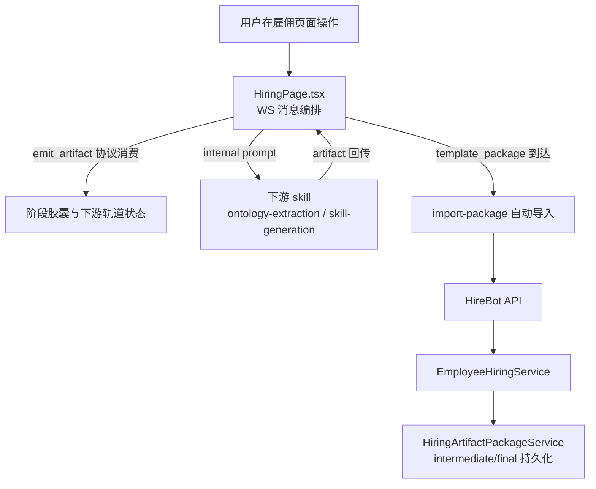
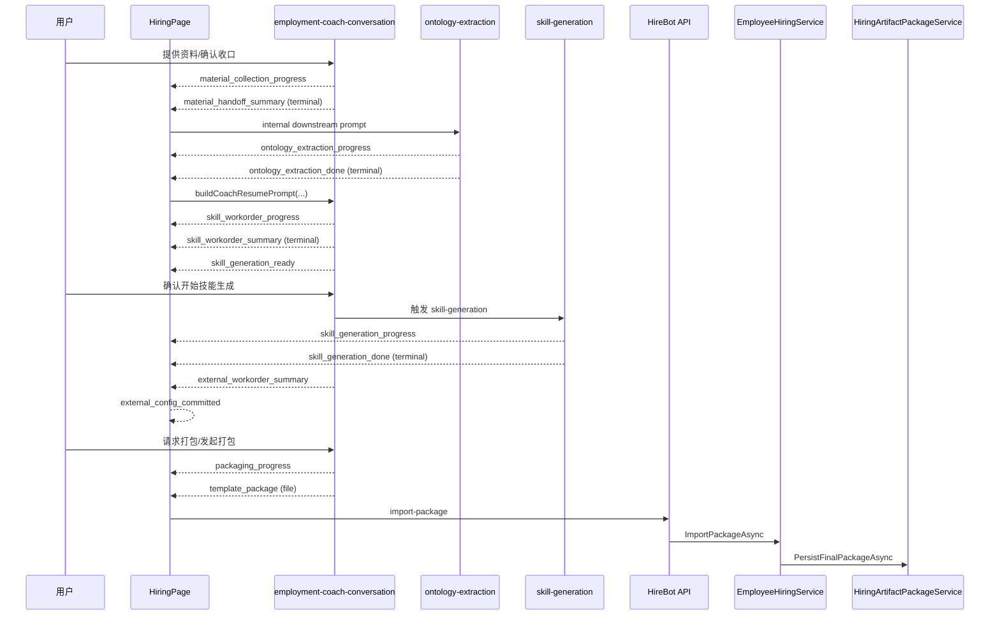
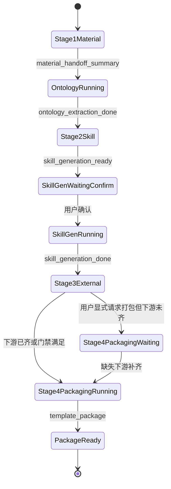

# employment-coach-conversation artifacts 执行链路功能模块分析

## 配套图表

| 图表 | 说明 | 文件 |
|---|---|---|
| 调用堆栈层次图 | 从用户操作到后端落包的调用分层 | [employment-coach-conversation artifacts调用堆栈.svg](./employment-coach-conversation%20artifacts调用堆栈.svg) |

## 分析总结

- 本链路以 `contracts/artifacts.json` 作为**协议契约**：约束 artifact 类型、阶段门禁、terminal 语义，不由后端 C# 直接解析驱动状态机。
- 真正运行时编排发生在前端 `HiringPage.tsx`：消费 WebSocket `artifact` / `skill_stage_gate` 消息，驱动主阶段胶囊、下游轨道和自动触发。
- 后端 `EmployeeHiringService` 负责会话同步、dispatch 处理、中间/最终包持久化，不直接读取该 contracts 文件。
- 打包阶段由双门禁控制：下游完成触发，或用户显式请求触发；未满足真实条件时只能发 `packaging_progress(waiting_downstream)`。

## 模块归属与职责

| 层 | 模块 | 核心职责 |
|---|---|---|
| 协议层 | `back-end/src/HireBot.ApiService/Assets/DigitalEmployeeTemplates/employment-coach-conversation/skills/employment-coach-conversation/contracts/artifacts.json` | 定义 stage、artifact 类型、gate 规则与下游轨道 |
| 技能约束层 | `.../skills/employment-coach-conversation/references/emit-artifact-protocol.md` | 规定 `emit_artifact` 字段、触发时机、阶段语义 |
| 前端编排层 | `front-end/src/features/hiring/pages/HiringPage.tsx` | 实时消费 artifact、推进 UI、触发下游 prompt 与自动导入 |
| 前端状态层 | `front-end/src/features/hiring/pages/hiringArtifactState.ts` | `artifactType -> downstream run` 映射与阶段兜底推断 |
| 后端会话层 | `back-end/src/HireBot.Core/Services/Hiring/EmployeeHiringService*.cs` | 同步对话轮次、处理 dispatch callback、持久化包产物 |
| 后端产物层 | `back-end/src/HireBot.Core/Services/Hiring/Artifacts/HiringArtifactPackageService.cs` | intermediate/final 包写盘、查询与下载 |

## 链路总览（组件关系）

## 按顺序执行步骤

1. **阶段 1：资料收集**
   - 资料进入后发 `material_collection_progress`。
   - 资料收口后发 `material_handoff_summary`（terminal）。
2. **触发下游本体抽取**
   - 前端收到 `material_handoff_summary` 后，排队 internal prompt 触发 `ontology-extraction`。
   - 下游先发 `ontology_extraction_progress`，再发 `ontology_extraction_done`（terminal）。
3. **回到主流程进入阶段 2**
   - 前端收到 `ontology_extraction_done` 后，用 `buildCoachResumePrompt(...)` 恢复 coach 主线。
   - 技能定义阶段发 `skill_workorder_progress`，收口发 `skill_workorder_summary`（terminal）。
   - 紧跟 `skill_generation_ready`，进入“等待用户确认生成技能实现”子状态。
4. **技能生成下游执行**
   - 用户确认后进入 projection/skill-generation 路径，发 `skill_generation_progress` 到 `skill_generation_done`。
   - 在 `skill_generation_done` 前，主 `stage2_skill` 保持进行中，外部阶段不可抢先完成。
5. **阶段 3：外部能力**
   - 发 `external_workorder_progress` 与 `external_workorder_summary`（terminal）。
   - 系统提交成功后发 `external_config_committed`，作为外部阶段最终完成信号。
6. **阶段 4：实例打包**
   - 满足 gate 后先发 `packaging_progress`。
   - 真实调用 `package_workspace` 成功后发 `template_package(kind=file, terminal=true)`。
   - 前端收到 `template_package` 后自动触发导入，后端落 final 包并提供下载。

## 主流程时序图

## 打包门禁状态机

## 调用堆栈概览

- L0 用户：页面资料上传、阶段确认、发起打包。
- L1-L2 前端：`HiringPage.tsx` 处理 WS `artifact`，维护阶段与下游运行态。
- L3 编排分支：根据 artifactType 触发下游或恢复主流程（例如 `ontology_extraction_done` 后恢复 coach）。
- L4 下游执行：`ontology-extraction`、`skill-generation`、外部配置提交联动。
- L5 API：`/api/v1/hirings/{hireId}/conversation/*`、`/import-package`、`/artifacts/download`。
- L6 领域服务：`EmployeeHiringService` 与 `HiringArtifactPackageService` 写入 intermediate/final 包。

## 目录速查

- 协议：`back-end/src/HireBot.ApiService/Assets/DigitalEmployeeTemplates/employment-coach-conversation/skills/employment-coach-conversation/contracts/artifacts.json`
- 协议说明：`back-end/src/HireBot.ApiService/Assets/DigitalEmployeeTemplates/employment-coach-conversation/skills/employment-coach-conversation/references/emit-artifact-protocol.md`
- 前端编排：`front-end/src/features/hiring/pages/HiringPage.tsx`
- 前端 artifact 状态：`front-end/src/features/hiring/pages/hiringArtifactState.ts`
- 后端会话：`back-end/src/HireBot.Core/Services/Hiring/EmployeeHiringService.cs`
- 后端对话编排：`back-end/src/HireBot.Core/Services/Hiring/EmployeeHiringService.ConversationOrchestration.cs`
- 产物持久化：`back-end/src/HireBot.Core/Services/Hiring/Artifacts/HiringArtifactPackageService.cs`
