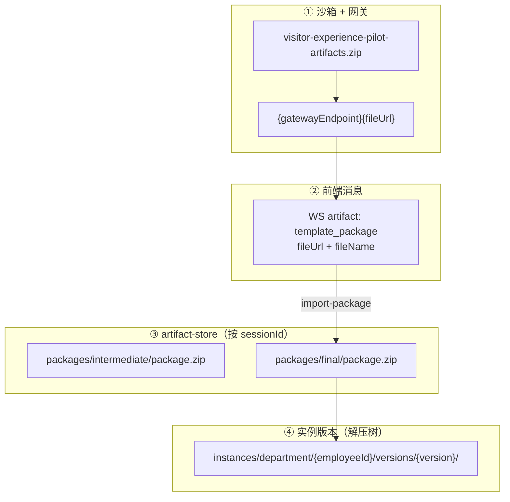
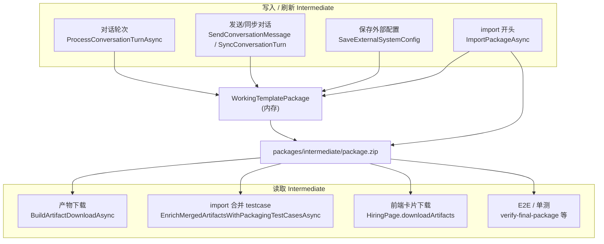

# 三种实例包关系与生成顺序总结

> 本文档汇总 Agent 会话中关于 **实例包 ZIP 路径**、**Intermediate / Final / 沙箱 `visitor-experience-pilot-artifacts.zip`** 三者关系及生成顺序的说明。  
> 更细的路径与 PowerShell 操作见：[实例包ZIP完整路径分析.md](./实例包ZIP完整路径分析.md)、[打包 testcase 扩展功能 E2E 验收操作手册.md](./打包%20testcase%20扩展功能%20E2E%20验收操作手册.md) §7–§8。

---

## 1. 话题范围

| 序号 | 问题 | 结论要点 |
|------|------|----------|
| 1 | 对话卡片（`ArtifactMessageCard`）对应的 ZIP「完整路径」是什么？ | DOM Path 是 **页面组件位置**，不是磁盘路径；ZIP 分布在沙箱网关、前端 artifact、`artifact-store`、实例版本目录四层 |
| 2 | Intermediate、Final 与 `visitor-experience-pilot-artifacts.zip` 的关系？ | **三个不同来源、三种配方**；不是同一文件的三个拷贝 |
| 3 | 生成时间顺序？ | Intermediate 可 **早于** 沙箱 ZIP；沙箱 ZIP 在阶段 4 打包时出现；Final **仅在 import 之后** 定稿 |
| 4 | Intermediate **用途**与**哪些模块**会用到？ | 后端 WTP 工作副本：对话/外部配置落盘、import 前刷新、testcase staging、下载兜底；详见 §3.4–§3.7 |

---

## 2. UI 卡片 vs 物理路径（勿混淆）

### 2.1 页面 DOM（非磁盘）

用户提供的 DOM Path 示例：

```text
div#root > ... > div.hb-hiring-msg[n] > div.hb-hiring-msg-stack > div.hb-artifact-card
```

- **React 组件**：`ArtifactMessageCard`（`front-end/.../ArtifactMessageCard.tsx`）
- **展示内容**：`artifactType=template_package`，`label` 如「实例包已就绪，正在导入系统」，`fileName` 如 `visitor-experience-pilot-artifacts.zip`
- **契约来源**：`employment-coach-conversation/contracts/artifacts.json` 阶段 4（`stage4_packaging`）

### 2.2 四层物理/逻辑路径



**默认本机根目录：**

```text
{ApiService ContentRoot}\ncrew-hire-data\artifact-store
```

开发环境常见绝对路径：

```text
c:\Users\wayye\Documents\ai4c_Projects\hirebot\back-end\src\HireBot.ApiService\ncrew-hire-data\artifact-store
```

| 层级 | 典型路径 / URL |
|------|----------------|
| 沙箱 Template 包 | `http://127.0.0.1:{port}/proxy/{id}/media/...`（`fileUrl` 以雇佣 API 返回的 `gatewayEndpoint` 为准） |
| Intermediate | `artifact-store\sessions\{sessionId}\packages\intermediate\package.zip` |
| Final | `artifact-store\sessions\{sessionId}\packages\final\package.zip` |
| HTTP 下载 Final | `GET http://localhost:5280/api/v1/hirings/{hireId}/artifacts/download` |
| 实例产物树 | `artifact-store\instances\department\{employeeId}\versions\{version}\` |

---

## 3. 三种包分别是什么

| 名称 | 是什么 | 主要数据来源 | 何时落盘到 artifact-store |
|------|--------|--------------|---------------------------|
| **`visitor-experience-pilot-artifacts.zip`** | 沙箱 `package_workspace` 打出的 **Template 包**（`{template_slug}-artifacts.zip`） | OpenSandbox 工作区内 coach / 下游 skill 编辑结果 | **默认不自动落盘**；仅网关 + 对话 `fileUrl`；import 时由前端下载上传 |
| **Intermediate** | 后端按 **`WorkingTemplatePackage`** 组装的 ZIP | 对话结构化数据、材料 JSON、右侧 **`external/`**、packaging testcase staging 等 | 对话轮次结束、保存外部配置、**import 开头** 等时机 **反复覆盖** |
| **Final** | **import-package 后的交付实包** | 沙箱 ZIP 解压内容 **+** store skill **+** WTP 补缺 **+** 外部配置 **+** 五件套 testcase 合并 | **仅** `ImportPackageAsync` 成功末尾写入 `packages/final/package.zip` |

### 3.1 关系一句话

- **沙箱 ZIP** ≈ AI 在沙箱工作区打包的「现场版」
- **Intermediate** ≈ 后端维护的「工作副本」（偏外部配置与对话沉淀；**不是**沙箱 ZIP 的镜像拷贝）
- **Final** ≈ 以沙箱 ZIP 为主干，经后端合并、补强后的 **定稿交付包**

### 3.2 是否同一文件

| 对比 | 结论 |
|------|------|
| 沙箱 ZIP ↔ Intermediate | **否**；来源不同，字节常不一致 |
| 沙箱 ZIP ↔ Final | **高度重叠**；Final 在冲突路径上 **沙箱优先**，并可能 **更大**（`external/`、合并后 testcases 等） |
| Intermediate ↔ Final | Final 是 import 后权威包；`GET artifacts/download` **优先 Final**，无则回退 Intermediate |

E2E 手册称 intermediate 与沙箱包「均可用于 template 侧五件套验收」指 **验收用途等价**，非字节级相同。

### 3.3 import 时的合并优先级（代码）

合并顺序（`MergeTemplatePackageArtifacts`）：

1. **沙箱 ZIP 解压内容**（最高，覆盖同名路径）
2. **Store skill 关联包**（沙箱已有则保留沙箱）
3. **`WorkingTemplatePackage`**（最低，仅 `TryAdd` 补缺）

Intermediate 落盘 **只** 序列化 `WorkingTemplatePackage`，**不会**在 import 时把沙箱 ZIP 原样写入 intermediate。

### 3.4 Intermediate 的用途（设计目标）

**Intermediate**（`kind=intermediate_package_zip`，磁盘路径 `packages/intermediate/package.zip`）是后端在雇佣会话内维护的 **工作副本 ZIP**，核心职责可概括为：

| 用途 | 说明 |
|------|------|
| **对话进度落盘** | 将内存中的 `WorkingTemplatePackage`（WTP）序列化为可下载、可校验的 ZIP，避免仅存在于运行时 Store |
| **外部配置权威副本** | 右侧 MCP/CLI 保存后，把 `external/` 等托管路径写入 WTP 并落盘；**即使沙箱工作区写入失败**，后端仍保留含最新外部配置的包 |
| **import 前的「后端视图」** | import 开头再刷一次 Intermediate（仍为 WTP，非沙箱 ZIP 拷贝），与随后上传的沙箱流在 `ImportPackageAsync` 内按优先级合并 |
| **打包 testcase 暂存区** | `EnsurePackagingTestCasesStagedAsync` 写入的 `testcases/`、`ontology/hiring-session/*-derived.json` 等先进入 WTP，再随 Intermediate 持久化；import 时从 Intermediate/WTP **回补** 进 Final |
| **下载与验收兜底** | `GET .../artifacts/download` 在尚无 Final 时 **回退 Intermediate**；E2E 在网关 `fileUrl` 404 时可用 `intermediate/package.zip` 做 template 侧五件套验收（字节可与沙箱 ZIP 不同） |

**不承担的职责：**

- **不是**沙箱 `package_workspace` 产物的镜像或缓存；
- **不能**替代 Final 作为 import 后的正式交付包（无沙箱主干 + store skill 合并结果）；
- **不会**自动包含沙箱 `skills/` 下由 AI 现场生成的全部文件（除非已同步进 WTP）。

### 3.5 WTP 写入 Intermediate 时通常包含什么

`PersistIntermediatePackageAsync` 调用 `BuildPackageFileMap(WorkingTemplatePackage)`，内容由 `ApplyConversationProgressToTemplatePackage` 等逻辑持续 enrichment，典型路径包括：

| 路径模式 | 来源模块 |
|----------|----------|
| `ontology/hiring-session/structured-data.json` | 对话结构化答案沉淀 |
| `ontology/hiring-session/materials.json` | 资料上传与解析结果 |
| `external/**`（如 `external/systems/mcp.json`） | 外部系统配置（`SaveExternalSystemConfig` / `SyncManagedExternalPackageFiles`） |
| `testcases/evaluation-test-cases.json` 及 `ontology/hiring-session/*` | Packaging testcase staging（`EmployeeHiringService.PackagingTestCases`） |
| 模板初始包中的 `config/`、`manifest.json` 等 | 创建雇佣时的 `IWorkingTemplatePackageProvider` 基底 |

### 3.6 命名易混：`intermediate` 两种 Kind

| `HiringArtifactEntity.Kind` | 物理位置 | 含义 |
|-----------------------------|----------|------|
| **`intermediate_package_zip`** | `packages/intermediate/package.zip` | 本文所述 **Intermediate 中间压缩包**（整包 ZIP） |
| **`intermediate`**（无 `_package_zip`） | `materials/{type}/{fileName}` 等 | **单份业务资料文件** 的上传记录（`HiringMaterialsController`），与 WTP 整包 **无关** |

排错与验收时请按 **logicalPath** 区分：`packages/intermediate/package.zip` 才是 Intermediate 包。

### 3.7 哪些功能模块会使用 Intermediate



#### 后端（写入）

| 功能模块 | 触发时机 | 代码入口 |
|----------|----------|----------|
| **雇佣对话编排** | 每轮沙箱回复解析完毕、工作流与 WTP 更新后 | `EmployeeHiringService.ConversationOrchestration.cs` → `ProcessConversationTurnAsync` |
| **雇佣对话 API** | 用户消息含敏感凭据被拦截时（仍会合并材料并推进 WTP） | `EmployeeHiringService.cs` → `SendConversationMessageAsync` / `SyncConversationTurnAsync` |
| **外部系统配置** | `PUT .../external-config` 保存 MCP/CLI 成功后 **立即** 落盘 | `EmployeeHiringService.ExternalSystemConfigs.cs` → `SaveExternalSystemConfigAsync` |
| **产物导入（import-package）** | 收到沙箱 ZIP 上传流后、合并前 **再刷一次** WTP → Intermediate | `EmployeeHiringService.cs` → `ImportPackageAsync` |
| **产物包存储服务** | 将文件字典打成 ZIP 写入 `artifact-store` 与 `hiring_artifacts` 表 | `HiringArtifactPackageService.PersistIntermediatePackageAsync` |

写入前提：`ShouldPersistArtifactPackages` 为真（有 `sessionId`，且非评估专用模板 `EvaluationWorkspaceTemplateId`）。

#### 后端（读取）

| 功能模块 | 用途 | 代码入口 |
|----------|------|----------|
| **产物下载 API** | `GetLatestPackageAsync`：**优先 Final**，无则 **回退 Intermediate** | `HiringArtifactPackageService.GetLatestPackageAsync`；`EmployeeHiringService.BuildArtifactDownloadAsync` |
| **import 时 testcase 合并** | Final 合并前，若 WTP 尚无主 testcase 文件，从已落盘的 Intermediate ZIP 解压取用 | `EmployeeHiringService.PackagingTestCases.cs` → `ResolvePackagingTestCaseSourcesAsync` |
| **（间接）实例版本树** | Intermediate 本身 **不** 解压到 `instances/...`；仅 import 后的 **Final** 经 `StoreDepartmentArtifactsAsync` 进入实例目录 | — |

#### 前端

| 功能模块 | 用途 | 代码入口 |
|----------|------|----------|
| **雇佣页产物卡片下载** | 已 import：下载 API 返回的 Final（缓存在 `artifactArchive`）；**已配置外部、尚未建实例**：走 `downloadArtifacts` → 后端 Intermediate（**禁止**回退网关沙箱 ZIP，避免缺 `external/`） | `HiringPage.tsx` → `onArtifactFileDownload` |
| **import 成功后** | `triggerCreate` 完成 → `setArtifactArchive(downloadArtifacts)`，后续下载优先 Final | `HiringPage.tsx` → `triggerCreate` |

#### 测试与运维文档

| 功能模块 | 用途 |
|----------|------|
| **E2E / 验收手册** | 网关 404 时复制 `intermediate/package.zip` 作 template 包兜底（§7.1 方式 B） |
| **Core 单测** | `HiringArtifactPackageServiceTests`、`ImportPackageTestCasesTests`、`FinalPackageZipAcceptanceTests` 等校验 Intermediate 落盘与 testcase 路径 |

---

## 4. 生成时间顺序

### 4.1 总时间线

```text
时间 →

[创建雇佣]
    ↓
[多轮对话 / 保存外部配置]
    → Intermediate 可能已存在并多次更新（尚无沙箱 ZIP）
    ↓
[阶段 4：沙箱 package_workspace]
    → visitor-experience-pilot-artifacts.zip（网关 /media/...）
    → 前端 template_package 卡片；可自动或手动 import
    ↓
[import-package 一次调用内]
    ① 再刷 Intermediate（仍来自 WTP，非沙箱 ZIP 拷贝）
    ② 解压上传流 → 与 store skill、WTP、external、testcases 合并
    ③ 写入 instances/department/.../versions/...
    ④ PersistFinalPackageAsync → packages/final/package.zip
```

### 4.2 分阶段说明

| 阶段 | 事件 | 沙箱 ZIP | Intermediate | Final |
|------|------|----------|--------------|-------|
| A. 打包前 | 每轮对话结束、保存外部配置等 | 无 | **有**，随 WTP 更新 | 无 |
| B. 阶段 4 | `package_workspace` + `emit_artifact` | **首次出现**（网关） | 可能已有旧版 | 无 |
| C. import | `POST .../import-package` | 作为上传流参与合并 | import **开头**再刷一次（WTP） | import **末尾**生成 |

### 4.3 前端行为（与顺序相关）

| 行为 | 说明 |
|------|------|
| 自动 import | 收到 `template_package` 且下游任务结束后，`useEffect` 调用 `triggerCreate`：从网关下载 ZIP → `import-package` |
| 手动导入 | 卡片「手动导入系统」→ 同上 |
| 点击下载 | 已 import 且存在 `artifactArchive` 时优先 **后端包**；仅配置外部系统未建实例时可能下 **intermediate**；否则走 **网关 fileUrl** |

---

## 5. 对照表（验收与排错）

| 你想验证… | 应使用… | 获取方式 |
|-----------|---------|----------|
| 沙箱 AI 打包结果（Template） | 沙箱 ZIP | 网关 `fileUrl`；404 时可复制 `intermediate/package.zip` 作兜底（手册 §7.1 方式 B） |
| 后端是否已有外部配置 / 对话沉淀 / staging testcase | **Intermediate** | `artifact-store\...\intermediate\package.zip` 或 `GET .../artifacts/download`（尚无 Final 时） |
| import 后正式交付 / 五件套 | **Final** | `GET .../artifacts/download`（有 Final 时优先）或 `...\final\package.zip` |
| 运行实例当前文件树 | 实例版本目录 | `instances\department\{employeeId}\versions\{version}\` |

**失败信号（E2E）**：仅 `packaging-fallback` 且 `test_cases: []`；缺 `testcases/` 目录。

---

## 6. 关键代码索引

| 主题 | 路径 |
|------|------|
| 产物卡片 | `front-end/.../ArtifactMessageCard.tsx` |
| 网关下载 + import | `front-end/.../HiringPage.tsx` → `triggerCreate` |
| 合并优先级 | `EmployeeHiringService.DataHelpers.cs` → `MergeTemplatePackageArtifacts` |
| Intermediate 落盘 | `PersistIntermediatePackageAsync` → `BuildPackageFileMap(WorkingTemplatePackage)` |
| WTP  enrichment | `EmployeeHiringService.DataHelpers.cs` → `ApplyConversationProgressToTemplatePackage` |
| 外部配置 → Intermediate | `EmployeeHiringService.ExternalSystemConfigs.cs` → `SaveExternalSystemConfigAsync` |
| import 读 Intermediate testcase | `EmployeeHiringService.PackagingTestCases.cs` → `ResolvePackagingTestCaseSourcesAsync` |
| import 流程 | `EmployeeHiringService.cs` → `ImportPackageAsync` |
| Final 落盘 | `HiringArtifactPackageService.cs` → `PersistFinalPackageAsync` |
| 下载优先 Final | `GetLatestPackageAsync` / `BuildArtifactDownloadAsync` |
| 前端 Intermediate 下载 | `HiringPage.tsx` → `onArtifactFileDownload` / `api.hiringWorkflow.downloadArtifacts` |
| 契约与 emit | `contracts/artifacts.json`、`SKILL.md` 阶段 4 |
| 资料单文件 kind（非整包） | `HiringMaterialsController.cs`（`Kind=intermediate`） |

---

## 7. 需自行替换的占位符（confirm-me）

写死路径前请从当前雇佣会话确认：

- `hireId`、`sessionId`
- `gatewayEndpoint`、对话中 `template_package` 的 `fileUrl`
- 是否已完成 **import**（决定下载 API 返回 Final 还是仅 Intermediate）

---

*文档类型：对话总结 + Intermediate 模块说明（2026-06-01 增补 §3.4–§3.7）；不修改业务代码。*
