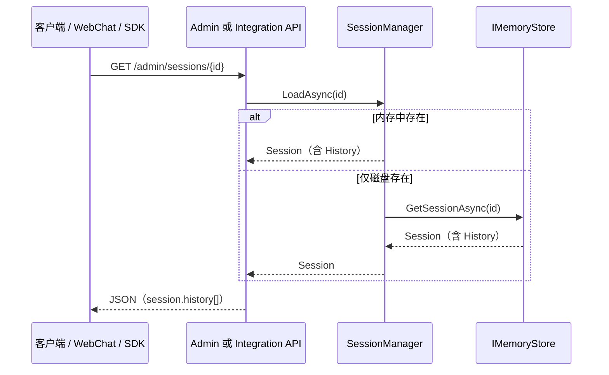

# 历史对话持久化接口功能模块

> 本文档总结 OpenClaw（kingcrab）项目中**历史对话持久化**相关的功能模块、数据流与对外接口。  
> 整理日期：2026-05-27

---

## 概述

OpenClaw 中的每一次对话（Telegram、Slack、WebSocket、定时任务等）由 **Session** 表示。会话的**多轮对话内容**保存在 `Session.History`（`List<ChatTurn>`）中，经 **SessionManager** 协调后写入 **IMemoryStore**（文件或 SQLite），进程重启后可通过存储层恢复。

历史对话的对外能力分为三类：

1. **写入路径**：业务管道在对话轮次结束后调用 `SessionManager.PersistAsync`，无独立「POST 持久化」REST 接口。
2. **HTTP 读取**：Admin API 与 Integration API 提供列表、详情（含 `history`）、导出、搜索等。
3. **Agent / MCP 工具**：`sessions`、`sessions_history` 及 MCP 资源 URI 供 Agent 读取历史。

---

## 架构总览

```mermaid
flowchart TB
    subgraph write [写入路径]
        Pipeline[GatewayWorkers / ChatCommandProcessor / OpenAiEndpoints 等]
        SM[SessionManager.PersistAsync]
        Store[(IMemoryStore<br/>FileMemoryStore / SqliteMemoryStore)]
        Pipeline --> SM --> Store
    end

    subgraph read [读取接口]
        Admin["/admin/sessions/*"]
        Integration["/api/integration/sessions/*"]
        Tools[sessions / sessions_history 工具]
        MCP[openclaw://sessions/{id}]
    end

    Store --> SM
    SM --> Admin
    SM --> Integration
    Store --> Tools
    SM --> MCP
```

---

## 一、持久化核心层（非 HTTP）

### 1.1 数据模型

| 模块 | 路径 | 职责 |
|------|------|------|
| **Session** | `src/OpenClaw.Core/Models/Session.cs` | 会话实体；`History` 字段为 `List<ChatTurn>`，承载多轮对话 |
| **ChatTurn** | 同目录相关模型 | 单轮角色、内容、时间戳等 |
| **SessionBranch** | `src/OpenClaw.Core/Models/SessionBranch.cs` | 会话历史在某时间点的分支快照 |

### 1.2 会话协调器

| 模块 | 路径 | 职责 |
|------|------|------|
| **SessionManager** | `src/OpenClaw.Core/Sessions/SessionManager.cs` | 内存热缓存（`ConcurrentDictionary`）+ 持久化后端协调 |

关键方法：

| 方法 | 说明 |
|------|------|
| `GetOrCreateAsync(channelId, senderId)` | 确定性键 `channelId:senderId` 创建/加载会话 |
| `GetOrCreateByIdAsync(sessionId, ...)` | 显式 sessionId（定时任务、Webhook、子 Agent 等） |
| `PersistAsync(session, ct)` | 带重试（3 次、指数退避）写入 `IMemoryStore` |
| `LoadAsync(sessionId, ct)` | 先查内存，再 `GetSessionAsync` 从存储加载 |
| `BranchAsync` / `RestoreBranchAsync` | 对话分支快照与恢复 |

持久化写入核心逻辑（节选）：

```csharp
// SessionManager.PersistAsync → IMemoryStore.SaveSessionAsync
await _store.SaveSessionAsync(session, ct);
```

配置项（来自 `GatewayConfig`）：

- `SessionTimeoutMinutes`：空闲过期
- `MaxConcurrentSessions`：内存中并发会话上限（LRU 淘汰）

### 1.3 存储抽象与实现

| 模块 | 路径 | 职责 |
|------|------|------|
| **IMemoryStore** | `src/OpenClaw.Core/Abstractions/IMemoryStore.cs` | `GetSessionAsync` / `SaveSessionAsync` / `DeleteSessionAsync`；分支 CRUD |
| **FileMemoryStore** | `src/OpenClaw.Core/Memory/FileMemoryStore.cs` | 文件系统持久化（本地优先） |
| **SqliteMemoryStore** | `src/OpenClaw.Core/Memory/SqliteMemoryStore.cs` | SQLite 持久化；可实现 FTS 搜索 |
| **CoreServicesExtensions** | `src/OpenClaw.Gateway/Composition/CoreServicesExtensions.cs` | DI 注册 `IMemoryStore`、`SessionManager`、`ISessionAdminStore` |

存储路径由配置 `Memory.StoragePath` 决定；Docker 部署时常挂载 `/app/memory` 以跨重启保留会话与记忆。

### 1.4 典型写入触发点

持久化在对话处理流程中**自动触发**，主要调用方包括：

| 调用方 | 路径 |
|--------|------|
| 消息管道 Worker | `src/OpenClaw.Gateway/Extensions/GatewayWorkers.cs` |
| 聊天命令处理器 | `src/OpenClaw.Core/Pipeline/ChatCommandProcessor.cs` |
| OpenAI 兼容端点 | `src/OpenClaw.Gateway/Endpoints/OpenAiEndpoints.cs` |
| 合约端点 | `src/OpenClaw.Gateway/Endpoints/ContractEndpoints.cs` |
| 后端会话同步 | `src/OpenClaw.Gateway/Backends/BackendSessionServices.cs` |
| A2A 执行桥 | `src/OpenClaw.Gateway/A2A/OpenClawA2AExecutionBridge.cs` |

> **说明**：项目内**没有**单独的 `POST /.../persist` 类 HTTP 接口；持久化由运行时管道隐式完成。

---

## 二、HTTP 读取接口

### 2.1 管理端 API（Admin）

**定义文件**：`src/OpenClaw.Gateway/Endpoints/AdminEndpoints.cs`  
**列表辅助**：`src/OpenClaw.Gateway/Composition/SessionAdminListing.cs`

| 方法 | 路径 | 说明 |
|------|------|------|
| GET | `/admin/sessions` | 会话列表（活跃 + 已持久化摘要）；支持 search、channelId、senderId、state、starred、tag 等筛选 |
| GET | `/admin/sessions/{id}` | **会话详情，响应中含完整 `session.history`** |
| GET | `/admin/sessions/{id}/timeline` | 运行时事件 + Provider 轮次（补充信息，非纯 History 字段） |
| GET | `/admin/sessions/{id}/export` | 纯文本 transcript 导出 |
| GET | `/admin/sessions/{id}/branches` | 分支列表 |
| GET | `/admin/sessions/{id}/diff` | 当前历史与分支的差异 |
| GET | `/admin/sessions/active` | 仅活跃会话 |
| POST | `/admin/sessions/{id}/metadata` | 元数据（starred、tag 等） |
| DELETE | `/admin/sessions/{id}` | 删除会话 |
| GET | `/admin/sessions/export` | 批量导出 |

**前端调用**：`src/OpenClaw.Gateway/wwwroot/webchat.js` 使用 `GET /admin/sessions`、`GET /admin/sessions/{id}` 展示会话历史面板。

### 2.2 集成 API（Integration）

**定义文件**：`src/OpenClaw.Gateway/Endpoints/IntegrationEndpoints.cs`  
**门面逻辑**：`src/OpenClaw.Gateway/Composition/IntegrationApiFacade.cs`

| 方法 | 路径 | 说明 |
|------|------|------|
| GET | `/api/integration/sessions` | 会话列表（与 Admin 类似的分页与筛选） |
| GET | `/api/integration/sessions/{id}` | **会话详情，含 `History`** |
| GET | `/api/integration/sessions/{id}/timeline` | 时间线（RuntimeEvents + ProviderTurns） |
| GET | `/api/integration/session-search` | 跨会话全文搜索（需 `text` 参数） |

**HTTP 客户端封装**：`src/OpenClaw.Client/OpenClawHttpClient.cs`

### 2.3 列表与搜索辅助模块

| 接口 / 类 | 实现位置 | 职责 |
|-----------|----------|------|
| `ISessionAdminStore` | `FileMemoryStore` / `SqliteMemoryStore` | 分页列出已持久化会话摘要 |
| `SessionAdminPersistedListing` | `SessionAdminListing.cs` | Admin / Integration 共用的持久化列表逻辑 |
| `ISessionSearchStore` | 同上 MemoryStore | 跨会话历史内容搜索 |
| `SessionMetadataStore` | `Gateway/SessionMetadataStore.cs` | starred、tag 等元数据（**不存储 History 正文**） |

### 2.4 保留与清理

| 能力 | 路径 / 端点 |
|------|-------------|
| 后台保留清扫 | `MemoryRetentionSweeperService`（`Gateway/Extensions/`） |
| 状态查询 | `GET /memory/retention/status` |
| 手动清扫 | `POST /memory/retention/sweep` |

---

## 三、Agent 与 MCP 工具接口

### 3.1 Agent 工具

| 工具名 | 文件 | 说明 |
|--------|------|------|
| `sessions`（`action=history`） | `src/OpenClaw.Agent/Tools/SessionsTool.cs` | 通过 `SessionManager.LoadAsync` 读取 `History` |
| `sessions_history` | `src/OpenClaw.Gateway/Tools/SessionsHistoryTool.cs` | 先查活跃会话，再 `IMemoryStore.GetSessionAsync` |
| `session_search` | `src/OpenClaw.Gateway/Tools/SessionSearchTool.cs` | 跨会话相关性搜索 |

`SessionsTool` 支持的 action：`list`、`history`、`send`。

### 3.2 MCP 资源

**文件**：`src/OpenClaw.Gateway/Mcp/OpenClawMcpResources.cs`

| URI 模板 | 说明 |
|----------|------|
| `openclaw://sessions/{sessionId}` | 会话详情 JSON |
| `openclaw://sessions/{sessionId}/timeline` | 会话时间线 |

---

## 四、相关但易混淆的模块

| 名称 | 说明 |
|------|------|
| `BrowserSessionAuthService` | 浏览器 Admin 登录会话（Cookie），**不是**对话 History |
| `webchat.js` 中「执行历史」 | Cron 任务执行记录，**不是** Session.History |
| `MafSessionStateStore` | MAF Agent 适配层状态，与 `IMemoryStore` 会话持久化不同路径 |
| `approval-history` | 工具审批审计历史，与会话对话无关 |

---

## 五、数据流简图（读取一条历史）



---

## 六、配置与部署提示

- **存储类型**：由 Gateway 配置选择 File 或 SQLite 实现 `IMemoryStore`。
- **持久化目录**：`config.Memory.StoragePath`；容器部署建议挂载 volume（如 `openclaw-memory:/app/memory`）。
- **并发写入**：`PersistAsync` 对**同一会话**通过 per-session 锁串行化；不同会话可并发 `SaveSessionAsync`。

---

## 七、延伸阅读

| 文档 | 路径 |
|------|------|
| 会话管理系统（设计说明） | `docs/OpenClaw-Session-Management.md` |
| 记忆召回与保留 | `docs/openclaw-memory-recall-and-retention.md` |
| Gateway 启动与内存服务注册 | `docs/openclaw-gateway-startup-layers.md` |

---

## 八、快速定位表

| 需求 | 优先查看 |
|------|----------|
| 对话内容存在哪 | `Session.History` → `IMemoryStore.SaveSessionAsync` |
| 何时落盘 | `SessionManager.PersistAsync` 及各 Pipeline 调用点 |
| HTTP 读完整历史 | `GET /admin/sessions/{id}` 或 `GET /api/integration/sessions/{id}` |
| 列表 / 搜索 | `/admin/sessions`、`/api/integration/session-search` |
| Agent 读历史 | `sessions`（history）、`sessions_history` |
| 官方设计文档 | `docs/OpenClaw-Session-Management.md` |
