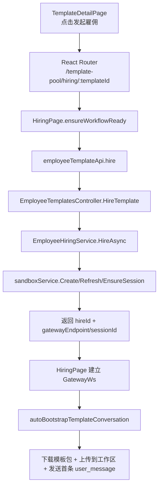
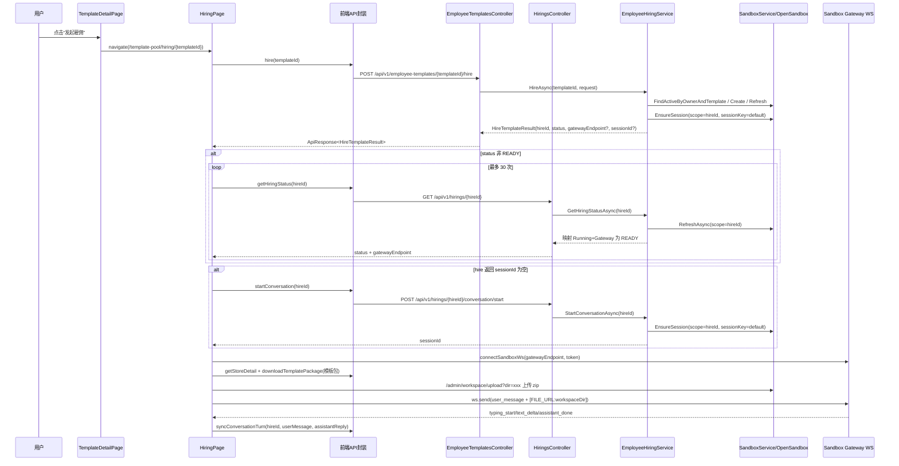
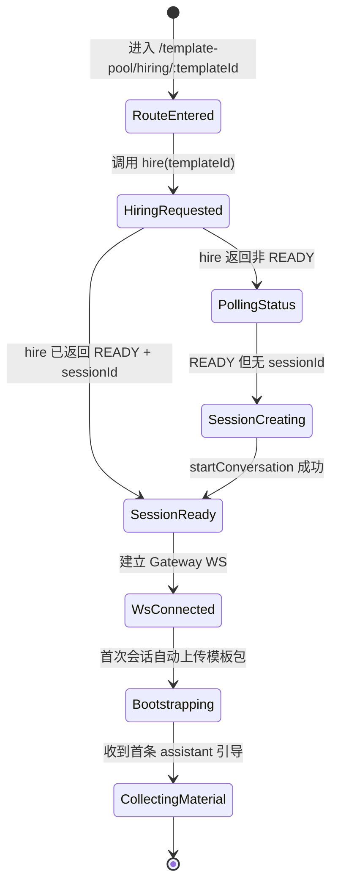

# 发起雇佣按钮功能模块分析

## 配套图表

| 图表 | 说明 | 文件 |
|---|---|---|
| 调用堆栈层次图 | 从点击按钮到沙箱会话引导完成的分层链路 | [发起雇佣按钮调用堆栈.svg](./发起雇佣按钮调用堆栈.svg) |

## 分析总结

- 点击 `TemplateDetailPage` 的“发起雇佣”按钮，本质先做路由跳转，不在当前页直接发起 API。
- 真正的雇佣创建发生在 `HiringPage.ensureWorkflowReady()`：调用 `POST /api/v1/employee-templates/{templateId}/hire`，随后轮询 `GET /api/v1/hirings/{hireId}` 等待 `READY`。
- 后端 `EmployeeHiringService.HireAsync(...)` 会优先复用可用沙箱；若无可复用沙箱则创建托管沙箱、创建会话、上传角色模板包并初始化运行态。
- 前端在拿到 `gatewayEndpoint + sessionId` 后建立 WebSocket，若是首次雇佣会自动下载模板包并上传到沙箱工作区，再发首条引导消息，进入资料收集阶段。

## 入口与职责归属

| 层 | 模块 | 职责 |
|---|---|---|
| UI 入口层 | `front-end/src/features/market/pages/TemplateDetailPage.tsx` | 点击按钮并导航到雇佣页 |
| 前端编排层 | `front-end/src/features/hiring/pages/HiringPage.tsx` | 创建/恢复 hire、轮询状态、建连 WS、自动模板引导 |
| 前端 API 层 | `front-end/src/infra/api/modules/employeeTemplateApi.ts`、`front-end/src/infra/api/modules/hiringWorkflowApi.ts` | 封装 hire/status/startConversation 等请求 |
| 沙箱直连层 | `front-end/src/infra/sandbox/sandbox-api.ts` | 直连 OpenSandbox Gateway，上传模板包到工作区 |
| API 控制器层 | `back-end/src/HireBot.ApiService/Controllers/EmployeeTemplatesController.cs`、`back-end/src/HireBot.ApiService/Controllers/HiringsController.cs` | 暴露 hire/status/startConversation 等 REST 入口 |
| 领域服务层 | `back-end/src/HireBot.Core/Services/Hiring/EmployeeHiringService*.cs` | 雇佣编排、沙箱初始化、会话保证、状态映射 |

## 页面与组件关系

## 主流程时序图（点击后完整链路）

## 后端关键分支说明

1. `HireAsync` 复用逻辑  
   - 先按 owner + template 查询活跃沙箱。  
   - 若已初始化且可运行，直接返回已有 `hireId`，并尽量回填 `sessionId` 与 `gatewayEndpoint`。  
   - 若沙箱被外部删除后重建为空壳，走 `ReinitializeRebuiltHireSandboxAsync(...)`，保持原 `hireId`。

2. `HireAsync` 新建逻辑  
   - 调用 `ProvisionManagedHireSandboxAsync(...)` 创建托管沙箱并等待就绪。  
   - 调用 `EnsureSessionAsync` 创建默认会话。  
   - 执行 `PersistSessionAndSourceZipAsync(...)` 持久化会话和来源模板包。  
   - 上传 `employment-coach-conversation` 角色模板包、可选上传 MCP 配置，最后标记沙箱 `IsInitialized=true`。

3. `GetHiringStatusAsync` 状态映射  
   - 内部依赖 `sandboxService.RefreshAsync` 获取真实状态。  
   - 对前端约定：`Running` 且 `GatewayEndpoint` 非空映射为 `READY`。

4. `StartConversationAsync` 会话保证  
   - 若运行态发现沙箱未初始化，会先执行重初始化。  
   - 再调用 `EnsureSessionAsync`，并把 `sessionId` 写回运行态。

## 状态机（前端视角）

## 关键 API 清单（按触发顺序）

- `GET /api/v1/employee-templates/{templateId}`：`HiringPage` 初始加载模板详情。  
- `POST /api/v1/employee-templates/{templateId}/hire`：创建或复用雇佣沙箱。  
- `GET /api/v1/hirings/{hireId}`：轮询沙箱状态直到 `READY`。  
- `POST /api/v1/hirings/{hireId}/conversation/start`：必要时创建默认会话。  
- `GET /api/store/templates/{templateId}` + `GET /api/store/templates/{templateId}/versions/{versionId}/download`：自动引导时拉取模板包。  
- `POST {gateway}/admin/workspace/upload?dir=...`：前端直传模板包到沙箱工作区。  
- `WebSocket {gateway}`：发送引导 prompt，接收流式回复。  
- `POST /api/v1/hirings/{hireId}/conversation/sync`：把一轮 WS 对话同步回后端工作流。

## 调用堆栈文字概览

- L0 用户：在模板详情页点击“发起雇佣”。  
- L1 前端路由层：`TemplateDetailPage` 跳转到 `HiringPage`。  
- L2 前端编排层：`ensureWorkflowReady` 组织 hire/status/session。  
- L3 API 层：`employeeTemplateApi` 与 `hiringWorkflowApi` 发起 REST。  
- L4 控制器层：`EmployeeTemplatesController`、`HiringsController` 接口分发。  
- L5 领域服务层：`EmployeeHiringService` 处理复用/新建/重建初始化。  
- L6 沙箱层：`SandboxService` 与 Gateway 提供会话、状态、工作区上传与 WS 流。  

## 目录速查

- `front-end/src/features/market/pages/TemplateDetailPage.tsx`
- `front-end/src/features/hiring/pages/HiringPage.tsx`
- `front-end/src/infra/api/modules/employeeTemplateApi.ts`
- `front-end/src/infra/api/modules/hiringWorkflowApi.ts`
- `front-end/src/infra/sandbox/sandbox-api.ts`
- `back-end/src/HireBot.ApiService/Controllers/EmployeeTemplatesController.cs`
- `back-end/src/HireBot.ApiService/Controllers/HiringsController.cs`
- `back-end/src/HireBot.Core/Services/Hiring/EmployeeHiringService.cs`
- `back-end/src/HireBot.Core/Services/Hiring/EmployeeHiringService.SandboxOperations.cs`
- `back-end/src/HireBot.Core/Services/Hiring/EmployeeHiringService.ConversationOrchestration.cs`
