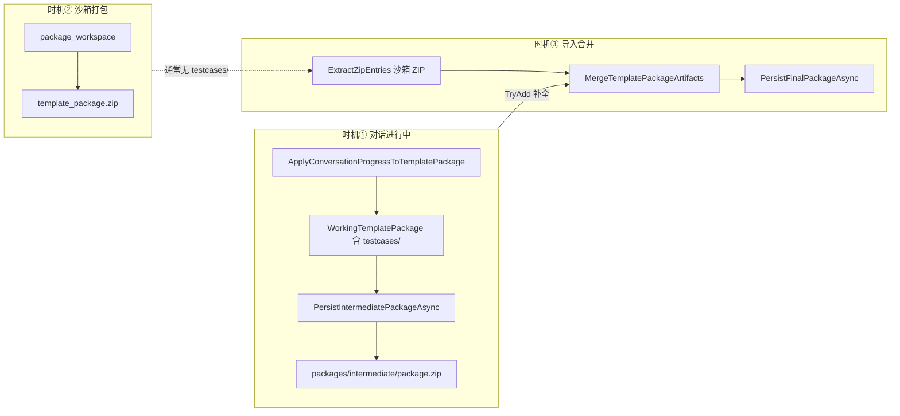
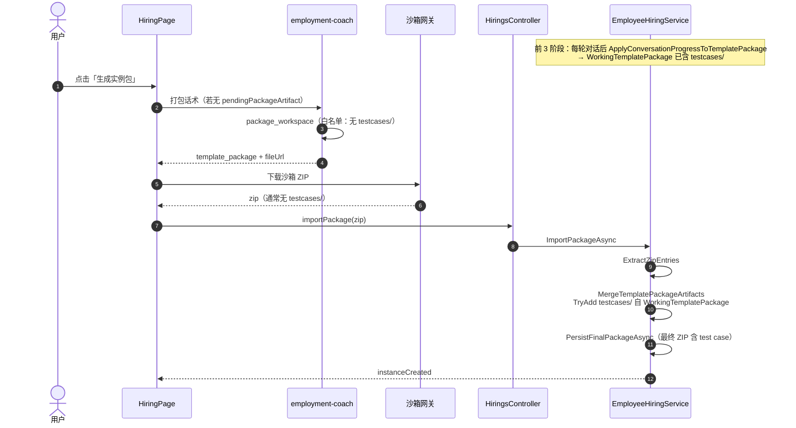

# 实例包 ZIP 内测试用例来源与写入流程

> 与 [生成实例包按钮功能模块分析.md](./生成实例包按钮功能模块分析.md) 配套：聚焦「ZIP 里出现的 test case 从哪来、在哪一步进包」。  
> 分析范围：雇佣第 4 阶段产物包链路（`template_package` → `import-package`）及后端运行时模板包合并逻辑。

**配套图表**

| 文件 | 说明 |
|------|------|
| 本文档内 Mermaid 图 | 时序、组件关系、ZIP 分层 |
| [实例包ZIP内测试用例调用堆栈.svg](./实例包ZIP内测试用例调用堆栈.svg) | 测试用例写入调用堆栈（SVG） |

---

## 1. 分析总结

### 1.1 核心结论

实例包 ZIP 中的测试用例（典型路径 **`testcases/evaluation-test-cases.json`**）**不属于**雇佣教练沙箱 `package_workspace` 的白名单打包内容，而是由 **雇佣（Hiring）后端** 在对话推进过程中，根据 **技能阶段材料** 与 **结构化业务字段** **程序化生成**，写入内存中的 `WorkingTemplatePackage`，并在 **`ImportPackageAsync` 三层合并** 时以最低优先级 `TryAdd` 补入最终 ZIP。

若你手里的 ZIP 是沙箱网关刚下载的 `template_package` 原始包，**通常看不到** `testcases/`；若来自导入成功后的 **最终交付包**（`packages/final/package.zip` 或合并后的实例制品），**应包含** 上述文件（前提：雇佣流程中已存在 `Type=skill` 的对话材料）。

### 1.2 功能模块归属

| 维度 | 实现位置 |
|------|----------|
| 产品阶段 | 雇佣四步流：资料 → 技能 → 外部 → **打包准备**（与「生成实例包」同一闭环） |
| 测试用例**生成** | `EmployeeHiringService.DataHelpers.TryBuildEvaluationTestCases` |
| 写入运行时模板包 | `ApplyConversationProgressToTemplatePackage`（每轮对话结束后） |
| 写入 ZIP（中间态） | `PersistIntermediatePackageAsync` → `BuildPackageFileMap` |
| 写入 ZIP（最终态） | `ImportPackageAsync` → `MergeTemplatePackageArtifacts` → `PersistFinalPackageAsync` |
| 消费方（下游） | AI 评估模块 `evaluation-expert` / `EvaluationService`（读取 `testcases/*.json`） |
| **不在此链路** | 沙箱 `package_workspace` 白名单（仅 `manifest/ontology/skills/external/config`） |

### 1.3 如何根据 ZIP 内容判断来源

| ZIP 内特征 | 最可能来源 | 说明 |
|------------|------------|------|
| `testcases/evaluation-test-cases.json`，含 `"source":"conversation-skill-guided"`、`cases[].caseId` 为 `eval-case-00x` | **雇佣后端生成** | 本文主路径 |
| 同内容副本 `ontology/hiring-session/evaluation-test-cases.json` | 同上（快照双写） | 与上同时写入 |
| `test_cases[]` + `test_case_id`（如 `DEFAULT-001`） | **评估默认夹具** | `_defaults/testcases/`，在评估沙箱预热时注入，非雇佣打包包进 |
| `testcases/*.json` 来自关联 **Store Skill** zip | Store Skill 中层合并 | `linkedStoreSkillIds` 下载后 `TryAdd` |
| 仅 `skills/`、`ontology/` 等，**无** `testcases/` | 沙箱原始 `template_package` | 正常；测试用例在 **import 合并后** 才进最终包 |

---

## 2. 测试用例生成逻辑（雇佣模块）

**文件**：`back-end/src/HireBot.Core/Services/Hiring/EmployeeHiringService.DataHelpers.cs`

### 2.1 触发条件

`TryBuildEvaluationTestCases` 仅在 `runtimeContext.Materials` 中存在 **`Type == "skill"`** 的材料时返回 true（例如用户完成技能阶段、关联了 evaluation-expert 等 skill 归档）。

### 2.2 生成内容

- 固定生成 **3 条** 场景：`eval-case-001`（正常闭环）、`eval-case-002`（异常路径）、`eval-case-003`（工具与合规）
- 字段来源：`StructuredData` 中的 `business_goal`、`user_profile`、`expected_outcome` 等 + skill 材料中的 `skillName` / `description` / 归档内评估指引
- JSON 顶层字段：`generatedAt`、`source: "conversation-skill-guided"`、`skillSummary`、`cases[]`

### 2.3 写入运行时包的两条路径

```csharp
UpsertPackageFile(enrichedFiles, "testcases/evaluation-test-cases.json", evaluationTestCasesJson);
UpsertPackageFile(enrichedFiles, "ontology/hiring-session/evaluation-test-cases.json", evaluationTestCasesJson);
```

### 2.4 何时调用 `ApplyConversationProgressToTemplatePackage`

每轮对话处理末尾（`ProcessConversationTurnAsync`）及敏感内容拦截分支均会调用，因此 **技能材料一旦进入 Materials，测试用例即进入 `WorkingTemplatePackage`**，早于用户点击「生成实例包」。

### 2.5 打包前生成（History + 上传资料 + 模板快照）

**文件**：`EmployeeHiringService.PackagingTestCases.cs`、`PackagingTestCaseMaterialLoader.cs`、`PackagingTestCaseTemplateSnapshotBuilder.cs`、`packaging-test-cases/SKILL.md`

| 步骤 | 说明 |
|------|------|
| 触发 | `ShouldStagePackagingTestCases`（`ready_for_packaging` 或打包意图话术）；在 `SendConversationMessageAsync` 沙箱发送前、`ProcessConversationTurnAsync` 进入打包阶段时调用 `EnsurePackagingTestCasesStagedAsync` |
| 读历史 | `ISandboxService.GetSessionDetailAsync` → KingCrab `GET /api/integration/sessions/{id}` |
| 读资料 | `PackagingTestCaseMaterialLoader` → `hiring_material_files` 表 + 磁盘 `StoragePath`（待办面板上传） |
| 读模板 | `PackagingTestCaseTemplateSnapshotBuilder` → `WorkingTemplatePackage.PackageFiles`（manifest/skills/ontology/config） |
| 生成 | invoke `packaging-test-cases` Skill，LLM 产出 merged + index + 三个 derived 子文件 |
| 写入 | 主文件 `testcases/evaluation-test-cases.json`（`source: packaging-merged`）；index/子文件在 `ontology/hiring-session/` |
| 降级 | 三源皆空或 Skill 失败时 `packaging-fallback`，`test_cases: []` |
| 防覆盖 | `PackagingTestCasesStaged == true` 时，`ApplyConversationProgressToTemplatePackage` **不再**调用 `TryBuildEvaluationTestCases` |

---

## 3. ZIP 写入的三个时间点



| 时机 | 步骤 | ZIP 是否含 test case |
|------|------|----------------------|
| ① 中间包 | 任意对话轮次后持久化中间包 | **有**（若已满足 skill 材料条件） |
| ② 沙箱包 | employment-coach 阶段 4 调用 `package_workspace` | **通常无**（SKILL 白名单未包含 `testcases/`） |
| ③ 最终包 | `POST .../import-package` 合并后 `PersistFinalPackageAsync` | **有**（沙箱未覆盖时由 `WorkingTemplatePackage` 补入） |

合并优先级（注释与实现一致）：**沙箱产物 > Store Skill > WorkingTemplatePackage**；`testcases/` 因沙箱侧一般不产出，几乎总是由第三层 `TryAdd` 进入最终 ZIP。

---

## 4. 与「生成实例包」主流程的关系



---

## 5. 沙箱为何不直接打进 testcases

**文件**：`employment-coach-conversation/SKILL.md` 阶段 4 打包白名单

允许：`manifest.json`、`ontology/`、`skills/`、`external/`、`config/`  
不允许：`testcases/`（与 `HiringWorkflowSupport.IsAllowedArtifactPath` 一致，dispatch 回写也不能写 `testcases/`）

因此测试用例**不是** AI 在沙箱里「写出来再 zip」的，而是后端在 **import 合并** 时注入，供后续 **AI 评估** 使用。

---

## 6. 下游：评估模块如何消费

| 组件 | 行为 |
|------|------|
| `EvaluationService` | 从实例/模板包 `testcases/*.json` 解析；优先识别 `test_cases` 数组格式 |
| `live_evaluator/material_loader.py` | 文件名含 `evaluation-test` 即视为 testcase 材料 |
| `_defaults/testcases/` | 模板无内置用例时的 **连通性兜底**（与雇佣生成的 `evaluation-test-cases.json` 并存不同路径） |

雇佣生成的 JSON 使用 `cases` + `caseId`，与夹具 `test_cases` + `test_case_id` 格式不同；评估侧通过路径/文件名与加载器兼容，解析时需结合具体实现版本。

---

## 7. 调用堆栈层次图（SVG）

**[实例包ZIP内测试用例调用堆栈.svg](./实例包ZIP内测试用例调用堆栈.svg)**

层次概览：

```
L0  雇佣对话产生 skill 材料 + StructuredData
L1  ProcessConversationTurnAsync
L2  ApplyConversationProgressToTemplatePackage
L3  TryBuildEvaluationTestCases → UpsertPackageFile(testcases/...)
L4  （并行）PersistIntermediatePackageAsync → 中间 ZIP
L5  用户生成实例包 → 沙箱 package_workspace（通常无 testcases）
L6  ImportPackageAsync → MergeTemplatePackageArtifacts → PersistFinalPackageAsync
```

---

## 8. 模块目录速查

```
hirebot/
├── back-end/src/HireBot.Core/Services/Hiring/
│   ├── EmployeeHiringService.DataHelpers.cs    ← 生成 + 合并 + 解压 ZIP
│   ├── EmployeeHiringService.cs                ← ImportPackageAsync
│   └── EmployeeHiringService.ConversationOrchestration.cs
├── back-end/src/HireBot.Core/Services/Hiring/Artifacts/
│   └── HiringArtifactPackageService.cs         ← 中间/最终 package.zip
├── back-end/src/HireBot.ApiService/Assets/DigitalEmployeeTemplates/
│   └── employment-coach-conversation/.../SKILL.md  ← 沙箱打包白名单
└── front-end/src/features/hiring/pages/HiringPage.tsx  ← triggerCreate / importPackage
```

---

## 9. 相关文档

- [生成实例包按钮功能模块分析.md](./生成实例包按钮功能模块分析.md)
- [hiring-evaluation-sandbox-flow.md](./hiring-evaluation-sandbox-flow.md)

---

*文档说明：基于仓库代码静态分析；若实际 ZIP 与上表不符，请对照文件名与 `source` 字段区分沙箱原包与 import 后最终包。*
