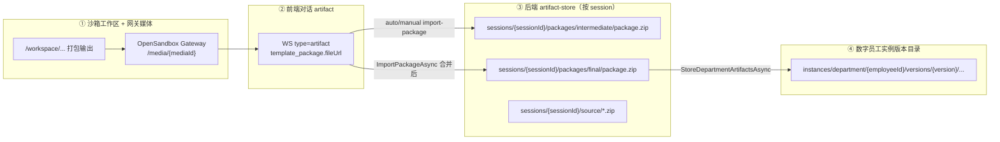

# 实例包 ZIP 完整路径分析

> 依据对话中 `ArtifactMessageCard`（`visitor-experience-pilot-artifacts.zip` / `stage4_packaging`）与 [打包 testcase 扩展功能 E2E 验收操作手册](./打包%20testcase%20扩展功能%20E2E%20验收操作手册.md) §7–§8 整理。  
> 适用模板：**访客全流程体验官**（`template_slug` ≈ `visitor-experience-pilot`）。

---

## 1. 先澄清：你给的 DOM Path 是什么路径

你提供的 DOM Path：

```text
div#root > div.hb-shell > main.hb-main > div.hb-hiring-page.hb-workflow-page
  > div.hb-hiring-workspace > div.hb-hiring-chat > div.hb-hiring-chat-body
  > div.hb-hiring-msg[41] > div.hb-hiring-msg-stack > div.hb-artifact-card
```

这是 **浏览器页面上的 React 组件挂载位置**，不是磁盘上的 ZIP 路径。

| 层级 | 含义 |
|------|------|
| `HiringPage` → `HiringConversationPanel` | 雇佣工作区主页面 |
| `div.hb-hiring-msg[41]` | 对话时间线中第 41 条消息（索引随会话变化） |
| `ArtifactMessageCard` + `div.hb-artifact-card` | 产物卡片 UI；`artifactType=template_package` 时展示 ZIP 文件名与「手动导入系统」 |

卡片文案「实例包已就绪，正在导入系统」来自契约 `artifacts.json` / coach `SKILL.md` 中 `template_package` 的 `label`，文件名 `visitor-experience-pilot-artifacts.zip` 来自沙箱 `package_workspace` 返回的 `fileName`（`{template_slug}-artifacts.zip`）。

---

## 2. 产物在系统中的四层「路径」

同一张卡片背后，ZIP 会依次出现在 **四个不同命名空间** 中（逻辑相关、物理路径不同）：



下面按层展开。

---

## 3. ① 沙箱内：打包源头（Template 包的真实 ZIP）

| 项 | 说明 |
|----|------|
| 触发 | coach 调用沙箱工具 `package_workspace`（或等价工具） |
| 工作区 | OpenSandbox 会话内模板工作区（如 `employment-coach-conversation` 技能目录树） |
| 输出文件名 | `{template_slug}-artifacts.zip`，访客模板即为 **`visitor-experience-pilot-artifacts.zip`** |
| 对外 URL | 工具返回的 **`fileUrl`**，通常为网关相对路径，例如 `/media/media-00x` |

**HTTP 下载完整 URL（方式 A，手册 §7.1）：**

```text
{gatewayEndpoint}{fileUrl}
```

示例（端口以雇佣接口返回的 `gatewayEndpoint` 为准，勿写死）：

```text
http://127.0.0.1:56063/proxy/18789/media/media-001
```

- `gatewayEndpoint`：前端 `HiringPage` 中 `gatewayEndpointRef`（来自创建/刷新雇佣会话 API）。
- `fileUrl`：对话 WS / `GET .../conversation/messages` 里该条 `template_package` artifact 的 `fileUrl` 字段。
- 请求头：`Authorization: Bearer {access_token}`。

**说明：** 沙箱磁盘上的绝对路径（如 `/workspace/.../visitor-experience-pilot-artifacts.zip`）由 OpenSandbox 管理，本机 E2E 一般 **不直接读沙箱文件系统**，只通过网关 `fileUrl` 或后端 artifact-store 兜底。

---

## 4. ② 前端消息模型：卡片绑定的逻辑路径

WebSocket / 历史回放解析后，单条消息结构（简化）：

```json
{
  "role": "artifact",
  "artifact": {
    "kind": "file",
    "artifactType": "template_package",
    "label": "实例包已就绪，正在导入系统",
    "skillName": "employment-coach-conversation",
    "stage": "stage4_packaging",
    "isTerminal": true,
    "fileUrl": "/media/media-xxx",
    "fileName": "visitor-experience-pilot-artifacts.zip"
  }
}
```

| 用户操作 | 实际走的下载逻辑 |
|----------|------------------|
| 点击 ZIP 文件名 | `onArtifactFileDownload` → 若已 `import` 且有 `artifactArchive`，下 **后端 final**；若仅配置了外部系统且未建实例，下 **后端 intermediate**；否则 `downloadGatewayFile(fileUrl)` → ① 网关 URL |
| 「手动导入系统」 | `triggerCreate({ fileUrl, fileName })` → 从网关拉 ZIP → `POST /api/v1/hirings/{hireId}/import-package` |
| 自动导入 | `template_package` 到达且下游任务结束后，`useEffect` 自动调用 `triggerCreate(pendingPackageArtifact)` |

相关前端代码：`front-end/src/features/hiring/pages/HiringPage.tsx`（`triggerCreate`、`downloadGatewayFile`、`onArtifactFileDownload`）。

---

## 5. ③ 后端 artifact-store：本机可复制的物理路径

**根目录（默认）：**

```text
{ApiService ContentRoot}/ncrew-hire-data/artifact-store
```

本仓库开发环境通常为：

```text
c:\Users\wayye\Documents\ai4c_Projects\hirebot\back-end\src\HireBot.ApiService\ncrew-hire-data\artifact-store
```

配置项：`HireBot:DataRoot` = `ncrew-hire-data`，`HireBot:ArtifactStoreRoot` = `artifact-store`（见 `appsettings.json`）。

### 5.1 按雇佣会话（session）— E2E 最常用

| 包类型 | 磁盘路径 | DB `logical_path` | 何时写入 |
|--------|----------|-------------------|----------|
| **Intermediate（Template 兜底）** | `artifact-store\sessions\{sessionId}\packages\intermediate\package.zip` | `packages/intermediate/package.zip` | 保存外部配置、staging testcase、或 import 前持久化 **WorkingTemplatePackage**（含 `external/` 等），**不是**直接把沙箱 ZIP 原样落盘 |
| **Final（import 后实包）** | `artifact-store\sessions\{sessionId}\packages\final\package.zip` | `packages/final/package.zip` | `ImportPackageAsync` 合并沙箱 ZIP + store skill + external + testcases 之后 |
| **源模板 ZIP（可选）** | `artifact-store\sessions\{sessionId}\source\{packageId}-{version}.zip` | `source/...` | 创建雇佣会话时若带了模板源归档 |

**方式 B 兜底复制（手册 §7.1，网关 404 时）：**

```powershell
$sessionId = 'session-xxxxxxxx'   # 须从雇佣 API / 页面状态确认
$hireId = 'hire-xxxxxxxx'
$intermediate = Join-Path (Get-Location) `
  "back-end\src\HireBot.ApiService\ncrew-hire-data\artifact-store\sessions\$sessionId\packages\intermediate\package.zip"
$templateOut = Join-Path $env:USERPROFILE "Documents\1.ncrew\测试\e2e-template-$hireId.zip"
Copy-Item -LiteralPath $intermediate -Destination $templateOut -Force
```

> 手册注明：intermediate 与沙箱 `visitor-experience-pilot-artifacts.zip` **语义等价**（均用于 template 侧五件套验收），但字节级可能因后端合并 `external/`、testcases 而与沙箱原始包略有差异。

### 5.2 HTTP 下载 Final（手册 §7.2）

```text
GET http://localhost:5280/api/v1/hirings/{hireId}/artifacts/download
Authorization: Bearer {token}
```

| HTTP | 含义 |
|------|------|
| 200 | 返回 latest 包（优先 **final**，否则 **intermediate**） |
| 409 | import 尚未完成或尚无包 |
| 404 | hireId 错误 |

落盘文件名多为 `{hireId}_final_package.zip` 或 import 时上传的 `visitor-experience-pilot-artifacts.zip`（见 `BuildFinalPackageFileName`）。

---

## 6. ④ 导入后的实例版本目录（解压后的「逻辑包」）

`ImportPackageAsync` 在创建/更新数字员工后，调用 `StoreDepartmentArtifactsAsync`，将合并后的文件写入：

```text
{artifact-store}\instances\department\{employeeId}\versions\{version}\
```

示例（来自本机已有验收数据）：

```text
...\artifact-store\instances\department\e_1780301846075_ec7b4dc7\versions\v_20260601081726127\
  ├── config\          (AGENTS.md, SOUL.md, ...)
  ├── ontology\        (hiring-session\*.json, *.md, ...)
  ├── external\        (user-config.json, systems\mcp.json, ...)
  ├── testcases\       (evaluation-test-cases.json, ...)
  ├── skills\          (...)
  └── manifest.json
```

这是 **解压后的实例文件树**，不是单一 ZIP；对应「数字员工当前版本」的运行时产物根。

---

## 7. 端到端路径对照表（一张表看完）

| 阶段 | 你看到的 UI | 逻辑标识 | 本机/网络物理路径 |
|------|-------------|----------|-------------------|
| 沙箱打包完成 | 卡片上 `visitor-experience-pilot-artifacts.zip` | `template_package` + `fileUrl` | `{gateway}{fileUrl}`；沙箱内 `/workspace/...`（不直接暴露） |
| 仅对话、未 import | 同上，可点下载 | 同上 | 优先网关；404 → `sessions/.../intermediate/package.zip` |
| 自动/手动 import 中 | 「正在导入系统」 | `POST .../import-package` | 内存流 → 合并 → 写 final |
| import 完成 | 可下「最终包」/ 培训入口 | `employeeId` + `artifacts/download` | `sessions/.../final/package.zip` + `instances/department/.../versions/.../` |
| 五件套验收 | 手册 §8 `verify-final-package.ps1` | `-ZipPath` 指向复制的 template/final ZIP | 与 §7.1–7.2 输出目录一致 |

---

## 8. 如何从当前会话解析「你的」完整路径

以下占位符需在你本机雇佣流程中 **自行替换**（`/confirm-me`：若你希望我根据某次具体 `hireId` 写出绝对路径，请提供 `hireId` 或 `sessionId`）。

### 8.1 从 API 取 gateway、session、hireId

```powershell
[Console]::OutputEncoding = [System.Text.UTF8Encoding]::new($false)
$token = '<access_token>'
$hireId = 'hire-xxxxxxxx'
$base = 'http://localhost:5280'

$h = Invoke-RestMethod -Uri "$base/api/v1/hirings/$hireId" `
  -Headers @{ Authorization = "Bearer $token" } -Method Get
# 字段名以实际 OpenAPI 为准，常见：sessionId / gatewayEndpoint / sandboxGateway
$sessionId = $h.data.session_id
$gateway = $h.data.gateway_endpoint
```

### 8.2 从对话消息取 fileUrl

```powershell
$msgs = Invoke-RestMethod -Uri "$base/api/v1/hirings/$hireId/conversation/messages" `
  -Headers @{ Authorization = "Bearer $token" }
$pkg = $msgs.data | Where-Object {
  $_.artifact.artifact_type -eq 'template_package' -or $_.artifact.artifactType -eq 'template_package'
} | Select-Object -Last 1
$fileUrl = $pkg.artifact.file_url ?? $pkg.artifact.fileUrl
$fileName = $pkg.artifact.file_name ?? $pkg.artifact.fileName
$fullUrl = if ($gateway -match '^https?://') { "$($gateway.TrimEnd('/'))$fileUrl" } else { "http://$gateway$fileUrl" }
```

### 8.3 拼出本机 artifact-store 路径

```powershell
$root = 'c:\Users\wayye\Documents\ai4c_Projects\hirebot\back-end\src\HireBot.ApiService\ncrew-hire-data\artifact-store'
$intermediate = Join-Path $root "sessions\$sessionId\packages\intermediate\package.zip"
$final        = Join-Path $root "sessions\$sessionId\packages\final\package.zip"
```

---

## 9. 五件套校验脚本入口（手册 §8）

对 **任意已落盘 ZIP**（template 或 final）：

```powershell
Set-Location 'c:\Users\wayye\Documents\ai4c_Projects\hirebot'
.\.cursor\skills\hirebot-final-package-e2e\scripts\verify-final-package.ps1 `
  -ZipPath 'C:\Users\wayye\Documents\1.ncrew\测试\e2e-template-hire-xxxxxxxx.zip' `
  -SessionId 'session-xxxxxxxx' `
  -SkipPreflight
```

---

## 10. 需要你确认的信息（confirm-me）

若要做 **某一次具体雇佣** 的路径核对，请补充任一项，便于写出无占位符的绝对路径：

1. **`hireId`**（如 `hire-4414cdfc...`）
2. **`sessionId`**（如 `session-4414cdfc5adf4b4bbf035ad10213ac43`）
3. 对话 JSON 中该 `template_package` 的 **`fileUrl`** 全文
4. 是否已完成 **import**（决定用 intermediate 还是 final / `instances/department/...`）

---

## 11. 关键代码索引

| 主题 | 路径 |
|------|------|
| 产物卡片 UI | `front-end/src/features/hiring/pages/components/ArtifactMessageCard.tsx` |
| 网关下载 + import | `front-end/src/features/hiring/pages/HiringPage.tsx` |
| 契约 label / stage4 | `back-end/.../employment-coach-conversation/contracts/artifacts.json` |
| 打包 emit 约束 | `back-end/.../employment-coach-conversation/SKILL.md` §阶段 4 |
| artifact-store 落盘 | `back-end/src/HireBot.Core/Services/Hiring/Artifacts/HiringArtifactPackageService.cs` |
| 文件系统根 | `back-end/src/HireBot.Core/Services/Hiring/Storage/FileSystemHiringFileStore.cs` |
| import 与 final | `back-end/src/HireBot.Core/Services/Hiring/EmployeeHiringService.cs` → `ImportPackageAsync` |
| 实例版本目录 | `back-end/src/HireBot.Core/Services/EmployeeRuntime/InstanceArtifactCloneService.cs` |

---

*文档生成说明：对应 Cursor 命令 `/md-only`，仅写入 `docs/`，不修改业务代码。*
