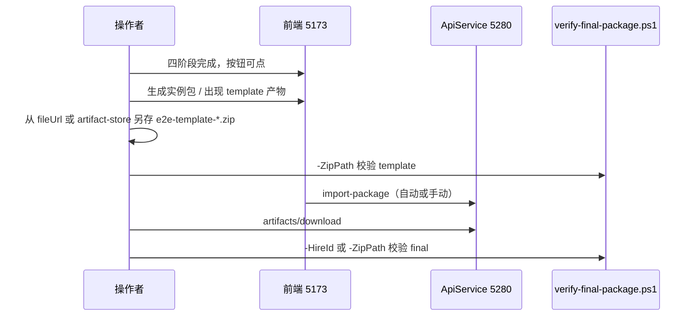

# 打包 testcase 扩展功能 E2E 验收操作手册

> 本文档根据 Agent 会话 [eef7b080](eef7b080-bb9c-4c33-85a7-fcc529de4a92) 与 [363cdbc7](363cdbc7-039a-4f12-aa87-89afa78cd536) 整理，用于在本机重复执行「访客全流程体验官」雇佣打包 E2E，验收 **沙箱 template_package** 与 **import 后 final 实包** 中的 packaging-test-cases **五件套 JSON**。
>
> 相关实现与契约：`扩展打包_testcase_输入` plan、[OUTPUT_CONTRACT.md](../back-end/src/HireBot.ApiService/Assets/DigitalEmployeeTemplates/employment-coach-conversation/skills/packaging-test-cases/references/OUTPUT_CONTRACT.md)、Skill `hirebot-final-package-e2e`。

---

## 1. 验收目标

| 顺序 | ZIP 类型 | 获取方式 |
|------|----------|----------|
| 1 | **沙箱 template_package** | 对话区产物 `template_package` / `visitor-experience-pilot-artifacts.zip` 的网关 `fileUrl`；**404 时**改从 artifact-store `packages/intermediate/package.zip` 复制 |
| 2 | **final 实包** | `GET /api/v1/hirings/{hireId}/artifacts/download`（须 import 完成） |

**通过标准（两份 ZIP 均需满足）：**

- `dotnet test --filter FullyQualifiedName~FinalPackageZipAcceptance` 全部 Passed
- 主文件 `testcases/evaluation-test-cases.json`：`source=packaging-merged`，`test_cases` 非空
- 五个 JSON 路径齐全（见下文 §8.1）
- **失败信号**：仅 `packaging-fallback` 且 `test_cases: []`；任一包缺 `testcases/`

**2026-05-29 实测参考（会话 363cdbc7）：**

| ZIP | 体积 | 结果 |
|-----|------|------|
| intermediate（template） | 14,415 B | 4/4 Passed |
| final 实包 | 50,340 B | 4/4 Passed |
| 主文件 | `packaging-merged`，6 条 `test_cases` | 通过 |

---

## 2. 固定测试素材

| 项 | 值 |
|----|-----|
| 模板名称 | 访客全流程体验官（Visitor Experience Pilot） |
| `templateId` | `019ddd2a-5143-73aa-8880-b8063164ed87` |
| 雇佣入口 URL | `http://localhost:5173/template-pool/hiring/019ddd2a-5143-73aa-8880-b8063164ed87` |
| 上传资料 | `%USERPROFILE%\Documents\1.ncrew\测试\访客预约与审核规则.md` |
| ZIP 输出目录 | `%USERPROFILE%\Documents\1.ncrew\测试` |

**说明：** 本 E2E 路径为 .NET + PowerShell，**不需要** Python 虚拟环境；若其他脚本需 Python，再按 `python-venv-bootstrap` 初始化 `.venv`。

---

## 3. 前置服务（Phase 0）

### 3.1 会话 UTF-8（PowerShell，每次新开终端先执行）

```powershell
[Console]::InputEncoding  = [System.Text.UTF8Encoding]::new($false)
[Console]::OutputEncoding = [System.Text.UTF8Encoding]::new($false)
$OutputEncoding = [System.Text.UTF8Encoding]::new($false)
$env:DOTNET_CLI_UI_LANGUAGE = 'zh-Hans'
Set-Location 'c:\Users\wayye\Documents\ai4c_Projects\hirebot'
```

### 3.2 启动/检查服务

| 端口 | 服务 | Skill / 说明 |
|------|------|----------------|
| 8090 | OpenSandbox | `hirebot-opensandbox-mcp` → `restart-sandbox.ps1`（网关须为 `127.0.0.1`） |
| 5280 | ApiService | 同上或 `hirebot-dev-start` |
| 5173 | Vite 前端 | `hirebot-dev-start` |

**冒烟检查：**

```powershell
@(
  'http://localhost:8090/health',
  'http://localhost:5280/swagger/index.html',
  'http://localhost:5173/',
  'http://localhost:5280/mcp'
) | ForEach-Object {
  try {
    $r = Invoke-WebRequest -UseBasicParsing -Uri $_ -TimeoutSec 5
    "$($r.StatusCode) $_"
  } catch {
    if ($_.Exception.Response) { "$([int]$_.Exception.Response.StatusCode) $_" }
    else { "ERR $_" }
  }
}
```

期望：`8090/5280/5173` 为 200；`5280/mcp` 为 **405**（表示 MCP 端点存在）。

### 3.3 单元测试门禁（可选但推荐）

```powershell
dotnet test "back-end\tests\HireBot.Core.Tests\HireBot.Core.Tests.csproj" `
  --filter "FullyQualifiedName~PackagingTestCase" `
  -p:BuildProjectReferences=false
```

若 ApiService 占用 DLL 导致 build 失败：先重启 5280，或验收脚本加 `-SkipPreflight`（须确认 5280 已是当前代码）。

---

## 4. 发起雇佣并记录 ID（Phase 1）

### 4.1 浏览器方式

1. 打开 `http://localhost:5173`，登录 Keycloak。
2. 进入模板池 → **访客全流程体验官**，或直达上文雇佣 URL。
3. 记录 **`hireId`**、**`sessionId`**（URL 或 DevTools 中 `/hire` 响应）。

### 4.2 浏览器 Console 快捷创建（已登录页）

```javascript
const tok = JSON.parse(localStorage.getItem('hirebot_oidc_token_set')).access_token;
const r = await fetch('/api/v1/employee-templates/019ddd2a-5143-73aa-8880-b8063164ed87/hire', {
  method: 'POST',
  headers: { Authorization: 'Bearer ' + tok, 'Content-Type': 'application/json' },
  body: '{}'
});
const j = await r.json();
console.log(j.data.hireId, j.data.sessionId);
```

### 4.3 本地记录文件（推荐）

将本次会话写入项目根 `.tmp-e2e-hire.json`，便于后续脚本替换变量：

```json
{
  "hireId": "hire-xxxxxxxx",
  "sessionId": "session-xxxxxxxx",
  "gatewayEndpoint": "127.0.0.1:56063/proxy/18789",
  "templateId": "019ddd2a-5143-73aa-8880-b8063164ed87"
}
```

`gatewayEndpoint` 来自 `GET /api/v1/hirings/{hireId}` 的 `data.gatewayEndpoint`。

**Token：** 从 `localStorage.hirebot_oidc_token_set` 取 `access_token`；过期需重新登录。

---

## 5. 四阶段推进（Phase 2，半自动）

依赖沙箱 LLM，**无法完全无人值守**。可用浏览器待办 + 对话，或用 API 发消息（单条超时建议 **600s**）。

**进度轮询（推荐）：**

```powershell
$h = @{ Authorization = "Bearer $token" }
$c = Invoke-RestMethod -Uri "http://localhost:5280/api/v1/hirings/$hireId/conversation/cache" -Headers $h
# 关注：stageOverrides、downstreamRuns.'skill-generation'
$c.data | ConvertTo-Json -Depth 6
```

### 5.1 上传资料（必做）

**API 上传（推荐，与待办面板等价）：**

```powershell
$hireId = 'hire-xxxxxxxx'
$sessionId = 'session-xxxxxxxx'
$token = '<access_token>'
$filePath = Join-Path $env:USERPROFILE 'Documents\1.ncrew\测试\访客预约与审核规则.md'

curl.exe -s -X POST "http://localhost:5280/api/v1/hirings/$hireId/material-files/upload" `
  -H "Authorization: Bearer $token" `
  -F "session_id=$sessionId" `
  -F "requested_category_title=访客预约与审核规则" `
  -F "files=@$filePath"

# 确认列表
Invoke-RestMethod -Uri "http://localhost:5280/api/v1/hirings/$hireId/material-files?session_id=$sessionId" `
  -Headers @{ Authorization = "Bearer $token" }
```

**资料阶段话术（首轮）：**

```text
已上传《访客预约与审核规则.md》，请从中抽取预约审核、实名核验与门禁发码规则。
另外两类资料我口头确认：门禁码动态刷新+08:00-18:00有效；接待按PACE框架推送。
请确认资料阶段完成并进入技能阶段。
```

**资料阶段追问（教练常问两点，须明确拍板）：**

```text
两点确认：1）实名核验采用到访时安保人证比对，不接入第三方实名接口；
2）门禁动态码按分钟刷新。资料阶段请收口并继续技能生成。
```

若教练追问技能边界（动态刷新 / 证件校验），需明确选项，例如：

```text
两题都选 A：access-code-dispatch 动态刷新选 A；visitor-booking-intake 证件校验选 A。
```

### 5.2 技能阶段话术

**首轮确认单技能：**

```text
确认优先仅生成1个技能：visitor-booking-intake（触发词「访客预约/提交预约」）。
其余技能先不生成、不落盘，完成后直接进入外部系统配置。
```

**技能生成卡住时（cache 显示 0/1 但沙箱已 write_file）：**

1. 查沙箱容器日志确认 `skills/*/SKILL.md` 是否已写入
2. 发送继续推进话术：

```text
技能文件已写入，请继续完成 skill-generation 并发出 done artifact，然后进入外部系统配置。
```

3. 若对话暂停，刷新页面后重试发消息

**其它技能被追问/要求补齐（单技能模式下的拍板，打包阶段也可能出现）：**

教练常见提示：

```text
本轮只生成一个技能，不生成其它技能（例如 reception-notify 等）。
按单技能模式收口：先进入外部系统配置并继续打包。
```

或：

```text
我这边收到多个技能定义，但本轮拍板只生成一个技能（visitor-booking-intake），其余技能先不落盘。
```

**标准回复（E2E 固定拍板，单技能收口）：**

```text
本轮仅生成一个技能：visitor-booking-intake。
其它技能先不生成/不落盘，不合并进其它流程，直接收口技能阶段；
实例包与 testcases 已生成，无需重复打包。
```

> **说明：** 即使 `skill-generation` 记录与 UI 展示存在滞后，只要最终 ZIP 五件套校验通过，本 E2E 以 ZIP 校验为准；技能补齐属于流程收口而非验收阻断项。

### 5.3 外部阶段（必须 completed）

**对话话术：**

```text
本模板不接任何外部系统，这一阶段直接跳过。
```

**必须同时做两件事：**

1. 在右侧待办 **「3 外部系统」** 卡片点击 **「跳过」**
2. 发送上述 skip 确认话术

前端「生成实例包」亮起条件：`material`、`skill`、`external` 在 WebSocket 状态里均为 **completed**（`HiringTodoPanel` 的 `canGenerate={allDone}`）。

**WebSocket 滞后：** 跳过话术已在对话生效、打包产物已出现，但右侧仍显示「等待」——以 `conversation/cache` 的 `stageOverrides` 与对话区 coach 回复为准，勿重复点跳过。

### 5.4 打包阶段

教练确认后回复：

```text
是，现在开始打包。请生成实例包。
```

**观察 ApiService 日志：** `[Hiring] Packaging testcase`、`packaging-test-cases` invoke、`Source=packaging-merged`（非 `packaging-fallback`）。

**对话区预期产物：**

- `visitor-experience-pilot-artifacts.zip`（约 40 KB）
- 五件套 JSON 文件列表（`evaluation-test-cases.json`、`testcases-sources-index.json` 等）
- `manifest.json`

**页面顶部异常（可忽略，不影响验收）：**

- 红色提示 **「工作流异常 下载文件失败（HTTP 404）」** — 网关 `fileUrl` 暂不可达，改用 §7.1 的 artifact-store 兜底下载 template 包

**import 状态：**

- final 包下载 **409** = import 尚未完成（正常，等待 process 结束）
- final 包下载 **200** = 可进入 Phase 4

### 5.5 API 发送对话消息模板

```powershell
$headers = @{ Authorization = "Bearer $token"; 'Content-Type' = 'application/json; charset=utf-8' }
$body = @{ content = '<话术内容>' } | ConvertTo-Json -Compress
$bytes = [System.Text.Encoding]::UTF8.GetBytes($body)
Invoke-RestMethod -Uri "http://localhost:5280/api/v1/hirings/$hireId/conversation/messages" `
  -Method Post -Headers $headers -Body $bytes -TimeoutSec 600
```

可选：先 `POST .../conversation/start`。

**504 / KingCrab 超时：** API 可能返回 504，但沙箱侧仍继续执行；勿立即重发相同话术，改查 `conversation/cache` 或沙箱 `docker logs` 后再决定是否补发。

### 5.6 流程卡点说明（来自实际 E2E）

| 现象 | 原因 | 处理 |
|------|------|------|
| 「生成实例包」灰色 | 外部阶段未 completed | 点「跳过」+ 发送 skip 确认话术 |
| 页面卡在「生成本体投影」/ process | 沙箱工具长耗时或 WS 未结束 | 等待 `typing_stop`；勿过早下载 ZIP |
| API 返回 `stage=material` 但已发打包话术 | 流程未真正推进到打包 | 继续完成外部/技能确认 |
| `ready_for_packaging` 但按钮仍灰 | 前端三阶段 WS 未齐 | 刷新页或补点「跳过」 |
| `skill-generation` 长期 0/3 | cache 未刷新 / KingCrab 超时 | 查沙箱日志；发「技能文件已写入…」推进话术 |
| 对话区 HTTP 404 下载失败 | 网关 fileUrl 失效 | 用 §7.1 artifact-store 兜底 |
| 教练在打包阶段追问 reception-notify | 技能 2/3 落盘，流程跨阶段回问 | 发送 §5.2 标准拍板话术 |
| 右侧「上传资料」仍显示待上传 3 | 仅上传 1 份文件 + 口头确认其余两类 | E2E 可接受；以 material-files API 与 ZIP 校验为准 |
| final download 409 | import 进行中 | 等待 process 结束后再下载 |

---

## 6. 正确验收顺序（重要）

**切勿在「生成实例包」仍灰色时下载 final 包。** `artifacts/download` 能返回 ZIP ≠ 雇佣流程已走完。



1. 右侧 **「4 生成实例包」** 可点击（或已显示已生成）。
2. 对话区出现 `template_package` / `visitor-experience-pilot-artifacts.zip` 后，**先**下载 template ZIP（网关或 artifact-store）。
3. **import 完成后** 再下载并校验 final ZIP。

---

## 7. 下载 ZIP（Phase 3）

### 7.1 Template 包（优先网关，404 则 artifact-store）

**方式 A：网关 fileUrl（对话时间线）**

从对话时间线或 `GET .../conversation/messages` 的 JSON 中提取 `fileUrl`：

```powershell
$gateway = 'http://127.0.0.1:56063/proxy/18789'   # 以 hiring 返回为准
$fileUrl = '/media/...'                             # 从 timeline 解析
$fullUrl = "$gateway$fileUrl"
$out = Join-Path $env:USERPROFILE "Documents\1.ncrew\测试\e2e-template-$hireId.zip"
Invoke-WebRequest -Uri $fullUrl -Headers @{ Authorization = "Bearer $token" } `
  -OutFile $out -UseBasicParsing
```

校验魔数：文件头两字节为 `PK`（0x50 0x4B），体积 > 1KB。

**方式 B：artifact-store 兜底（2026-05-29 E2E 实测有效）**

当页面出现 **HTTP 404 下载失败**，或 `GET /api/v1/hirings/{hireId}/artifacts/visitor-experience-pilot-artifacts.zip` 返回 404 时：

```powershell
$sessionId = 'session-xxxxxxxx'
$hireId = 'hire-xxxxxxxx'
$intermediate = Join-Path (Get-Location) `
  "back-end\src\HireBot.ApiService\ncrew-hire-data\artifact-store\sessions\$sessionId\packages\intermediate\package.zip"
$templateOut = Join-Path $env:USERPROFILE "Documents\1.ncrew\测试\e2e-template-$hireId.zip"

Copy-Item -LiteralPath $intermediate -Destination $templateOut -Force
(Get-Item -LiteralPath $templateOut).Length
```

> intermediate 包与沙箱 `visitor-experience-pilot-artifacts.zip` 等价，均可用于 template 侧五件套验收。

### 7.2 Final 包（import 之后）

```powershell
$finalZip = Join-Path $env:USERPROFILE "Documents\1.ncrew\测试\e2e-final-$hireId.zip"
Invoke-WebRequest -Uri "http://localhost:5280/api/v1/hirings/$hireId/artifacts/download" `
  -Headers @{ Authorization = "Bearer $token" } -OutFile $finalZip -UseBasicParsing
```

**状态码：**

| 码 | 含义 |
|----|------|
| 409 | import 尚未完成，继续等待 |
| 404 | hireId 错误或尚未产生 final 包 |
| 200 | 可校验 |

---

## 8. 五件套 JSON 自动校验（Phase 4）

统一使用脚本（对 **任意 ZIP** 通用，不限 final）：

```powershell
Set-Location 'c:\Users\wayye\Documents\ai4c_Projects\hirebot'

# Template 包
.\.cursor\skills\hirebot-final-package-e2e\scripts\verify-final-package.ps1 `
  -ZipPath 'C:\Users\wayye\Documents\1.ncrew\测试\e2e-template-hire-xxxxxxxx.zip' `
  -SessionId 'session-xxxxxxxx' `
  -SkipPreflight

# Final 包（已有 ZIP）
.\.cursor\skills\hirebot-final-package-e2e\scripts\verify-final-package.ps1 `
  -ZipPath 'C:\Users\wayye\Documents\1.ncrew\测试\e2e-final-hire-xxxxxxxx.zip' `
  -SessionId 'session-xxxxxxxx' `
  -SkipPreflight

# Final 包（API 下载 + 校验）
.\.cursor\skills\hirebot-final-package-e2e\scripts\verify-final-package.ps1 `
  -HireId 'hire-xxxxxxxx' `
  -AccessToken '<access_token>' `
  -SessionId 'session-xxxxxxxx' `
  -SkipPreflight
```

### 8.1 五个必需路径

| 路径 | 说明 |
|------|------|
| `testcases/evaluation-test-cases.json` | 合并主文件，`source=packaging-merged` |
| `ontology/hiring-session/testcases-sources-index.json` | 索引 |
| `ontology/hiring-session/testcases-sources/history-derived.json` | 对话历史衍生 |
| `ontology/hiring-session/testcases-sources/materials-derived.json` | 上传资料衍生 |
| `ontology/hiring-session/testcases-sources/template-derived.json` | 模板快照衍生 |

### 8.2 人工抽查（可选）

```powershell
$dest = Join-Path $env:USERPROFILE 'Documents\1.ncrew\测试\e2e-inspect-hire-xxxxxxxx'
Expand-Archive -LiteralPath $templateZip -DestinationPath $dest -Force
Get-Content (Join-Path $dest 'testcases\evaluation-test-cases.json') -Encoding utf8 | Select-Object -First 30
```

---

## 9. 失败排查

| 现象 | 动作 |
|------|------|
| 401 / 小体积 JSON | Token 过期，浏览器重新登录 |
| 404 download（final） | import 未完成或 hireId 错误 |
| 404 download（template 网关） | 改用 §7.1 方式 B artifact-store |
| 对话区「工作流异常 HTTP 404」 | 同上；不影响 final 包与五件套校验 |
| 504 conversation/messages | KingCrab 超时；查 cache / 沙箱日志，勿盲目重发 |
| 缺 5 JSON / packaging-fallback | 查 5280 日志 `[Hiring] Packaging testcase`；确认 ApiService 已重启 |
| materials-derived 为空 | 确认走过 `material-files/upload`，勿仅对话附件 |
| template 通过、final 失败 | import 竞态；重启 5280 后重新 import，见 [最终包缺少testcases目录原因分析.md](./最终包缺少testcases目录原因分析.md) |
| 沙箱 503 / MCP 不可达 | 重跑 `hirebot-opensandbox-mcp` |
| verify 脚本 build 失败 | `-SkipPreflight` + 先 `dotnet build` Core |
| reception-notify 仅 2/3 技能落盘 | 发 §5.2 拍板话术收口；以 ZIP 五件套校验为最终判定 |

---

## 10. 复用模块索引

| 用途 | 路径 |
|------|------|
| 打包编排 | `back-end/src/HireBot.Core/Services/Hiring/EmployeeHiringService.PackagingTestCases.cs` |
| ZIP 校验 | `back-end/tests/HireBot.Core.Tests/FinalPackageTestCasesZipVerifier.cs` |
| 验收脚本 | `.cursor/skills/hirebot-final-package-e2e/scripts/verify-final-package.ps1` |
| 沙箱重启 | `.cursor/skills/hirebot-opensandbox-mcp/SKILL.md` |
| 前后端重启 | `.cursor/skills/hirebot-dev-start/SKILL.md` |
| 资料上传 API | `POST /api/v1/hirings/{hireId}/material-files/upload` |
| intermediate 包 | `ncrew-hire-data/artifact-store/sessions/{sessionId}/packages/intermediate/package.zip` |
| final 包 | `ncrew-hire-data/artifact-store/sessions/{sessionId}/packages/final/package.zip` |
| 进度轮询 | `GET /api/v1/hirings/{hireId}/conversation/cache` |

---

## 11. 预估耗时

| 阶段 | 时间 |
|------|------|
| 环境 + 门禁 | 5–10 分钟 |
| 雇佣四阶段（LLM） | 20–45 分钟 |
| 双 ZIP 下载 + 校验 | 2–3 分钟 |
| **合计** | 约 30–60 分钟（人力主要在对话推进） |

---

## 12. Checklist（打印即用）

- [ ] UTF-8 + 8090 / 5280 / 5173 冒烟通过
- [ ] `PackagingTestCase` 单元测试通过（或已知跳过原因）
- [ ] 新建雇佣，记录 `hireId` / `sessionId` / `gatewayEndpoint` 到 `.tmp-e2e-hire.json`
- [ ] 上传 `访客预约与审核规则.md` 且 material-files 列表可见
- [ ] 资料追问两点确认已回复（实名核验 / 动态码）
- [ ] 三技能确认；若 reception-notify 缺失，已发独立技能拍板话术
- [ ] 外部阶段：话术 + 右侧「跳过」均已操作
- [ ] 「生成实例包」可点或已生成；五件套 JSON 出现在对话区
- [ ] 保存 `e2e-template-{hireId}.zip`（网关或 intermediate 兜底）且 `-ZipPath` 通过
- [ ] import 完成后保存 `e2e-final-{hireId}.zip` 且 final 校验通过
- [ ] 两份 ZIP 主文件均为 `packaging-merged`，`test_cases` 非空

---

*文档版本：基于 2026-05-29 会话 363cdbc7 整理；执行命令均为 Windows PowerShell。*
