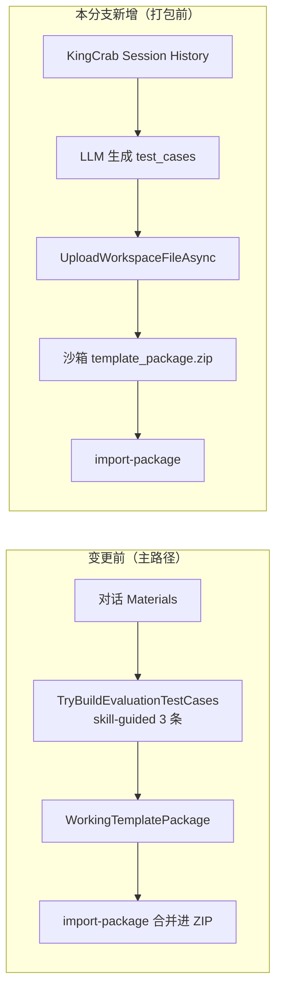
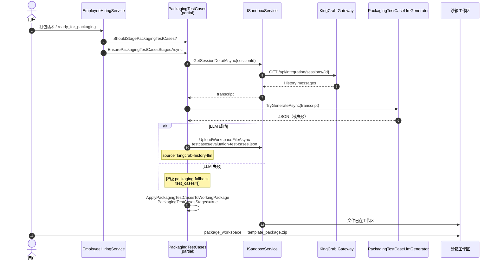
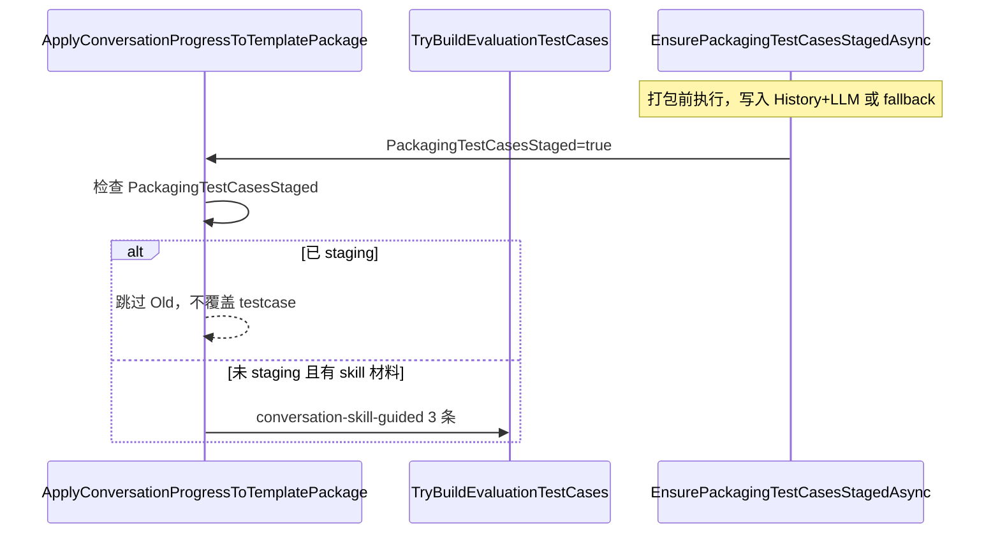
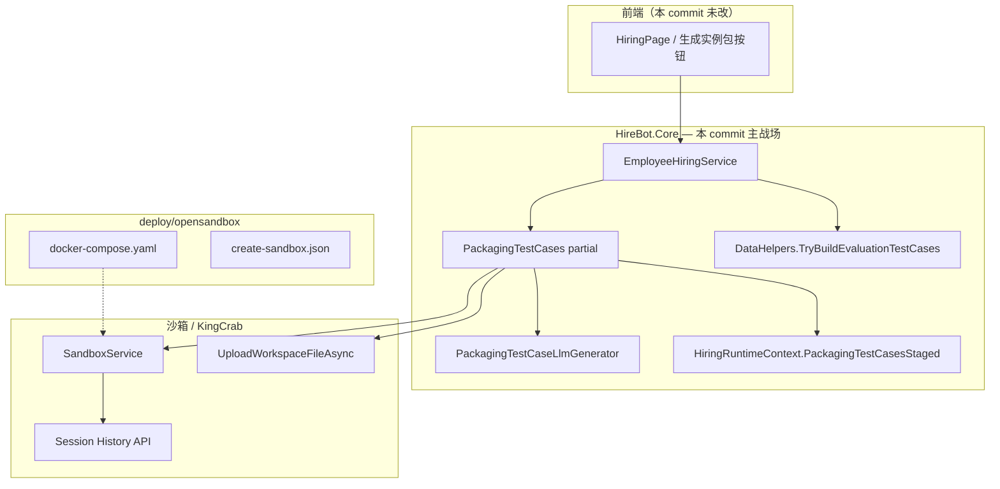
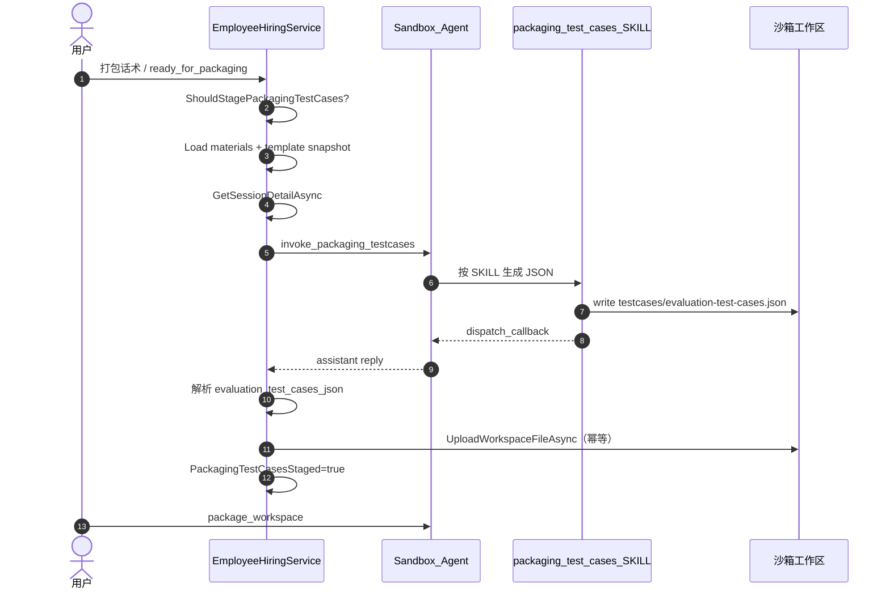

# 打包前测试用例分支变更分析

> 分析对象：提交 `e01e4cb5546896ca21a48aa9a446570b6389171f`（分支 `dev_testcase_assest`）  
> 参考对话：[f4be7d86 验收与 A+B 补强](f4be7d86-e2cd-4daf-a5f3-b3464573592c)（对照 [6a9a14e6 实施计划](6a9a14e6-f2e8-41ad-b14c-9fa82b8ffa70) 做功能验证）  
> 关联文档：[实例包ZIP内测试用例功能模块分析.md](./实例包ZIP内测试用例功能模块分析.md)、[生成实例包ZIP是否包含测试用例.md](./生成实例包ZIP是否包含测试用例.md)、[历史对话持久化接口功能模块.md](./历史对话持久化接口功能模块.md)

---

## 1. 变更规模总览

| 指标 | 数值 |
|------|------|
| 分析提交 | `e01e4cb`（`feat: 添加打包前测试用例管理功能`） |
| 父提交 | `458ba83`（`chore: 忽略本地 docs 与 .cursor 目录`） |
| **变更文件总数** | **17** |
| 修改（M） | **9** |
| 新增（A） | **8** |
| 代码行数 | +1484 / −6（单 commit 统计） |

> 说明：若将「分支 `dev_testcase_assest`」理解为从 `458ba83` 到 `e01e4cb` 的范围，则**仅此 1 个功能提交**；更早提交（如 `e46d789` 执行轨迹等）不属于本 commit 的 diff 范围。

---

## 2. 文件清单与变更原因

### 2.1 新增文件（8）

| # | 文件 | 行数（约） | 为何新增 |
|---|------|------------|----------|
| 1 | `EmployeeHiringService.PackagingTestCases.cs` | 238 | **核心**：打包前 testcase 编排（触发判断、History→LLM、沙箱上传、写入 `WorkingTemplatePackage`） |
| 2 | `IPackagingTestCaseLlmGenerator.cs` | 18 | LLM 生成器抽象，便于 DI 与单测 Mock |
| 3 | `PackagingTestCaseLlmGenerator.cs` | 375 | 读取 `OpenSandbox:KingCrab:Llm*`，调用 OpenAI 兼容接口，产出 `live_evaluator` 结构 JSON |
| 4 | `PackagingTestCasesTests.cs` | 180 | 静态 helper / 触发条件 / 占位 JSON / 防覆盖 等单元测试 |
| 5 | `PackagingTestCaseLlmGeneratorTests.cs` | 187 | LLM 生成器校验、Prompt、JSON 元数据追加等单测 |
| 6 | `PackagingTestCasesFromHistoryTests.cs` | 391 | **集成测**：Mock `ISandboxService` + `IPackagingTestCaseLlmGenerator`，覆盖 History 成功/失败/staging 全路径 |
| 7 | `deploy/opensandbox/docker-compose.yaml` | 49 | 本地 OpenSandbox / KingCrab 联调环境（支撑 History API 与沙箱打包 E2E） |
| 8 | `deploy/opensandbox/create-sandbox.json` | 16 | 创建沙箱实例的请求模板，配合 compose 使用 |

### 2.2 修改文件（9）

| # | 文件 | 变更要点 | 为何修改 |
|---|------|----------|----------|
| 1 | `EmployeeHiringService.cs` | +7 | 注入 `IPackagingTestCaseLlmGenerator`；`SendConversationMessageAsync` 在发往沙箱前调用 `EnsurePackagingTestCasesStagedAsync` |
| 2 | `EmployeeHiringService.ConversationOrchestration.cs` | +6 | 进入 `ready_for_packaging` 时若未 staging，先确保 testcase 写入沙箱工作区 |
| 3 | `EmployeeHiringService.DataHelpers.cs` | +5 | `ApplyConversationProgressToTemplatePackage` 增加 `PackagingTestCasesStaged` 守卫，避免覆盖 History+LLM 产物 |
| 4 | `HiringRuntimeContext.cs` | +3 | 新增 `PackagingTestCasesStaged` 标记，贯穿内存态与持久化 |
| 5 | `PersistentHiringRuntimeStore.cs` | +7 | 序列化/反序列化 `PackagingTestCasesStaged` |
| 6 | `ServiceExtensions.cs` | +3 | 注册 `IPackagingTestCaseLlmGenerator` → `PackagingTestCaseLlmGenerator` |
| 7 | `employment-coach-conversation/SKILL.md` | +2 | 阶段 4 打包说明与 testcase 预置约定对齐 |
| 8 | `contracts/artifacts.json` | ±2 | artifact 契约补充打包前 testcase 相关描述 |
| 9 | `.gitignore` | +1 | 忽略本地/临时路径（与 `458ba83` 忽略 docs/.cursor 策略一致） |

---

## 3. 业务目标（本分支要解决什么）

在用户进入 **打包准备 / 生成实例包** 之前，将 **`testcases/evaluation-test-cases.json`** 预先写入沙箱工作区，使沙箱 `package_workspace` 打出的 `template_package.zip` **自带** 评估用例，而不是仅在 `import-package` 合并阶段才由后端补入。

---

## 4. 时序图（Mermaid）

### 4.1 打包前 testcase 主流程

### 4.2 与旧路径的共存关系

---

## 5. 功能模块复用分析（/functions-detation）

**结论：本分支以「扩展既有雇佣 / 沙箱模块」为主，仅新增 LLM 生成器与 OpenSandbox 部署描述；不建议再平行造一套 testcase 管线。**

### 5.1 已复用的既有模块

| 既有模块 | 复用方式 | 代码位置 |
|----------|----------|----------|
| **雇佣服务 partial 拆分** | 新 partial `EmployeeHiringService.PackagingTestCases.cs`，与 `DataHelpers`、`ConversationOrchestration` 等同模式 | `HireBot.Core/Services/Hiring/` |
| **KingCrab 会话历史** | 复用 `ISandboxService.GetSessionDetailAsync` → `GET /api/integration/sessions/{id}` | `SandboxService.cs`（已有） |
| **沙箱工作区上传** | 复用 `UploadWorkspaceFileAsync` 写入 `testcases/` | 与资料上传同一沙箱 API |
| **包文件合并工具** | 复用 `UpsertPackageFile`、双路径写入（`testcases/` + `ontology/hiring-session/`） | `EmployeeHiringService.DataHelpers` |
| **运行时上下文** | 扩展 `HiringRuntimeContext` + `PersistentHiringRuntimeStore` | 与现有 hire 状态持久化一致 |
| **OpenSandbox LLM 配置** | 读取已有 `OpenSandbox:KingCrab:LlmModel/LlmEndpoint/LlmApiKey` | `appsettings.*` |
| **评估 JSON 形态** | Prompt / 校验对齐 `live_evaluator/test_cases/customer_service_demo.json` | `evaluation-expert` 模板资产 |
| **DI 注册** | `ServiceExtensions.AddHireBotCore` 中 `AddSingleton` | 与项目其他 Hiring 服务一致 |
| **单测基础设施** | `PackagingTestCasesFromHistoryTests` 参考 `InstanceRuntimeConversationServiceTests` 的 Fake 模式 | `HireBot.Core.Tests` |

### 5.2 保留但未删除的旧路径（互补，非重复实现）

| 模块 | 行为 | 与本分支关系 |
|------|------|----------------|
| `TryBuildEvaluationTestCases` | 基于 `Materials` 中 `Type=skill` 生成 3 条 `eval-case-00x`，`source=conversation-skill-guided` | **仍保留**；当 `PackagingTestCasesStaged=false` 时在对话进度中写入 |
| 沙箱 `package_workspace` 白名单 | 不直接生成 testcase | 依赖本分支 **预先 Upload** 进工作区 |
| `ImportPackageAsync` 三层合并 | 最终落库 | 消费已含 testcase 的 zip 或 WorkingPackage |

### 5.3 不宜再重复建设的能力

| 若新建… | 问题 | 建议 |
|---------|------|------|
| 第二套 History HTTP 客户端 | 与 `SandboxService` / `IKingCrabHttpClient` 重复 | 继续走 `GetSessionDetailAsync` |
| 独立 testcase 文件服务 | 与 `UpsertPackageFile` + artifact 存储重叠 | 维持 Hiring 域内 partial |
| 前端专用 testcase 编辑器 | 本需求为打包前自动生成 | 非本分支范围；评估页另议 |

### 5.4 参考对话中的验收结论（f4be7d86）

| 项 | 状态 |
|----|------|
| 计划内单元测试（13 项） | ✅ 已通过 |
| 新增集成测试（6 项，`PackagingTestCasesFromHistoryTests`） | ✅ 合计 **19/19** |
| 文档 §2.2 与 §1 矛盾 | ✅ 已在 `生成实例包ZIP是否包含测试用例.md` 修正 |
| E2E（真实 template_package.zip 含 testcase） | ⚠️ 需本地走雇佣打包流程 + 重启 ApiService 后人工验证 |

---

## 6. 模块归属图

---

## 7. 按目录归纳「为何动这些文件」

| 目录/域 | 文件数 | 目的 |
|---------|--------|------|
| `HireBot.Core/Services/Hiring/` | 10 | 实现打包前 testcase staging 全链路 |
| `HireBot.Core.Tests/` | 3 | 回归与集成保障 |
| `HireBot.ApiService/Assets/.../employment-coach-conversation/` | 2 | 与教练阶段 4 打包语义对齐 |
| `deploy/opensandbox/` | 2 | 本地沙箱联调 |
| `.gitignore` | 1 | 仓库卫生 |

---

## 8. 后续建议（需你确认时再做）

以下项来自参考对话，**未包含在本 commit 的 17 个文件中**，若需要可单独排期：

1. **E2E**：完整雇佣流 → 解压 `template_package.zip` 验证 `source: kingcrab-history-llm`
2. **加强校验**：`TryValidateTestCasesJson` 与 Prompt 对齐（如 `expected_behavior_sequence` 至少 2 步）
3. **Prompt 与 LLM 配置**：确认 `appsettings.Development.local.json` 中 `Llm*` 可达

---

## 9. 相关文档索引

| 文档 | 内容 |
|------|------|
| [生成实例包按钮功能模块分析.md](./生成实例包按钮功能模块分析.md) | 「生成实例包」按钮与触发打包 |
| [实例包ZIP内测试用例功能模块分析.md](./实例包ZIP内测试用例功能模块分析.md) | ZIP 内 testcase 来源（含 §2.5 本功能） |
| [生成实例包ZIP是否包含测试用例.md](./生成实例包ZIP是否包含测试用例.md) | 网关 zip vs 合并后 zip 差异 |
| [历史对话持久化接口功能模块.md](./历史对话持久化接口功能模块.md) | KingCrab History API |

---

## 10. Skill 化架构（packaging-test-cases）

> 2026-05 重构：将 C# 直连 LLM（`PackagingTestCaseLlmGenerator`）迁移为雇佣模板内项目 Skill **`packaging-test-cases`**；后端保留自动触发与 `PackagingTestCasesStaged` 守卫。

### 10.1 模块归属

| 组件 | 路径 | 职责 |
|------|------|------|
| **项目 Skill** | `employment-coach-conversation/skills/packaging-test-cases/` | 根据 History + 上传资料 + 模板快照生成 JSON，写入 `testcases/` 与 `ontology/hiring-session/testcases-sources/`，返回 `dispatch_callback` |
| **资料 Loader** | `PackagingTestCaseMaterialLoader.cs` | 从 `hiring_material_files` 读取待办上传 `.md/.json` 正文 |
| **模板快照** | `PackagingTestCaseTemplateSnapshotBuilder.cs` | 从 `WorkingTemplatePackage.PackageFiles` 提取 manifest/skills/ontology/config 文本 |
| **后端编排** | `EmployeeHiringService.PackagingTestCases.cs` | 三源组装 payload → invoke Skill → 解析 bundle → 上传 5 个 JSON + `WorkingTemplatePackage` |
| **JSON 校验** | `PackagingTestCasesJsonValidator.cs` | 转录过滤、merged/index/derived 校验、从 `technical_artifact` 提取 bundle |
| **旧路径（保留）** | `DataHelpers.TryBuildEvaluationTestCases` | `conversation-skill-guided`，仅当 `PackagingTestCasesStaged=false` |

### 10.2 输出（merged_index）

| 文件 | 说明 |
|------|------|
| `testcases/evaluation-test-cases.json` | 合并主文件，`source: packaging-merged` |
| `ontology/hiring-session/testcases-sources-index.json` | 来源索引 |
| `ontology/hiring-session/testcases-sources/history-derived.json` | 仅历史 |
| `ontology/hiring-session/testcases-sources/materials-derived.json` | 仅上传资料 |
| `ontology/hiring-session/testcases-sources/template-derived.json` | 仅模板快照 |

### 10.3 时序（Skill 化后）

### 10.3 已移除

- `PackagingTestCaseLlmGenerator.cs` / `IPackagingTestCaseLlmGenerator.cs`
- `ServiceExtensions` 中对应 DI 注册

---

*文档基于 `git show e01e4cb` 与仓库当前代码静态分析生成；§10 反映 Skill 化重构后架构。*
