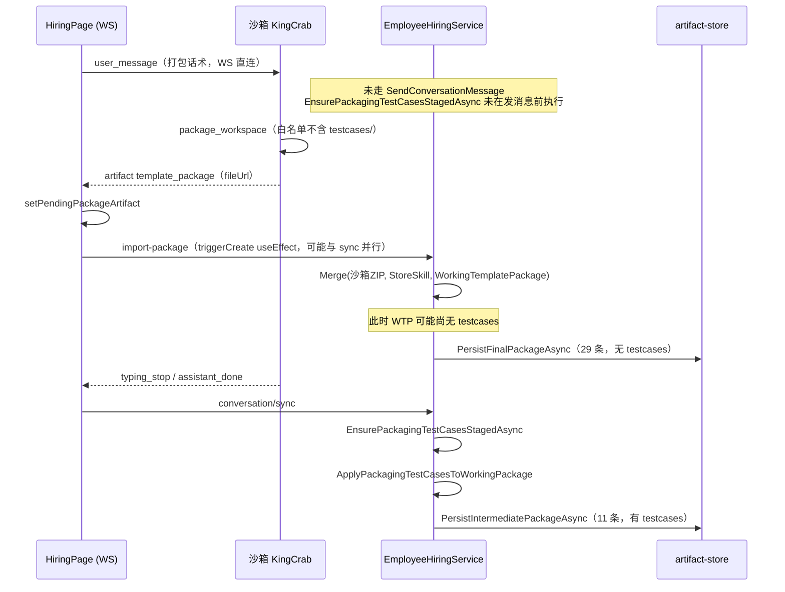

# 最终包缺少 testcases/ 目录原因分析

> **话题**：E2E 雇佣会话（访客全流程体验官）完成后，用户从系统下载的最终实例包 ZIP 中缺少 `testcases/` 目录。  
> **会话**：`hire-be7ba40c1dcc47489086eaa3a1e282fd` / `session-ac6348a178184eb1bcbfc4971c25c79b`  
> **依据**：本地 artifact-store 实包对比 + 前后端代码静态分析 + [d500a5ca 对话 E2E 验收记录](d500a5ca-5223-434f-a5ba-5c53638df7c8)

**相关文档**

| 文档 | 说明 |
|------|------|
| [生成实例包ZIP是否包含测试用例.md](./生成实例包ZIP是否包含测试用例.md) | 沙箱原包 vs import 后最终包 |
| [实例包ZIP内测试用例功能模块分析.md](./实例包ZIP内测试用例功能模块分析.md) | 测试用例写入链路（旧 skill-guided 路径） |
| [打包前测试用例分支变更分析.md](./打包前测试用例分支变更分析.md) | packaging-test-cases Skill 新路径 |

---

## 1. 直接结论

**你下载的最终包缺少 `testcases/`，不是打包 Skill 完全没跑，而是「import 生成 final 包」与「testcase staging 写入 WorkingTemplatePackage」发生时序错位，导致合并时第三层补入失败。**

| 包类型 | 路径 | 条目数 | 含 testcases? |
|--------|------|--------|---------------|
| **中间包** | `.../packages/intermediate/package.zip` | 11 | **有** `testcases/evaluation-test-cases.json` |
| **最终包**（用户下载对象） | `.../packages/final/package.zip` | 29 | **无** |
| **实例制品** | `instances/department/e_1779939097441_3ffb9d74/...` | — | **无** testcase 相关文件 |

一句话：**testcase 已在中间包阶段写入后端内存/持久化中间态，但 `import-package` 落库 final 包时，合并用的 `WorkingTemplatePackage` 尚未带上 testcases，且沙箱原 ZIP 本身也不含 testcases。**

---

## 2. 运行时证据（本地 artifact-store）

### 2.1 intermediate 有、final 无

PowerShell 实查 `session-ac6348a178184eb1bcbfc4971c25c79b`：

**intermediate/package.zip（11 条）**

```
config/AGENTS.md
config/IDENTITY.md
config/MEMORY.md
config/SOUL.md
manifest.json
ontology/hiring-session/evaluation-test-cases.json   ← 有
ontology/hiring-session/materials.json
ontology/hiring-session/structured-data.json
ontology/ontology-slice.md
skills/README.md
testcases/evaluation-test-cases.json                 ← 有
```

**final/package.zip（29 条）**

- 含完整 3 个 visitor-* 技能目录、ontology projections 等（来自沙箱 `package_workspace` 产物）
- **无任何** `testcases/` 或 `evaluation-test-cases` 路径

SHA256（实跑）：

- final: `ca68aaab5842709056b277386b092d95432308a6d7e655149ddfdbb61d307210`
- intermediate: `b19578d64394b6de9ad81ccf323eb45be5b2fa02d42101c8f18416a273457e9a`

### 2.2 与用户下载入口的对应关系

| 下载方式 | 实际文件 | 是否应有 testcases |
|----------|----------|-------------------|
| 右侧「生成实例包」成功后系统下载 | `BuildFinalPackageDownloadAsync` → **final** | 应有，本次缺失 |
| 对话区点击沙箱 `template_package` 网关链接 | 沙箱原 ZIP | 通常无（除非 staging 已上传到 workspace 且被打进包） |
| 直接读 artifact-store intermediate | intermediate | 本次**有** |

---

## 3. 根因链路（代码 + 时序）

### 3.1 两条写入路径不同步



### 3.2 假设验证

| ID | 假设 | 结论 | 证据 |
|----|------|------|------|
| H1 | 沙箱原 ZIP 不含 testcases | **CONFIRMED** | final 29 条结构与沙箱技能/ontology 一致，无 testcases |
| H2 | import 合并时 WTP 未含 testcases | **CONFIRMED** | final 无 testcases；`MergeTemplatePackageArtifacts` 第三层 `TryAdd` 未能补入 |
| H3 | testcase staging 完全失败 | **REJECTED** | intermediate 明确含 `testcases/evaluation-test-cases.json` |
| H4 | import 早于 sync/staging | **CONFIRMED（高置信）** | intermediate 在 staging 后写入；final 在 import 时写入且内容更像沙箱产物 |
| H5 | WS 路径跳过发消息前 staging | **CONFIRMED** | `submitWorkflowMessage` WS 分支不调用 REST `SendConversationMessage`；后者才有 `ShouldStagePackagingTestCases` 前置 staging |

### 3.3 关键代码位置

**（1）WS 直连不发 REST，跳过了发消息前 staging**

`front-end/.../HiringPage.tsx` — `submitWorkflowMessage` 在 WS 连通时只 `ws.send(user_message)`，不调用后端 `SendConversationMessage`。

后端仅在 REST 发消息路径执行前置 staging：

```812:816:back-end/src/HireBot.Core/Services/Hiring/EmployeeHiringService.cs
if (ShouldStagePackagingTestCases(runtimeContext, request.Content))
{
    runtimeContext = await EnsurePackagingTestCasesStagedAsync(runtimeContext, cancellationToken);
    hiringRuntimeStore.Upsert(runtimeContext);
}
```

**（2）staging 仅在 sync 回合处理中触发**

`ProcessConversationTurnAsync` 在 `ReadyForPackaging && !PackagingTestCasesStaged` 时调用 `EnsurePackagingTestCasesStagedAsync`，而 sync 由 `typing_stop` 触发，**晚于** 同轮内可能已到达的 `template_package` artifact。

**（3）收到 template_package 后立即 import，未等待 sync**

```533:541:front-end/src/features/hiring/pages/HiringPage.tsx
useEffect(() => {
  if (!pendingPackageArtifact || !workflowHireId || instanceCreated) return
  if (hasPendingDownstreamRuns(downstreamRunsRef.current)) return
  void triggerCreate(pendingPackageArtifact)
}, [pendingPackageArtifact, workflowHireId, instanceCreated, downstreamRuns])
```

`syncConversationTurn` 与 `triggerCreate` 均为 fire-and-forget，**无 happens-before 保证**。

**（4）import 合并不会重新 staging**

`ImportPackageAsync` 直接 `MergeTemplatePackageArtifacts(extractedArtifacts, storeSkillArtifacts, WorkingTemplatePackage)`，**不调用** `EnsurePackagingTestCasesStagedAsync` 或 `ApplyConversationProgressToTemplatePackage`。

合并优先级：沙箱 ZIP（最高）> Store Skill > WorkingTemplatePackage（`TryAdd` 最低）。

```749:788:back-end/src/HireBot.Core/Services/Hiring/EmployeeHiringService.DataHelpers.cs
// 沙箱已有则尊重沙箱，否则补上 store skill / WTP 文件
mergedArtifacts.TryAdd(normalizedPath, pair.Value);
```

**（5）PackagingTestCasesStaged=true 时跳过旧 skill-guided 补写**

`ApplyConversationProgressToTemplatePackage` 在 `PackagingTestCasesStaged` 为 true 时不再走 `TryBuildEvaluationTestCases`，依赖 staging 已写入 WTP——若 import 早于 staging，则两层兜底均失效。

---

## 4. 与参考文档的差异说明

[生成实例包ZIP是否包含测试用例.md](./生成实例包ZIP是否包含测试用例.md) 描述的理想路径：

1. 打包前 `EnsurePackagingTestCasesStagedAsync` 上传 testcases 到沙箱 workspace  
2. import 后 final 包保留或从 WTP 补入  

本次 E2E **实际走 WS 直连**，且 **import 与 sync 竞态**，导致：

- 沙箱 ZIP：无 testcases（workspace 未先 staging 或 staging 晚于 package_workspace）
- import 时 WTP：无 testcases
- sync 后 intermediate：有 testcases（但 final 已落库，不会回溯更新）

---

## 5. 修复方向（待确认后实施）

以下方案可组合，按侵入性从低到高：

| 方案 | 思路 | 优点 |
|------|------|------|
| **A. 前端顺序约束** | `triggerCreate` 前 `await syncConversationTurn`（或等待 staging 完成标记） | 改动小，直击竞态 |
| **B. 后端 import 兜底** | `ImportPackageAsync` 合并前若缺 testcases，调用 `EnsurePackagingTestCasesStagedAsync` 或从 intermediate 包补读 | 对 WS/REST 均有效 |
| **C. 发 WS 打包消息前 REST 预 staging** | 前端在发送打包话术前调专用 API 触发 staging | 保证沙箱 ZIP 也可能含 testcases |
| **D. final 合并时读 intermediate** | 若 WTP 无 testcases 但 intermediate 有，合并 intermediate 条目 | 兼容已发生的竞态 |

**建议优先：B + A**（后端兜底 + 前端消除竞态），避免仅改前端仍留 REST/重试边界问题。

---

## 6. 自检命令

```powershell
[Console]::OutputEncoding = [System.Text.UTF8Encoding]::new($false)
Add-Type -AssemblyName System.IO.Compression.FileSystem

$session = 'session-ac6348a178184eb1bcbfc4971c25c79b'
$base = "c:\Users\wayye\Documents\ai4c_Projects\hirebot\back-end\src\HireBot.ApiService\ncrew-hire-data\artifact-store\sessions\$session\packages"

foreach ($kind in @('intermediate','final')) {
  Write-Output "=== $kind ==="
  [System.IO.Compression.ZipFile]::OpenRead("$base\$kind\package.zip").Entries |
    ForEach-Object { $_.FullName } |
    Where-Object { $_ -match 'testcase|evaluation-test' }
}
```

期望：intermediate 有 2 条匹配，final 无匹配（修复前应如此；修复后 final 也应有）。

---

## 7. 总结

1. **现象**：用户下载的 **final** 包缺 `testcases/`；同会话 **intermediate** 包有。  
2. **根因**：WS 雇佣路径下，**testcase staging 发生在 conversation/sync 之后**，而 **import-package 由 template_package artifact 触发且与 sync 并行**，合并时 `WorkingTemplatePackage` 尚无 testcases，沙箱 ZIP 亦无 testcases。  
3. **模块**：问题在 **前后端时序 + ImportPackageAsync 缺少兜底**，非 packaging-test-cases Skill 完全未执行。  
4. **下一步**：确认修复方案（建议 B+A）后实施，并用同会话 E2E 复验 final 包条目。

---

*文档说明：/md-only 对话总结；基于 2026-05-28 本地 artifact-store 实包与代码分析。*
