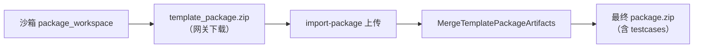

# 生成实例包 ZIP 是否包含测试用例

> **话题**：右侧待办面板 `FinalCard` 按钮「生成实例包」所触发的产物 ZIP 是否含有 testcase 文件。  
> **UI 定位**：`HiringTodoPanel` → `FinalCard` → `button.hb-todo-row-btn.is-primary`（`onGenerate` → `HiringPage.handleRequestPackaging` / `triggerCreate`）。  
> **结论依据**：仓库代码静态分析。

**相关文档**

| 文档 | 说明 |
|------|------|
| [生成实例包按钮功能模块分析.md](./生成实例包按钮功能模块分析.md) | 按钮全链路 |
| [实例包ZIP内测试用例功能模块分析.md](./实例包ZIP内测试用例功能模块分析.md) | test case 来源与写入步骤 |
| [实例包ZIP内测试用例调用堆栈.svg](./实例包ZIP内测试用例调用堆栈.svg) | 调用堆栈图 |

---

## 1. 直接回答

| 你查看的是哪一种 ZIP | 是否包含 testcase | 说明 |
|----------------------|-------------------|------|
| **沙箱刚打好的包**（`template_package`，网关 `fileUrl` 下载） | **应包含** | 打包前通过 KingCrab `GET /api/integration/sessions/{id}` 拉取 History，经 LLM 生成 `testcases/evaluation-test-cases.json`（`test_cases[]` 结构，`source: kingcrab-history-llm`）；失败时降级为 `packaging-fallback` 且 `test_cases: []` |
| **点击按钮后系统落库的最终包**（`import-package` 合并 + `PersistFinalPackageAsync`） | **在条件下包含** | 合并时从 `WorkingTemplatePackage` 补入 `testcases/evaluation-test-cases.json` |
| **对话区手动下载的同一 `fileUrl` 文件** | 与沙箱原包相同 | **通常不包含** testcase |

**一句话**：该按钮会先下载沙箱 ZIP 再调 `import-package`；**沙箱原包在打包前应含** 由 History+LLM 生成的 `testcases/evaluation-test-cases.json`（`test_cases` 数组）；**导入后最终包**若已 `PackagingTestCasesStaged` 则保留该文件，否则仍可由 skill-guided 逻辑补入旧格式用例。

---

## 2. 按钮与 ZIP 的对应关系

### 2.1 UI → 代码

```
用户点击「生成实例包」(FinalCard)
  → HiringPage.handleRequestPackaging()
  → （若无 pendingPackageArtifact）发打包话术 → 沙箱 package_workspace
  → WebSocket 收到 template_package（fileUrl）
  → HiringPage.triggerCreate()
      ① fetch(gateway fileUrl) 得到 Blob（沙箱 ZIP）
      ② api.hiringWorkflow.importPackage(hireId, packageBlob, ...)
      ③ 返回 finalizeResult.generatedFiles（合并后的路径列表）
      ④ setInstanceCreated(true)
```

关键代码：`front-end/src/features/hiring/pages/HiringPage.tsx` 中 `triggerCreate`（约 1549–1642 行）。

### 2.2 两种 ZIP 不要混看



- **网关下载对象**（沙箱 `template_package.zip`）：打包前若已执行 `EnsurePackagingTestCasesStagedAsync`，**应含** `testcases/evaluation-test-cases.json`（`source: kingcrab-history-llm` 或降级 `packaging-fallback`）。  
- **合并落库对象**（`import-package` 之后）：若 `PackagingTestCasesStaged == true`，保留上述文件；否则仍可能由 `WorkingTemplatePackage` 的 skill-guided 逻辑补入旧格式用例。

---

## 3. 何时最终包会带上 testcase

需同时满足：

1. 雇佣前序阶段已产生 **`Type = "skill"`** 的对话材料（技能阶段完成并有关联 skill）。  
2. 后端已执行 `ApplyConversationProgressToTemplatePackage` → `TryBuildEvaluationTestCases` 成功。  
3. 用户完成「生成实例包」且 **`import-package` 成功**。

典型文件：

- `testcases/evaluation-test-cases.json`（主路径）  
- `ontology/hiring-session/evaluation-test-cases.json`（同内容副本）  

JSON 特征：`"source": "conversation-skill-guided"`，`cases[].caseId` 为 `eval-case-001` ~ `eval-case-003`。

**不会**由本按钮沙箱打包写入的格式示例（评估夹具，非雇佣按钮链路）：

- `test_cases` + `test_case_id`（如 `DEFAULT-001`）→ 来自 `_defaults/testcases/` 等评估预热来源。

---

## 4. 如何自检

在 PowerShell 中查看 ZIP 条目（将路径换成你的文件）：

```powershell
[Console]::OutputEncoding = [System.Text.UTF8Encoding]::new($false)
Add-Type -AssemblyName System.IO.Compression.FileSystem
$zip = 'C:\path\to\your-package.zip'
[System.IO.Compression.ZipFile]::OpenRead($zip).Entries |
  ForEach-Object { $_.FullName } |
  Where-Object { $_ -match 'testcase|test.case|test_case' -or $_ -like 'testcases/*' }
```

导入成功后，若 API 返回的 `generatedFiles` 含 `testcases/evaluation-test-cases.json`，说明**系统认定的最终包**已包含测试用例。

---

## 5. 本次对话结论汇总

1. **按钮归属**：「生成实例包」属于雇佣模块第 4 步「打包准备」，实现于 `HiringTodoPanel.FinalCard`。  
2. **testcase 来源模块**：**雇佣后端** `EmployeeHiringService.DataHelpers`，非沙箱 AI 在 `package_workspace` 中写入。  
3. **进 ZIP 的步骤**：在 **`ImportPackageAsync` 三层合并**（沙箱 ZIP + Store Skill + `WorkingTemplatePackage`）时，由最低优先级层 `TryAdd` 补入。  
4. **对用户可见包**：沙箱下载 ZIP **应有** History+LLM 生成的 `testcases/evaluation-test-cases.json`（`source: kingcrab-history-llm`）；**import 后**若打包阶段已 staged，则不会被 `conversation-skill-guided` 覆盖。

---

*文档说明：/md-only 对话总结；若 ZIP 与上表不符，请对照文件名与 JSON 中 `source` 字段区分沙箱原包与 import 后最终包。*
