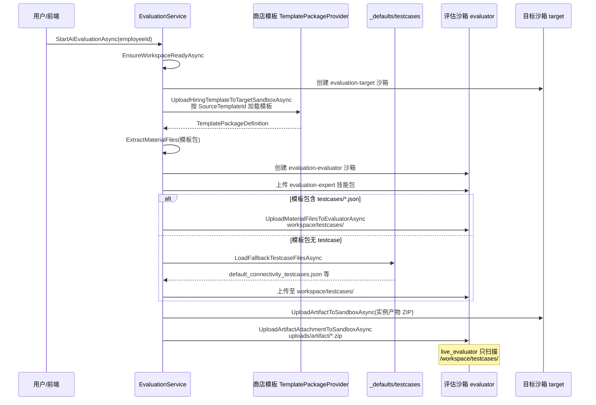

# 生成实例包后评估流程：兜底测试用例来源与合并关系

> 分析范围：雇佣 **finalize（导入实例包）完成之后**，用户发起 **AI 评估（`StartAiEvaluationAsync`）** 时，评估沙箱使用的 testcase 从哪里来、是否与 final ZIP 中的用例合并。  
> 代码基准：`back-end/src/HireBot.Core/Services/Evaluation/`、`back-end/src/HireBot.Core/Services/Hiring/EmployeeHiringService.PackagingTestCases.cs`。

---

## 1. 结论摘要

| 问题 | 结论 |
|------|------|
| **#1 评估兜底 testcase 从哪来？** | 当 **商店模板包**（`SourceTemplateId` → `templatePackageProvider.LoadAsync`）中 **没有** `testcases/` 下 JSON 时，从 **`DigitalEmployeeTemplates/_defaults/testcases/`** 读取，当前仓库内为 `default_connectivity_testcases.json`（基础连通性用例）。 |
| **#2 是否与 final ZIP 合并？** | **评估阶段：不合并。** 兜底是 **整包替换**（仅用默认连通性文件写入评估沙箱 `testcases/`），**不会**与实例 final 包里的 `testcases/evaluation-test-cases.json` 做 JSON 级合并。 |
| **与打包阶段的关系** | **打包/finalize 阶段** 另有 `packaging-fallback`（Skill 失败时的空 `test_cases`）及 `PackagingTestCasesJsonMerger`（写入 final ZIP 时与 staging 合并），属于 **雇佣链路**，与评估 `_defaults` 兜底 **不是同一套机制**。 |

---

## 2. 评估主流程（实例包生成之后）



入口：`EvaluationService.StartAiEvaluationAsync` → `EnsureWorkspaceReadyAsync`（`EvaluationService.WorkspaceManagement.cs`）。

---

## 3. 问题 #1：评估兜底 testcase 文件在哪里获取？

### 3.1 触发条件

在 `UploadMaterialFilesToEvaluatorAsync` 中：

1. 先从 **雇佣模板归档** 的 `MaterialFiles` 中筛出 `TargetDir == "testcases"` 的文件。
2. 这些 `MaterialFiles` 来自 `UploadHiringTemplateToTargetSandboxAsync` 对模板包执行的 `ExtractMaterialFiles`。
3. 模板包来源是员工的 **`SourceTemplateId`**，通过 `templatePackageProvider.LoadAsync(templateId)` 加载（**商店/资产目录中的模板定义**，不是 import 后的 final 实包内存展开结果）。

当 `testcaseFiles.Count == 0` 时打日志并调用兜底：

```890:902:back-end/src/HireBot.Core/Services/Evaluation/EvaluationService.WorkspaceManagement.cs
        // 目标模板没有内置测试用例时，回落到内置默认连通性测试文件
        if (testcaseFiles.Count == 0)
        {
            logger.LogWarning(
                "[Eval] No testcase files found in template, loading default fallback testcases sandboxId={SandboxId}",
                evaluatorSandboxId);
            var fallback = await LoadFallbackTestcaseFilesAsync(cancellationToken);
            // ...
            testcaseFiles = [.. fallback];
        }
```

### 3.2 兜底文件物理路径

`LoadFallbackTestcaseFilesAsync` 解析目录：

- `evaluationTemplatePackageRoot` = `.../DigitalEmployeeTemplates/evaluation-expert`
- `templatesRoot` = 其上一级 `.../DigitalEmployeeTemplates`
- **兜底目录** = `{templatesRoot}/_defaults/testcases/`
- 读取该目录下 **所有顶层 `*.json`**

仓库内当前文件：

`back-end/src/HireBot.ApiService/Assets/DigitalEmployeeTemplates/_defaults/testcases/default_connectivity_testcases.json`

内容为 `DEFAULT-001` / `DEFAULT-002` 等 **连通性探测** 场景（`test_cases` 数组），与雇佣打包生成的 `evaluation-test-cases.json` 形态兼容，但 **业务语义不同**。

```1008:1043:back-end/src/HireBot.Core/Services/Evaluation/EvaluationService.WorkspaceManagement.cs
    /// 当目标模板没有内置测试用例时，从 DigitalEmployeeTemplates/_defaults/testcases/ 目录
    /// 加载兜底连通性测试文件，确保评估流程不因材料缺失而中断。
    private async Task<IReadOnlyList<TemplateMaterialFile>> LoadFallbackTestcaseFilesAsync(
        CancellationToken cancellationToken)
    {
        var templatesRoot = Path.GetDirectoryName(evaluationTemplatePackageRoot);
        // ...
        var fallbackDir = Path.Combine(templatesRoot, "_defaults", "testcases");
        foreach (var filePath in Directory.EnumerateFiles(fallbackDir, "*.json", SearchOption.TopDirectoryOnly))
        {
            // ...
        }
    }
```

### 3.3 评估沙箱如何消费

上传目标目录：`evaluator` 沙箱 **`workspace/testcases/{fileName}`**（与 `live_evaluator/material_loader.py` 的 `discover_testcase_documents(workspace_root, "testcases")` 一致）。

**不会**从 `uploads/artifact/` 下解压的实例 ZIP 自动发现 testcase（见 §4.2）。

### 3.4 与「雇佣打包兜底 packaging-fallback」的区别

| 维度 | 评估兜底 `_defaults/testcases` | 雇佣 packaging-fallback |
|------|-------------------------------|-------------------------|
| 阶段 | AI 评估 `EnsureWorkspaceReady` | 打包前 `EnsurePackagingTestCasesStagedAsync` |
| 触发 | 商店模板无 `testcases/` | `packaging-test-cases` Skill 失败或输入为空 |
| 产物 | `default_connectivity_testcases.json` | 内存生成 JSON，`source=packaging-fallback`，`test_cases: []` |
| 代码 | `EvaluationService.WorkspaceManagement.cs` | `EmployeeHiringService.PackagingTestCases.cs` |

---

## 4. 问题 #2：兜底是否与 final ZIP 内测试用例合并？

### 4.1 评估阶段：**不合并**

评估侧 **没有** 调用 `PackagingTestCasesJsonMerger`，也 **没有** 从 final 实包 ZIP 提取 `testcases/evaluation-test-cases.json` 再与 `_defaults` 做 union。

逻辑是 **二选一**：

- 商店模板 `ExtractMaterialFiles` 有 testcase → 上传这些文件；
- 否则 → **仅** 上传 `_defaults/testcases/*.json`。

实例 final 包中的雇佣用例保存在：

- `artifactPackageService.PersistFinalPackageAsync`（按 **hireId** 存库）；
- `InstanceArtifactCloneService.StoreDepartmentArtifactsAsync`（按 **employeeId** 落盘到 artifact store）。

但评估准备材料时：

- **testcase 上传路径**：仅模板 `MaterialFiles` 或 `_defaults`（§3）；
- **实例 ZIP**：通过 `BuildArtifactBundleAsync` → `UploadArtifactAttachmentToSandboxAsync` 放到 **`uploads/artifact/`**，**不是** `workspace/testcases/`。

`live_evaluator` 只扫描 `workspace_root/testcases/`：

```92:94:back-end/src/HireBot.ApiService/Assets/DigitalEmployeeTemplates/evaluation-expert/skills/live_evaluator/material_loader.py
def discover_testcase_documents(*, workspace_root: str) -> list[MaterialDocument]:
    """发现测试用例文件。"""
    return _deduplicate_documents(_read_directory_documents(workspace_root, "testcases"))
```

因此：**final ZIP 里的 `testcases/evaluation-test-cases.json` 与评估兜底连通性用例在运行时通常是两条线**；除非商店模板本身已带 testcase，或后续人工/Skill 上传到 `testcases/`。

补充：`LoadTestcaseSourcesAsync`（`FetchTestcases` / `PrepareEvaluatorMaterialsArchiveAsync`）优先读 **缓存的模板 ZIP**（`UploadedTemplatePackageZipPath`，同样来自 `SourceTemplateId` 构建的归档），再回退 `templatePackageProvider` 定义，**仍不读** instance artifact 目录中的雇佣用例。

### 4.2 Finalize 阶段：**会合并**（雇佣链路，非评估兜底）

用户 import 实例包时，`EnrichMergedArtifactsWithPackagingTestCasesAsync` 将 **staging**（`WorkingTemplatePackage` / intermediate ZIP）中的 testcase **与 merged 产物里已有 JSON 合并** 后写入 final：

```402:424:back-end/src/HireBot.Core/Services/Hiring/EmployeeHiringService.PackagingTestCases.cs
    /// import 合并后将 staging（WTP / intermediate）中的 testcase 写入 final，并与 merged 已有兜底 JSON 合并。
    private async Task<Dictionary<string, byte[]>> EnrichMergedArtifactsWithPackagingTestCasesAsync(
```

合并器 `PackagingTestCasesJsonMerger.TryMergeEvaluationTestCasesJson`：

- **staged 优先**，按 `test_case_id` 去重；
- 可把 `packaging-fallback`（空数组）与 `packaging-merged`（有场景）合成同一 `test_cases` 列表；
- 输出 `source` / `merged_sources` 等元数据。

这是 **写入 final ZIP** 的行为，**不是** 评估 `_defaults` 与 ZIP 的合并。

---

## 5. 数据流对照表

| 数据 | 产生阶段 | 存储位置 | 评估 START 是否用于 `workspace/testcases/` |
|------|----------|----------|-------------------------------------------|
| `packaging-merged` 主文件 | 打包 Skill + finalize 合并 | final ZIP、`testcases/evaluation-test-cases.json` | **默认否**（未从实例包解压到 testcases 目录） |
| `packaging-fallback` 空结构 | Skill 失败 | 同上（合并前可能单独存在） | **默认否** |
| 商店模板自带 testcase | 模板发布 | TemplatePackages | **是**（若模板含 `testcases/`） |
| `_defaults` 连通性 | 评估准备 | 磁盘 `_defaults/testcases/` | **是**（仅当商店模板无 testcase 时） |
| 实例产物整包 ZIP | finalize | artifact store + `uploads/artifact/` | **否**（路径不在 material_loader 扫描范围） |

---

## 6. 相关 API / 状态机

- **发起评估**：`POST` 类员工评估 START → `EvaluationService.StartAiEvaluationAsync`
- **拉取用例**：`FetchTestcasesAsync` → `LoadTestcaseSourcesAsync`（模板 ZIP / 模板定义，见 §4.1）
- **沙箱内执行**：`evaluation-expert` → `live_evaluator` → `material_loader.py`

员工状态：实例包导入后一般为 `hired` / 创建后 `interning_ai`，START 后 `EvalPhase = ai_running`。

---

## 7. 风险与改进方向（供产品/研发确认）

以下为代码现状推导，**非已实现需求**：

1. **雇佣定制用例可能未进入 AI 评估**：final 实包已含 `packaging-merged` 用例，但评估仍可能只用 `_defaults` 连通性用例（当商店模板无 `testcases/`）。
2. **`BuildArtifactBundleAsync` 使用 `GetLatestPackageAsync(employee.EmployeeId)`**：该 API 按 **hireId** 查库，与 employeeId 不一致时可能拿不到 final 包，artifact 上传走 fixture 或失败（仅 warning）。
3. **若期望「评估必用实例包内 evaluation-test-cases.json」**：需在评估准备阶段从 instance artifact / final ZIP 提取并写入 `workspace/testcases/`，或与 `PackagingTestCasesJsonMerger` 类似做合并；当前 **未实现**。

---

## 8. 关键代码索引

| 主题 | 文件 |
|------|------|
| 评估工作区与兜底加载 | `EvaluationService.WorkspaceManagement.cs` |
| 评估 START | `EvaluationService.cs` → `StartAiEvaluationAsync` |
| testcase 源加载（Fetch） | `EvaluationService.SessionAndTestcases.cs` → `LoadTestcaseSourcesAsync` |
| 兜底连通性 JSON | `Assets/DigitalEmployeeTemplates/_defaults/testcases/default_connectivity_testcases.json` |
| 沙箱材料发现 | `evaluation-expert/skills/live_evaluator/material_loader.py` |
| 打包 staging / packaging-fallback | `EmployeeHiringService.PackagingTestCases.cs` |
| final 合并 | `PackagingTestCasesJsonMerger.cs` |
| final 持久化 | `EmployeeHiringService.cs` finalize + `HiringArtifactPackageService.cs` |

---

## 9. 文档修订

| 日期 | 说明 |
|------|------|
| 2026-05-29 | 初版：基于当前 `back-end` 主分支代码静态分析 |
