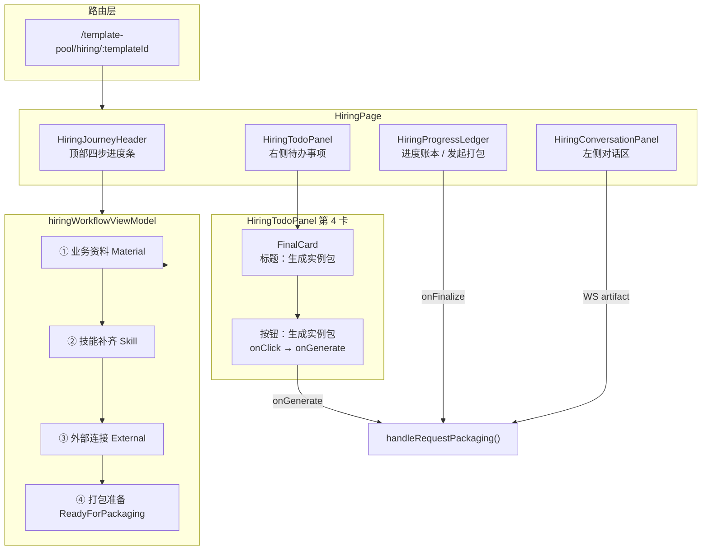
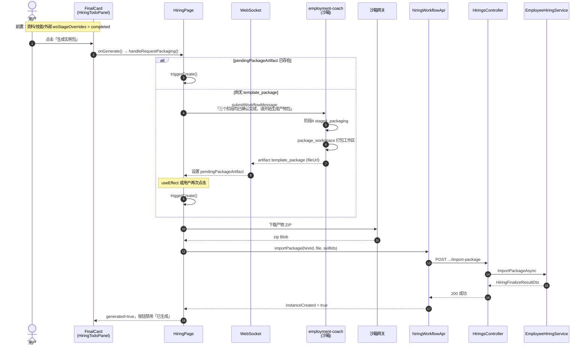
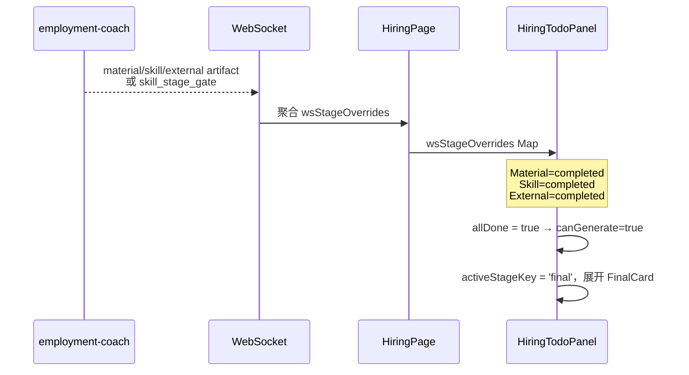
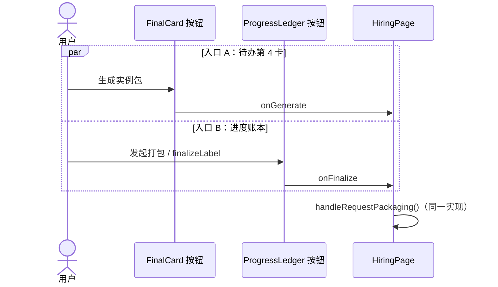
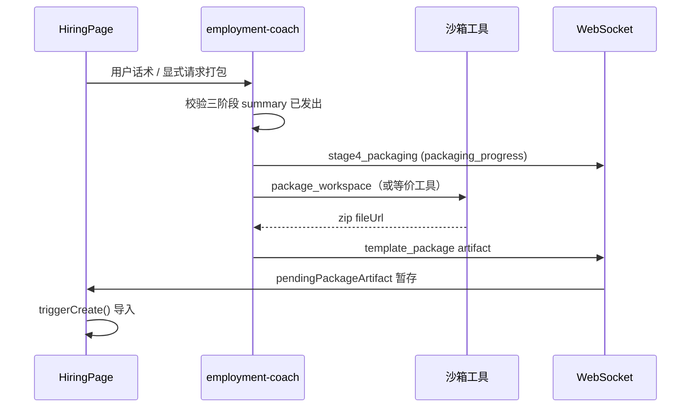
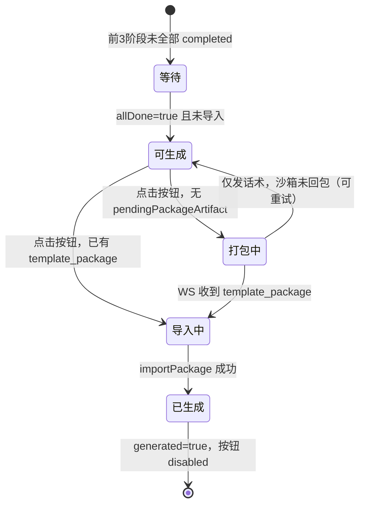

# 「生成实例包」按钮功能模块分析

> 依据雇佣配置页截图（右侧待办面板第 4 步红框按钮）与代码库对照整理。  
> 对应页面路由：`/template-pool/hiring/:templateId`（`HiringPage`）。

**配套图表**

| 文件 | 说明 |
|------|------|
| 本文档内 Mermaid 图 | 时序、组件关系、状态机 |
| [生成实例包按钮调用堆栈.svg](./生成实例包按钮调用堆栈.svg) | 调用堆栈层次图（SVG，可独立打开） |

---

## 1. 分析总结

### 1.1 核心结论

「生成实例包」按钮属于 **雇佣（Hiring）** 功能模块中 **第 4 阶段「打包准备」** 的主操作入口，不是独立子系统。其实现横跨 **前端 TODO 面板 UI**、**页面编排**、**雇佣教练 AI 沙箱打包** 与 **后端实例导入 API** 四层。

### 1.2 模块归属一览

| 维度 | 实现位置 |
|------|----------|
| 产品阶段 | 雇佣四步流第 4 步：`ReadyForPackaging`（展示名「打包准备」） |
| 前端功能包 | `front-end/src/features/hiring/` |
| 按钮组件 | `HiringTodoPanel` → `FinalCard` |
| 点击处理 | `HiringPage.handleRequestPackaging()` → `triggerCreate()` |
| 备用入口 | `HiringProgressLedger.onFinalize`（同一处理函数） |
| 顶部进度条 | `hiringWorkflowViewModel` → `STAGE_CONFIG[ReadyForPackaging]` |
| AI 打包 | `employment-coach-conversation` 阶段 4：`stage4_packaging` → `template_package` |
| 后端落库 | `HiringsController.ImportPackage` → `EmployeeHiringService.ImportPackageAsync` |

### 1.3 业务闭环（一句话）

前 3 阶段完成后用户点击按钮 → 若无沙箱产物则先让 AI 打包 → 收到 `template_package` 后从网关下载 ZIP → `import-package` 导入系统 → 按钮变为「已生成」并禁用。

### 1.4 启用条件

- `canGenerate = allDone`：资料 / 技能 / 外部三阶段在 `wsStageOverrides` 中均为 `completed`。
- `generated = instanceCreated`：导入成功后按钮禁用。

---

## 2. 与截图 UI 的对应关系

### 2.1 页面布局（组件关系图）



- **顶部第 4 步「打包准备」**：`HiringCollectionStage.ReadyForPackaging`。
- **右侧第 4 卡标题 / 按钮文案**：i18n `hiring.todo.final.title` / `generateBtn`（`zh.json`）。

---

## 3. 前端实现分层

### 3.1 按钮渲染（UI 层）

**文件**：`front-end/src/features/hiring/pages/components/HiringTodoPanel.tsx`

- 第 4 步 UI：`FinalCard`（注释：`// ── Final 卡片（生成实例包） ──`）。
- 按钮核心绑定：

```tsx
<button
  type="button"
  disabled={!canGenerate || generated}
  onClick={onGenerate}>
  {generated ? t('hiring.todo.final.generatedBtn') : t('hiring.todo.final.generateBtn')}
</button>
```

- **启用**：`canGenerate={allDone}`（前 3 阶段均为 `completed`）。
- **样式**：`hiring-todo.css` → `/* ④ 生成实例包 */`。

### 3.2 事件上行（页面层）

**文件**：`front-end/src/features/hiring/pages/HiringPage.tsx`

```tsx
<HiringTodoPanel
  onGenerate={() => { void handleRequestPackaging() }}
  generated={instanceCreated}
/>
```

| 函数 | 职责 |
|------|------|
| `handleRequestPackaging()` | 有 `pendingPackageArtifact` 则 `triggerCreate()`；否则发送打包话术 |
| `triggerCreate()` | 网关下载 ZIP → `importPackage` → `instanceCreated=true` |

### 3.3 并行入口

`HiringProgressLedger` 在 `actionState.canFinalize` 时展示「发起打包」，回调同一 `handleRequestPackaging()`。

### 3.4 国际化（`zh.json`）

| Key | 中文 |
|-----|------|
| `hiring.todo.final.title` | 生成实例包 |
| `hiring.todo.final.generateBtn` | 生成实例包 |
| `hiring.todo.final.hint` | 前序阶段完成后，将整合资料、技能与可选配置… |

---

## 4. 后端与 AI 侧

| 层级 | 组件 | 说明 |
|------|------|------|
| AI 技能 | `employment-coach-conversation/SKILL.md` | 阶段 4：调用 `package_workspace` 等工具 |
| Artifact | `stage4_packaging` / `template_package` | WS 推送，`contracts/artifacts.json` 定义 |
| API | `HiringsController.ImportPackage` | `POST /hirings/{hireId}/import-package` |
| 服务 | `EmployeeHiringService.ImportPackageAsync` | 解析 ZIP、合并 skill、创建实例 |

---

## 5. 时序图（Mermaid）

### 5.1 主流程：点击按钮到实例落库



### 5.2 前 3 阶段完成 → 按钮解锁



### 5.3 双入口汇聚（TODO 面板 vs 进度账本）



### 5.4 AI 沙箱打包子流程（阶段 4）



---

## 6. 按钮状态机



| 状态 | UI 表现 | 条件 |
|------|---------|------|
| 等待 | 徽章「等待」，`disabled` | `!allDone` |
| 可生成 | 主色按钮「生成实例包」 | `allDone && !instanceCreated` |
| 打包中 | 对话区 `stage4_packaging` 卡片 | 已发打包话术，等待 artifact |
| 导入中 | `triggerCreate` 执行中 | 正在下载 ZIP / 调 API |
| 已生成 | 「已生成」+ 可选「进入 AI 评估」 | `instanceCreated` |

---

## 7. 调用堆栈层次图（SVG）

自上而下调用关系见独立 SVG 文件（建议在浏览器或 IDE 中预览）：

**[生成实例包按钮调用堆栈.svg](./生成实例包按钮调用堆栈.svg)**

层次概览：

```
L0  用户点击
L1  HiringTodoPanel.FinalCard → onGenerate
L2  HiringPage.handleRequestPackaging
L3  分支：triggerCreate() | submitWorkflowMessage(打包话术)
L4  employment-coach 沙箱打包 → template_package
L4  HiringPage.triggerCreate → 网关下载 → hiringWorkflowApi.importPackage
L5  HiringsController.ImportPackage
L6  EmployeeHiringService.ImportPackageAsync
```

---

## 8. 模块目录速查

```
hirebot/
├── front-end/src/features/hiring/          ← 【主模块】雇佣功能
│   ├── pages/HiringPage.tsx
│   ├── pages/components/HiringTodoPanel.tsx    ← 【按钮】FinalCard
│   ├── pages/components/HiringProgressLedger.tsx
│   ├── pages/hiringWorkflowViewModel.ts
│   └── hiring-todo.css
├── front-end/src/infra/api/modules/hiringWorkflowApi.ts
└── back-end/
    ├── Controllers/HiringsController.cs
    ├── Services/Hiring/EmployeeHiringService.cs
    └── Assets/.../employment-coach-conversation/
```

---

## 9. 相关文档

- [hiring-evaluation-sandbox-flow.md](./hiring-evaluation-sandbox-flow.md) — 雇佣 / 沙箱全链路
- [02-1 雇佣端AI评估环节产品设计文档.md](./02-1%20雇佣端AI评估环节产品设计文档.md) — 生成后进入 AI 评估

---

*文档说明：基于仓库代码静态分析；Mermaid 图可在支持 Mermaid 的 Markdown 预览器中渲染；SVG 为独立矢量图。*
