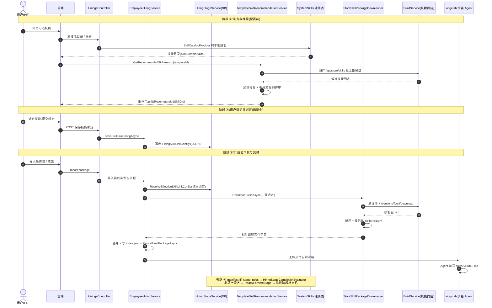

# 技能交付链功能模块分析

> 主题:hirebot 作为业务编排层,如何把"会被沙箱里 Agent(数字员工)加载执行的技能(skill)"管理、推荐、绑定并下发到 kingcrab 沙箱。
> 面向读者:中级开发工程师。代码标识符 / 文件名 / 第三方库名保留英文,其余中文。
> 配套图:[技能交付链分层调用堆栈.svg](技能交付链分层调用堆栈.svg)

---

## 0. 一句话结论

hirebot 里的 "skill" 本质就是一个 **`SKILL.md` 驱动的能力包**(目录结构 = `SKILL.md` 入口指令 + `manifest.json` 元数据 + 资产文件),和 Claude Code 的 skill 高度同构。hirebot **自己不执行 skill**,它只负责一条"交付链":**注册 → 浏览/推荐 → 绑定 → 下发 → 沙箱 Agent 加载**,同时用技能元数据里的 `stage_rules` 反向驱动雇佣流程的阶段状态机。

判定"什么算一个 skill"的代码只有一行——必须同时存在两个文件:

```csharp
// FileSystemSystemSkillRegistry.cs:185-189
private static bool IsSkillPackageDirectory(string directoryPath)
    => File.Exists(Path.Combine(directoryPath, "manifest.json")) &&
       File.Exists(Path.Combine(directoryPath, "SKILL.md"));
```

---

## 1. 功能模块清单(全项目总览)

| # | 功能模块 | 关键类 / 接口 | 编排位置 | 职责 |
|---|---------|--------------|---------|------|
| ① | 系统技能注册表 | `FileSystemSystemSkillRegistry`(实现 `ISystemSkillRegistry`) | 底座(贯穿) | 扫描本地 `Assets/DigitalEmployeeTemplates`,识别技能包 |
| ② | 技能目录浏览 | `ISkillCatalogProvider`、`SkillSummaryDto` / `SkillDetailDto` | 配置前 | 列表 / 搜索过滤 / 看详情,数据源=本地注册表 |
| ② | 模板技能推荐 | `TemplateSkillRecommendationService` | 配置前 | 按模板能力,从外部商店打分推荐 Top-N |
| ③ | 雇佣技能绑定 | `HiringSkillLinkConfigState`、`HiringSkillLinkConfigDto` | 编排中 | 记录"本次雇佣绑了哪些技能",落库 |
| ④ | 技能包下载下发 | `StoreSkillPackageDownloader`(实现 `IStoreSkillPackageDownloader`) | 编排末端(成包) | 从商店下载 zip,解压规范化 `skills/<slug>/`,合进交付包 |
| ⑤ | 交付执行 | `EmployeeHiringService` 成包 + Sandbox 上传 | 编排末端 | 交付包上传沙箱,Agent 加载 `SKILL.md` |
| ⑥ | 阶段-技能映射 | `SystemSkillStageRule`、`FileSystemDiscoveryRuleProvider`、`HiringStageCompletionEvaluator` | 状态机(旁路) | 技能 `stage_rules` 驱动"阶段能否推进" |

> 注:`FileSystemSystemSkillRegistry` 一个类**同时实现** `ISystemSkillRegistry`(编排内部用)和 `ISkillCatalogProvider`(前端浏览用),一份目录数据两副面孔。

---

## 2. 分层交付链说明(对应 SVG)

```
①注册底座        ②浏览/推荐         ③绑定           ④下发           ⑤交付
SystemSkills → Catalog/推荐算法 → SkillLinkConfig → StoreDownloader → 交付包 → 沙箱 Agent
(识别有哪些技能)  (帮用户挑技能)    (记下选了哪些)     (下载+解压+合并)  (打包上传) (加载 SKILL.md)
                                       ↑
                          ⑥ stage_rules 同时驱动阶段状态机推进
```

- **② 推荐**最有料:`TemplateSkillRecommendationService` 不是简单关键词匹配,而是把模板画像和技能画像分词(中文做 2-gram/3-gram),加权打分(标签命中 +12、`category` 命中 +10、短语命中 +5,叠加使用量与更新近度),排除模板已自带、过滤不可下载/已废弃,结果缓存 2 分钟。
- **④ 下发**是核心消费点:导入最终包时读回绑定 → `DownloadSkillsAsync` 下载并把 zip 规范化为 `skills/<slug>/...`(用户绑定的技能是权威来源,覆盖沙箱同名文件)→ 写 `linked-store-skills.index.json` → `PersistFinalPackageAsync` 打成交付包。
- **⑥ 旁路**易被忽略:技能 `manifest.json` 的 `stage_rules` 定义每个阶段的 `required_fields`,经 `FileSystemDiscoveryRuleProvider` 转出后喂给 `HiringStageCompletionEvaluator`,以"必填字段是否齐全"判定 `ReadyForNextStage`。**技能元数据反向约束了雇佣流程的验收标准。**
- **外部依赖**:推荐(②)与下发(④)共用外部 `BuildService`(ncrew-builder 技能商店),通过转发当前请求的 `Authorization` 头调用其 HTTP 接口。

---

## 3. 时序图(Mermaid)

一次完整的"浏览 → 推荐 → 绑定 → 下发 → 沙箱加载"时序:



---

## 4. 关键代码位置索引

| 关注点 | 文件:行 |
|--------|---------|
| 技能包识别(SKILL.md+manifest.json) | `FileSystemSystemSkillRegistry.cs:185-189` |
| 目录浏览 / 搜索过滤 | `FileSystemSystemSkillRegistry.cs:109-147` |
| 推荐入口 | `TemplateSkillRecommendationService.cs:101` |
| 推荐打分算法 | `TemplateSkillRecommendationService.cs:279` |
| 绑定 API(GET/POST) | `HiringsController.cs:97 / 113` |
| 绑定落库 | `HiringStageService.cs:172 / 197` |
| 成包时读回绑定 | `EmployeeHiringService.cs:1414-1442` |
| 生效绑定解析 | `EmployeeHiringService.cs:1799` |
| 构造下载请求 | `EmployeeHiringService.cs:1835` |
| 下载 + 解压 + 合并 | `StoreSkillPackageDownloader.cs:24 / 268-326` |
| `Authorization` 转发 | `StoreSkillPackageDownloader.cs:405-430` |
| stage_rules → 状态机 | `FileSystemDiscoveryRuleProvider.cs`、`HiringStageCompletionEvaluator.cs` |
| DI 注册(注册表 Singleton / 下载器 Scoped) | `ServiceExtensions.cs:168 / 228` |

---

## 5. 通俗讲解(给中级工程师)

- **把 skill 想成"App 安装包"**:`SKILL.md` 是说明书 + 入口,`manifest.json` 是 `AndroidManifest`,资产文件是 App 资源。hirebot 是"应用商店 + 装机流水线",沙箱里的 Agent 才是"运行 App 的手机"。
- **推荐像"猜你喜欢"**:拿模板画像和技能画像算相似度排序取前几个,只是把电商商品换成了能力包。
- **下发是装机最后一步**:把用户勾选的技能包下载下来,统一塞进 `skills/<slug>/` 目录,连同一份"装了哪些技能"的索引清单(`index.json`)一起打包交付。
- **stage_rules 是"验收清单"**:技能不仅是能力,它的元数据还顺手定义了"雇佣流程每一关要收齐哪些字段才能放行"。

> 一句话总结:hirebot 的技能交付链 = **SystemSkills(定义技能)→ Catalog/推荐(挑技能)→ SkillLinkConfig(绑技能)→ StoreDownloader(下发技能)→ 沙箱 Agent(加载 SKILL.md)**,外加 stage_rules 这条把技能元数据接到阶段状态机上的旁路。
