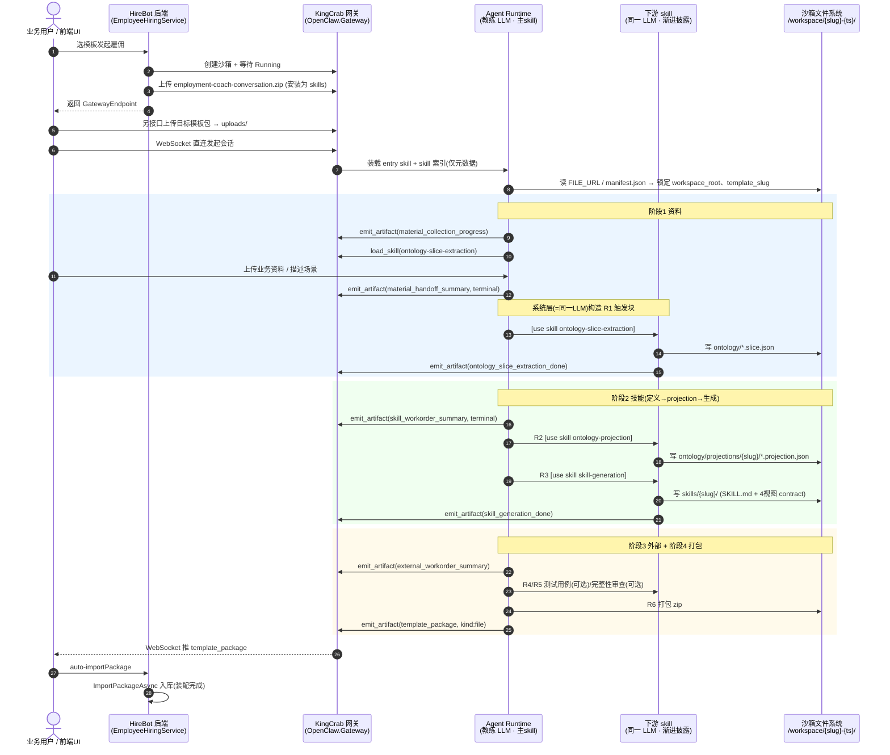
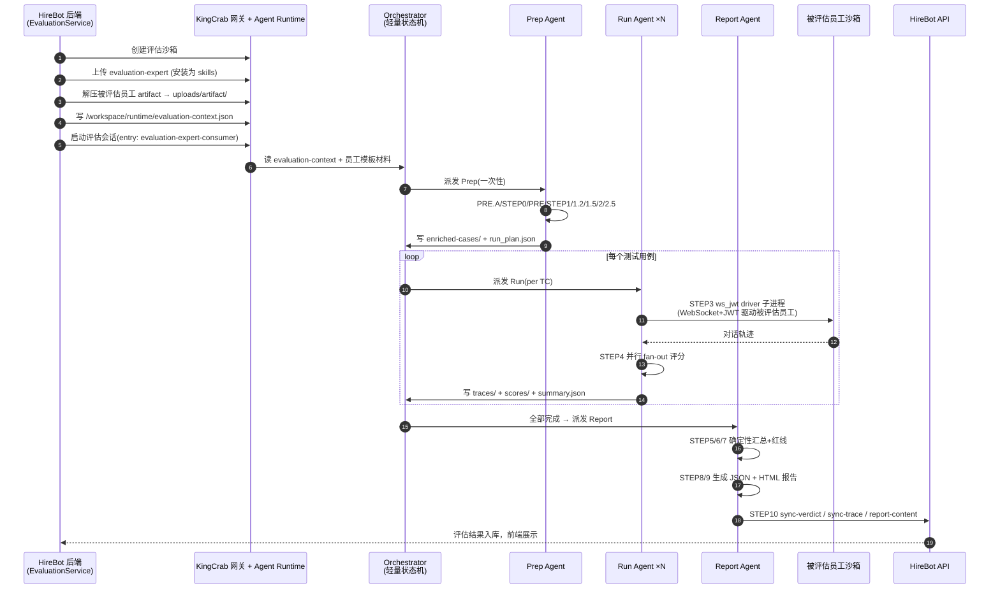

# 数字员工模板执行链路与 kingcrab skill 调用分析（图文版）

> 本文是 [数字员工模板执行链路与kingcrab-skill调用分析.md](数字员工模板执行链路与kingcrab-skill调用分析.md) 的**图文重制版**：内容一致，重绘了 4 张专业 SVG 图，便于快速建立全局直觉。原分析文档保留不动。
>
> 分析对象：
> - `back-end/HireBot.ApiService/Assets/DigitalEmployeeTemplates/employment-coach-conversation`（雇佣教练对话包 / **生产链**）
> - `back-end/HireBot.ApiService/Assets/DigitalEmployeeTemplates/evaluation-expert`（评估专家包 / **消费/评估链**）
>
> 配套调用堆栈图：[雇佣教练模板调用堆栈层次图.svg](雇佣教练模板调用堆栈层次图.svg)、[评估专家模板调用堆栈层次图.svg](评估专家模板调用堆栈层次图.svg)

---

## 0. 一句话结论

这两个目录**本身不是 hirebot 后端的可执行代码**，而是一组"数字员工包"（manifest + config + ontology + 一堆 `SKILL.md`）。hirebot 后端负责把它们**打包上传进 kingcrab（OpenClaw.Gateway）沙箱**并安装成 skill；真正的"执行"发生在 kingcrab 侧的 **Agent Runtime（LLM）** 里，通过三种机制驱动：

- `load_skill`（渐进式披露）
- `emit_artifact`（产物回传 + 质检）
- `[Internal downstream trigger: use skill xxx]`（下游触发块）

一句话记住：

| 链路 | 本质 | 产出 |
|---|---|---|
| `employment-coach-conversation`（**生产链**） | 单 Agent + 渐进披露 + prompt 内部编排的"四阶段装配流水线" | 一个**新的数字员工包** |
| `evaluation-expert`（**评估链**） | Agent 内部再拆三段式 multi-agent（Prep / Run / Report）的"13 步确定性评估流水线" | 一份**评估报告**并回传 hirebot |

---

## 1. 全局架构：一个"机器人代工厂"

如果没接触过"Agent + skill 沙箱"这套东西，先用一个比喻建立直觉：把整套系统想象成一个**造机器人（数字员工）的代工厂**。

| 系统里的角色 | 工厂里的角色 | 干什么 |
|---|---|---|
| **hirebot 后端** | 车间调度 + 仓库管理员 | 自己**不造**机器人。负责开工位（建沙箱）、把图纸和原料运进车间（上传模板包）、机器人造好后登记入库 |
| **kingcrab（OpenClaw.Gateway）沙箱** | 隔离的车间 / 工位 | 真正的组装在这里发生，有自己的文件系统 `/workspace/...` |
| **Agent Runtime（LLM）** | 车间里的技工 | 唯一真正"干活"的角色：读图纸、动手写文件、报进度 |
| **SKILL.md** | 一本本操作手册 | 技工照着做的说明书——**本质就是喂给 LLM 的 prompt** |
| **manifest.json** | 手册总目录 / `package.json` | 声明"从哪本手册开始（`entry_skill`）"和"有哪些下游手册" |
| **artifact** | 传送带上的半成品 / 成品 | 技工每完成一步就往传送带放一个"产物"，附带质检 |

### 4 个必须先懂的名词

1. **沙箱 (sandbox)**：隔离的容器环境，Agent 在里面跑。类比 Docker 容器。
2. **数字员工包**：一堆配置 + markdown 说明书打成的 zip，**本身不是可执行代码**，而是"喂给 LLM 的资料 + 规则"。
3. **渐进式披露 (progressive disclosure)**：手册太多，一次性全塞给 LLM 会撑爆上下文（token）。所以系统提示里**只放一份索引目录**，LLM 判断"我现在需要 X 手册"时，才用 `load_skill` 把那本手册的正文拉进来。类比：懒加载 / 按需 `import`。
4. **artifact 契约 (contract)**：Agent 想往传送带放产物时，网关会拿一张白名单（`contracts/artifacts.json`）核对"这个产物的类型 / 阶段是否合法"。类比：JSON Schema 校验 / 状态机的合法转移表。

> **一句话看懂全局**：hirebot 只做"搭台"（建沙箱 + 传包 + 入库），真正的"唱戏"（装配 / 评估）全在 kingcrab 沙箱里由**一个 LLM** 边读手册边执行；kingcrab 只对"加载手册、放产物、质检产物"这三件事提供确定性保障，**"下一步该干嘛"靠 LLM 遵守 prompt**。

---

## 2. 生产链：employment-coach-conversation

`manifest.json` 关键字段：

| 字段 | 值 |
|---|---|
| `entry_skill` | `skills/employment-coach-conversation` |
| `skills` | 主 skill + 6 个下游 skill（slice 抽取 / projection / skill 生成 / 外部配置 / 测试用例 / 完整性审查） |
| `stage_rules` | `material → skill → external → ready_for_packaging` 四阶段门控 |

主 skill [SKILL.md](../back-end/HireBot.ApiService/Assets/DigitalEmployeeTemplates/employment-coach-conversation/skills/employment-coach-conversation/SKILL.md)（1368 行）定义了整条"资料 → 技能（先定义、再生成）→ 外部 → 打包"的对话导航中枢。

### 2.1 阶段 A — hirebot 后端准备沙箱（确定性 C# 代码）

入口 [EmployeeHiringService.cs](../back-end/HireBot.Core/Services/Hiring/EmployeeHiringService.cs)：

1. 创建 kingcrab 沙箱 → `WaitForSandboxReadyAsync` 等到 Running → 拿到 `GatewayEndpoint`；
2. `discoveryRoleTemplatePackageProvider.LoadAsync()` 加载 employment-coach-conversation 模板目录 → `TemplatePackageArchiveBuilder.BuildArchive` 打成 zip；
3. `sandboxService.UploadDigitalEmployeeTemplateAsync(...)` 把 zip 上传到沙箱，**安装为 skills**（`SkillsInstalled`）；
4. 上传 MCP 配置 → 标记沙箱已初始化 → 建 `HiringSession` + hiring 状态员工实例；
5. 返回 `GatewayEndpoint` 给前端。

> 注意：**目标模板包（要被装配的数字员工）由前端另走接口上传到 `workspace/uploads/`**，不在这一步。

### 2.2 阶段 B — 会话运行（前端 ↔ kingcrab，WebSocket）

前端拿 `GatewayEndpoint` **直连 kingcrab 的 WebSocket**（hirebot 后端不转发对话）。kingcrab 的 Agent Runtime 把 `employment-coach-conversation` 作为 entry skill 装载，系统提示里**只放 skill 索引**（`SkillPromptBuilder.BuildIndex`），正文按需加载。

四阶段推进，每个阶段都在重复同一个机器循环：

- `emit_artifact`（[EmitArtifactTool.cs](../../kingcrab/src/OpenClaw.Gateway/Tools/EmitArtifactTool.cs)）推进度 / 完成产物 → 经 `SkillArtifactRuntime` 契约校验 → WebSocket envelope 推前端 → 阶段胶囊 / 卡片更新；
- terminal artifact 触发 `SkillStageGateEvent`（阶段门）；
- `load_skill`（[LoadSkillTool.cs](../../kingcrab/src/OpenClaw.Core/Skills/LoadSkillTool.cs)）把下游 SKILL.md 正文拉进上下文；
- 输出 `[Internal downstream trigger: use skill xxx]` 触发块，**同一个 LLM** 切换成下游 skill 的指令去写盘、发 terminal artifact；
- 收到下游 terminal artifact（如 `ontology_slice_extraction_done`）后解锁下一阶段。

最终 R6 打包发 `template_package(kind:file)` → 前端 `auto-importPackage` → hirebot `ImportPackageAsync` 入库，装配结束。

### 2.3 生产链时序图

> 下面的时序图与原分析文档一致，此处保留 mermaid 源码，便于对照上方 SVG 流水线视图。

---

## 3. 评估链：evaluation-expert

`manifest.json`：`entry_skill = skills/evaluation-expert-consumer`，只有 1 个 skill。[evaluation-expert-consumer/SKILL.md](../back-end/HireBot.ApiService/Assets/DigitalEmployeeTemplates/evaluation-expert/skills/evaluation-expert-consumer/SKILL.md) 定义了**与模板无关的 13 步确定性评估工作流**，角色差异全部通过 6 个热插拔数据层（`metrics/`、`test-cases/`、`runtime-drivers/`、`simulators/`、`role-catalog/`、`employees/`）承载。

### 3.1 阶段 A — hirebot 后端准备评估沙箱

入口 [EvaluationService.WorkspaceManagement.cs](../back-end/HireBot.Core/Services/Evaluation/EvaluationService.WorkspaceManagement.cs)：

1. 创建评估沙箱（`evaluation-evaluator`）；
2. `UploadEvaluationTemplateToSandboxAsync` 上传 evaluation-expert 模板 → 安装为 skills；
3. `UploadArtifactAttachmentToSandboxAsync` 把**被评估员工的 artifact bundle 解压到 `uploads/artifact/`**；
4. 写 `/workspace/runtime/evaluation-context.json`（含 `client_secret`、目标沙箱地址、`hirebot_api`）；
5. 启动评估会话。

### 3.2 阶段 B — 评估运行（kingcrab Agent，内部 multi-agent）

`evaluation-expert-consumer` 作为 entry skill，先读 `evaluation-context.json` 与 `uploads/artifact/<template>/` 下的 5 类员工模板材料（IDENTITY / SOUL / AGENTS / SKILL / ontology），然后执行**三段式 multi-agent + 文件系统通信**：

> 💡 **别被 "multi-agent" 误导**：这里不一定是三个独立进程 / LLM，而是把一次评估拆成 **Prep / Run / Report 三种角色**，靠**文件系统交接**（Prep 写 `run_plan.json` → Run 写 `traces/`+`scores/` → Report 汇总）。和生产链"同一个 LLM 换身份干下一道工序"是同一个套路，只是评估链的步骤更确定（13 步 + K 规则审计）。唯一真会起子进程的是 STEP 3 的 `ws_jwt` driver——它单独开进程用 WebSocket+JWT 连回"被评估员工"的沙箱去跑真实对话。

- **Prep Agent**（一次性）：PRE.A `loadRoleCatalog` → STEP 0 `resolveEmployee` → PRE `loadMetricRegistry` → STEP 1 角色过滤指标 → STEP 1.2 `curateMetrics` → STEP 1.5 合成测试用例 → STEP 2 `enrichTestCases` → STEP 2.5 `planRun`（落 `run_plan.json`）；
- **Run Agent ×N**（每测试用例）：STEP 3 `driveEmployeeOnScenario`——用 `runtime-drivers/ws_jwt/run.py` 作为**子进程**，走 **WebSocket + JWT 连回"被评估员工"所在沙箱**驱动真实对话并写 trace → STEP 4 并行 fan-out 评分；
- **Report Agent**（全部完成后）：STEP 5/6/7 确定性汇总 + 红线检查 → STEP 8/9 生成 JSON + HTML 报告 → STEP 10 `uploadToHireBot`。

### 3.3 阶段 C — 回传 hirebot

STEP 10 通过 HTTP 把结果 POST 回 hirebot API：`sync-verdict`（评分结论）+ `sync-trace`（轨迹 bundle）+ `report-content`（完整报告）。

### 3.4 评估链时序图

---

## 4. 最终如何调用 kingcrab 的 skill

需要区分**两层"调用"**：安装层（模板包 → skill）和运行层（三种机制驱动 skill）。

### 4.1 安装层：模板包 → kingcrab skill

hirebot 把模板目录（含各级 `SKILL.md`）打 zip，经 `KingCrabGatewayClient` / `KingCrabHttpClient` 走 HTTP 上传：

- `/media/upload`、`/admin/workspace/upload?dir=...`（[KingCrabGatewayClient.cs](../back-end/HireBot.Core/Services/Sandbox/KingCrabGatewayClient.cs)）；
- 鉴权走 `KingCrabSandboxTokenProvider`（Bearer / client_credentials），HireBot API 前缀 `/api/integration/hirebot`。

kingcrab 侧 `SkillLoader` / `SkillWatcherService` 发现并注册这些 skill，`SkillPromptBuilder.BuildIndex` 把它们做成**索引**注入系统提示。

### 4.2 运行层：三种机器机制驱动 skill

| 机制 | kingcrab 实现 | 作用 | 确定性 |
|---|---|---|---|
| `load_skill` | `LoadSkillTool` | **渐进式披露**：系统提示只放 skill 元数据索引；模型判断需要某 skill 时才把它的 `SKILL.md` 正文 + 资源清单 + artifact 契约拉进上下文 | ✅ 确定性 C# 代码 |
| `emit_artifact` | `EmitArtifactTool` + `SkillArtifactRuntime` | 把阶段产物（`kind:data`）或文件（`kind:file`）经 WebSocket envelope 即时推前端；按 `contracts/artifacts.json` **白名单校验** type/stage，标记 terminal，产出 `SkillStageGateEvent` 阶段门 | ✅ 确定性 C# 代码 |
| `[Internal downstream trigger: use skill xxx]` | **无 C# 实现**（仅 prompt 约定） | 主 skill 输出该文本块，同一 LLM 据此"切换"到下游 skill 指令继续执行 | ❌ 全靠 LLM 遵守 prompt |

### 4.3 关键事实：下游触发不是确定性代码

在整个 kingcrab `src/` 的 C# 代码里**检索不到** `Internal downstream trigger` / `use skill` 的注入逻辑（仅 `oidc-auth.js` 有无关字符串）。也就是说：

> SKILL.md 里反复声称的"**系统层**自动构造 R1/R2/R3 触发块、coach 不手写"，物理上就是**同一个 Agent 会话（LLM）自己**。所谓"系统层"只是 prompt 层面把"面向用户的教练"和"负责调度下游 skill 的编排者"做了**逻辑角色区分**，并没有独立的确定性 orchestrator 进程去保证它一定发生。

kingcrab 侧真正确定性的只有三件事：`load_skill` 加载、`emit_artifact` 推送、`SkillArtifactRuntime` 的契约校验 + 阶段门。**"下一步该触发哪个 skill、按什么顺序、带什么 payload"完全由 LLM 遵守 prompt 来保证。**

---

## 5. 设计合理性分析

### 5.1 合理之处

1. **关注点分离清晰**：hirebot 管业务编排 / 持久化 / 沙箱生命周期，kingcrab 管 Agent 运行时 / skill 执行，边界是 HTTP（准备）+ WebSocket（会话）。职责干净。
2. **渐进式披露控制上下文膨胀**：主 skill 索引常驻、6+ 下游 skill 正文按需 `load_skill`，对这种超长多阶段流程是**必要且有效**的工程手段。
3. **artifact 驱动 UI + 契约白名单**：`SkillArtifactRuntime` + `contracts/artifacts.json` 提供了一层确定性护栏，阻止 LLM 自造阶段 / artifact，并用 `SkillStageGateEvent` 把"UI 阶段推进"和"自然语言"解耦——这是难得的确定性锚点。
4. **模板即数据**：生产链与评估链复用同一套沙箱 / skill / artifact 基础设施，新增数字员工只改 `manifest + SKILL.md + ontology`，**不动 runtime**。
5. **评估链的工程化到位**：multi-agent（Prep/Run/Report）+ 文件系统通信 + 确定性步骤隔离 + K 规则审计，是应对"上下文膨胀"和"评分可复现 / 可审计"的合理设计。driver 以子进程 + WebSocket 连回被评估员工沙箱，隔离得很干净。

### 5.2 风险 / 不合理之处

1. **⚠️ "系统层自动触发"名不副实（最大风险）**：R1/R2/R3 的触发靠 LLM 自觉输出触发块，而非确定性代码注入。一旦模型漂移、上下文被裁剪、或切换 LLM，就可能**漏触发 / 错序 / 状态分叉**（"对话已进技能阶段但右侧 UI 停在资料阶段"）。SKILL.md 里那一大堆防御性规则（入口门禁、反循环快捷路径、反伪造路径红线、5 秒有界等待、6~8 项人工核对清单）本质上都是在**用 prompt 兜底本应由代码保证的确定性**——这正是脆弱性的证据。
2. **主 SKILL.md 过度膨胀**：单文件 1368 行 + 十余个互相引用的 references。token 成本高、可维护性差，且已出现**规则打架**（"用户拍板胜出，此裁决优先于 SOUL.md 的明确度优先原则"这类冲突裁决条款）。
3. **跨 skill 契约偏隐式**：`workspace_root` / `template_slug` / `items[]` 靠 artifact `data` 透传，但 `SkillArtifactRuntime` 只校验 type/stage，**不校验 data 内部字段**；data 完整性主要靠 prompt 约束 + LLM 自查。
4. **术语双层负担**：用户侧话术 vs 内部协议名的归一化表，增加了 prompt 体量和出错面。
5. **共享沙箱靠纪律防污染**：`/workspace` 是租户 + 用户级共享 PVC，"禁止用 /workspace 根做 workspace_root、否则会把系统 skill 混进产物包"这类关键隔离**只靠 prompt 约束**，一旦违规后果严重。

### 5.3 改进方向建议

| 现状 | 建议 |
|---|---|
| R1/R2/R3 靠 LLM 输出触发块 | 下沉为 gateway 确定性编排：`SkillArtifactRuntime` 收到指定 terminal artifact 后，由 **C# 代码**确定性构造并回注下游触发消息，让"系统层"名实相符 |
| 只校验 artifact type/stage | 在 `EmitArtifactTool` 侧引入 **JSON Schema 校验 data 字段**（尤其 `workspace_root`/`items` 必填项） |
| 主 skill 承担阶段状态机 | 把阶段门控状态机迁到确定性 stage machine，`SKILL.md` 只留话术与引导，给 prompt 瘦身 |
| 路径隔离靠 prompt 红线 | 在沙箱工具层（`ToolPathPolicy`）对 `workspace_root` 做**代码级白名单**，禁止落到 `/workspace` 根 |

---

## 6. 总览对比

| 维度 | employment-coach-conversation（生产） | evaluation-expert（评估） |
|---|---|---|
| 目的 | 把业务需求装配成新的数字员工包 | 对已有数字员工打分并出报告 |
| entry skill | employment-coach-conversation | evaluation-expert-consumer |
| Agent 结构 | 单 Agent + 渐进披露 + prompt 内部编排 | 单 Agent 内再拆三段 multi-agent（Prep/Run/Report） |
| skill 数量 | 主 + 6 下游 | 1（差异走 6 个热插拔数据层） |
| 编排确定性 | 弱（靠 SKILL.md prompt） | 较强（13 步 + K 规则 + 文件系统通信） |
| 与外部交互 | WebSocket 回前端 + 打包入库 | driver 子进程 ws+jwt 连被评估沙箱 + STEP10 HTTP 回 hirebot |
| kingcrab 依赖 | load_skill / emit_artifact / SkillArtifactRuntime | 同左 + ws_jwt driver + Keycloak 鉴权 |

---

## 附：相关文档

- 原始分析（纯文字版）：[数字员工模板执行链路与kingcrab-skill调用分析.md](数字员工模板执行链路与kingcrab-skill调用分析.md)
- 详细分层调用堆栈：[雇佣教练模板调用堆栈层次图.svg](雇佣教练模板调用堆栈层次图.svg)、[评估专家模板调用堆栈层次图.svg](评估专家模板调用堆栈层次图.svg)

> **本文配图（SVG，可缩放）**：
> - [数字员工模板-01-全局架构图.svg](数字员工模板-01-全局架构图.svg)
> - [数字员工模板-02-生产链流水线.svg](数字员工模板-02-生产链流水线.svg)
> - [数字员工模板-03-评估链三段式.svg](数字员工模板-03-评估链三段式.svg)
> - [数字员工模板-04-调用机制对比.svg](数字员工模板-04-调用机制对比.svg)
