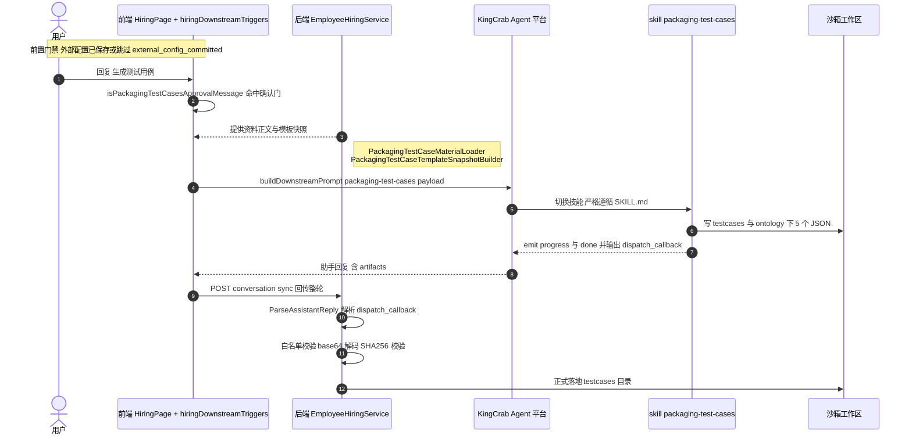
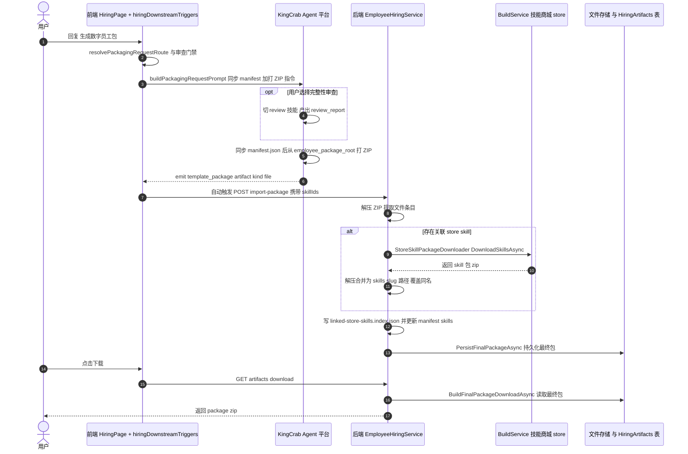

# 测试用例文档生成与下载包：是否使用 skill 技能及完整链路分析

> 面向中级开发工程师的通俗讲解。结论先行，后附两条链路的时序图、分步说明与代码索引。
> 配套调用堆栈层次图见同目录 `测试用例生成与下载包调用堆栈.svg`。

---

## 一、结论速览

| 功能模块 | 是否使用 skill 技能 | 用的是哪种 skill |
|---------|:---:|---------|
| **生成测试用例文档** | ✅ 是 | 专用 Agent Skill **`packaging-test-cases`**（`SKILL.md` 格式） |
| **下载包（数字员工产物包）** | ✅ 是 | ① 包本身就是一组 skill 的集合；② 用户额外关联的"技能商城 store skill" |

一句话总结：**hirebot 本身不写"生成测试用例"和"打 ZIP"的算法逻辑，它把这两件事都交给 skill（技能）去做**。hirebot 扮演"业务编排层 + 门禁 + 落地存储"，真正干活的是运行在 KingCrab（Agent 执行平台）里的 skill。

---

## 二、先搞清楚：这里的"skill 技能"到底是什么？

很多人会把它和 Claude Code 的 `/xxx` 斜杠技能搞混。在 hirebot 里，"skill"是 **Claude Agent Skill 格式的技能包**，目录长这样：

```
skills/packaging-test-cases/
├── SKILL.md                    # 技能说明书：何时触发、输入契约、生成要求、输出契约
├── references/OUTPUT_CONTRACT.md
├── templates/TEMPLATE.json
├── examples/ready/*.json
└── contracts/artifacts.json
```

`SKILL.md` 顶部有 YAML frontmatter（`name` / `description` / `trigger` / `input` / `output`），正文是给 AI Agent 看的自然语言"作业指导书"。Agent 在执行时被"切换"到某个 skill，就会严格按这份 `SKILL.md` 干活。

数字员工模板 `employment-coach-conversation` 内置了 7 个 skill：

| skill 名 | 职责 |
|---------|------|
| `employment-coach-conversation` | 雇佣教练主对话（总调度） |
| `ontology-slice-extraction` | 从上传资料抽取业务本体切片 |
| `ontology-projection` | 把本体投影/匹配到技能数据 |
| `skill-generation` | 生成业务技能实现 |
| `external-config` | 外部系统/MCP 配置 |
| **`packaging-test-cases`** | **打包前生成评估测试用例** ← 本文链路一 |
| `digital-employee-package-completeness-review` | 打包前完整性审查 |

> 关键点：这些 skill 文件被打包进**数字员工产物包**里（`skills/<slug>/SKILL.md`）。所以"下载包"里装的，本身就是一堆 skill。

---

## 三、链路一：生成测试用例文档（`packaging-test-cases` skill）

### 3.1 通俗讲解

想象一条流水线：用户和"雇佣教练"聊完资料、技能、外部配置后，系统会问一句"要不要顺便生成评估测试用例？"。用户说"生成"，hirebot **不自己写用例**，而是：

1. 前端确认用户意图（门禁），
2. 把"会话历史 + 上传资料 + 模板快照"打包成 payload，
3. 给 KingCrab Agent 发一条内部指令："切到 `packaging-test-cases` 技能，按它的 SKILL.md 干"，
4. Agent 生成 5 个 JSON 文件写进沙箱工作区，并回传一个 `<dispatch_callback>`，
5. hirebot 后端解析这个回调，把文件正式落地。

### 3.2 时序图



### 3.3 分步说明 + 代码索引

| 步 | 做什么 | 关键代码 |
|---|--------|---------|
| 1 | 识别用户"生成测试用例"的确认语 | [hiringDownstreamTriggers.ts:781](../front-end/src/features/hiring/pages/utils/hiringDownstreamTriggers.ts#L781) `isPackagingTestCasesApprovalMessage` |
| 2 | 准备资料正文（从 DB 读上传资料，限长截断） | [PackagingTestCaseMaterialLoader.cs:16](../back-end/HireBot.Core/Services/Hiring/PackagingTestCaseMaterialLoader.cs#L16) |
| 3 | 准备模板快照（manifest/skills/ontology/config 文本） | [PackagingTestCaseTemplateSnapshotBuilder.cs:23](../back-end/HireBot.Core/Services/Hiring/PackagingTestCaseTemplateSnapshotBuilder.cs#L23) |
| 4 | 构造内部触发提示词，注入 KingCrab 会话 | [hiringDownstreamTriggers.ts:441](../front-end/src/features/hiring/pages/utils/hiringDownstreamTriggers.ts#L441) `buildDownstreamPrompt('packaging-test-cases')` |
| 5 | 技能执行规则（入口门禁、输入契约、输出 5 文件、降级） | [packaging-test-cases/SKILL.md](../back-end/HireBot.ApiService/Assets/DigitalEmployeeTemplates/employment-coach-conversation/skills/packaging-test-cases/SKILL.md) |
| 6 | 回传整轮对话 | [HiringsController.cs:117](../back-end/HireBot.ApiService/Controllers/HiringsController.cs#L117) `POST /conversation/sync` → [EmployeeHiringService.cs:673](../back-end/HireBot.Core/Services/Hiring/EmployeeHiringService.cs#L673) |
| 7 | 解析 `<dispatch_callback>`、解码并落地 | [HiringWorkflowSupport.cs:17](../back-end/HireBot.Core/Services/Hiring/HiringWorkflowSupport.cs#L17) `ParseAssistantReply` / `DecodeArtifactContent` / `IsAllowedArtifactPath` |

> 注意：`<invoke_packaging_testcases>` 这个标签**不是后端硬编码字符串**，它由前端 `buildDownstreamPrompt` 注入到会话、并由 `SKILL.md` 约定门禁。后端只负责"喂数据"和"收回调落地"。

---

## 四、链路二：生成与下载数字员工包（产物包）

### 4.1 通俗讲解

"打包"同样不是后端自己 `zip` 文件夹，而是：

1. 用户说"生成数字员工包"，前端做"审查/跳过审查"门禁，
2. 前端给 Agent 发打包指令：**先同步 `manifest.json`，再用工具把工作区打成 ZIP**，
3. Agent 打完 ZIP，emit 一个 `template_package` artifact（`kind` 必须是 `file`），
4. 前端**自动触发** `import-package`，把这个 ZIP 上传给后端，
5. 后端在这一步把**用户关联的"技能商城 store skill"下载下来合并进包**，再持久化成"最终包"，
6. 下载时后端直接把这个最终包 ZIP 流式返回。

这里 skill 出现了两次：包里**本来就有** skill（数字员工自己的技能）；导入时**还会再合并**用户在商城里额外挑选的 store skill。

### 4.2 时序图



### 4.3 分步说明 + 代码索引

| 步 | 做什么 | 关键代码 |
|---|--------|---------|
| 1 | 识别"生成产物包"意图 + 审查门禁路由 | [hiringDownstreamTriggers.ts:1065](../front-end/src/features/hiring/pages/utils/hiringDownstreamTriggers.ts#L1065) `resolvePackagingRequestRoute` |
| 2 | 后端打包意图正则（多处规则集中维护） | [PackagingIntentSupport.cs:10](../back-end/HireBot.Core/Services/Hiring/PackagingIntentSupport.cs#L10) |
| 3 | 构造打包提示词：同步 manifest + 打 ZIP 指令 | [hiringDownstreamTriggers.ts:497](../front-end/src/features/hiring/pages/utils/hiringDownstreamTriggers.ts#L497) `buildPackagingRequestPrompt` / `buildManifestSyncInstructionLines` / `buildPackageZipInstructionLines` |
| 4 | 打包成功 emit `template_package`(kind=file) 是自动导入的唯一条件 | [employment-coach-conversation/SKILL.md:1231](../back-end/HireBot.ApiService/Assets/DigitalEmployeeTemplates/employment-coach-conversation/skills/employment-coach-conversation/SKILL.md#L1231) |
| 5 | 前端自动触发 import-package | [HiringPage.tsx:992](../front-end/src/features/hiring/pages/HiringPage.tsx#L992) / [hiringWorkflowApi.ts:713](../front-end/src/infra/api/modules/hiringWorkflowApi.ts#L713) |
| 6 | 导入入口（接收文件 + skillIds） | [HiringsController.cs:161](../back-end/HireBot.ApiService/Controllers/HiringsController.cs#L161) `POST /import-package` |
| 7 | 导入主流程：解压 → 下载合并 store skill → 持久化 | [EmployeeHiringService.cs:1321](../back-end/HireBot.Core/Services/Hiring/EmployeeHiringService.cs#L1321) `ImportPackageAsync` |
| 8 | 从商城下载 skill 包并解压成 `skills/<slug>/...` | [StoreSkillPackageDownloader.cs:24](../back-end/HireBot.Core/Services/Hiring/StoreSkills/StoreSkillPackageDownloader.cs#L24) `DownloadSkillsAsync` |
| 9 | 把关联 skill 追加进 manifest.skills | [FinalPackageManifestUpdater.cs:14](../back-end/HireBot.Core/Services/Hiring/FinalPackageManifestUpdater.cs#L14) `AppendLinkedSkills` |
| 10 | 把文件打 ZIP 持久化为最终包 + 入库 | [HiringArtifactPackageService.cs:37](../back-end/HireBot.Core/Services/Hiring/Artifacts/HiringArtifactPackageService.cs#L37) `PersistFinalPackageAsync` |
| 11 | 底层 ZIP 字节构建 | [TemplatePackageArchiveBuilder.cs:14](../back-end/HireBot.Core/Services/Hiring/TemplatePackageArchiveBuilder.cs#L14) |
| 12 | 下载最终包 / 单文件 | [HiringsController.cs:225](../back-end/HireBot.ApiService/Controllers/HiringsController.cs#L225) → [EmployeeHiringService.cs:1720](../back-end/HireBot.Core/Services/Hiring/EmployeeHiringService.cs#L1720) `BuildArtifactDownloadAsync` |

---

## 五、两类 skill 的区别（容易混淆）

| 维度 | 数字员工内置 skill（如 `packaging-test-cases`） | 技能商城 store skill |
|------|----------------------------|----------------|
| 存放位置 | 模板 `Assets/DigitalEmployeeTemplates/.../skills/` | BuildService（ncrew-builder）的商城 |
| 谁来执行 | KingCrab Agent 加载 `SKILL.md` 执行 | 不执行，只作为资产合并进包 |
| 进包方式 | 随模板/工作区天然存在 | `import-package` 时 `StoreSkillPackageDownloader` 下载合并 |
| 在本文链路 | 链路一的"生成测试用例"主角 | 链路二的"下载包"附加资产 |
| 权威性 | 沙箱生成 | **覆盖**沙箱同名文件（用户关联的是权威来源） |

---

## 六、核心结论再强调

1. **生成测试用例文档 = 调用 `packaging-test-cases` 技能**（一个标准 Agent Skill），由前端门禁触发、KingCrab 执行、后端回调落地。
2. **下载包 = 多个技能协作产出的资产集合**，且导入时还会把用户挑选的商城技能下载合并进去。
3. hirebot 的代码职责是**编排（前端门禁 + 提示词注入）+ 数据准备 + 回调落地 + 存储下载**，而**"怎么生成"的智能全部封装在各个 `SKILL.md` 里**。这正是"业务编排层 hirebot + Agent 执行平台 kingcrab"分工的体现。
