# 雇佣流程 & 评估流程 LangGraph 编排架构迁移设计方案

> 文档版本：v1.0　　整理日期：2026-08-19　　目标读者：中级工程师

**参考资料（共 8 份）：**

| 编号 | 文件 | 定位 |
|---|---|---|
| S1 | `langgraph_重构雇佣流程编排设计方案.md` | 核心源文档，本文第 4–6 章的直接依据 |
| S2 | `langgraph_替换雇佣流程编排可行性与对比分析.md` | 核心源文档，本文第 2 章的直接依据 |
| S3 | `Kingcrab六大关键机制分析.md` | kingcrab 底座能力参考 |
| S4 | `OpenClaw与Kingcrab项目规划工具调用记忆状态管理工作流编排与多步任务执行关键机制分析.md` | 同上，含更完整附录 |
| S5 | `数字员工模板执行链路与kingcrab-skill调用分析-图文版.md` | 生产链/评估链现状拆解依据 |
| S6 | `数字员工模板执行链路与kingcrab-skill调用分析.md` | 同上文字版（含 R1–R6 流水线图） |
| S7 | `雇佣教练模板调用堆栈层次图.svg` | 生产链调用堆栈可视化 |
| S8 | `评估专家模板调用堆栈层次图.svg` | 评估链调用堆栈可视化 |

---

## 0. 文档说明与阅读指南

**这篇文档要做什么。** 把 kingcrab + hirebot 现有的两条数字员工流水线——**生产链**（雇佣教练对话，产出新数字员工）和**评估链**（评估专家，产出评估报告）——的编排骨架，重新设计成以 **LangGraph** 为核心的编排架构，并给出可以直接拿去评审、拆任务的完整方案。

**哪些内容"有据可查"，哪些是"本文推演"，请注意区分：**

- 第 1、2、4、5、6 章关于**生产链**的分析和设计，直接来自 S1、S2 两份核心源文档，是原文档已经论证过的结论，本文只做重新整理和体系化呈现。
- 第 1、7、8、9 章关于**评估链**的 LangGraph 化设计，S1、S2 两份源文档**完全没有涉及**（它们明确说"只分析雇佣流程"）。这部分是本文按照生产链同样的设计原则，在 S5/S6/S8 对评估链现状的事实描述基础上做的**推演设计**，工程上合理，但没有原作者的背书，请在评审时重点关注。
- 第 3、10、11、12 章是两条链共用的基础设施设计（总体架构、异常处理、持久化、可扩展性、部署、迁移路径），综合了两条链的需求后统一设计。

**约定：** 文中的 Python 代码块全部是**示意性伪代码**，用来讲清楚"新架构里这一块对应旧架构的哪一块、大致怎么实现"，不是可以直接拷进项目跑起来的最终实现——这一点和 S1、S2 两份源文档的免责声明保持一致。

**技术栈选型（已确认）：** LangGraph 编排服务使用 **Python + langgraph 官方库**独立部署为新的后端服务，不复用现有 TypeScript 前端或 C# 后端的运行时。

---

## 1. 现状架构全景回顾（重新整理 kingcrab + hirebot）

### 1.1 三层协作架构总览

kingcrab 和 hirebot 目前是三层协作，职责边界很清楚：

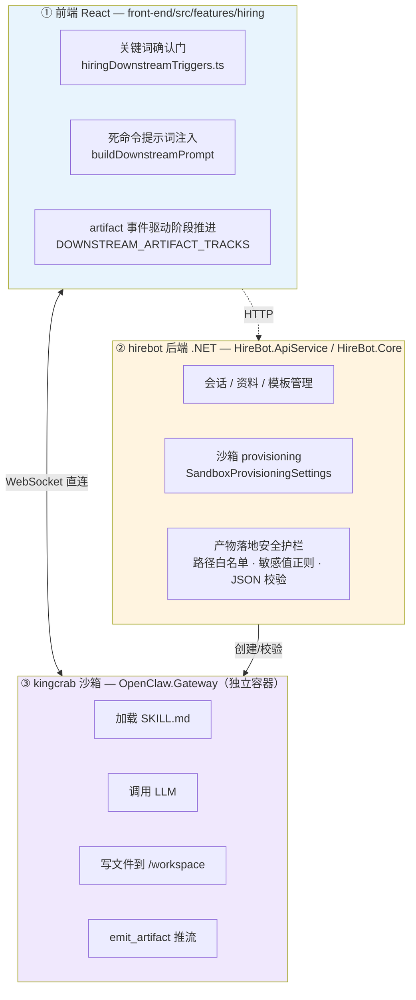

**关键事实（决定了本次迁移的边界）：**

1. 前端和 kingcrab 沙箱之间是 **WebSocket 直连**，hirebot 后端**不转发会话内容**，只负责"开局"（建沙箱、装模板）和"落地校验"（产物写盘前的安全检查）。
2. 沙箱内部**没有硬隔离**：`AllowedReadRoots` / `AllowedWriteRoots` 配置是 `"*"`，`WorkspaceOnly=false`。真正的安全边界是前端的 prompt 级约束 + 后端的产物落地校验，不是操作系统级沙箱隔离。
3. 所谓"系统层自动触发下游 skill"，在 kingcrab 的 C# 代码里**找不到实现**——`[Internal downstream trigger: use skill xxx]` 是纯 prompt 约定，能不能触发完全取决于 LLM 愿不愿意按 SKILL.md 的话去做。这是现状最大的确定性缺口，也是本次 LangGraph 迁移要补的最大短板。

### 1.2 kingcrab 六大机制速览（不变的底座能力）

以下机制发生在 ③ 沙箱层内部，本次迁移**完全不动**，只是作为背景知识帮助理解"LangGraph 加在什么位置"：

| 机制 | 成熟度 | 一句话说明 |
|---|---|---|
| 规划（Planning） | 偏弱 | 没有自主 Planner；靠 PEV（治理不是规划）+ 外部 MAF Durable Workflow（真正的规划在外部）+ `SkillWorkflowStepType`（声明式死数据，没有执行器）三条腿分摊 |
| 工具调用（Tool Calling） | 强 | 三层注册（原生动态插件 / C# 内置约 35 个工具 / MCP 工具）+ 执行管线上挂七类横切 Hook（合约域、PEV、审批回调、沙箱、审计日志等） |
| 记忆（Memory） | 中上 | `IStructuredMemoryProvider`（高层）+ `IMemoryStore`（中低层）两层，多种后端实现；"分形记忆"给外部注入内容打"不可信"标签防提示词注入；历史三段式防御（截断/压缩/持久化） |
| 状态管理（State Management） | 强 | 内存活跃层 + 持久化层 + 跨实例层三层存储；`SessionBranch` 类 git 分支能力；`MafSessionStateStore` 用 SHA-256 路径 + 信封三重校验 |
| 工作流编排（Workflow Orchestration） | 中 | 远程 Durable 编排强，进程内多 Agent 编排弱；`Handoff todo` 状态机（drafting → ready_to_dispatch → dispatched → dirty → confirmed → needs_review → dismissed）是亮点设计 |
| 多步任务执行（Multi-step Execution） | 强 | 黑盒循环委托给 MAF 的 `FunctionInvokingChatClient`，外面挂"外骨骼治理"：最大工具调用数、路径范围、token 预算、超时链、PEV 验证、学习闭环、主动巡检 |

kingcrab 的设计哲学可以概括成八个字：**"重治理、轻规划、循环外包、能力外挂"**。它管的是"沙箱里这一次 Agent 会话怎么被安全、可控地跑起来"；而本文要设计的 LangGraph 编排层，管的是"沙箱外面，一整条多阶段业务流程该怎么推进"——两者是正交的，不冲突，这也是为什么第 3 章的新架构图里 kingcrab 沙箱是原封不动地被"挂"在 LangGraph 节点后面。

### 1.3 生产链（employment-coach-conversation）现状拆解

**定位：** 单 Agent + 渐进披露（progressive disclosure）+ prompt 内部编排的"四阶段流水线"，产出一个全新的数字员工包。

**manifest.json 的四阶段门禁：** `material → skill → external → ready_for_packaging`

**三根支柱（现状的编排逻辑，全部长在前端 React 里）：**

| 支柱 | 现状实现 | 作用 | 典型痛点 |
|---|---|---|---|
| 关键词确认门 | `hiringDownstreamTriggers.ts` 里的 `isXxxApprovalMessage` 系列函数 | 识别用户是否"同意进入下一步" | 写死的同意词词典，用户换个说法可能识别不到 |
| 死命令提示词注入 | `buildDownstreamPrompt` | 给下游 skill 塞自然语言"纪律"（如"必须用 `write_file`""失败要标记 `slices_not_ready`"） | 执行不执行全看 LLM 听不听话 |
| artifact 事件驱动阶段推进 | `DOWNSTREAM_ARTIFACT_TRACKS` | 把 `ready` / `progress` / `done` 事件映射成阶段状态 | **LLM 忘记 emit `done` → 前端永远停在 `running`，流水线卡死**（现状头号故障） |

**R1–R6 下游 skill 流水线：**

```mermaid
flowchart LR
    M["资料收口<br/>material_handoff_ready"] --> R1["R1 本体切片抽取<br/>ontology-slice-extraction<br/>写 ontology/*.slice.json"]
    R1 --> SD["技能定义确认门<br/>skill_definition"]
    SD --> R2["R2 数据匹配投影<br/>ontology-projection<br/>写 ontology/projections/&lt;slug&gt;/*.projection.json"]
    R2 --> R3["R3 技能生成<br/>skill-generation<br/>读投影 → 写 skills/&lt;slug&gt;/(SKILL.md+四视图契约)"]
    R3 --> EX["外部系统配置<br/>external-config"]
    EX --> R4["R4 测试用例（可选）<br/>packaging-test-cases<br/>写 testcases/evaluation-test-cases.json"]
    R4 --> R5["R5 完整性审查（可选）<br/>completeness-review<br/>P0/P1/P2 审查报告"]
    R5 --> R6["R6 打包<br/>packaging<br/>template_package(kind:file)"]
    R6 --> F["前端自动 importPackage"]

    style R1 fill:#d4e8fc
    style R2 fill:#d4e8fc
    style R3 fill:#d4e8fc
    style R4 fill:#fce8d4
    style R5 fill:#fce8d4
    style R6 fill:#d4fcd8
```

主 SKILL.md（`employment-coach-conversation`）本身 1368 行，是整条流水线的对话导航中枢；`packaging-test-cases` 等下游 skill 头部声明 `autonomy:75`，属于"高自主 prompt 驱动 Agent"，不是确定性代码。

### 1.4 评估链（evaluation-expert）现状拆解

**定位：** 表面是"1 个 entry skill"，Agent 内部再拆成 Prep / Run / Report 三段 multi-agent 的 **13 步确定性评估流水线**，产出评估报告。和生产链不同，评估链**跟具体模板无关**——角色差异全部由 6 个可热插拔的数据层（`metrics/`、`test-cases/`、`runtime-drivers/`、`simulators/`、`role-catalog/`、`employees/`）承载，不需要改 skill 文件本身。

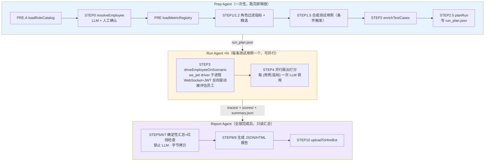

**评估链和生产链的本质区别：** 生产链的"阶段推进"完全靠同一个 LLM 会话在 prompt 里自觉输出触发块；评估链已经引入了一个**"轻量状态机 Orchestrator"**（只持有 `eval_id` / `phase` / `tc_list` / `completed_tcs`，不传业务数据）+ **文件系统通信**（`run_plan.json` → `traces/` + `scores/` → `summary.json`）来做跨 Agent 交接，确定性天然比生产链高。这也是为什么第 7 章会说"评估链上 LangGraph 的收益点和生产链不一样"。

STEP5/6/7 明确标注"禁止 LLM · 字节拷贝"——这几步是纯确定性代码，不调用模型，这一点在第 7 章设计评估链节点时很重要（不是所有节点都要调 LLM）。

### 1.5 现状问题全景总结

| 维度 | 生产链 | 评估链 |
|---|---|---|
| 阶段推进机制 | 前端关键词匹配 + LLM 自觉 emit done | 文件系统状态机 + 显式 STEP 编号 |
| 确定性水位 | 低（prompt 约定为主） | 中（13 步 + K 规则约束，但 Orchestrator 仍是手写代码） |
| 最大风险点 | 漏发 `done` → 卡死；越级推进；结构不合规 | Run Agent 并行调度是手搓循环，缺原生 map-reduce；跨 Agent 交接靠文件系统，恢复逻辑要自己写 |
| 人工确认点 | 关键词确认门（技能定义、测试用例、审查通过） | STEP0 resolveEmployee 需人工确认 |
| 并行需求 | 基本无（线性流水线） | 有（Run Agent × N 天然可并行） |
| 是否已有 Orchestrator 雏形 | 无（散落在前端 hooks/routes 里） | 有（轻量状态机，但功能有限） |

两条链的现状问题，第 2 章会先给出统一的诊断框架（"流程层 vs 内容层"），再分别在第 4–6 章（生产链）和第 7–9 章（评估链）给出具体的 LangGraph 设计。

---

## 2. 迁移决策：为什么迁移、迁移什么、不迁移什么

### 2.1 一句话结论

> LangGraph 能把"流程该走到哪一步"这件事从"看 LLM 心情"变成"看代码逻辑"，但它治不好"LLM 写出来的内容好不好"——这是两个独立的问题，前者是编排框架的事，后者是模型能力和 prompt 工程的事。

### 2.2 "不稳定"拆解：流程层 vs 内容层

这是 S2 全文最关键的一步拆解，也是理解本次迁移价值边界的钥匙。现状里所谓"换个模型就不稳定"，其实是两种性质完全不同的问题混在一起说：

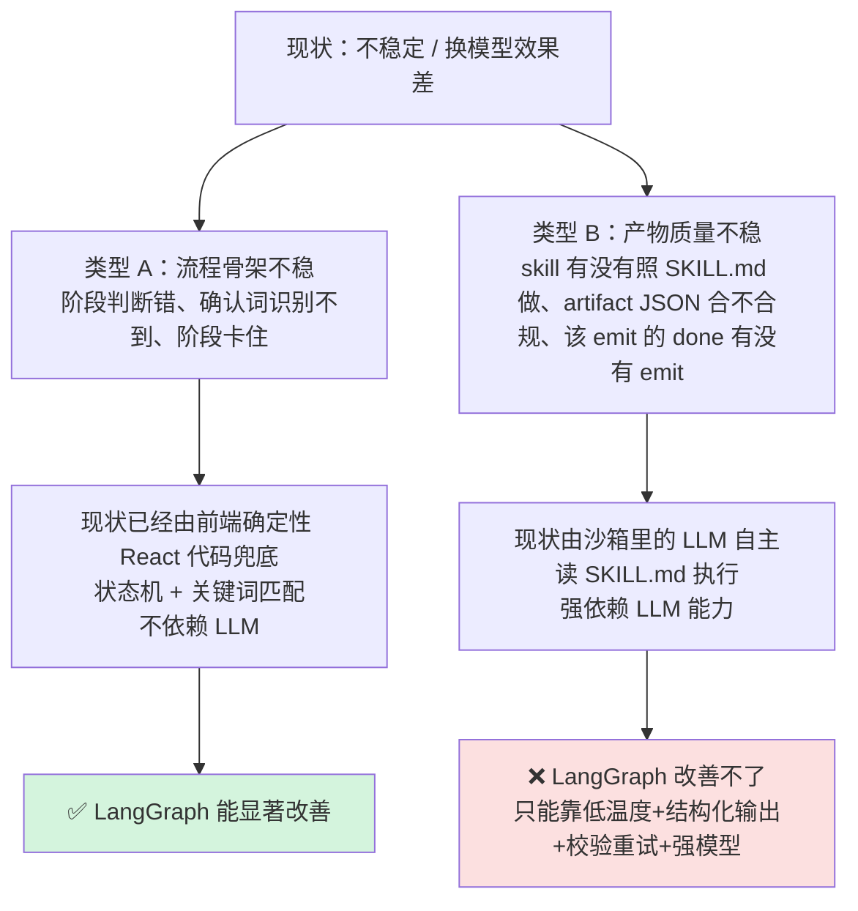

| | 类型 A：流程骨架不稳 | 类型 B：内容/产物质量不稳 |
|---|---|---|
| 现状归属 | 前端 React 确定性代码（状态机 + 关键词匹配） | 沙箱内 LLM 自主读 SKILL.md 执行 |
| 是否依赖 LLM | 基本不依赖 | 强依赖 |
| LangGraph 能不能治 | ✅ 能，而且是它的核心强项 | ❌ 不能，跟用什么编排框架无关 |
| 真正的解法 | 把"隐式协议"换成"显式代码结构"（节点、条件边、结构化输出） | 降低 `LlmTemperature`、加结构化输出 schema、加校验重试、必要时上强模型兜底 |

### 2.3 LangGraph 能治 / 不能治的边界

逐项拆解 S1/S2 里反复验证过的结论：

**✅ 能实实在在改善的三件事：**

1. **漏发 artifact 导致卡死** → 现状靠 LLM 自己 emit `done` 事件来推进；LangGraph 里节点函数**返回**就代表这一步完成，完成判断权从"模型愿不愿意说"转移到"代码逻辑判不判定"。
2. **产物结构不合规** → 用 `with_structured_output()` 绑定 Pydantic schema，不合规直接抛错触发重试，而不是让下游拿着一份格式错误的 JSON 继续跑。
3. **只说不做（narrative-only）** → 关键动作可以由**代码直接调用写入工具**，而不是把"要不要写文件"这个决策权完全交给 LLM 的自由发挥。

**❌ 治不了的根本问题：**

测试用例写得好不好、字段填得准不准——这事和用什么编排框架没关系，LangGraph、原生 prompt 编排、甚至纯手写状态机，面对同一个模型输出的内容质量都是一样的。

**⚠️ 一个容易踩的坑：** LangGraph 本身**不提供沙箱**——它不负责"安全地跑代码 / 写文件"这件事。真正的文件写入、打包压缩，依然要发生在 kingcrab 沙箱里。所以迁移后的系统形态，不是"用 LangGraph 替换掉沙箱"，而是"LangGraph 编排 + kingcrab 沙箱"两者都留着，多了一层而不是换了一层。这一点会直接体现在第 3 章的新架构图上。

### 2.4 两条链的迁移边界声明与优先级建议

**生产链（S1/S2 的原始分析对象）：**

- 只动**前端那套"确定性编排骨架"**——关键词路由、提示词拼装、状态机——把它搬进新增的 LangGraph 编排服务。
- **不碰 LLM**（还在 kingcrab 沙箱里跑），**不碰沙箱**（真正写文件、打 zip 的还是 kingcrab）。
- hirebot .NET 后端的 sandbox provisioning、产物落地安全护栏**原样保留**。

**评估链（本文推演，S1/S2 未覆盖）：**

- 评估链现状已经有"轻量状态机 Orchestrator + 文件系统通信"，确定性比生产链高，所以 LangGraph 在这里的**边际收益点不一样**——不是"从无到有治卡死"，而是"把手搓的 Orchestrator 换成有原生 checkpoint / 原生并行扇出（Send API）能力的图"，收益集中在**可维护性**和 **Run Agent × N 的并行调度**上。
- 同样不碰 LLM、不碰驱动被评估员工对话所用的 `ws_jwt` 底层机制。

**迁移优先级建议：** 生产链的"漏 done 卡死"是现状实打实的头号故障，收益最直接，建议**优先落地生产链**；评估链的现状问题相对温和（已有 Orchestrator 兜底），更适合放在生产链验证过整体方案可行之后，作为第二阶段迁移目标——第 12 章的迁移路径会按这个顺序给出具体步骤。

---

## 3. 新总体架构设计

### 3.1 新总体架构图

新增一个独立的 **LangGraph 编排服务**（Python 进程），插在"前端"和"hirebot 后端 / kingcrab 沙箱"之间，内部托管两张图：`HiringGraph`（生产链）和 `EvaluationGraph`（评估链）。

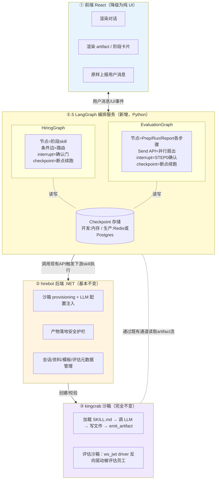

**几个容易误读的地方，提前说清楚：**

1. LangGraph 编排服务**不是**取代 hirebot 后端，而是取代**前端里那部分本来就不该长在 UI 层的编排逻辑**。hirebot 后端的 sandbox provisioning 和产物落地校验原样保留，LangGraph 节点调用它，而不是绕过它。
2. LangGraph 节点触发下游 skill 执行时，走的还是"现有的调用链路"（在生产链里对应节点内部调用一个 `run_skill_in_sandbox` 封装函数，本质上是复用 hirebot 后端已有的能力，而不是自己重新实现一套沙箱通信协议）。
3. 图里的双向虚线表示 LangGraph 服务需要感知 kingcrab 通过既有链路吐出的 artifact 流（用来判断节点该不该往下走、给结构化输出做校验），但不负责重新实现这条通道。

### 3.2 模块划分总览表

| 模块 | 归属层 | 是否新增/变更 | 一句话职责 |
|---|---|---|---|
| 前端 UI 渲染 | ① 前端 | 变更（大幅精简） | 只管展示，不再做路由判断和 prompt 拼装 |
| `HiringGraph` | ①.5 LangGraph 服务 | **新增** | 生产链的状态图：接材料 → 四阶段流水线 → 出包 |
| `EvaluationGraph` | ①.5 LangGraph 服务 | **新增** | 评估链的状态图：Prep → Run×N（并行）→ Report |
| Checkpoint 存储 | ①.5 LangGraph 服务 | **新增** | 图执行到哪一步的持久化快照，支撑断点续跑和 interrupt |
| `run_skill_in_sandbox` 封装 | ①.5 LangGraph 服务 | **新增**（内部调用既有能力） | 节点驱动 kingcrab 执行某个下游 skill 的统一入口 |
| 会话 / 资料 / 模板管理 | ② hirebot 后端 | 不变 | 业务数据的增删改查 |
| 沙箱 provisioning | ② hirebot 后端 | 不变 | 建沙箱、装模板、注入 LLM 配置 |
| 产物落地安全护栏 | ② hirebot 后端 | 不变 | 路径白名单、敏感值正则、JSON 校验 + 兜底降级 |
| kingcrab Agent 执行平台 | ③ kingcrab 沙箱 | 不变 | 真正加载 SKILL.md、调 LLM、写文件、emit_artifact |
| `ws_jwt` 评估驱动器 | ③ kingcrab 沙箱 | 不变 | Run Agent 用它反向驱动被评估员工的真实对话 |

### 3.3 各模块职责矩阵（输入 / 输出）

| 模块 | 输入 | 输出 | 关键约束 |
|---|---|---|---|
| 前端 UI | 用户输入、graph 推送的状态更新 | 用户消息、UI 事件（如"点击确认"按钮） | 不做任何路由判断，纯展示 |
| `HiringGraph` | 用户消息、材料文件、kingcrab artifact 流 | 阶段状态更新、下游 skill 触发指令、interrupt 请求 | 每个节点的输出必须符合对应的结构化 schema |
| `EvaluationGraph` | 评估任务参数、被评估员工模板引用、评估过程 artifact/trace | 评估进度更新、最终报告路径 | STEP5/6/7 对应节点严禁调用 LLM，必须是纯代码聚合 |
| hirebot 后端 | LangGraph 服务的调用请求 | 沙箱句柄、产物落地结果 | 安全护栏逻辑不因迁移而放松 |
| kingcrab 沙箱 | SKILL.md、注入的 LLM 配置、用户/系统消息 | 文件写入、emit_artifact 事件流 | 行为完全由 SKILL.md 定义，LangGraph 不改这一层 |

第 4–6 章展开生产链的 `HiringGraph` 具体设计，第 7–9 章展开评估链的 `EvaluationGraph` 具体设计。

---

## 4. 生产链 LangGraph 设计（HiringGraph）

### 4.1 核心概念与现状映射

LangGraph 的几个核心概念，和现状里的对应物基本能一一对上号，这也是为什么 S1/S2 都认为"这次迁移概念上不难，难的是改得彻不彻底"：

| LangGraph 概念 | 现状对应物 | 类比 |
|---|---|---|
| **State** | 现状散落在前端各个 hook/变量里的 `DownstreamRunState` | 一路带着走的"公文包"，每个节点都能看、能改 |
| **Node** | 现状"启动某个下游 skill"这个动作本身 | 一个"盒子"，进去是状态，出来是更新后的状态 |
| **Edge** | 现状写死的"A 走完直接跳 B" | 固定箭头 |
| **Conditional Edge** | 现状 `resolveXxxRoute` 那一堆 if/else | 一个"判断菱形框" |
| **Checkpoint** | 现状几乎没有，全靠前端内存态硬扛，刷新页面就丢 | 游戏存档点 |
| **interrupt** | 现状的关键词确认门 | "暂停，等一个点头" |

### 4.2 State 设计：HiringState 完整 Schema

```python
from typing import TypedDict, Literal, Optional

StageStatus = Literal[
    "pending",          # 尚未开始
    "waiting_confirm",  # 等待用户确认（interrupt 挂起点）
    "running",          # 节点正在驱动 kingcrab 执行
    "completed",        # 已完成，产物已校验通过
    "skipped",          # 可选阶段被跳过
    "failed",           # 执行失败，等待重试或人工介入
]

class HiringState(TypedDict):
    # 会话上下文
    session_id: str
    workspace_root: str
    user_message: str
    incoming_file_count: int

    # 各阶段状态（对应 R1–R6 流水线）
    material: StageStatus
    slice_extraction: StageStatus        # R1
    skill_definition: StageStatus        # 技能定义确认门
    ontology_projection: StageStatus     # R2
    skill_generation: StageStatus        # R3
    external_system: StageStatus
    packaging_testcases: StageStatus     # R4，可选
    review: StageStatus                  # R5，可选
    packaging: StageStatus               # R6

    # 辅助字段
    last_summary: str                    # 给用户看的当前进展摘要
    retry_count: dict[str, int]          # 节点级重试计数，供第 10.2 节使用
    error_log: list[str]                 # 失败记录，供异常处理/可观测性使用
```

> **一点补充说明：** 源文档 S1 的示意代码里，"技能定义确认"这个动作是隐式折叠在 `skill_generation` 字段的 `waiting_confirm` 状态里的。本文为了让状态图更完整、更方便做异常追踪，把它拆成独立的 `skill_definition` 字段。这是本文在源文档基础上做的一处小优化，不影响原文档论证的核心结论，评审时如果团队更倾向于原始的折叠写法，也可以直接合并回去。

### 4.3 节点清单（Node Catalog）

| 节点函数 | 对应流水线阶段 | 类型 | 一句话职责 |
|---|---|---|---|
| `node_material_intake` | 资料收口 | 纯代码 | 判断材料是否收齐，决定能否进入 R1 |
| `node_slice_extraction` | R1 本体切片抽取 | 调用 LLM（驱动沙箱） | 驱动 kingcrab 跑 `ontology-slice-extraction` |
| `node_skill_definition_gate` | 技能定义确认门 | **interrupt** | 暂停，等用户确认技能定义方向 |
| `node_ontology_projection` | R2 数据匹配投影 | 调用 LLM（驱动沙箱） | 驱动 kingcrab 跑 `ontology-projection` |
| `node_skill_generation` | R3 技能生成 | 调用 LLM（驱动沙箱） | 驱动 kingcrab 跑 `skill-generation` |
| `node_external_system` | 外部系统配置 | 调用 LLM（驱动沙箱） | 驱动 kingcrab 跑 `external-config` |
| `node_packaging_testcases_gate` | 测试用例确认门（可选分支入口） | **interrupt** | 询问用户是否需要生成测试用例 |
| `node_packaging_testcases` | R4 测试用例生成 | 调用 LLM（驱动沙箱） | 驱动 kingcrab 跑 `packaging-test-cases` |
| `node_review_readiness` | 完整性审查路由判断 | 纯代码 | 决定走"需要审查"还是"跳过审查"分支 |
| `node_completeness_review` | R5 完整性审查 | 调用 LLM（驱动沙箱） | 驱动 kingcrab 跑 `completeness-review` |
| `node_packaging` | R6 打包 | 调用 LLM（驱动沙箱） | 驱动 kingcrab 跑 `packaging`，产出 `template_package` |

注意 `node_material_intake` 和 `node_review_readiness` 是**纯代码节点，不调用 LLM**——这是 LangGraph 的一个常被忽略的优势：不是图里每个节点都得是一次模型调用，判断性、聚合性的逻辑完全可以是普通 Python 函数，比在现状里把这类判断也裹进 prompt 让 LLM"顺便判断一下"要可靠得多。

### 4.4 边与条件边：路由逻辑设计

固定边（Edge）负责没有分支的"必然下一步"，比如 `slice_extraction` 完成后必然进入 `skill_definition_gate`。条件边（Conditional Edge）负责替换现状里那堆 `resolveXxxRoute`：

```python
def route_after_review_readiness(state: HiringState) -> str:
    """替代现状 resolveReviewRoute 的 if/else 路由判断"""
    if state["review"] == "skipped":
        return "node_packaging"
    if state["packaging_testcases"] == "completed":
        return "node_completeness_review"
    return "node_packaging_testcases_gate"

graph.add_conditional_edges(
    "node_review_readiness",
    route_after_review_readiness,
    {
        "node_packaging": "node_packaging",
        "node_completeness_review": "node_completeness_review",
        "node_packaging_testcases_gate": "node_packaging_testcases_gate",
    },
)
```

和现状比，核心差异不是"逻辑变了"（判断条件基本是照抄现状 `resolveXxxRoute` 里的规则），而是这段逻辑**从前端 TS 文件搬进了图定义**，和其他节点、边放在同一份可视化的图结构里，不用再靠人脑在几个文件之间跳转拼凑出完整流程。

### 4.5 interrupt 设计：人工确认门

```python
from langgraph.types import interrupt, Command
from langgraph.checkpoint.memory import MemorySaver

def node_skill_definition_gate(state: HiringState) -> HiringState:
    decision = interrupt({
        "question": "以下是本次技能定义方案，是否确认？",
        "context": state["last_summary"],
    })
    if decision == "确认":
        return {**state, "skill_definition": "completed"}
    return {**state, "skill_definition": "waiting_confirm"}

# 开发/影子运行阶段：内存版 checkpointer（进程重启即丢失，仅用于验证逻辑）
checkpointer = MemorySaver()
app = graph.compile(checkpointer=checkpointer)

# 首次调用，图跑到 interrupt 处自动挂起
app.invoke({"user_message": "..."}, config={"configurable": {"thread_id": session_id}})

# 用户在前端点击"确认"后，恢复执行
app.invoke(Command(resume="确认"), config={"configurable": {"thread_id": session_id}})
```

这段完全对应现状的"关键词确认门"，区别在于：现状是**前端用正则/关键词猜用户是不是在说"同意"**；LangGraph 里，图执行会**真正暂停并持久化在 checkpoint 里**，前端只需要把用户的确认动作（哪怕是一个按钮点击，而不是一句自然语言）原样传回来即可——这顺带还解决了"用户换个说法说'同意'但关键词词典没收录"的问题，因为确认动作可以从"猜测自然语言"降级为"前端按钮回传一个确定的信号"。

### 4.6 提示词模板 + 结构化输出替代"死命令注入"

```python
from pydantic import BaseModel, Field
from typing import Literal

class ProjectionResult(BaseModel):
    slug: str = Field(description="本次投影生成的技能标识")
    projection_file_path: str = Field(description="产物文件相对路径")
    matched_fields: list[str] = Field(description="成功匹配的本体字段")
    unmatched_fields: list[str] = Field(default_factory=list, description="未匹配字段，需人工关注")
    status: Literal["success", "partial", "failed"]

def node_ontology_projection(state: HiringState) -> HiringState:
    prompt = ONTOLOGY_PROJECTION_PROMPT_TEMPLATE.format(
        workspace_root=state["workspace_root"],
        slice_summary=state["last_summary"],
    )
    result: ProjectionResult = run_skill_in_sandbox(
        state["session_id"], "ontology-projection", prompt
    ).with_structured_output(ProjectionResult)

    if result.status == "failed":
        return {**state, "ontology_projection": "failed",
                "error_log": state["error_log"] + [f"投影失败: {result.unmatched_fields}"]}
    return {**state, "ontology_projection": "completed",
            "last_summary": f"已生成投影 {result.slug}"}
```

现状的"死命令"是一段自然语言，塞进 prompt 里指望 LLM 记得住、听得懂、照着做（"必须用 write_file 写""失败要标记 xxx"）；这里把其中**可以变成硬约束的部分**（产物必须有哪些字段、状态只能是哪几种取值）改成 Pydantic schema，模型如果不遵守，`with_structured_output` 直接报错，触发重试，而不是让一份格式不对的 JSON 混进下游流程。**但注意**：prompt 本身并没有消失，节点里依然需要给模型一段自然语言指令（`ONTOLOGY_PROJECTION_PROMPT_TEMPLATE`），只是这段指令现在管的是"内容怎么产出"，"产出的结构对不对"这件事交给了代码。

### 4.7 节点如何驱动沙箱执行（不重造轮子）

LangGraph 本身不提供沙箱，第 2.3 节已经强调过这一点。节点驱动 kingcrab 执行下游 skill，走的是对现有 hirebot 后端能力的封装调用，而不是重新实现一套沙箱通信协议：

```python
async def run_skill_in_sandbox(session_id: str, skill_name: str, prompt: str) -> SkillRunResult:
    """
    复用 hirebot 后端现有的沙箱触发能力（对应现状里前端拼好
    buildDownstreamPrompt 之后向 kingcrab 发消息的那条链路），
    而不是重新实现沙箱通信协议或产物落地校验。
    """
    response = await hirebot_client.trigger_skill(
        session_id=session_id, skill_name=skill_name, injected_prompt=prompt,
    )
    # 阻塞等待 kingcrab 通过既有 artifact 通道吐出该 skill 的终态产物
    artifact = await wait_for_terminal_artifact(session_id, skill_name, timeout_s=300)
    return SkillRunResult(artifact=artifact, raw_response=response)
```

`wait_for_terminal_artifact` 为什么能比现状更可靠地判断"这一步到底完没完"，第 10.1 节会展开讲"三层保险机制"，这里先记住一个结论：**节点函数的返回，本身就是完成信号**，不再需要专门等待模型自觉 emit 一个 `done` 事件。

### 4.8 完整状态流转图

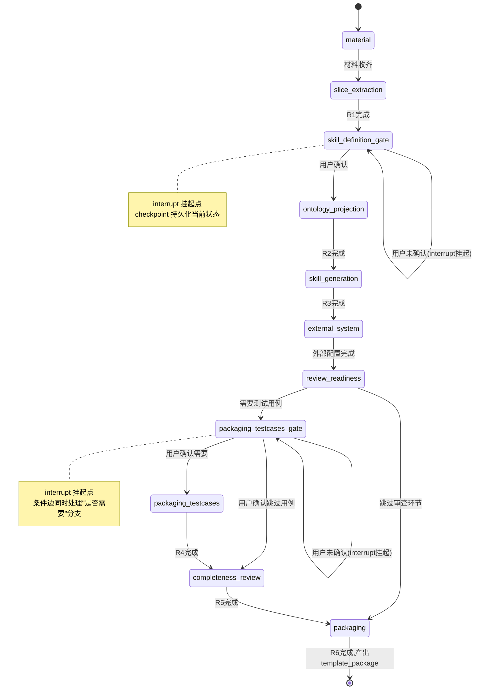

---

## 5. 生产链模块级实现逻辑详解

### 5.1 各节点输入输出契约总表

| 节点 | 读取的 State 字段 | 写回的 State 字段 | 外部依赖 |
|---|---|---|---|
| `node_material_intake` | `incoming_file_count` | `material`, `last_summary` | 无（纯代码） |
| `node_slice_extraction` | `workspace_root`, `material` | `slice_extraction`, `last_summary` | kingcrab（R1） |
| `node_skill_definition_gate` | `last_summary` | `skill_definition` | 用户 interrupt 输入 |
| `node_ontology_projection` | `workspace_root`, `last_summary` | `ontology_projection`, `last_summary`, `error_log` | kingcrab（R2） |
| `node_skill_generation` | `workspace_root` | `skill_generation` | kingcrab（R3） |
| `node_external_system` | `workspace_root` | `external_system`, `error_log` | kingcrab |
| `node_review_readiness` | `review`, `packaging_testcases` | 无（判断锚点，不改状态） | 无（纯代码） |
| `node_packaging_testcases_gate` | `last_summary` | `packaging_testcases` | 用户 interrupt 输入 |
| `node_packaging_testcases` | `workspace_root` | `packaging_testcases` | kingcrab（R4） |
| `node_completeness_review` | `workspace_root` | `review`, `error_log` | kingcrab（R5） |
| `node_packaging` | `workspace_root` | `packaging`, `last_summary` | kingcrab（R6） |

### 5.2 补充节点实现（第 4 章未展开的部分）

```python
def node_material_intake(state: HiringState) -> HiringState:
    """纯代码判断：材料是否收齐，不调用 LLM"""
    if state["incoming_file_count"] == 0:
        return {**state, "material": "pending", "last_summary": "等待用户上传资料"}
    return {**state, "material": "completed",
            "last_summary": f"已收到 {state['incoming_file_count']} 份材料，进入本体切片抽取"}


async def node_external_system(state: HiringState) -> HiringState:
    prompt = EXTERNAL_SYSTEM_PROMPT_TEMPLATE.format(workspace_root=state["workspace_root"])
    result = await run_skill_in_sandbox(state["session_id"], "external-config", prompt)
    if not result.artifact.is_terminal_success():
        return {**state, "external_system": "failed",
                "error_log": state["error_log"] + [result.artifact.error_message]}
    return {**state, "external_system": "completed"}


def node_packaging_testcases_gate(state: HiringState) -> HiringState:
    decision = interrupt({
        "question": "是否需要为该数字员工生成测试用例？（可选步骤）",
        "context": state["last_summary"],
    })
    if decision == "需要":
        return {**state, "packaging_testcases": "waiting_confirm"}
    return {**state, "packaging_testcases": "skipped"}


async def node_packaging_testcases(state: HiringState) -> HiringState:
    prompt = PACKAGING_TESTCASES_PROMPT_TEMPLATE.format(workspace_root=state["workspace_root"])
    result = await run_skill_in_sandbox(state["session_id"], "packaging-test-cases", prompt)
    if not result.artifact.is_terminal_success():
        return {**state, "packaging_testcases": "failed",
                "error_log": state["error_log"] + [result.artifact.error_message]}
    return {**state, "packaging_testcases": "completed"}


def node_review_readiness(state: HiringState) -> HiringState:
    """纯代码判断锚点：本身不改状态，真正的分支选择在 4.4 节的条件边函数里"""
    return state


async def node_completeness_review(state: HiringState) -> HiringState:
    prompt = COMPLETENESS_REVIEW_PROMPT_TEMPLATE.format(workspace_root=state["workspace_root"])
    result: ReviewResult = await run_skill_in_sandbox(
        state["session_id"], "completeness-review", prompt
    ).with_structured_output(ReviewResult)
    if result.severity == "P0":
        return {**state, "review": "failed",
                "error_log": state["error_log"] + [f"P0阻断项: {result.blocking_issues}"]}
    return {**state, "review": "completed"}


async def node_packaging(state: HiringState) -> HiringState:
    prompt = PACKAGING_PROMPT_TEMPLATE.format(workspace_root=state["workspace_root"])
    result = await run_skill_in_sandbox(state["session_id"], "packaging", prompt)
    return {**state, "packaging": "completed",
            "last_summary": f"数字员工包已生成：{result.artifact.package_path}"}
```

### 5.3 图组装：把节点和边拼起来

```python
from langgraph.graph import StateGraph, START, END

graph = StateGraph(HiringState)

for name, fn in [
    ("node_material_intake", node_material_intake),
    ("node_slice_extraction", node_slice_extraction),
    ("node_skill_definition_gate", node_skill_definition_gate),
    ("node_ontology_projection", node_ontology_projection),
    ("node_skill_generation", node_skill_generation),
    ("node_external_system", node_external_system),
    ("node_review_readiness", node_review_readiness),
    ("node_packaging_testcases_gate", node_packaging_testcases_gate),
    ("node_packaging_testcases", node_packaging_testcases),
    ("node_completeness_review", node_completeness_review),
    ("node_packaging", node_packaging),
]:
    graph.add_node(name, fn)

graph.add_edge(START, "node_material_intake")
graph.add_conditional_edges("node_material_intake", route_after_material,
    {"node_slice_extraction": "node_slice_extraction", "node_material_intake": "node_material_intake"})
graph.add_edge("node_slice_extraction", "node_skill_definition_gate")
graph.add_conditional_edges("node_skill_definition_gate", route_after_skill_definition,
    {"node_ontology_projection": "node_ontology_projection", "node_skill_definition_gate": "node_skill_definition_gate"})
graph.add_edge("node_ontology_projection", "node_skill_generation")
graph.add_edge("node_skill_generation", "node_external_system")
graph.add_edge("node_external_system", "node_review_readiness")
graph.add_conditional_edges("node_review_readiness", route_after_review_readiness, {
    "node_packaging": "node_packaging",
    "node_completeness_review": "node_completeness_review",
    "node_packaging_testcases_gate": "node_packaging_testcases_gate",
})
graph.add_conditional_edges("node_packaging_testcases_gate", route_after_testcases_gate, {
    "node_packaging_testcases": "node_packaging_testcases",
    "node_completeness_review": "node_completeness_review",
})
graph.add_edge("node_packaging_testcases", "node_completeness_review")
graph.add_edge("node_completeness_review", "node_packaging")
graph.add_edge("node_packaging", END)

app = graph.compile(checkpointer=checkpointer)
```

这段拼装代码本身，就是"整条雇佣流程长什么样"这件事**第一次有了一份可以打印出来看的、单一权威来源的定义**——现状要理解完整流程，得同时打开 `hiringDownstreamTriggers.ts`、`buildDownstreamPrompt`、`DOWNSTREAM_ARTIFACT_TRACKS` 三个地方的代码在脑子里拼图；这里一份 `graph.add_edge/add_conditional_edges` 的清单就是全部。这也是 LangGraph 对"可维护性"这一项最直接的贡献。

---

## 6. 生产链：与原架构的映射关系表

### 6.1 原架构组件 → LangGraph 概念映射总表

| 原架构位置（文件/函数/类） | 现状职责 | 迁移后对应 | 迁移动作 |
|---|---|---|---|
| `hiringDownstreamTriggers.ts` 中 `isXxxApprovalMessage` 系列 | 关键词识别用户是否确认 | `interrupt()` 挂起点 + 前端按钮回传确定信号 | **迁移**：从"猜测自然语言"改为"接收确定信号" |
| `hiringDownstreamTriggers.ts` 中 `resolveXxxRoute`（含 `resolvePackageReviewDecisionRoute`） | 手写 if/else 路由判断 | `add_conditional_edges` 的路由函数 | **迁移**：判断条件基本照搬，位置从 TS 文件搬进图定义 |
| `buildDownstreamPrompt` | 拼装注入下游 skill 的"死命令"提示词 | 各节点内的 Prompt 模板（如 `ONTOLOGY_PROJECTION_PROMPT_TEMPLATE`） | **迁移**：内容大部分照搬，结构约束部分转移给 Pydantic schema |
| `DOWNSTREAM_ARTIFACT_TRACKS` | 把 artifact 事件映射成阶段状态 | `HiringState` 里的 `StageStatus` 字段 + 节点返回值 | **大部分替代**：完成判断权从"等 LLM 发事件"转移到"节点返回即完成"；但仍需要一层适配把 graph state 变化翻译成 artifact 风格事件推给前端渲染 |
| 前端内存态（页面刷新即丢） | 临时存当前跑到哪一步 | Checkpoint 存储（Redis/Postgres） | **迁移+增强**：从"不持久化"变成"持久化，支持断点续跑" |
| `SandboxProvisioningSettings.cs`（.NET） | 沙箱 provisioning + LLM 配置注入 | 不变，被 `run_skill_in_sandbox` 调用 | **不动** |
| hirebot 后端产物落地校验（路径白名单、敏感值正则、JSON 校验） | 产物写盘前的安全护栏 | 不变 | **不动** |
| `EmployeeHiringService.cs` 建沙箱/装模板流程 | 沙箱 provisioning 业务逻辑 | 不变，LangGraph 服务调用而非绕过 | **不动** |
| `EmitArtifactTool.cs` + `SkillArtifactRuntime`（kingcrab C#） | kingcrab 内部产物校验与推流 | 不变 | **不动** |
| `LoadSkillTool.cs`（渐进披露） | kingcrab 内部按需加载下游 SKILL.md | 不变 | **不动** |
| `[Internal downstream trigger: use skill xxx]` prompt 约定 | 现状唯一驱动"进入下一个 skill"的机制，无代码实现 | 被 `run_skill_in_sandbox` 的显式调用取代 | **迁移**：从"纯 prompt 约定，无代码兜底"变成"代码显式触发+校验" |

### 6.2 迁移边界一览：什么动、什么不动

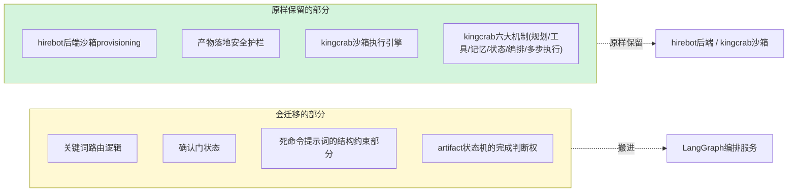

### 6.3 差异说明：行为层面到底变了什么

| 行为维度 | 迁移前 | 迁移后 | 影响 |
|---|---|---|---|
| 完成判断依据 | LLM 自觉 emit `done` 事件 | 节点函数返回 + 结构化输出校验通过 | 根治"漏发信号卡死" |
| 确认门交互 | 猜测自然语言关键词 | 前端按钮回传确定信号 | 消除"换个说法识别不到"的问题 |
| 流程定义的权威来源 | 三个文件里的逻辑拼在一起才是完整流程 | 一份 `graph.add_edge/add_conditional_edges` 清单 | 可维护性显著提升 |
| 状态持久化 | 前端内存态，刷新丢失 | Checkpoint 持久化，支持断点续跑 | 新增能力，现状没有 |
| 架构范式 | 事件驱动（被动等待模型推送信号） | 同步调用（主动调用/阻塞/判断） | 控制权从"LLM 手里"转移到"编排代码手里" |
| 系统进程数 | 前端 + hirebot 后端 + kingcrab 沙箱，三个 | 新增 LangGraph 编排服务，变成四个 | 局部复杂度下降，整体复杂度上升（新增一个 Python 运行时和一次网络跳转） |
| 内容质量（测试用例好不好、字段准不准） | 取决于模型能力 | **完全不变**，取决于模型能力 | LangGraph 在这一点上没有任何帮助，需要低温度/结构化输出/强模型来解决 |

---

## 7. 评估链 LangGraph 设计（EvaluationGraph）【本篇推演，S1/S2 未覆盖】

> 提醒：本章内容是本文按照第 4–6 章同样的设计原则，在 S5/S6/S8 对评估链现状事实描述的基础上做的推演设计，不是 S1/S2 两份源文档的结论，评审时请重点核对。

### 7.1 现状到 LangGraph 的设计思路

评估链和生产链的起点不一样：生产链现状是"前端裸手写状态机"，评估链现状**已经有**一个"轻量状态机 Orchestrator + 文件系统通信"的雏形（见 1.4 节）。这意味着评估链上 LangGraph 的收益点，不是"从无到有治好卡死问题"，而是三件更具体的事：

1. 把手搓的 Orchestrator（自己维护 `eval_id`/`phase`/`tc_list`/`completed_tcs`）换成 LangGraph 原生的 State + Checkpoint，不用再自己写持久化和恢复逻辑。
2. `Run Agent × N` 目前是手搓循环 + 文件系统协调（写 `run_plan.json`，各自写 `traces/`+`scores/`，最后读 `summary.json` 汇总），LangGraph 的 **Send API** 是专门为"运行时才知道要扇出几份"这种场景设计的原生并行原语，能直接替代这一套手工协调。
3. STEP5/6/7 明确要求"禁止 LLM·字节拷贝"，这一点在显式图结构里可以通过"这几步固定是纯代码节点"来强制体现，比藏在一段普通业务代码里更醒目、更不容易被后续改动不小心破坏。

### 7.2 State 设计：EvaluationState 完整 Schema

```python
from typing import TypedDict, Literal, Optional
from typing_extensions import Annotated
import operator

TestCaseStatus = Literal["pending", "running", "completed", "failed"]

class TestCaseRunResult(TypedDict):
    tc_id: str
    trace_path: str
    score_path: str
    status: TestCaseStatus

class EvaluationState(TypedDict):
    eval_id: str
    employee_template_ref: str            # 被评估员工模板引用
    target_sandbox_endpoint: str          # 被评估员工所在沙箱的连接信息

    # Prep 阶段产出
    role_catalog: Optional[dict]
    resolved_employee: Optional[dict]     # STEP0 确认结果
    metric_registry: Optional[dict]
    curated_metrics: Optional[list]
    test_cases: Optional[list]            # STEP1.5 + STEP2 enrich 后的用例
    run_plan: Optional[dict]              # STEP2.5 产出

    # Run 阶段产出：并行扇出的多个分支各自返回一份，靠 operator.add 自动合并
    tc_results: Annotated[list[TestCaseRunResult], operator.add]

    # Report 阶段产出
    aggregated_summary: Optional[dict]
    redline_flags: Optional[list]
    report_paths: Optional[dict]
    upload_status: Literal["pending", "completed", "failed"]

    error_log: list[str]
```

**这里的 `Annotated[list[...], operator.add]` 是本章最重要的一个技术点**：`Run Agent × N` 并行跑起来后，N 个分支各自只返回自己那一份 `{"tc_results": [单条结果]}`；LangGraph 看到这个字段标注了 `operator.add` 归约函数，会自动把 N 份局部更新累加合并，而不是"谁最后写谁生效"式的互相覆盖。这直接替代了现状"各自写 `traces/`+`scores/`，最后靠 Report Agent 读文件系统汇总"的做法——汇总这件事从"读磁盘拼凑"变成了"框架自动做状态归约"。

### 7.3 节点清单（含 Send API 并行扇出设计）

| 节点 | 对应现状步骤 | 类型 | 一句话职责 |
|---|---|---|---|
| `node_load_role_catalog` | PRE.A | 纯代码 | 加载角色目录数据层 |
| `node_resolve_employee_gate` | STEP0 | LLM + **interrupt** | 识别并确认被评估员工 |
| `node_load_metric_registry` | PRE | 纯代码 | 加载指标注册表数据层 |
| `node_curate_metrics` | STEP1/1.2 | 调用 LLM | 按角色过滤 + 精选指标 |
| `node_synthesize_test_cases` | STEP1.5 | 调用 LLM（条件触发） | 现有用例不足时合成新用例 |
| `node_enrich_test_cases` | STEP2 | 调用 LLM | 补全测试用例细节 |
| `node_plan_run` | STEP2.5 | 纯代码 | 生成 `run_plan`，为扇出做准备 |
| `node_drive_and_score_test_case` | STEP3+STEP4 | 调用 LLM，**Send API 并行扇出** | 每条用例：驱动对话 + 并发多指标打分 |
| `node_aggregate_results` | STEP5/6/7 | **纯代码，严禁 LLM** | 确定性汇总 + 红线检查 |
| `node_generate_reports` | STEP8/9 | 模板渲染为主 | 生成 JSON/HTML 报告 |
| `node_upload_to_hirebot` | STEP10 | 纯代码 | 回传结果给 hirebot 后端 |

**为什么把 STEP3 和 STEP4 合并成一个节点：** 现状里 STEP4 是"每 (用例,指标) 一次 LLM 调用"，属于用例内部再一层的细粒度并行。如果连这一层也用 Send API 展开成图里的独立节点，图会变得很碎，可观测性提升有限但复杂度陡增。这里的设计选择是：**用例级别（Run Agent × N）用 Send API 做图级别的并行**，**指标级别的并行用 `asyncio.gather` 在节点内部处理**。如果团队后续确实需要在图层面单独观测每个指标的打分状态，可以把这个节点进一步拆成两层 Send，但这是一个可以按需升级的选择，不是本方案的硬性要求。

### 7.4 Send API 扇出实现

```python
from langgraph.types import Send

def dispatch_run(state: EvaluationState) -> list[Send]:
    """
    用 LangGraph 原生 Send API 做并行扇出，替代现状"手搓循环+文件系统协调"。
    对 run_plan 里的每一条测试用例，派生一个独立的 node_drive_and_score_test_case 调用；
    具体要扇出几份，运行时根据 run_plan 内容动态决定，这正是 Send API 设计初衷所在的场景。
    """
    return [
        Send("node_drive_and_score_test_case", {**state, "current_tc": tc})
        for tc in state["run_plan"]["test_cases"]
    ]

graph.add_conditional_edges("node_plan_run", dispatch_run, ["node_drive_and_score_test_case"])


async def node_drive_and_score_test_case(state: EvaluationState) -> dict:
    tc = state["current_tc"]
    # STEP3：ws_jwt driver 子进程，反向驱动被评估员工的真实对话（沙箱到沙箱通信机制不变）
    trace = await drive_employee_via_ws_jwt(
        target_endpoint=state["target_sandbox_endpoint"], test_case=tc,
    )
    # STEP4：对该用例涉及的每个指标并发调用 LLM 打分
    scores = await asyncio.gather(*[
        score_trace_on_metric(trace, metric) for metric in tc["applicable_metrics"]
    ])
    # 注意：这里只返回"这一个分支自己的贡献"，不是完整 state
    return {"tc_results": [TestCaseRunResult(
        tc_id=tc["id"], trace_path=trace.path, score_path=save_scores(scores), status="completed",
    )]}
```

驱动被评估员工真实对话所用的 `ws_jwt` 底层机制**完全不变**——这依然是评估沙箱通过 WebSocket + JWT 反向连接被评估员工沙箱的既有能力，LangGraph 节点只是这个既有能力的调用方，不重新实现它。

### 7.5 interrupt 设计：STEP0 人工确认

```python
async def node_resolve_employee_gate(state: EvaluationState) -> EvaluationState:
    candidate = await llm_resolve_employee(state["employee_template_ref"])
    decision = interrupt({
        "question": f"识别到待评估员工为「{candidate['name']}」，是否确认？",
        "context": candidate,
    })
    if decision == "确认":
        return {**state, "resolved_employee": candidate}
    return {**state, "resolved_employee": None}   # 回退，等待重新指定
```

和生产链的确认门设计思路一致：LLM 先做识别，人工确认只做"点头/摇头"这个动作，这个动作被 `interrupt()` 真实挂起并持久化，而不是靠前端猜测用户下一句话是不是在确认。

### 7.6 纯代码节点 vs LLM 节点划分（重点）

评估链的现状材料里明确标注 STEP5/6/7"禁止 LLM·字节拷贝"，这一点在图设计里必须显式体现，不能因为"图里其他节点都在调 LLM"就顺手也让这几步调一下模型：

| 节点 | 是否调用 LLM | 原因 |
|---|---|---|
| `node_load_role_catalog` / `node_load_metric_registry` | ❌ 否 | 单纯的数据加载 |
| `node_resolve_employee_gate` | ✅ 是（识别部分） | 需要理解自然语言引用去匹配候选员工 |
| `node_curate_metrics` / `node_synthesize_test_cases` / `node_enrich_test_cases` | ✅ 是 | 需要语义理解和内容生成能力 |
| `node_plan_run` | ❌ 否 | 纯粹是把已有信息结构化成执行计划 |
| `node_drive_and_score_test_case` | ✅ 是 | 驱动对话需要语言理解，打分需要语义判断 |
| `node_aggregate_results` | ❌ **严禁** | 源材料明确要求这一步"字节拷贝"，任何语义层面的"帮你顺便润色一下"都是不允许的，防止评分结果被模型不知不觉篡改 |
| `node_generate_reports` | ⚠️ 视情况 | JSON 报告应为纯模板渲染；HTML 报告若需要自然语言摘要小节，可以让 LLM 只负责这一小块叙述性文字，不碰核心数据 |
| `node_upload_to_hirebot` | ❌ 否 | 纯 HTTP 调用 |

这张表本身就是"不是每个 LangGraph 节点都得调模型"这条原则最直接的证据——把确定性计算和模型调用在图结构里显式分开，比现状"整个 Agent 会话里 LLM 自己决定这一步要不要认真按规则算"要可靠得多。

### 7.7 完整状态流转图

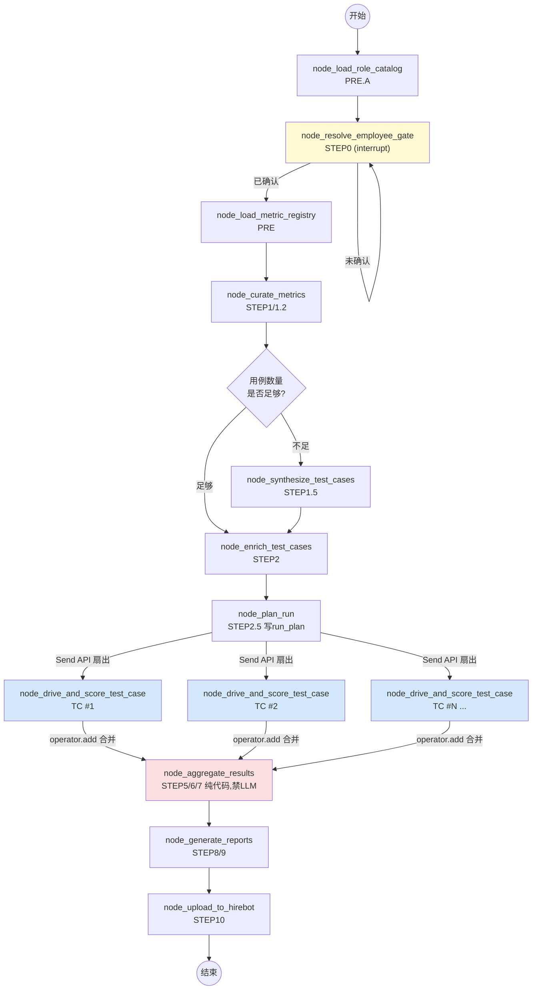

---

## 8. 评估链模块级实现逻辑详解

### 8.1 各节点输入输出契约总表

| 节点 | 读取的 State 字段 | 写回的 State 字段 | 外部依赖 |
|---|---|---|---|
| `node_load_role_catalog` | 无 | `role_catalog` | `role-catalog/` 数据层 |
| `node_resolve_employee_gate` | `employee_template_ref` | `resolved_employee` | LLM + 用户 interrupt 输入 |
| `node_load_metric_registry` | 无 | `metric_registry` | `metrics/` 数据层 |
| `node_curate_metrics` | `resolved_employee`, `metric_registry` | `curated_metrics` | kingcrab（LLM 调用） |
| `node_synthesize_test_cases` | `curated_metrics` | `test_cases` | kingcrab（LLM 调用） |
| `node_enrich_test_cases` | `test_cases` | `test_cases` | kingcrab（LLM 调用） |
| `node_plan_run` | `test_cases` | `run_plan` | 无（纯代码） |
| `node_drive_and_score_test_case` | `run_plan`、`current_tc`、`target_sandbox_endpoint` | `tc_results`（局部贡献，自动合并） | `ws_jwt` driver + kingcrab 打分 LLM |
| `node_aggregate_results` | `tc_results` | `aggregated_summary`, `redline_flags` | 无（纯代码） |
| `node_generate_reports` | `aggregated_summary`, `redline_flags` | `report_paths` | 视情况少量 LLM |
| `node_upload_to_hirebot` | `report_paths`, `aggregated_summary`, `tc_results` | `upload_status` | hirebot 后端 HTTP 接口 |

### 8.2 补充节点实现（第 7 章未展开的部分）

```python
def node_load_role_catalog(state: EvaluationState) -> EvaluationState:
    """纯代码：加载 role-catalog/ 数据层，不调用 LLM"""
    catalog = load_data_layer(state["eval_id"], "role-catalog")
    return {**state, "role_catalog": catalog}


def node_load_metric_registry(state: EvaluationState) -> EvaluationState:
    """纯代码：加载 metrics/ 数据层"""
    registry = load_data_layer(state["eval_id"], "metrics")
    return {**state, "metric_registry": registry}


async def node_curate_metrics(state: EvaluationState) -> EvaluationState:
    prompt = CURATE_METRICS_PROMPT_TEMPLATE.format(
        role=state["resolved_employee"]["role"], registry=state["metric_registry"],
    )
    curated = await run_skill_in_sandbox(state["eval_id"], "curate-metrics", prompt)
    return {**state, "curated_metrics": curated.result}


async def node_synthesize_test_cases(state: EvaluationState) -> EvaluationState:
    prompt = SYNTHESIZE_TESTCASES_PROMPT_TEMPLATE.format(metrics=state["curated_metrics"])
    synthesized = await run_skill_in_sandbox(state["eval_id"], "synthesize-test-cases", prompt)
    return {**state, "test_cases": synthesized.result}


async def node_enrich_test_cases(state: EvaluationState) -> EvaluationState:
    prompt = ENRICH_TESTCASES_PROMPT_TEMPLATE.format(test_cases=state["test_cases"])
    enriched = await run_skill_in_sandbox(state["eval_id"], "enrich-test-cases", prompt)
    return {**state, "test_cases": enriched.result}


def node_plan_run(state: EvaluationState) -> EvaluationState:
    """纯代码：把已 enrich 的测试用例整理成执行计划，不调用 LLM"""
    plan = {"test_cases": state["test_cases"], "dispatched_at": now_iso()}
    write_run_plan(state["eval_id"], plan)
    return {**state, "run_plan": plan}


async def node_generate_reports(state: EvaluationState) -> EvaluationState:
    json_report = render_json_report(state["aggregated_summary"], state["redline_flags"])
    html_report = render_html_report(json_report)   # 模板渲染为主，非必须调 LLM
    return {**state, "report_paths": {"json": json_report.path, "html": html_report.path}}


async def node_upload_to_hirebot(state: EvaluationState) -> EvaluationState:
    await hirebot_client.sync_verdict(state["eval_id"], state["aggregated_summary"])
    await hirebot_client.sync_trace(state["eval_id"], state["tc_results"])
    await hirebot_client.report_content(state["eval_id"], state["report_paths"])
    return {**state, "upload_status": "completed"}
```

### 8.3 图组装：把节点和边拼起来

```python
def route_after_resolve_employee(state: EvaluationState) -> str:
    return "node_load_metric_registry" if state["resolved_employee"] else "node_resolve_employee_gate"

def route_test_case_synthesis_needed(state: EvaluationState) -> str:
    if len(state.get("curated_metrics", {}).get("existing_cases", [])) < MIN_REQUIRED_CASES:
        return "node_synthesize_test_cases"
    return "node_enrich_test_cases"

graph = StateGraph(EvaluationState)

for name, fn in [
    ("node_load_role_catalog", node_load_role_catalog),
    ("node_resolve_employee_gate", node_resolve_employee_gate),
    ("node_load_metric_registry", node_load_metric_registry),
    ("node_curate_metrics", node_curate_metrics),
    ("node_synthesize_test_cases", node_synthesize_test_cases),
    ("node_enrich_test_cases", node_enrich_test_cases),
    ("node_plan_run", node_plan_run),
    ("node_drive_and_score_test_case", node_drive_and_score_test_case),
    ("node_aggregate_results", node_aggregate_results),
    ("node_generate_reports", node_generate_reports),
    ("node_upload_to_hirebot", node_upload_to_hirebot),
]:
    graph.add_node(name, fn)

graph.add_edge(START, "node_load_role_catalog")
graph.add_edge("node_load_role_catalog", "node_resolve_employee_gate")
graph.add_conditional_edges("node_resolve_employee_gate", route_after_resolve_employee,
    {"node_load_metric_registry": "node_load_metric_registry",
     "node_resolve_employee_gate": "node_resolve_employee_gate"})
graph.add_edge("node_load_metric_registry", "node_curate_metrics")
graph.add_conditional_edges("node_curate_metrics", route_test_case_synthesis_needed,
    {"node_synthesize_test_cases": "node_synthesize_test_cases",
     "node_enrich_test_cases": "node_enrich_test_cases"})
graph.add_edge("node_synthesize_test_cases", "node_enrich_test_cases")
graph.add_edge("node_enrich_test_cases", "node_plan_run")
graph.add_conditional_edges("node_plan_run", dispatch_run, ["node_drive_and_score_test_case"])
graph.add_edge("node_drive_and_score_test_case", "node_aggregate_results")
graph.add_edge("node_aggregate_results", "node_generate_reports")
graph.add_edge("node_generate_reports", "node_upload_to_hirebot")
graph.add_edge("node_upload_to_hirebot", END)

eval_app = graph.compile(checkpointer=checkpointer)
```

`node_aggregate_results` 在图里只会被 Send 出去的所有并行分支共同指向一次——这是 LangGraph 的"多个分支自动 join 到同一个下游节点"的默认行为，不需要额外写"等所有分支都完成"的同步代码，这部分同步逻辑现状是靠 Report Agent 自己轮询文件系统判断"是不是所有 `scores/` 文件都齐了"，迁移后由框架托管。

---

## 9. 评估链：与原架构的映射关系表

### 9.1 原架构组件 → LangGraph 概念映射总表

| 原架构位置 | 现状职责 | 迁移后对应 | 迁移动作 |
|---|---|---|---|
| Orchestrator（轻量状态机·只经文件系统通信） | 持有 `eval_id`/`phase`/`tc_list`/`completed_tcs` | `EvaluationState` + Checkpoint | **迁移+增强**：从自己手写维护变成框架原生支持 |
| `run_plan.json` → `traces/`+`scores/` → `summary.json` 文件系统通信 | 跨 Agent 交接机制 | `tc_results` 字段（`operator.add` reducer）自动合并 | **迁移+增强**：从"写文件再读文件汇总"变成"框架自动状态归约" |
| Prep Agent（一次性） | PRE.A ~ STEP2.5 | `node_load_role_catalog` ~ `node_plan_run` 线性节点链 | **迁移**，逻辑基本照搬 |
| Run Agent × N（可并行） | STEP3+STEP4 | Send API 并行扇出的 `node_drive_and_score_test_case` | **迁移+增强**：从手搓循环变成原生并行原语 |
| Report Agent（只读汇总） | STEP5 ~ STEP10 | `node_aggregate_results` ~ `node_upload_to_hirebot` | **迁移**，"禁止 LLM"约束显式体现在节点划分上 |
| `ws_jwt` driver（`run.py` 子进程） | STEP3 反向驱动被评估员工 | 不变，被 `node_drive_and_score_test_case` 调用 | **不动** |
| `EvaluationService.WorkspaceManagement.cs` | 建评估沙箱、上传模板/被评估员工产物包、写 `evaluation-context.json` | 不变 | **不动** |
| hirebot 后端 HTTP 回传接口（sync-verdict / sync-trace / report-content） | 接收评估结果 | 不变，被 `node_upload_to_hirebot` 调用 | **不动** |

### 9.2 差异说明

| 维度 | 迁移前 | 迁移后 |
|---|---|---|
| 跨 Agent 状态协调方式 | 文件系统读写（`run_plan.json`/`traces/`/`scores/`/`summary.json`） | LangGraph State + Checkpoint，自动归约 |
| 并行扇出实现 | 手搓循环 + 各自写文件 | 原生 `Send` API |
| "何时所有用例都跑完了"的判断 | Report Agent 轮询文件系统 | 框架自动 join，无需手写同步逻辑 |
| STEP5/6/7 的"禁止 LLM"约束 | 靠开发约定，写在文档/代码注释里 | 显式体现为一个独立的纯代码节点，结构上更难被误改 |
| 断点续跑能力 | 依赖文件系统里已有的部分产物，恢复逻辑要自己判断 | Checkpoint 原生支持从任意已持久化节点继续 |

---

## 10. 异常处理、重试与状态持久化策略（两条链统一设计）

### 10.1 漏 done 卡死根治：三层保险机制

现状卡死的根本原因：整条推进链路是**事件驱动（push）**——前端被动等待 LLM 在某个时刻自觉 emit 一个 `done` 事件，LLM 如果因为上下文太长、指令冲突、或者单纯"忘了"而没有 emit，前端就永远停在 `running` 状态，没有任何兜底逻辑。

LangGraph 把这条链路换成**同步调用（pull）**——编排代码主动调用、阻塞等待、然后自己判断完没完，不再指望模型"记得说一声"。具体靠三层保险叠加实现：

| 层级 | 机制 | 作用 |
|---|---|---|
| 第一层：Agent 会话层 | kingcrab 内 Agent loop 自身生命周期结束 → RPC 调用自然返回 | 即使 LLM 完全没 emit 任何自定义事件，只要这次 Agent 会话本身跑完了，调用方（LangGraph 节点）也一定会拿到一个返回，不会无限挂起 |
| 第二层：结构化输出契约 | `with_structured_output()` 绑定的 Pydantic schema 校验 | 返回内容如果不符合约定结构，直接抛错触发重试，而不是让格式错误的内容混入下游 |
| 第三层：返回后代码校验 | 节点代码检查实际产出的 artifact 是否真实存在、内容是否合理 | 即使前两层都"通过"了，节点代码依然会再核实一遍产物本身（比如检查目标文件是否真的被写入），三重把关 |

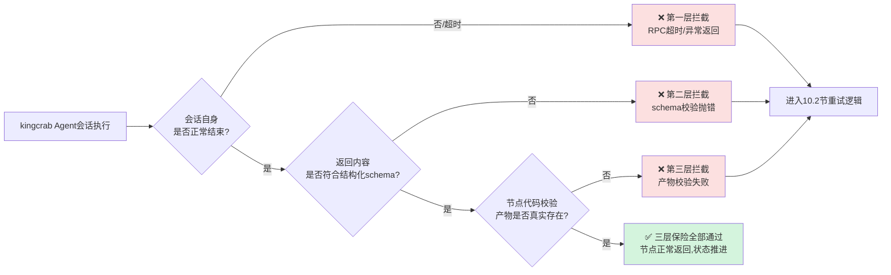

**边界提醒（呼应第 2 章）：** 这三层保险保证的是"流程能不能往下走、走的时候有没有基本校验"，不保证"LLM 写出来的内容质量本身有多好"。第二、三层能拦住"格式不对""文件没写"这类问题，拦不住"格式对、文件也写了，但测试用例写得很敷衍"这种内容层面的问题。

### 10.2 节点级失败重试策略

```python
from langgraph.pregel import RetryPolicy

graph.add_node(
    "node_ontology_projection",
    node_ontology_projection,
    retry_policy=RetryPolicy(max_attempts=3, backoff_factor=2.0),
)
```

结合 `retry_count` / `error_log` 字段，节点内部可以做更细粒度的判断：

```python
async def node_ontology_projection(state: HiringState) -> HiringState:
    attempt = state["retry_count"].get("node_ontology_projection", 0)
    if attempt >= MAX_RETRY:
        return {**state, "ontology_projection": "failed",
                "error_log": state["error_log"] + ["超过最大重试次数，转人工介入"]}
    try:
        result = await run_skill_in_sandbox(state["session_id"], "ontology-projection", prompt)
        return {**state, "ontology_projection": "completed"}
    except SchemaValidationError as e:
        return {**state,
                "retry_count": {**state["retry_count"], "node_ontology_projection": attempt + 1},
                "error_log": state["error_log"] + [f"第{attempt+1}次重试: {e}"]}
```

超过最大重试次数后，建议复用 `interrupt` 机制弹出一个"需要人工处理"的确认门，而不是让状态静默停在 `failed` 里没人知道——这一点两条链都适用：生产链某个 R 阶段反复失败时转人工，评估链某条测试用例反复跑不通时，也应该在聚合报告里显式标注"该用例未能完成"，而不是被悄悄跳过。

### 10.3 Checkpoint 持久化选型对比与建议

| 方案 | 适用阶段 | 优点 | 缺点 |
|---|---|---|---|
| `MemorySaver`（内存版） | 本地开发、影子运行验证逻辑 | 零配置，启动快 | 进程重启即丢失，不能跨实例共享 |
| `RedisSaver` | 生产环境（**默认推荐主选**） | 读写快，适合短期会话态，天然支持 TTL 过期清理 | 默认非强持久化（需配置持久化策略），不适合做长期审计留痕 |
| `PostgresSaver` | 需要长期审计留痕 / 合规场景 | 强持久化，可结合 SQL 做复杂查询和审计 | 读写延迟相对 Redis 更高 |

**默认推荐组合：** Checkpoint 主存储用 Redis（覆盖断点续跑、interrupt 恢复这类"短期热数据"场景，几小时到几天的会话生命周期完全够用），关键节点完成时额外落一份精简审计记录到关系型数据库（哪怕只是 `session_id / node_name / status / timestamp` 这种最简单的审计表），兼顾速度和留痕需要。**如果 hirebot 后端已有既定的基础设施标准（比如团队已统一用某个数据库），应以此为准，不必强行引入新组件。**

### 10.4 超时与降级策略

| 场景 | 超时设置建议 | 降级策略 |
|---|---|---|
| 单个下游 skill 节点执行 | 参考现状 artifact 等待超时（如 300 秒），可按阶段类型微调 | 超时标记 `failed`，进入 10.2 节重试逻辑，超过最大重试后 interrupt 转人工 |
| 评估链单条测试用例（Run） | 单条用例超时不应阻塞其他并行分支 | 该分支标记 `failed` 并写入 `tc_results`，不影响其余分支继续；聚合节点对失败用例单独统计，不静默丢弃 |
| 整图执行 | 设置整体墙钟时间上限（生产链建议 30 分钟量级，评估链视用例数量弹性设置） | 超过上限时保留已完成阶段的 checkpoint，人工可从断点恢复，不必从头重跑 |

### 10.5 沙箱侧安全护栏（不变说明）

第 2.3 节已经强调过，LangGraph 不提供沙箱，这里做一次"防走样"提醒：hirebot 后端现有的产物落地安全护栏——路径白名单、敏感值正则、JSON 校验 + 兜底降级——迁移后**不应该被削弱或绕过**。

节点调用 `run_skill_in_sandbox` 时依然要经过这一层校验，不能因为"节点自己也做了结构化输出校验"就误以为可以跳过后端的安全护栏——两层校验目的不同：节点的结构化输出校验管的是"内容对不对、能不能用"，后端安全护栏管的是"这份内容有没有恶意路径穿越 / 敏感信息泄露风险"，是两条独立防线，都要留着。

另外，沙箱本身**没有硬隔离**这一点（`AllowedReadRoots`/`AllowedWriteRoots="*"`，`WorkspaceOnly=false`）在迁移后也不会改变——这不属于本次编排迁移的范围。如果团队认为这是需要解决的安全风险，建议作为独立的安全加固项目单独立项，不要混进这次编排迁移一起做，避免范围蔓延导致两件事都做不干净。

---

## 11. 可扩展性与部署注意事项

### 11.1 新增阶段 / 技能的扩展方式

现状要新增一个下游 skill 阶段（比如未来生产链多一个 R7 阶段），得同时改动四处地方：`hiringDownstreamTriggers.ts` 里新增一个 `isXxxApprovalMessage` 函数、新增一个 `resolveXxxRoute` 分支、调整 `DOWNSTREAM_ARTIFACT_TRACKS` 映射、修改 `buildDownstreamPrompt` 拼装逻辑——四个文件改完还要人工核实彼此没打架。

迁移后新增一个阶段，只需要：

```python
# 1. State 里加一个新字段（StageStatus）
# 2. 写一个新的节点函数
async def node_permission_config(state: HiringState) -> HiringState:
    ...

# 3. 注册节点
graph.add_node("node_permission_config", node_permission_config)

# 4. 调整边：把新节点插入原有连线之间
graph.add_edge("node_packaging_testcases", "node_permission_config")
graph.add_edge("node_permission_config", "node_completeness_review")
# 如果新阶段需要人工确认，加一个 interrupt 节点即可，参照 4.5 节模式
```

改动集中在一份图定义文件里，"这条流水线现在长什么样"始终只有一个权威来源，不需要在多个文件之间做心智同步。

### 11.2 部署形态与技术栈

技术栈已确认为 **Python + langgraph 官方库**，独立容器化部署，作为 hirebot 体系里新增的一个微服务：

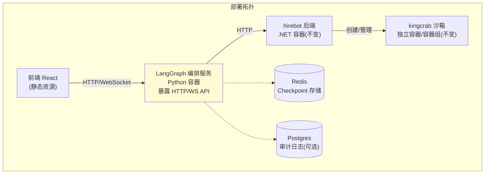

**建议的最小依赖清单：** `langgraph`、`langchain-core`、`pydantic`、`redis`（或 `asyncpg`，视 checkpoint 选型），Python 3.11+；对外暴露一组 HTTP/WebSocket 接口供前端调用（如 `POST /hiring/sessions/{id}/invoke`、`POST /hiring/sessions/{id}/resume`），触发下游 skill 执行时通过 HTTP 调用 hirebot 后端既有能力，纳入现有 CI/CD 流水线独立做版本管理。

### 11.3 可观测性建议

- 每个节点执行前后打结构化日志：`session_id / node_name / status / duration_ms`。
- 可以接入 LangGraph 生态自带的图执行 trace 工具，或者视团队是否愿意引入外部 SaaS，自建一套轻量日志聚合。
- 重点监控指标：各阶段平均耗时、重试率、interrupt 等待时长，以及**"卡死率"**——这是现状的头号故障，上线后应该把它当作验证迁移是否达到预期收益的核心指标，建议上线头两周专门跟踪该问题的复现率变化。

### 11.4 两条图的资源隔离与扩缩容

- `HiringGraph` 和 `EvaluationGraph` 虽托管在同一个 Python 服务里，建议逻辑上用不同的 `thread_id` 命名空间隔离（如 `hiring:{session_id}` vs `eval:{eval_id}`），checkpoint 存储按前缀区分，避免两条链的会话状态互相污染。
- 评估链的 `Run Agent × N` 并行扇出，如果测试用例数量很大（几十上百条），要给编排服务配置合理的并发上限（比如用信号量/连接池限制同时向 kingcrab 发起的并发请求数），避免对评估沙箱或被评估员工沙箱造成瞬时压力过大。
- `LangGraph` 编排服务本身是无状态计算（状态全在外部 checkpoint 存储里），可以水平扩容多个实例，用 `thread_id` 做粘性路由，或者完全不做粘性（反正状态都在外部存储里，哪个实例接到请求都能续跑）。

---

## 12. 迁移路径与落地建议

### 12.1 三步走迁移路径

**生产链：**

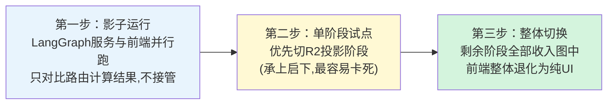

**评估链（建议在生产链验证通过后启动，作为第二阶段迁移目标）：**

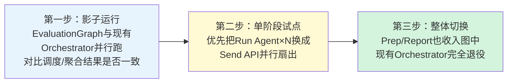

评估链现状确定性已经比生产链高，风险相对可控，建议放在生产链方案完整验证通过之后再启动，避免两条链同时变动导致问题定位困难。

### 12.2 风险清单与应对

| 风险 | 影响 | 应对 |
|---|---|---|
| 半途而废：前端保留一部分编排逻辑，LangGraph 接管另一部分 | "双脑打架"，比不迁移更差 | 严格按三步走，每一步都要求"已接管的阶段，前端完全退化为纯 UI"，不留模糊过渡态 |
| 新增 Python 运行时带来运维/团队技能负担 | 团队原本是 TS+C# 双栈，现在要再维护一套 Python 服务 | 提前评估团队 Python 能力，必要时安排学习/结对，把该服务的部署/监控标准化 |
| 误以为迁移能解决内容质量问题，迁移后发现"还是不稳" | 期望落空，团队对迁移价值产生怀疑 | 迁移启动前用第 2 章的框架把预期讲清楚：治的是流程层，不是内容层 |
| 沙箱无硬隔离的既有风险被误认为"这次一起解决了" | 安全风险被搁置又被遗忘 | 明确写进文档：沙箱隔离不在本次范围，需要单独立项跟踪 |
| Checkpoint 存储选型不当（比如直接上高延迟方案拖慢 interrupt 体验） | 用户体验下降 | 按 10.3 节对比表做选型验证，上线前压测 interrupt 恢复延迟 |
| 评估链并行扇出时对 kingcrab/被评估沙箱造成瞬时压力 | 影响其他会话稳定性 | 按 11.4 节设置并发限制 |

### 12.3 换模型稳妥做法 Checklist

不管迁不迁移 LangGraph，换模型时都建议照做：

- [ ] 换模型前先跑一轮回归测试，覆盖两条链的关键路径
- [ ] 核实新模型对结构化输出格式的遵从度，必要时针对性调整 prompt 或 schema 描述
- [ ] 调低 `LlmTemperature`，观察输出稳定性变化
- [ ] 谨慎评估是否开启思考模式（`LlmEnableThinking`），视模型和场景而定，不要默认照搬旧配置
- [ ] 对结构化输出校验失败率做前后对比，确认新模型没有让 10.1 节的"第二层保险"频繁触发

---

## 13. 附录

### 13.1 术语对照表

**本文新增：LangGraph 相关术语**

| 术语 | 含义 |
|---|---|
| State | 图执行过程中传递的共享数据结构，本文里是 `HiringState`/`EvaluationState` |
| Node | 图中的一个处理单元，输入 state，输出更新后的 state |
| Edge | 节点之间固定的跳转关系 |
| Conditional Edge | 根据 state 内容动态决定下一个节点的路由函数 |
| `interrupt` | 图执行到某处主动挂起，等待外部输入（如用户确认）后恢复 |
| Checkpoint | 图执行状态的持久化快照，支撑断点续跑和 `interrupt` |
| `Send` API | LangGraph 原生的动态并行扇出原语，运行时才决定扇出几份 |
| Reducer（如 `operator.add`） | 多个并行分支各自的局部状态更新，如何合并为最终状态的规则 |

**继承自 kingcrab 现状的术语**（准确定义引自 S4 附录 C，供快速查阅）

| 术语 | 含义 | 对应主流框架概念 |
|---|---|---|
| MAF | Microsoft Agent Framework（NuGet: `Microsoft.Agents.AI`） | LangChain AgentExecutor |
| PEV | Plan-Execute-Verify，高风险工具的"立约→执行→验证器"闭环；名字里虽有 Plan，但实际功能是治理/校验，不是自主任务规划 | Guardrails / Guardrails AI |
| HarnessContract | 执行契约，写明目标/成功标准/验证计划/回滚计划 | Temporal Workflow Input |
| Handoff todo | 业务阶段流转工单状态机（`drafting → ... → dismissed`） | LangGraph state machine（这点很有意思：kingcrab 自己内部的一个子机制，参照系本来就是 LangGraph 风格的状态机） |
| Fractal Memory（分形记忆） | 走 MCP 外部进程的记忆机制 | MemGPT memory hierarchy |
| ChatClientAgent | MAF 的 agent 实现，每次 `RunAsync` 新建 | LangChain Agent |
| `FunctionInvokingChatClient` | 驱动"思考→tool_call→观察→再思考"循环的内置组件 | LangChain AgentExecutor 的 while-loop |

### 13.2 原始文档索引

| 编号 | 文件 | 本文引用的主要章节 |
|---|---|---|
| S1 | `langgraph_重构雇佣流程编排设计方案.md` | 第 4、5、6 章 |
| S2 | `langgraph_替换雇佣流程编排可行性与对比分析.md` | 第 2 章 |
| S3 | `Kingcrab六大关键机制分析.md` | 第 1.2 节 |
| S4 | `OpenClaw与Kingcrab项目规划工具调用记忆状态管理工作流编排与多步任务执行关键机制分析.md` | 第 1.2 节、13.1 节术语表 |
| S5 | `数字员工模板执行链路与kingcrab-skill调用分析-图文版.md` | 第 1.3、1.4、7、8 章 |
| S6 | `数字员工模板执行链路与kingcrab-skill调用分析.md` | 第 1.3 节 R1–R6 流水线 |
| S7 | `雇佣教练模板调用堆栈层次图.svg` | 第 1.1、1.3 节 |
| S8 | `评估专家模板调用堆栈层次图.svg` | 第 1.4、7 章 |

### 13.3 关键文件 / 类速查表

以下是实现本方案时会实际接触到的既有代码位置（文件/类级别）。**精确到行号的代码验证清单，请以 S1、S2 两份源文档各自的附录为准**——那两份文档的作者已经对照实际源码逐行核实过，本文不重复摘抄具体行号，避免引用过程中出现转录误差。

| 既有文件/类 | 所属层 | 本方案中的角色 |
|---|---|---|
| `hiringDownstreamTriggers.ts` | 前端 | 待被 LangGraph 条件边/interrupt 取代的现状实现 |
| `buildDownstreamPrompt` | 前端 | 待被节点内 Prompt 模板取代的现状实现 |
| `DOWNSTREAM_ARTIFACT_TRACKS` | 前端 | 待被 `HiringState` 取代的现状实现 |
| `SandboxProvisioningSettings.cs` | hirebot 后端 | 不变，被 `run_skill_in_sandbox` 间接调用 |
| `EmployeeHiringService.cs` | hirebot 后端 | 不变，生产链沙箱 provisioning |
| `EvaluationService.WorkspaceManagement.cs` | hirebot 后端 | 不变，评估链沙箱 provisioning |
| `EmitArtifactTool.cs` / `SkillArtifactRuntime` | kingcrab | 不变，产物推流与合约校验 |
| `LoadSkillTool.cs` | kingcrab | 不变，渐进披露机制 |
| `runtime-drivers/ws_jwt/run.py` | kingcrab 评估沙箱 | 不变，被 `node_drive_and_score_test_case` 调用 |

---

*文档结束。如需针对某一章节展开更细的实现细节（例如某个节点的完整 prompt 文案、或某张图的可运行 Python 工程骨架），可以在此基础上继续追加。*
